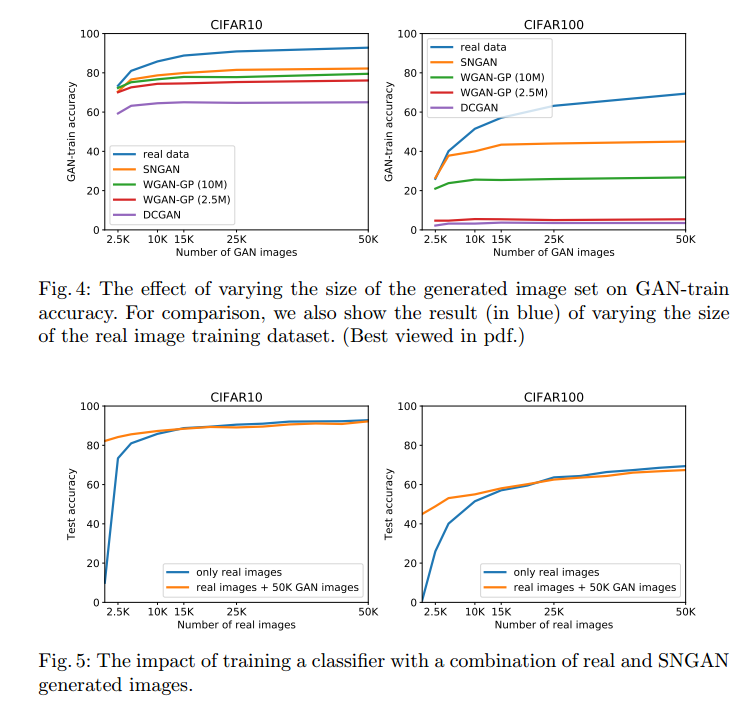

# How good is my GAN?

## Contact me

* Blog -> <https://cugtyt.github.io/blog/index>
* Email -> <cugtyt@qq.com>, <cugtyt@gmail.com>
* GitHub -> [Cugtyt@GitHub](https://github.com/Cugtyt)

> **本系列博客主页及相关见**[**此处**](https://cugtyt.github.io/blog/papers/index)

---

<head>
    
    
</head>

## Abstract

虽然GAN在视觉上有令人惊叹的结果，但是最近才出现一些量化标准。我们认为，现存的这些还不够，需要适应手头的工作。本文我们介绍了两个基于图像分类的衡量方法——GAN-train和GAN-test，近似于召回率（多样性）和准确率（图像质量）。我们使用这两个方法测试了最近的一些GAN的方法，证明了性能上明显的不同。另外，我们观察到数据集难度的递增情况，从CIFAR10到CIFAR100到ImageNet，展示了它和GAN质量有相反的关系，也作为我们衡量方法的清晰的证据。

## Introduction

GAN有两部分：生成器和判别器。这个模型通过交替优化两个目标函数来训练，使得生成器G学习产生像真实图像的样本，判别器D学习鉴别真假数据。这个模式潜力很大，它可以学习生成任何数据分布。已经在计算机视觉上有很多成功案例，例如文本转图像，图像转图像，超分辨率，和自然图像生成。

GAN有很多变种，但是一个关键的问题是这些模型如何和其他比较。

评价或比较GAN，或者说，GAN生成图像，是很困难的。这一部分是因为缺乏明显的似然衡量，这通常是比较概率模型的方法。因此，先前大量的工作通过主观视觉来比较。正如图1，只靠主观判断是很难比较它们的质量的。近两年也有针对这个问题提出定量比较方案。

Inception score (IS)和Fr´echet Inception distance (FID)是专门针对生成图像质量的衡量方法。IS通过计算生成图像的(logit)响应和边缘分布之间的KL散度来衡量生成图像的质量，也就是说使用在ImageNet训练的Inception网络，对所有生成图像的平均响应。换句话讲，IS不比较样本和目标分布，而只限于量化生成样本的分布。FID比较真实图像和生成图像之间的Inception激活（Inception网络倒数第二层的响应）。虽然这个比较近似真实图像和生成图像为高斯分布的激活，但是计算它们的均值和协方差，对于捕获微妙细节太过于粗糙。这两个方法都依赖于在ImageNet预训练的Inception网络，和其他数据集相差很远，例如人脸和生物医疗图像。总而言之，IS和FID是衡量训练的有用方法，但是在真实世界任务性能上不保证相关性。

一个可选的方法是计算生成样本到真实数据流形的准确率和召回率距离。高准确率表示生成样本与数据流形接近，高召回率表示生成器输出样本对数据流形涵盖得很好。这些方法过于理想化，因为它们不能计算流形未知得自然图像数据。的确，这个方法受限于使用灰度三角的合成数据。另一个是切片Wasserstein距离（SWD），SWD是真实和生成图像Wasserstein-1距离的近似，作为局部图像块之间的统计近似性计算，图像块从拉普拉斯金字塔中提取。

我们提出了一个新的衡量方法，使用GAN-train和GAN-test分数来比较类别-条件GAN结构。我们依赖于神经网络来做图像分类。为了计算GAN-train，我们训练了一个分类网络，用GAN生成的图像训练，然后在真实图像的测试集中衡量性能。直觉上，这个方法衡量的是学的和目标分布的差异。分类网络从不同类别生成的判别图像学习特征，可以正确的分类真实图像，那么我们可以得到结论生成的图像与真实的图像相似。换句话讲，GAN-train与召回率类似，好的GAN-train性能说明生成样本足够多样。但是，GAN-train也要求足够的准确率，不然分类器会受样本质量影响。

我们的第二个方法，GAN-test，是网络在真实图像训练，在生成图像上判断的准确率。这个方法与准确率相似，高的值代表生成样本和自然图像的分布是近似的。除了这两个方法，我们研究了GAN生成图像做数据增强的效用。这个可以解释为生成图像的多样性。具体讲，当主观比较不够的时候，GAN-train的衡量情况见图1。

我们的实验结果显示这些衡量表标准比之前讨论的方法含有更多信息，数据集复杂度增强的时候，GAN图像质量降低很多。

## Related work

### Inception score

一个最常用的方法是IS：

其中x是生成器分布$p_g$的生成图像样本。E是生成图像的期望，$D_{KL}$是条件分布$p(y \vert x)$和边缘分布的KL散度。IS根本不考虑真实图像，也不可能衡量生成器与真实分布的近似情况。这个分数受限于生成图像的多样性。其他的限制包括：Inception网络权重细微改变的敏感性，以及分数有很大方差。

### Fr´echet Inception distance

FID比较真实图像和生成图像的Inception嵌入距离。这些分布建模为参数化的多维高斯分布。距离定义为：

其中$(m_r, C_r), (m_g, C_g)$表示真实和生成图像的均值和方差。FID是IS反向相关，同样有前面说的问题。

这两个基于Inception的方法不能区分图像质量和图像多样性。例如低IS或FID可能是由于生成图像不真实（低质量）或太相似（低多样性），而且没有方法分析原因。相反，我们的方法可以区分。

### Other evaluation measures

切片Wasserstein距离（SWD）用于衡量高分辨率GAN。这是多尺度的统计相似度。虽然SWD是一个高效的近似，使用随机投影，真实图像和生成图像的Wasserstein-1距离对于比较GAN的不同模型是受限的，因为它们不能都产出高分辨率的图像。

准确率和召回率在GAN中通过构建合成数据流形引入。通过寻找距离流形最近的点，便能计算图形样本的流形距离。在这个步骤中，准确率定义为生成样本到流形距离低于一个特定阈值的分数。召回率，通过测试集得到。首先，每个测试样本x的隐含表示$\tilde{z}$t通过翻转生成器G梯度下降来进行估计。召回率由测试样本L2距离低于阈值的分数给定。高召回率等价于GAN捕获了大部分的流形，高准确率表示生成样本与流形接近。虽然这些方法带来了不同的涵义，可以广泛的用于衡量GAN的判别模型，但是对于流形未知的真实图像是无法应用的，适用范围限制到了合成数据上。

### Data augmentation

数据增强是很重要的部分，可以通过增加训练集完成，或直接对隐含空间进行增强。一个流行的方法是对数据做小的转换来增加数据量，对性能提升由帮助。GAN提供了一个自然的方法——生成数据，来增强数据。GAN也被用半监督的方法来训练分类网络等。现在GAN生成足够真实的图像来提升应用性能。【略】我们也探究了GAN对分类网络数据增强的效能。

总的来说，对生成网络的衡量不是个容易的任务，尤其是对于类似GAN的模型。我们带来了新的维度，基于性能的GAN-train和GAN-test的衡量方法。

## GAN-train and GAN-test

条件GAN模型的一个重要特征是生成图像不仅仅真实，而且可以和本类别同样识别。一个最优GAN可以完美的捕捉目标分布，生成新的图像集$S_g$，使得和原始训练集$S_t$无法区分。假设这些集合有相同的大小，分类器不管在哪个上训练都可以产生差不多一样的验证集准确率。数据集足够简单那的确可以这样，例如MNIST。受这个最优GAN特征启发，我们设计了两个指标来衡量GAN，如图2。

GAN-train是在$S_g$上训练的分类器，在真实图像$S_v$上测试。当GAN不完美，GAN-train比在$S_t$上训练的准确率要低。这可能有多种原因：(1)与$S_g$相比，模式丢失导致$S_t$降低了多样性，(2)生成样本不足够真实让分类器学到相关特征，(3)GAN把类别混合，迷惑了分类器。不幸的是，GAN的失败是很难诊断的。当GAN-train与验证集准确率接近时，说明GAN图像质量高，和训练集有相似的多样性。

GAN-test是在原始训练集$S_t$训练，在$G_g$上测试，如果GAN学的很好，那么这个分类任务就简单了，因为这两个集合的分布一样。理想情况下，GAN-test应该和验证集准确率接近。如果非常高，那么说明GAN过拟合了，只是把训练集背下来了。相反，如果很低，说明GAN没有很好的捕获目标分布，图像质量很差。注意这个衡量方法和样本多样性无关，因为模型把训练图像记住可以得到很高的分数。GAN-test准确率衡量了生成图像和数据流形的距离有多近。

为了洞悉GAN生成图像的多样性，我们衡量了GAN-train在生成不同数量数据集上的准确率，和在相同数量真实数据训练的分类器作比较。如果生成的图像很好，GAN-train和在数量减少的训练集上的准确率相等，那么$S_g$的大小就是不同图像数量的良好估计。实践中，我们观察到GAN-train准确率在GAN生成特定数量样本时饱和，见图4a，b。这个衡量GAN多样性的方法与召回率类似，衡量GAN覆盖数据流形的比例。

## Datasets and Methods

**Datasets**为了比较不同的GAN方法和PixelCNN++，我们使用了几个数据集：MNIST,CIFAR10,CIFAR100,ImageNet1K。【细节略】

### Evaluated methods

GAN模型很多，很难找到最好的一个，尤其是把所有主要的GAN超参数调节到一个接近的性能。我们选择了在Wasserstein GAN (WGAN-GP)上做分析，它是个被广泛接受的模型，还有SNGAN，一个最近的模型，有着最好的图像生成结果。另外，我们引入了两个基线，DCGAN和PixelCNN++。我们在实验中总结了所有的模型。

**Wasserstein GAN**WGAN不用判别器来区分真实和生成图像，而是一个评论家(critic)来估计对应分布的Wasserstein-1距离。相比经典GAN，WGAN的成功有两点因素。第一，生成器的优化更容易，因为评论家的梯度相比之下更好。第二，实践中观察到WGAN值函数与样本质量相关性更好。

为了估计真实和生成图像分布的Wasserstein-1距离，评论家必须是一个K-Lipschitz函数。原始的文章提出了一个约束评论家，通过权重剪切来适应Lipschitz要求。但是，这个导致训练的不稳定，生成的样本差。权重剪切的一个替代是使用梯度惩罚作为正则器强制Lipschitz约束。尤其是，我们惩罚了标准化的评论家函数关于输入的梯度。在很多GAN结构证明了这个方法可以稳定训练。

我们使用WGAN的梯度惩罚变种，对应到我们实验的数据集，称它为WGAN-GP。标签条件是使用可用标签的高效方法。和ACGAN一样，我们把输入噪声z叠加到生成器标签中，修改判别器来产出标签和源的概率分布。

**SNGAN**GAN的变种分析了一些训练GAN的其他问题，例如判别器的性能控制影响。由于判别器训练的不稳定，生成器在学习目标分布的多峰结构时经常失败，特别是在高维空间中。更戏剧性的是，生成器在真实和生成图像分布互斥的情况下会停止学习。这会因为判别器能快速区分这些分布而出现，导致判别器函数对于输入的梯度变成0，无法进一步更新生成模型。

SNGAN引入了谱标准化来稳定的训练判别器。对于判别器每一层的权重矩阵谱范数进行标准化，也就是最大奇异值。Miyato等显示了这个正则化比其他的更好，包括梯度惩罚，达到了ImageNet上最好的综合结果。我们使用了条件类别版本的SNGAN。条件是判别器的投影，和生成网络的批量标准化。

**DCGAN**深度卷积GAN(DCGAN)是一类结构，借助于CNN监督学习和无监督学习GAN的优势。DCGAN主要的原则是生成器和判别器只使用卷积层和批标准化层。

**PixelCNN++**原始的PixelCNN属于一类可跟踪的生成模型。是一个深度网络，在所有的空间维度上预测像素序列。像素的空间依赖用带掩模卷积的全卷积网络捕获。PixelCNN++对正则化，网络连接修改和高效训练做了改进。

## Experiments

### Implementation details of evaluation measures

我们使用WGAN-GP的代码来计算IS，用1008修正。这个分数的均值在5k分割上计算10次。

我们发现有两个变种来计算FID。第一个是原始实现，使用了所有的真实图像和最少10k生成图像。第二个是来自SNGAN的实现，5k生成图像和5k真实图像做对比。协方差估计矩阵在这些情况下都是很难做的。因此本文我们包含了这两个版本来做比较。原始实现记作FID，我们5k的版本记作FID-5K。

### Generative model evaluation

**MNIST**我们验证了我们的声明：GAN能完美的在MNIST产出一个简单的数据集。一个4层卷积分类器在MNIST可以训练到99.3%的测试准确率。相比而言，SNGAN可以到达99.0%的GAN-train准确率，GAN-test准确率有99.2%，说明图像质量和多样性都是很高的。

**CIFAR10**表1是GAN模型在CIFAR10上的比较。我们观察到模型在不同衡量方法上的排名是一致的：FID，GAN-train，GAN-test。SNGAN和WGAN-GP在GAN-train和GAN-test都是很高的。这说明图像质量和多样性是很好的，但是还是低于真实图像。注意到PixelCNN++多样性很低，因为GAN-test比GAN-train高很多。这和它较低的IS和FID是一致的。

注意到SWD和其他衡量标准不一致，比WGAN-GP小。我们认为这是因为SWD用的真实和生成图像的Wasserstein-1近似距离，与Wasserstein GAN优化目标一致，但是和其他模型不一样。这样WGAN和其他GAN比较就不合适。另一个值得注意的是WGAN-GP(10M)显示只比WGAN-GP(2.5M)高一点点。图3中，我们展示了SNGAN在CIFAR10生成的图像和它们特征空间的最近邻，我们使用GAN-test来计算。注意SNGAN一直在找相同的类作为生成图像，和训练集中的一个图像时很接近的。

为了说明GAN-train和GAN-test的互补性，我们通过下采样/腐蚀训练集仿真了一个简单的模型。GAN-train/test对应于修改后数据中的训练和测试。我们观察到GAN-test对下采样不敏感，不像GAN-train。椒盐噪声，替换1%到20%的像素，很难影响GAN-train，但是极大的降低了GAN-test。

通过这个修改数据的实验，我们观察到FID不足以区分图像多样性和质量。例如CIFAR10在下训练集和训练集+高斯噪声FID都是27.1，而训练集和随机5K子集+相同噪声的FID是29.6。这个区别也许是因为缺乏多样性或质量，或二者皆有。GAN-test衡量图像质量，在这些情况下是等价的。GAN-train从91%掉到80%，说明5K的训练集缺乏多样性。这样我们的方法就解决了FID的一个主要问题。

**CIFAR100**在CIFAR100的结果总结在表2。这个数据集比CIFAR10更具有挑战性，主要因为类别数量多，每个类图像更少。从卷积网络分类准确率也可以看出。SNGAN和WGAN-GP(10M)有相似的IS和FID，但是GAN-train和GAN-test不同。容易得出SNGAN比WGAN-GP有更好的图像质量和多样性。更有趣的是WGAN-GP(10M)除了SWD，其他指标都比WGAN-GP(2.5M)好。WGAN-GP(2.5M)达到了合适的IS和FID，但是生成样本的质量很低，GAN-test也可以看到。SWD在CIFAR10服从一样的模式：WGAN-GP在这个方法中展示了更好的性能，但是图像质量差。PixelCNN++有个有趣的行为，高GAN-test，低GAN-train，说明生成的图像质量可接受，但是缺乏多样性。这个情况下高FID也说明了模式的显著下降。我们也通过t-SNE分析了生成图像的质量。

*Random forests*我们在随机森林上验证了我们的发现是否取决于分类器的类型。结果证明GAN的排序是一致的。

*Human study*我们设计了人工实验，目的是发现那些方法和人的判断更一致。受试者从两个生成样本中选择一个最真实的。我们用t测试来统计分析这些结果。我们的结论是生成图像的质量需要差很多，人才能区别出来。人不足以区分出微妙的差异。

**ImageNet**如表3，SNGAN达到了合理的GAN-train准确率和很高的GAN-test准确率。这说明SNGAN生成图像有很好的质量，但是多样性比原始数据很低。这可能是因为生成器的大小(150Mb)相比于ImageNet训练数据来说太小。除了大小不同，它达到了GAN-train为9.3%和21.9%，对应于top1和top5。作为比较，WGAN-GP的性能很低。

生成64\*64分辨率时，SNGAN的GAN-train和GAN-test低于128\*128。GAN-test准确率比GAN-train好4倍，说明缺乏多样性。有趣的时WGAN-GP的IS和FID与SNGAN相似，但是图像不足以训练一个合适的分类器。

### GAN image diversity

我们通过不同量生成数据对应的准确率进一步分析了生成图像的多样性。模型有低的多样性生成冗余的样本，增加生成数据的质量不会导致更好的GAN-train准确率。相反，多样性好的生成更多样本可以有更好的GAN-train分数。我们在图4展示了这个分析。

在CIFAR10中，我们观察到GAN-train准确率在12-20k生成图像左右饱和，即使是最好的模型SNGAN，见图4a。

### GAN data augmentation

我们分析了GAN对数据增强的效能，用最好的GAN模型(SNGAN)生成额外训练样本。首先，图5a和5b显示了用真实图像和生成图像训练的影响。这个情况下，SNGAN用所有原始数据训练。我们观察到增加2.5k或5k真实图像到50kGAN生成图像提升了准确率。但是增加50k真实图像没有更多的提高，实际上还降低了点。这可能是因为缺乏多样性。

这个实验提供了另一个生成多样性的视角。增强2.5k真实数据到50k生成数据导致更好的准确率。因此我们总结出GAN模型生成图像比2.5k真实图像有更高的多样性，这个的前提假设是生成图像和真实图像一样真实。实践中，生成的数据倾向于缺乏真实性，更多样。

我们在缩减的训练集上训练SNGAN，然后在把这个数据集和生成的数据集结合起来训练分类器。表4是CIFAR10和CIFAR100的结果，证明行为是基本一致的。

## Summary

本文向着解决衡量和比较GAN生成图像的问题更进了一步。我们提出了定量方案，GAN-train和GAN-test，受启发于准确率和召回率。我们衡量了几个最近的GAN方法和其他流行的生成模型。我们广泛的实验分析证明了GAN-train和GAN-test不仅突出了性能的区别，也为现有的方法提供了补充。