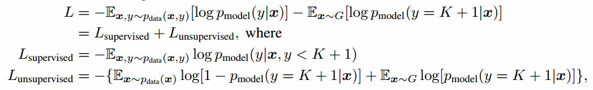
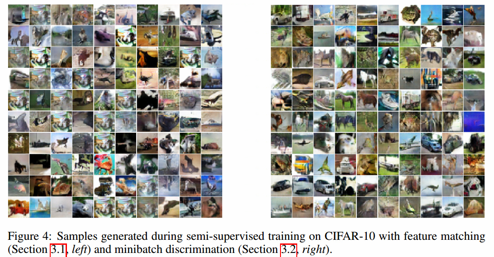

# Improved Techniques for Training GANs

## Contact me

* Blog -> <https://cugtyt.github.io/blog/index>
* Email -> <cugtyt@qq.com>, <cugtyt@gmail.com>
* GitHub -> [Cugtyt@GitHub](https://github.com/Cugtyt)

> **本系列博客主页及相关见**[**此处**](https://cugtyt.github.io/blog/papers/index)

---

<head>
    
    
</head>

## Abstract

我们提出了一些新的结构特征和训练过程可以用到GAN上。我们关注两点应用：半监督学习和生成视觉上真实的图像。我们的主要目标不是训练一个模型给测试数据赋值最大似然，也不要求模型能不用任何标签学得很好。使用我们的方法，可以在MNIST，CIFAR10,SVHN上达到最好的半监督效果。生成图像有很高的质量：生成的MNIST人眼无法区分，CIFAR10错误率21.3%。在ImageNet高分辨率样本上显示了我们的方法可以让模型学到可识别的特征。

## Introduction

GAN是基于博弈论的生成模型方法。GAN训练一个生成网络来生成尽可能真实的图像，一个判别网络尽可能区分真是图像和生成图像。

训练GAN要求找到在连续高维参数下非凸博弈的纳什均衡。但是通常GAN用梯度下降方法去寻找损失函数的最小值，而不是纳什均衡。

本文，我们介绍了几个方法去鼓励GAN博弈的收敛。这些方法的灵感来源于非凸问题的启发式理解。可以帮助提升半监督学习性能和提升采样生成。

## Related work

我们结合了最近一些关于稳定训练和提升样本质量的工作，例如使用了DCGAN。

我们的方法之一，**特征匹配（feature matching）**，和最大平均差异本质上一致。另一个方法，**小批量特征（minibatch features）**，基于批量标准化的部分思想，我们提出的 **虚拟批量标准化（virtual batch normalization）** 是批量标准化的直接扩展。

我们工作的主要目标是提升生成对抗网络在半监督学习上的效果。

## Toward Convergent GAN Training

训练GAN是要找双人博弈的纳什均衡。每个人最小化自己的损失函数。不幸的是，这是个非常困难的问题。由于损失函数的非凸，参数连续，参数空间维度很高，很难把一些现有的算法应用到GAN上。

通过基于梯度的最小化方法最小化双方的损失，损失达到最小的时候出现纳什均衡。但是对$\Theta^{(D)}$的修改减少$J^{(D)}$增大了$J^{(D)}$，对于$\Theta^{(G)}$有对应的情况。在很多时候梯度下降因此无法收敛。例如，一个针对x最小化xy，另一个针对y最小化-xy，那么就无法收敛到理想的均衡点x=y=0。

### Feature matching

解决的问题是GAN的不稳定性，方法是为生成器设定新的目标，避免在当前判别器上过训练。不直接最大化判别器的输出，新的目标要求生成器生成的数据匹配真实数据的统计，而我们用的判别器只是设定了我们认为值得匹配的统计。具体而言，我们训练生成器去匹配特征在判别器中间层的期望值。这是让生成器匹配统计的自然选择，因为我们训练判别器就是寻找最能判别真实和生成数据的特征值。

令f(x)记作判别器的中间层激活，我们为生成器设定新的目标定义为：。判别器用通常的方法来训练。和通常的GAN训练一样，目标在生成器正好匹配训练数据分布时有一个固定点。我们不能保证在实践中达到这个固定点，但是我们的实验结果表面特征匹配在GAN不稳定时是很有效的。

### Minibatch discrimination

GAN一个主要的失败模式是生成器在一个参数设置下坍塌，总是发出相同的点。当单个坍塌模式接近时，判别器的梯度对很多相似的点有相似的指向。由于判别器对每个样本的处理是独立的，没有梯度协调，因此没有方法说明生成器的输出比其他的更接近。相反，所有的输出都朝着一个判别器认为最真实的单一点前进。在坍塌出现的时候，判别器学到这个单一点来自生成器，但是梯度下降不足以区分一样的输出。然后判别器的梯度把这个单一点永远的推到空间中，算法不能收敛到正确的分布上。一个避免这类错误的直接策略是允许判别器查看查看多个数据样本，进行我们称作小批量判别的操作。

小批量判别的概念非常直观：任何判别器查看多个样本，而不是单独一个样本，可以潜在的避免生成器坍塌。事实上，批量标准化在判别器的成功应用就是一个很好的解释。目前为止，我们已经严格限制了显式区分非常靠近的生成样本的模型。一个对小批量样本紧密的建模是：令$f(x_i) \in R^A$表示输入$x_i$的特征向量，由判别器的中间层输出。然后把向量$f(x_i)$乘以张量$T \in R^{A \times B \times C}$，结果是一个矩阵$M_i \in R^{B \times C}$。然后计算矩阵每行$M_i$的L1距离，然后应用负指数(图1)，小批量层对样本$x_i$输出$o(x_i)$记作：

下面我们把小批量的输出$o(x_i)$和中间特征$f(x_i)$拼接起来作为判别器下一层的输入。我们对来自生成器和训练数据的样本分别计算小批量特征。和前面一样，判别器依然需要对每个样本输出一个数，表示来自训练数据的可能性。但是现在他可以使用小批量中的其他样本作为辅助信息。小批量判别允许我们快速生成很好的图像，在这方面它优于特征匹配。有趣的是，如果目标是使用这个方法在半监督学习中获得更强的分类器，特征匹配工作的并不好。

### Historical averaging

用这个方法时，我们把每层的损失加入了一项，其中$\Theta[i]$是时间i的参数值。参数的历史均值可以在线更新，这样测个学习规则可以扩展到很长的时间序列。我们发现我们的方法可以在低维、连续非凸博弈中找到平衡，例如最小化最大博弈，一个玩家控制x，另一个控制y，值函数为(f(x)-1)(y-1)，其中在x<0时f(x)=x，其他情况下$f(x)=x^2$。对于这样类似的博弈，梯度下降失败，进入了扩展轨道（extended orbits）无法接近平衡点。

### One-sided label smoothing

标签平滑，把分类中的0和1替换为平滑的值，例如0.9或0.1，最近的研究显示可以减少神经网络对对抗样本的脆弱性。

把正类替换为$\alpha$，负类替换为$\beta$，最优判别器变成。分子上的$p_{model}$是有问题的，$p_{data}$接近0时，$p_{model}$很大，$p_{model}$中的错误样本不会被激励得更接近真实数据。因此我们之平滑正类为$\alpha$，让负类为0。

### Virtual batch normalization

批标准化极大地改善了网络的优化，在DCGAN中展示出很好的效果。但是，它导致网络对于一个输入样本x的输出高度依赖于在这个批量中其他的几个输入$x'$。为了避免这个问题，我们引入了虚拟批标准化(VBN)，其中每个样本x用引用批量（reference batch）上的统计来标准化，这个引用批量的样本只选取一次，在开始训练时固定。引用批量只使用自己的统计数据标准化。VBN计算很昂贵，因为它需要在两个小批量上两次前向传播，所以我们只在生成网络上用它。

## Assessment of image quality

由于GAN缺乏目标函数，因此很难比较不同模型的性能。一个直觉上的衡量方法是人眼。我们使用了Amazon Mechanical Turk (MTurk)来自动化这个过程，使用的网页接口见图2。

当然这个方法非常依赖于标记者。我们提出了一个更自动化的方法，我们发现和人的判断相关性很好：我们利用Inception模型，获取每个生成图像的条件标签分布$p(y\vert x)$。图像如果包含有意义的目标应该有低熵的条件标签分布。另外，我们期望模型生成多样的图像，这样边缘分布有高熵。把这两个要求结合起来，我们提出的衡量方法是，我们取了指数，这样结果更容易比较。我们的Inception分数和CatGAN用的目标函数很接近：虽然我们使用这个目标来训练没怎么成功，但是我们发现它是个好的衡量方法，与人类的判断很相关。

## Semi-supervised learning

考虑一个标准分类器把数据点x分到k个类。例如输入x，输出k维逻辑向量$\{ l_1, \dots, l_K \}$，用softmax可以变成类别概率。在监督学习中，这样的模型是最小化交叉熵$p_{model}(y\vert x)$。

我们可以简单的加入生成器G生成的样本来做半监督学习，把生成的类标记为K+1，输出维度从K变成K+1。我们可以用$p_{model}(y=K+1 \vert x)$补充x为假的概率，对应于原始GAN的1-D(x)。我们现在也可以从无标签数据中学习，只要我们知道对应于K类中的哪一类，最大化$\log p_{model}(y \in \{ 1, \dots, K \} \vert x)$。假设数据中一半是真实数据，一般是（任意的）生成数据，训练分类器的损失函数变为：

我们把整个交叉熵分解为标准的监督损失函数和无监督损失函数，无监督损失函数也是标准的GAN值函数，把$D(x)=p_{model}(y=K+1 \vert x)$带进表达式就更清楚了：

最小化$L_{supervised}$和$L_{unsupervised}$的最优解是对于一些未定比例函数(undetermined scaling) c(x)有。无监督损失因此和监督损失一致，我们希望通过最小化这两个损失来更好的估计最优解。实践中，$L_{unsupervised}$只在当分类器最小化很困难的时候有帮助，因此我们需要训练G来近似数据分布。一个方法是训练G最小化游戏值，使用我们分类器定义的判别器D。这个方法引入了G和我们分类器之间的交互，目前我们还没有完全理解，但是经验上我们发现使用特征匹配GAN优化G在半监督学习上工作的很好，但是使用批量判别训练G基本不工作。这里我们使用这种方法展示了我们的实验结果，完全的理论理解留给未来的工作。

最后，注意到我们的有K+1输出的分类器是过参数化了，对于每个输出逻辑(logit)减去通用函数f(x)，例如，不改变softmax的输出。这意味着我们等价的固定了，其中$L_{supervised}$变成了原始K个类别分类器的标准监督损失函数，我们的判别器D是$D(x)=\frac{Z(x)}{Z(x)+1}$，其中。

### Importance of labels for image quality

除了在半监督学习上达到最好的结果，上述的方法也在提升生成图像质量上有惊人的效果。原因是人类视觉系统对图像统计信息非常敏感，可以帮助推断图像代表的类别，但是对于局部统计信息不敏感，因为这对图像的解析没有那么重要。我们发现人类标注者汇报的质量和IS有很强的相关性。

## Experiments

在MNIST，CIFAR10和SVHE上做了半监督实验，在MNIST，CIFAR10，SVHE和ImageNet上做了样本生成实验。

### MNIST

从数据集中随机选取了一小部分，有20，50，100,200个有标签的样本来做半监督训练。结果在10个随机带标签子集上取平均。剩下的训练图像不提供标签。我们的网络有5个隐层，我们使用了权重标准化，在判别器的每层输出上加入了高斯噪声。表1总结了我们的结果。

半监督学习中生成器使用特征匹配生成的样本看起来并不令人满意（图3左）。使用批量判别我们可以提升质量。在MTurk上，标注者可以区分52.4%的样本，50%是随机猜的。但是小批量判别的半监督学习不能像特征匹配那样产生好的分类器。

### CIFAR10

我们的判别器是９层的深度卷积网络，带有dropout和权重标准化。生成器是４层深度CNN，带有批量标准化。表２是我们半监督学习任务上的总结。

50%真实和由最好的CIFAR10模型生成的50%虚假数据，MTurk用户正确的分类了78.7%的数据。但是我们更熟悉数据集，能达到95%。我们在IS上做检验，观察到当数据只使用top 1%IS分数过滤后，MTurk准确率掉到了71.4%。我们做了一系列剥离实验，证明我们提出的方法提升了IS分数，见表3。我们也展示了这些剥离实验的图像，我们认为，IS分数和图像质量的主观评价相关性很好。我们警告，IS应该作为一二个粗糙的指导，如果直接优化IS会导致生成对抗样本。

### SVHN

在SVHN上，我们使用了和CIFAR10相同的结构和实验步骤。

### ImageNet

我们破天荒的在ILSVRC2012,1000个类中的128\*128尺度上测试了我们的方法。就我们所知，目前没有公开的研究有把生成模型用在这样高分辨率和这么多类别。这个数量的类别对于GAN来说很有挑战性，因为他们有低估分布熵的倾向。使用本文描述的方法，GAN学习生成的对象集成了动物，但是解剖学错误。结果见图6。

## Conclusion

GAN是一类前景很好的生成模型，但是目前训练不稳定，缺乏合适的衡量方法。我们的工作提供了部分解答。我们提出了几个方法稳定训练。另外，我们提出的衡量方法（IS）给了我们比较这些模型的基础。我们把方法用于半监督学习上，在很多不同的数据集上都达到了最好的结果。我们的工作在实践中很有意义，未来也希望能发展更理论的工作。