# Grad-CAM++: Generalized Gradient-based Visual Explanations for Deep Convolutional Networks

## Contact me

* Blog -> <https://cugtyt.github.io/blog/index>
* Email -> <cugtyt@qq.com>, <cugtyt@gmail.com>
* GitHub -> [Cugtyt@GitHub](https://github.com/Cugtyt)

> **本系列博客主页及相关见**[**此处**](https://cugtyt.github.io/blog/papers/index)

---

<head>
    
    
</head>

## Abstract

基于最近提出的方法Grad-CAM，我们提出了一个通用方法叫做Grad-CAM++，可以对CNN模型预测提供更好的视觉可解释性，与目前最好的方法相比，更好的解释了目标定位和单个图形上出现多个目标实例的解释。我们提供了数学推导，加权结合了最后一层卷积层的特征图对特定类别分数的正偏导，作为权重来生成对应类别的视觉解释。我们在标准数据集上的实验和评估，包括主观和客观，展示了Grad-CAM++提供了很好的人类可观察的解释，无论CNN在分类，字幕生成和3D动作识别，还有一些新的东西如知识蒸馏。

## INTRODUCTION

现在的深度学习模型效果很好，但是解释性很差。解释黑盒方面也有一些工作如ZFnet，CAM，Grad-CAM等。

虽然Grad-CAM等方法效果不错但是，这些方法有局限性，例如多个同类目标同时出现的定位，即使是单一物体，Grad-CAM也不能定位完全。我们提出了Grad-CAM++，改良了先前的方法，我们的关键贡献在于：

* 我们引入了输出梯度对于特定位置的像素级别加权。这个方法提供了对每个像素在特征图的重要性衡量，更重要的是我们推导了闭式解，同时获得了高阶的精确表达，包括了softmax和指数激活输出。我们的方法需要一次反向回传，因此计算量和先前的基于梯度的方法一致，但是效果更好。
* 先前的几个方法，如反卷积（Deconvolution），导向反向传播（Guided Backpropagation），CAM，Grad-CAM，他们的结果评判都是靠人眼，或其他辅助标准。我们提出了新的方法来衡量可靠性，也就是说这个可视化结果是否与决策相关，我们的方法有很大优势。
* 好的可视化方法应该能够高效提炼模型的知识。这个方面最近一致被忽视，我们用受限的师生设置（teacher-student setting），发现可以通过特定的损失函数来提升学生的性能，这个损失函数受Grad-CAM++生成的解释图启发。我们引入了一个训练方法，发现效果很好。
* 我们也用了人工的方式来评价可视化效果，发现我们的方法的确很好。
* 通过可视化样本和目标估计，我们展示了Grad-CAM++在弱监督目标定位上相比Grad-CAM有提升。
* 最后，我们展示了Grad-CAM++在图像字幕生成，3D动作识别方面的有效性。据我们所知，这是第一次3D-CNN的可视化。

## RELATED WORK

Zeiler & Fergus提出了反卷积方法来理解网络层。“Deconvnet”让激活信息从高层流入图像，这样激活神经元的部分就高亮了。后面Springenberg扩展了这个工作提出了导向反向传播（guided backpropagation）。【略去一些工作】

我们的工作主要受两个算法的启发，叫做CAM和Grad-CAM，他们都基于一个基本假设，类别c获得的分数$Y^c$可以写作最后卷积层特征图$A^k$的全局均值池化的线性组合：

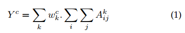

特定类别显著图（saliency map）在位置(i, j)上的$L^c$计算是：

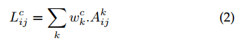

CAM通过最后一层卷积层生成的激活图来训练线性分类器预测这些$w_k^c$，但是有一些局限，它受限于使用全局均值池化层，在初始化模型后，需要重新训练搜歌线性分类器。

Grad-CAM解决了这些问题，他的权重$w_k^c$计算为：

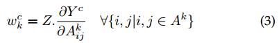

其中Z是个常数（激活图的像素数量）。这可以让CAM泛化到任意的CNN模型，而不需要重新训练，最后的$Y^c$是激活图$A^k$的可微函数。但是这让权重$w_k^c$独立于位置(i,j)，解决这个的方法是取偏导的全局均值池化：

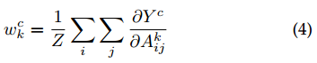

为了获取更好的像素尺度的表达，Grad-CAM上采样，通过逐点相乘融合了特征图$L^c$和导向反向传播的可视化结果。如图1他有些缺点，如果图中有多个同类物体，它不能完好定位目标。另一个偏导不加权的结果是，它只能定位物体的一部分。

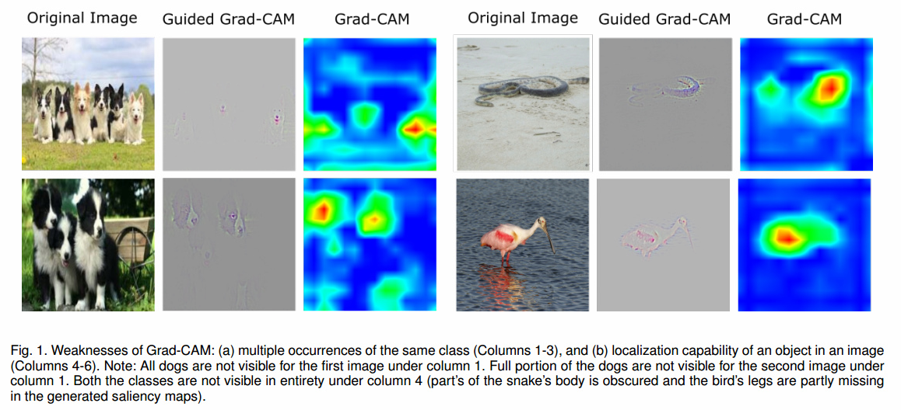

## GRAD-CAM++ METHODOLOGY

我们的方法通过对每个像素对最终特征图的贡献建模。我们通过显式编码权重结构$w_k^c$重写公式1：

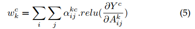

背后的想法是$w_k^c$捕获特定激活图$A^k$的重要性。激活图在像素上正的梯度代表对分数正的影响。这样保证了权重$w_k^c$是加权平均而不是全局平均。

结合公式1和公式5我们得到：

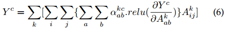

不失一般性，我们去掉了relu，因为他只是个阈值，两边取偏导：

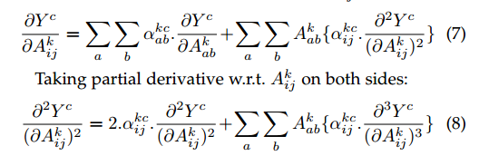

整理得到：

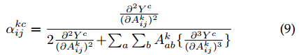

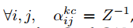下，Grad-CAM++退化为Grad-CAM。原则上，$Y^c$可以说任意预测的分数，唯一的要求是他必须是光滑函数。由于这个原因，不像Grad-CAM（把倒数第二层表示作为分数$Y^c$），我们把倒数第二层分数传入一个指数函数，因为它可微。如果我们把倒数第二层分数传入指数函数，网络的最后一层卷积和倒数第二层只有线性或ReLU激活，计算高阶倒数很容易了。令$S^c$为类c的倒数第二层分数：

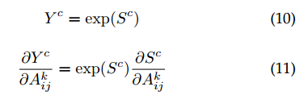
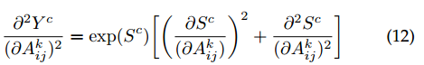

对于ReLU，倒数是：

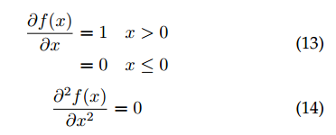

把式14带入12，得到：

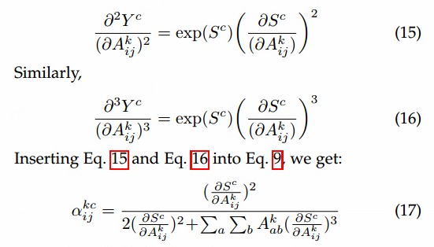

所以，一次反向回传，所有的梯度权重都可以计算得到。

显著图$L^c$可以用前向激活图+relu的线性组合计算得到：

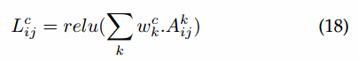

为了生成在像素空间梯度可视化的显著图方法，我们逐点相乘了上采样显著图和导向反向传播生成的可视化结果，这个方法启发于Grad-CAM，这个方法叫做Grad-CAM++。

图2展示了加权的可视化结果，图3是三种方法CAM,Grad-CAM,Grad-CAM++的鸟瞰图。

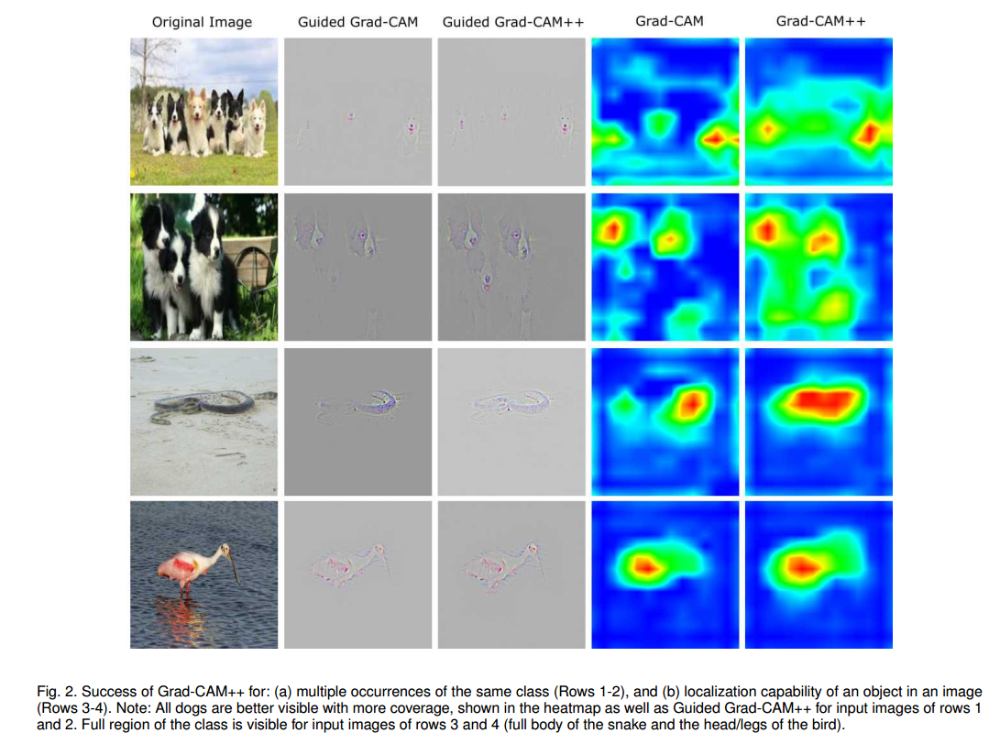
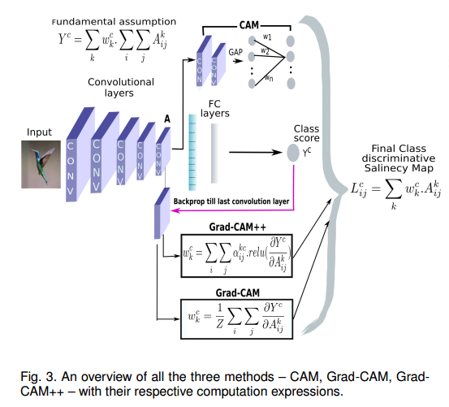

### Gradient weights for the softmax function

softmax：

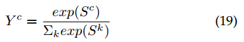

$S^k$是倒数第二层分数。

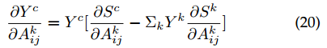
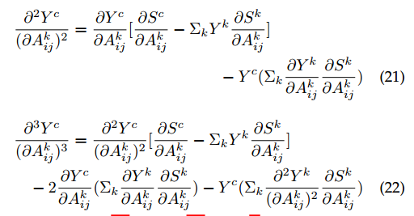

## EMPIRICAL EVALUATION OF GENERATED EXPLANATIONS

实验结果的详细内容见论文原文。

### Objective Evaluation of Performance based on Object Recognition

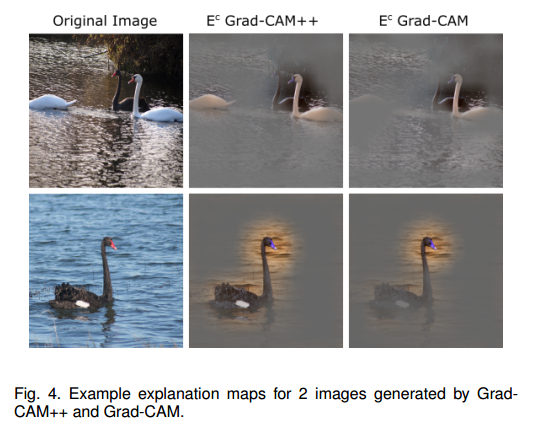
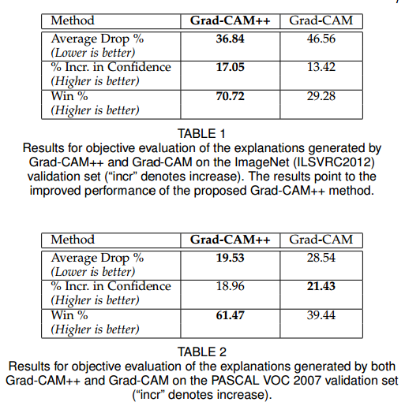

### Evaluating Human Trust

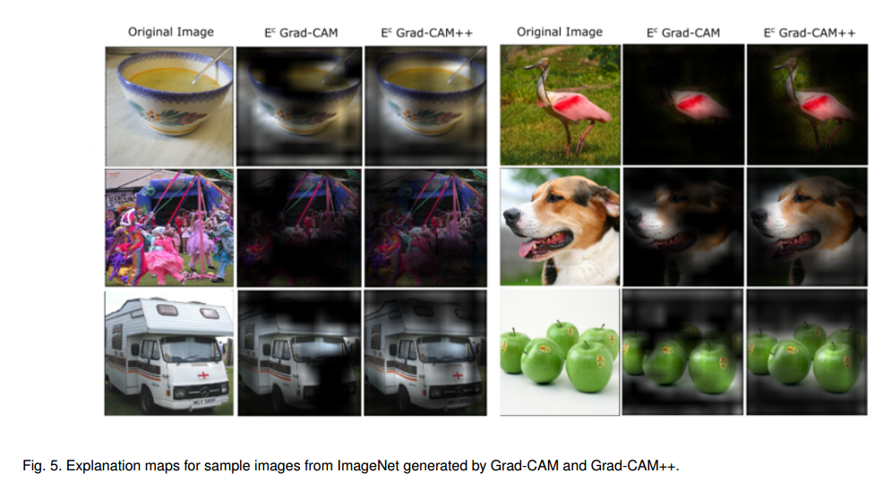

### Harnessing Explainability to generate Object Localizations

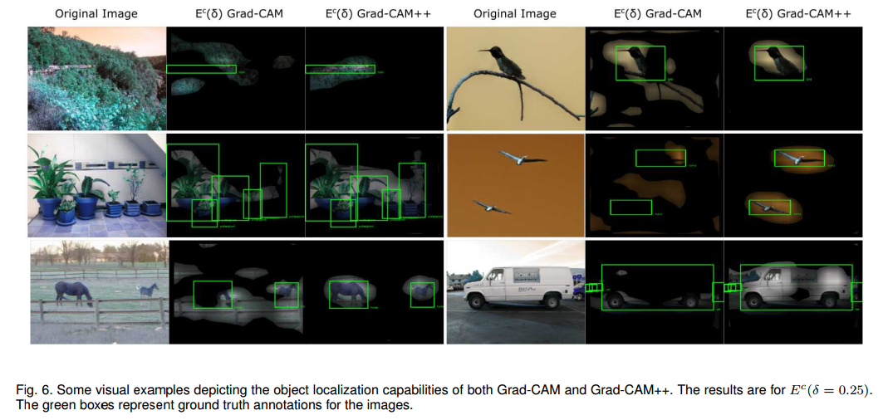
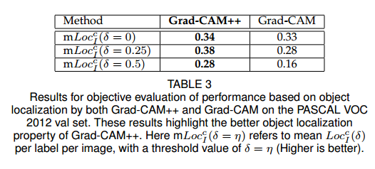

## LEARNING FROM EXPLANATIONS: KNOWLEDGE DISTILLATION

这部分介绍了知识蒸馏和师生设置的细节。

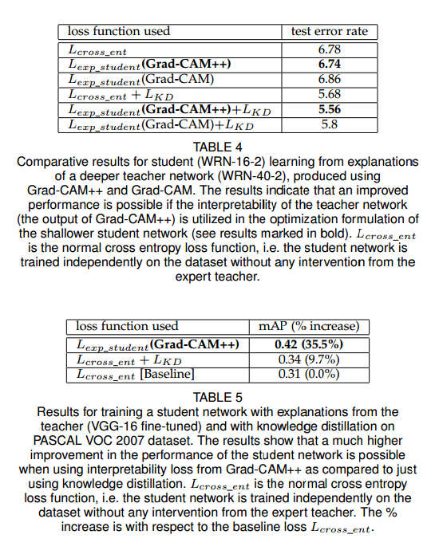

## EXPLANATIONS FOR IMAGE CAPTIONING AND 3D ACTION RECOGNITION TASKS

### Image Captioning

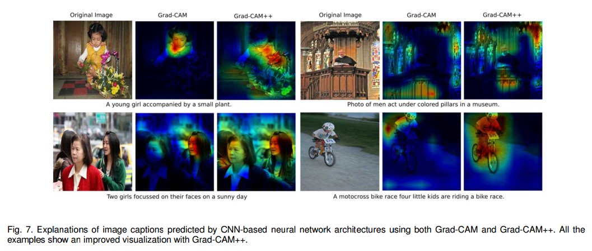

### 3D Action Recognition

见原文附录

## WHY ONLY POSITIVE GRADIENTS IN GRADCAM++?

这部分解释了为什么只用正的梯度，因为实验发现效果更好。

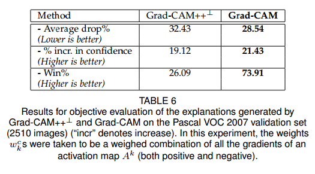

## CONCLUSION

我们提出了一个通用的类别判别方法，Grad-CAM++，用于视觉解释基于CNN的架构。我们提供了一个严格推导,展示了它的简洁，是早期基于梯度视觉解释方法的有效泛化。我们的方法解决了Grad-CAM的短板——一个图像出现多个相同类别和目标定位差。这是通过视觉样本来证明的。我们使用标准的CNN模型和数据集客观的和主观的验证了方法的有效性。我们展示了在图像字幕生成和视频理解等任务的优越性。我们也启发了一个研究方向，对深度网络的解释不仅用于理解模型背后的推理，而且可以用于训练一个简陋的学生网络。这个学生网络比老师网络可以学到更好的表示（低测试错误率）。未来的工作包括优化老师-学生设定的损失公式，通过Grad-CAM++高效的蒸馏知识。我们也希望探索我们的算法到解释其他网络架构的决策，例如RNN，LSTM，GAN。