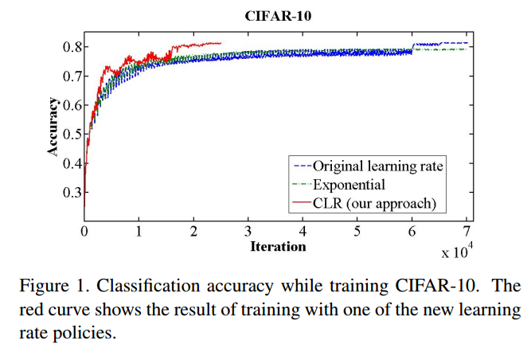
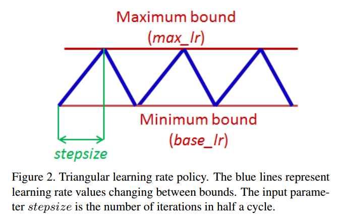
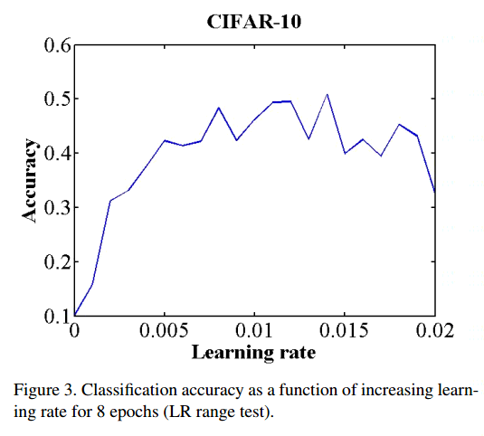
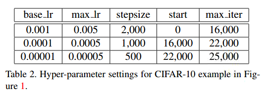
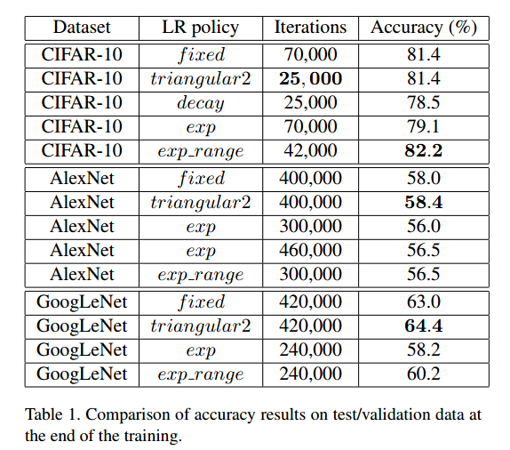
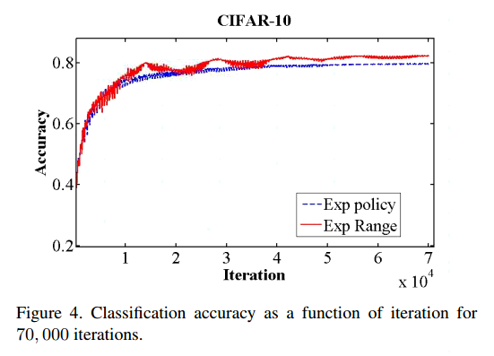
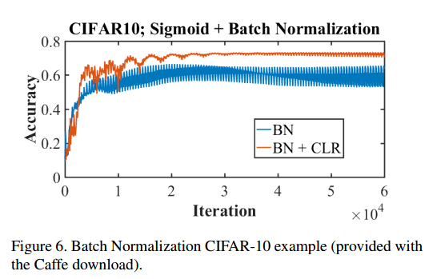
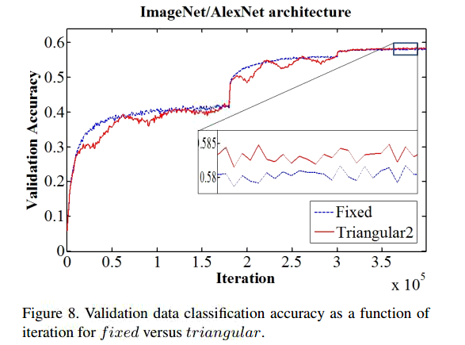

# Cyclical Learning Rates for Training Neural Networks

## Contact me

* Blog -> <https://cugtyt.github.io/blog/index>
* Email -> <cugtyt@qq.com>, <cugtyt@gmail.com>
* GitHub -> [Cugtyt@GitHub](https://github.com/Cugtyt)

> **本系列博客主页及相关见**[**此处**](https://cugtyt.github.io/blog/papers/index)

---

## Abstract

众所周知，学习率是个很重要的超参数，本文描述了一个新方法来设置学习率，叫做周期学习率（cyclical learning rates， CLR），实践中可以减少对最优学习率和学习率变化策略的尝试。并不单调的减少学习率，这个方法让学习率在一个合理的边界中周期变化。使用周期学习率而不是固定值可以提升分类准确率，不用去调迭代次数，但往往需要更少的迭代次数。本文还描述了简单的估计合理边界的方法，就是每一些批量线性增加学习率。另外，周期学习率也在CIFAR10和CIFAR100对ResNets，Stochastic Depth networks, 及 DenseNets, 和ImageNet上AlexNet、GoogLeNet得到了验证。

## Introduction

神经网络通常是随机梯度下降来训练的，太小的学习率使得学习算法收敛很慢，太大的学习率后导致发散。因此，我们必须尝试多种学习率和变化策略。

传统的做法是学习率是一个单一值，在训练中单调下降。本文证明了一个惊人现象，在训练中变化的学习率是很有益处的，因此我们提出让全局学习率在一个界限内周期变化。这个周期的方法减少了对学习率参数的调整。另外，与自适应学习率不同，这个方法不要求额外的计算。

这个方法的益处见图1。基线（蓝色）在70000个周期后达到81.4%。网络完全使用CLR方法训练达到相同的准确率需要25000个周期。



本文的贡献在于：

1 一个设置全局学习率的方法，极大减少了对学习率的实验探究。而且没有额外的计算量。

2 证明了一个惊人的现象，学习率反复升降虽然暂时损害了网络性能，但是整体是收益的。

3 在ResNets，Stochastic Depth networks, 及 DenseNets, 和ImageNet上AlexNet、GoogLeNet得到了实验证明。

## Related work

“Neural Networks: Tricks of the Trade”一书中有很好的实践建议。尤其是，Yoshua Bengio讨论了学习率的合理范围，强调了调学习率的重要性。还有一些其他的实践建议。

**Adaptive learning rates** 自适应学习率是个有力的竞争者，它依赖于局部适应的学习率，但是计算量不小。CLR不需要这些计算。

一些自适应学习率的回顾。【略】

## Optimal Learning Rates

### Cyclical Learning Rates

这个学习率策略的本质来自于一个观察，增加学习率会有短暂的负面影响，但是长远来看有好处。这个观察启发了我们的想法，让学习率在一个范围内变化，而不是用常值或指数递减啥的。所以只需要设置上下界和周期变化就可以了。大量的实验尝试了各种形式，triangular window (linear), a Welch window (parabolic) and a
Hann window (sinusoidal)，他们的结果差不多。就采用triangular窗吧，见图2。



一个直观理解为什么CLR可以工作是考虑损失函数的拓扑结构。Dauphin et al. 认为最小化损失的困难在于鞍点，而不是局部最小值。鞍点梯度小，减弱了学习，而增加学习率会快速跳过。CLR工作的一个实验上的原因是，有可能最优学习率在一个界内，接近最优的学习率可以在整个训练中被使用。

图1的红线是triangular策略，上下界是[0.001, 0.006]。周期长度是4000。CLR的实现很简单，例如torch代码是：

```
localcycle = math.floor(1 + epochCounter / (2 ∗ stepsize))
localx = math.abs(epochCounter / stepsize − 2 ∗ cycle + 1)
locallr = opt.LR + (maxLR − opt.LR) ∗ math.max(0, (1 − x))
```

代码的解释见论文。这个方法是triangular，除了这个我们还讨论triangular2, exp_range。

### How can one estimate a good value for the cycle length?

这个参数可以简单的从一个周期的迭代轮数计算得到。一个周期计算是总样本数除以批量大小。例如CIFAR10有50000图片，批量大小100，所以一个周期500迭代数。准确率对这个参数比较鲁邦，但是实践证明最好设置stepsize为2到10倍迭代次数。

一些细节描述【略】

### How can one estimate reasonable minimum and maximum boundary values?

一个简单的估计上下界的方法是，训练网络几个周期。这几个周期让学习率从小到大线性增加。把尝试的学习率画出来，注意准确率开始证据和减慢，甚至下降的情况。这两个就是好的边界。

图3是个例子。我们甚至了边界为[0.001, 0.006]。



## Experiments

## CIFAR

对于图1中的triangular2策略，stepsize和学习率边界见表2。



表1是一些训练的结果。



还有一些结果解释见论文。






## ImageNet

完整的实验结果见论文。总的说，结果基本和下图一致。



## Conclusions

本文证明了CLR的优越性。简单的尝试运行就足够预测上下界，这个方法容易实现，也不需要额外的计算。本文也展示了用CLR会提升训练效果。也减少了学习率的试错次数。