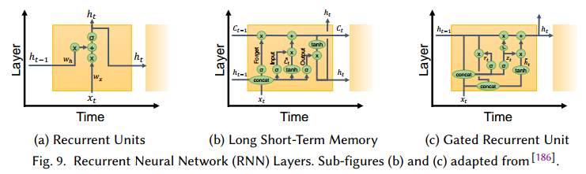
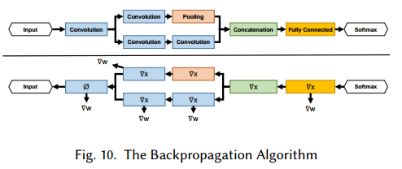

# Demystifying Parallel and Distributed Deep Learning: An In-Depth Concurrency Analysis

## Contact me

* Blog -> <https://cugtyt.github.io/blog/index>
* Email -> <cugtyt@qq.com>, <cugtyt@gmail.com>
* GitHub -> [Cugtyt@GitHub](https://github.com/Cugtyt)

> **本系列博客主页及相关见**[**此处**](https://cugtyt.github.io/blog/papers/index)

---

<head>
    
    
</head>

加速深度网络的训练从分布式算法和底层电路设计上都是一个大挑战，我们从理论的角度描述了这个问题，以及一些并行化的方法。我们展示了并行策略中的网络结构和揭示的趋势。我们综述和建模了DNN不同类型的并发：从单个运算符，到网络推理和训练并行化，到分布式深度学习。我们讨论了异步随机优化，分布式系统结构，通信模式，和网络结构的搜索。基于这些方法，我们推测了深度学习并行化的潜在趋势。

## 1 INTRODUCTION

【略去一些深度学习的发展】深度需要大量的计算资源。在文中，我们讨论了深度学习并行化和分布式的一系列主题，从向量化到更好的利用超算。尤其是，我们提出了DNN评价和实现的并行化策略，同时扩展到了支持分布式环境的训练算法和系统。为了提供更好的比较，我们使用Work-Depth分析了他们的并发和平均并行化。

### 1.1 Related Surveys

【略】

### 1.2 Scope

图1是我们的总览。表1是arXiv上历年文章的数量。

## 2 TERMINOLOGY AND ALGORITHMS

### 2.1 Supervised Learning

【监督学习常识略】

在本文中，我们把操作$P$和$E$作为随机变量的概率和期望，$z \sim D$表示随机变量$z$来自概率分布$D$，$E_{z \sim D}[f(z)]$表示$f(z)$对于随机变量$z$的期望。这些记号见表2。

正式的，给定数据$D$的概率分布，随机变量$z \sim D$，样本域$X$，标签域$Y$，假说$H$包含函数$f: X \rightarrow Y$，我们希望最小化泛化错误，定义为损失函数$L_D(f) \equiv P[f(z) \not= h(z)]$，其中$h(z)$表示真实的标签$z$。实践中，通常使用向量参数$w$定义的函数$f_w$作为$H$。例如，$H$表示N维超平面，把样本分为两类，$w_i$是系数。深度网络中，我们在很多层中定义$w$，$w_{l,i}$表示第l层，第i个。

我们希望找到最优的$w^*$最小化损失函数：

其中$l: H \times X \rightarrow R_+$是单个样本上的损失。

在我们的工作中，我们考虑两种类型的监督问题：多类别的分类和回归。

根据最小化原则，一个样本损失$l$应该是连续可微的。在回归问题中，可以直接使用如平方损失$l(w,z)=(f_w(z)-h(z))^2$。另一方面，分类问题中，一个简单的损失定义：$l(w,z)=0 ~~ if ~~ f_w(z)=h(z)~~ or ~~ 1$，也叫作0-1损失，但是不符合连续可微的条件。

为了解决这个问题，多分类问题定义$Y$为推断类别的概率分布，如图2，而不是一个简单的标签。输出用softmax：标准化。损失计算和真实标签分布的差异，例如使用交叉熵：。

最小化损失函数可以是使用不同的方法，例如迭代法或元启发式方法。机器学习中的优化主要是通过梯度下降。由于全部$D$不能观察到，获得一个无偏的梯度估计就是很必要的了。观察到：。因此，期望上，我们可以每次迭代中使用随机采样的数据做下降，用随机梯度下降的方法。

SGD迭代优化参数，它被证明对与带Lipschitz连续凸函数和有界梯度上以速率$O(1/\sqrt{T})$收敛。

在运行SGD前，可以采样权重$w^{(0)}$的初始估计，由于一些问题的病态特性，对于$w^{(0)}$的选择很重要，可以影响最终的结果。可以选择采样一定的初始化策略或者预训练的权重（迁移学习）。

#### 2.1.1 Weight Update Rules

表3是一些流行的权重更新策略。【算法的常识略】

#### 2.1.1.2 Minibatch SGD

通常在批量SGD中，会减少权重的更新次数，对于数据的子集平均梯度。

实践中，小批量的采样是通过打乱数据$S$实现的，不断的从中取大小为$B$的数据。

### 2.2 Unsupervised and Reinforcement Learning

机器学习中的其他两类是无监督学习和强化学习。前者，数据集$S$无标签，训练有不同的目标函数，尝试着去预测无标签数据的结构。后者是说观察一个时间点的环境，训练去优化一个行为策略函数最大化观察者的奖励。

在深度学习中，无监督学习有两个有用的实现：自动编码器和GAN。自动编码器把样本$x$作为输入，输出一个尽可能和$x$接近的值。在训练的时候，可以给输入加入噪声，学习输入无噪声的数据，作为去噪过滤器，相似的技术也可以用在图像压缩上。

GAN通过同时训练两个网络生成真实的数据，通常是图像。一个网络是判别器来区分真实和生成的数据，一个是生成器来生成尽可能和真实数据相似的样本。

强化学习将深度网络用于不同的用途，例如定义策略函数和奖励函数。训练算法不同于监督和无监督学习，时所用的方法如Deep Q Learning和A3C。

### 2.3 Parallel Computer Architecture

#### 2.3.1 Single-machine Parallelism

并行在今天的计算机中被大量运用，多进程编程迫使程序员把数据分布作为首要考虑，而多线程编程允许程序员只关心并行，把打乱数据交给硬件系统。

通用CPU对于通常类型的任务做了优化。机器学习通常是计算密集的，类似于传统的高性能计算应用。因此，大的学习负载在GPU或FPGA上通常表现更好,这些设备特化他们的结构来做数据并行。

图3是一些展示实验设备细节论文的总结，和这些工作中多节点并行的情况。

#### 2.3.2 Multi-machine Parallelism

单机通常无法训练大规模的模型。在网络交换中最重要的指标是延迟，带宽，信息率。【略】目前位置，网络的通信速度低于机器内部的通信。

图4a是近些年深度学习研究节点数。

### 2.4 Parallel Programming

实现并行学习算法的编程技术取决于并行计算机的结构。加速器通常用特殊的语言例如NVIDIA的CUDA等。

在多机分布式内存中，可以使用一个简单的通信机制如TCP/IP，或Remote Direct Memory Access (RDMA)。在分布式内存机器中，可以使用更方便的库例如 Message Passing Interface (MPI)或者 Apache Spark。

图4b是使用多节点并行的不同通信技术的趋势。

### 2.5 Parallel Algorithms

计算机上每个计算可以建模为一个有向无环图（DAG）。顶点是计算指令，边是数据依赖（数据流）。计算并行化有两个主要参数：图的工作量$W$，对应于节点的总数，和图的深度$D$，它是在DAG中任意长路径中的节点数。这两个参数可以让我们并行系统中的计算复杂度。例如，假设我们每一个时间单位处理一个运算，在单个处理器上处理图的时间是$T_1=W$，在无穷数量处理器上处理图的时间是$T_\infty = D$。计算的平均并行是$W/D$，这是处理图的处理器最好的数量。另外，我们可以证明$p$个处理器处理这样一个DAG的时间是有界的：。

大部分运算可以用张量建模，这个运算是高度数据并行的，只有在综合操作引入了依赖。

我们可以用一系列二元运算符来把n个值变成一个值，例如：。如果运算符是关联的，我们可以把线形图转换为树形图，如图5。容易看到，减少n的工作量和深度是$W=n-1$和$D = \lceil \log_2n \rceil$。在深度学习中，通常需要归并大量独立的参数，返回所有处理的结果，这在MPI中通常叫做*allreduce*。

在多机环境中，这些数据通常是分布在不同的机器上，由于机器间带宽低，这个操作通常是分布式学习中的关键因素。我们用简单的LogP模型分析算法，这里我们忽略了注入率限制$(o=g=0)$，使得它类似于简单的$\alpha - \beta$模型：$L=\alpha$建模了网络点对点延迟，$G=\beta$建模了单比特代价，$P\le p$网络中的机器数。基于以上的DAG模型，容易得到这个模型中reduction的时间下界：$T_r \ge L \log_2(P)$。另外由于每个元素要至少发送一次，第二个下界是$T_r \ge \gamma mG$，其中$\gamma$是单个数据大小，$m$是值发送的次数。如果不允许冗余计算，这个界可以加强为：$T_r \ge L \log_2(P) + 2 \gamma mG (P - 1)$。

【理论细节略】

## 3 THE EFFICIENCY TRADEOFF: GENERALIZATION VS. UTILIZATION

设置批量大小是复杂的优化空间，它影响了统计准确率（泛化性）和硬件效率（利用率）， 如图6a，小批量不能太小或太大。

我们可以结合SGD和带L-lipschitz函数f来展示区域C：，其中$z \sim D$，$\bigtriangledown f_z$是z的随机梯度，这说明大的梯度可以增加收敛率，但是它的梯度变化和学习率后导致最后一项阻碍收敛。

的确，这个情况在大的批量上会显示出来，见图6b，通常的大小是在10和10000之间。同时，大批量方法收敛和泛化出现在：（a）学习率统计或自适应调整，（b）使用“warmup”，（c）使用批量大小控制梯度变化，（d）在训练时自适应增加批量大小，（e）使用特殊的学习率策略。

## 4 DEEP NEURAL NETWORKS

图7中，我们两种网络：一个只有单一的运算，一个是一些运算的组合。

### 4.1 Neurons

【一些基本知识略】

#### 4.1.1 Feed-Forward Operators

#### 4.1.2 Recurrent Operators

### 4.2 Deep Networks

在并发中，我们使用Work-Depth(W-D)模型来描述计算代价。表4说明W渐进的决定了最大运算依赖路径D。这在实践中也得以验证，并行化是训练和衡量网络的的重要部分。

与前向传播相反，RNN包括自连接，因此不能简单的反向传播训练。最流行的方法是backpropagation
through time (BPTT)，它把循环层展开成一个固定长的序列，每个时间点使用相同的权重。

### 4.3 Trends in DNN Characteristics

我们研究了表5中的几个网络。【略去一些网络历史知识】

## 5 CONCURRENCY IN OPERATORS

### 5.1 Performance Modeling

即使使用W-S模型，还是很难估计一个深度网络的运行时间。图11是在NVIDIA CUBLAS库上的性能衡量。图说明了当维度改变，性能不是线性改变的，实践中，系统内部通常使用15个实现中的一种，左边的图是分段的。

使用上图作为查找表，有可能预测计算和反向传播的时间，误差大概有5-19%。【略】

### 5.2 Fully Connected Layers

全连接网络可以描述为矩阵矩阵相乘。所以一些线性代数库可以使用。【略】

### 5.3 Convolution

卷积占用了大量的运算。图12是一些卷积运算的细节，表6是他们Work-Depth的总结。

虽然卷积运算可以直接计算，但是没有高效利用向量处理器和多核架构的资源。

第一个算法是使用已知的技术把离散卷积转为矩阵乘法，使用Toeplitz矩阵，称作im2col。第一次把CNN的卷积展开同时使用了CPU和GPU。后面有人发扬了这个方法，它把图像从3D张量变形为2D矩阵。每个1D的行包括一个展开的2D块，通常是盘旋的，有冗余信息。卷积核使用用2D矩阵存储，每一列表示一个未展开的核（一个卷积滤波器）。把这两个矩阵相乘为一个矩阵，这个矩阵包含了盘旋的2D张量，可以通过运算变形为3D。这个阔以扩展到4D，核可以展开到行（kn2row）用于矩阵乘法。

虽然是对处理器友好的，但是这个GEMM方法消耗大量的内存，因此扩展性不好。因此实践中的GEMM方法，例如在CUDNN中，实现了隐式GEMM，并不实现Toeplitz。

第二个算法是使用傅里叶域，这里卷积可以定义为元素相乘。这个方法中，数据和核用傅里叶转换，相乘，在转换回来：

实践显示，越大的卷积核，越有优势，相比GEMM可以有16倍的性能提升。额外的优化使用FFT方面的优化，使用DNN方面的领域知识：（a）FFT使用decimation-infrequency，IFFT使用decimation-in-time，这样可以缓和比特取反指令，（b）多个大小$\le 32$的FFT做一个批量，（c）预计算旋转因子。【详见原文】

对于DNN，基于FFT的卷积可以进一步优化，ZNNi的作者观察到由于0填充，比图像小得多的卷积核大部分都是0.因此修改后的FFT可以转换卷积核，减少运算3倍。今天流行的方法是Winograd算法，由于小卷积核。这个算法为多个滤波器修改了原始算法。对于一块执行以下计算：

由于Winograd算法运算量相比滤波器大小成二次增长，所以卷积分解为一组小卷积之和。由于表达式的元素数量随滤波器大小增加，所以它的数值准确率通常比其他方法低，卷积核越大越低。

表6 TODO

### 5.4 Recurrent Units

## 6 CONCURRENCY IN NETWORKS

由于使用小批量算法，可以把宽度（$\propto W$）和深度（$\propto D$）的前向传播和反向传播分发到并行的处理器上。下面我们讨论三个策略：分输入样本(data parallelism), 分网络结构(model parallelism), 分网络层(pipelining)。如图14。

### 6.1 Data Parallelism

由于小批量SGD是把数据分为N份，一个直接的做法是把这些样本分到多个处理器上。

可以说，小批量SGD的使用是由数据并行驱动的。Farber and Asanović使用多个向量加速微处理器来自并行化错误反向传播由于网络训练。为了支持数据并行化，文章提出了一个延迟梯度更新的版本，叫做“bunch mode”，梯度在权重之前更新多次，内在等价于小批量SGD。

最早使用数据并行结构的文章关注于深度置信网络的训练问题。文章提出了高于CPU训练72.6倍的速度。

数据并行的比例由批量大小定义，除了BN，第4节所有的运算，都是完全独立的。但是在更新的时候，需要求平均，这时候需要访问所有的设备，意味着要对参数进行复制。

#### 6.1.1 Neural Architecture Support for Large Minibatches

通过多种方法，现在有很多已经成功把批量大小增加到8k，32k，64k，而且准确率没有明显损失。但是泛化问题依旧存在，但是也没有那么严重。一个影响并行的运算是BN，他需要完全的同步，而且由于在训练中出现多次，所以代价很大。所以一些文章提出把一些子集，如32个样本作为单独一部分标准化。

另一个方法定义一个不同的运算。加权标准化（WN）中权重定义为：$w = \left( \frac{g}{\Vert v \Vert} \right) \cdot v$，其中g表示权重大小，v标准化后的方向。WN把深度D从$O(\log N)$变为$O(1)$，去除了内部依赖。

#### 6.1.2 Coarse- and Fine-Grained Data Parallelism

在ParallelSGD中，数据分到多个处理器上，SGD运行k次。在所有SGD实例收敛后，权重结果集合取平均获得$\bar{w}$，表现出粗粒度的并行。

ParallelSGD和其他一些深度学习实现，使用MapReduce的编程范式设计。使用MapReduce，容易把并行任务分不到多个处理器上或分布式环境中。

虽然MapReduce对于深度学习一开始是成功的，但是一般阻碍了特定深度网络的优化。因此，当前的实现使用了高性能通信接口（MPI）来实现并行，例如通过异步执行，管道，系数通信等减少延时，如图15a。还有的是把小批量分解为微小批量（图15b），用于顺序计算。这减少了需要的内存，使得可以获取更多的内存来选择更快的算法，也可以使用混合CPU-GPU接口。

### 6.2 Model Parallelism

这个方法根据切分网络每层的神经元。这样，样本批量拷贝到所有的处理器上。不同的网络部分在不同的处理器上计算，减少了内存占用，但是需要额外的通信。

由于深度网络每层是独立的，通信决定了总体性能。全连接层是all-to-all的通信，神经元要和下一层的每个神经元进行连接。

为了减少全连接层的通信代价，有人提出了冗余计算。这个方法把网络进行了划分，每个处理器负责两倍的神经元，因此需要更多的计算，但是通信更少。

另一个减少全连接层通信的是使用Cannon矩阵相乘算法，为深度网络进行了修改。文章显示了这个算法有更好的效率和速度。

对于卷积网络，使用模型并行做卷积运算是很低效的。如果样本切分到不同的处理器上，每个卷积需要获得其他所有处理器上的结果来进行计算。为了缓解这个问题，Locally Connected Networks (LCNs)被提出。虽然也是执行卷积，但是它为每个区域定义了多个局部滤波器（图16a），这样可以切分C,H,W维度而不需要all-to-all的通信。

由于权重共享是CNN重要的部分，有助于减少内存占用和提升泛化，因此标准的卷积操作使用的更加频繁。

第二种模型并行的形式是复制DNN的元素。TreeNets的作者研究了DNN的集成（把不同网络的结果平均，而不是参数），提出了集成和单模型的中间形式：一个确定的层控制连接，此后网络的多个拷贝来训练（图16b）。文章定义了集成感知的损失函数，和反向传播的方法，以便于规范化训练过程。反过来训练过程把多个网络拷贝上在多个处理器上并行。

### 6.3 Pipelining

在深度学习中，管道可以指计算的重叠部分，或者把网络根据深度划分到不同的处理器上（图14c）。管道也可以看作是数据并行的一种形式，因为样本要并行通过网络来处理。

第一种管道可以用作前向求值、反向传播和圈中更新的重叠，这在实践中广泛运用，通过减少处理器的空闲来增加了利用率。在更好的粒度上，网络结构可以在层间计算重叠的角度来设计，Deep Stacking Networks(DSN)是其中一个例子。在DSN中，每一步计算一个不同的全连接层。但是先前步骤的结果要拼接在输入上，见图17a。这样可以让每层并行计算部分，减少了数据的依赖。

对于层的切分，多处理器管道有几个在数据和模型并行上的优势：（a）在前向求值和反向传播中不需要在所有的处理器上存储所有的参数，（b）处理器之间有固定数量的通信点，起始和终点处理器都是已知的。另外，由于处理器都是已知的，权重可以缓存减少内存的读写。但是这两个优势需要数据以固定的速率到达来更好的利用系统，延迟和处理器的数量成正比。

### 6.4 Hybrid Parallelism

多个并行模式的结合可以克服单个模式的缺点。

在AlexNet中，大部分计算量在卷积层，但是大部分的参数在全连接层。当分别使用数据并行或模型并行把AlexNet映射到多GPU节点上时，4个GPU最好的加速是2.2倍。一个混合模式的成功例子是把数据并行用于卷积，模型并行用于全连接部分（图17b）。使用这种混合方法，在8个GPU上可以达到6.25倍的速度，只有1%准确率的损失。这些结果在其他的混合实现中也得到了肯定。

AMPNet是一个DNN在CPU训练的异步实现，它使用了中间表示来实现细致的模型并行。尤其是，动态控制流的异步执行使得前向求值，反向传播，权重更新得以实现（图15a）。AMPNet主要的优势是循环，基于树的，门控图的神经网络。

最近，DistBelief分布式深度学习系统结合了三种并行策略。在实现中，训练在同时复制的多个模型上训练，每个模型副本在不同的样本上训练（数据并行），每个副本上，深度网络在相同层（模型并行）和不同层（管道）上进行分布训练。Adam项目在Distbelief上进行了扩展，但是它的管道受限于相同节点不同的CPU核。

## 7 CONCURRENCY IN TRAINING

目前讨论的训练算法都是只有一份权重w的拷贝，它的更新值是所有处理器可见的。在分布式环境中，有多个SGD实例独立运行，因此整个算法得互相配合。分布式模式在这个角度有三类：模型一致性，参数分布式和训练分布式。图18和19是总结图。

### 7.1 Model Consistency

我们把每个人观察到的w都是最新的训练算法叫做一致性模型方法，见图20a和20b。直接切分节点的计算构成了数据并行的分布式形式，其中，所有节点必须在获取新批量数据前互相通信自己的更新情况。数据并行化SGD为了支持分布式，把算法2修改3行和7行为从参数存储中读写权重，这又分为中心化和去中心化。

最近的工作放松了同步的限制，形成了非一致性模型，见图20c。训练的代理i在时间t包含一个权重的拷贝，记作$w^{(\tau, i)} ~~ for ~~ \tau \le t$，其中$t-\tau$叫做延迟。一个广为人知的不一致SGD是HOGWILD共享内存算法，它训练代理自由的读参数和更新梯度。它已经证明只更新一部分修改后的权重子集，一般对于稀疏学习问题能够收敛。证明基于分布式异步SGD，利用了一些特性：（a）写操作总是原子的，（b）Lipschitz连续可微和$f_w$上的凸特性，（c）延迟，读和写之间的最大数量迭代，写$\triangledown w$是有界的。

HOGWILD算法最初设计用于共享内存的架构，但是已经被扩展到分布式内存系统中，依旧在深度学习问题中达到收敛。为了减少每一步修改w的影响， TODO

### 7.2 Centralization

选择中心化或去中心化的结构取决于很多因素，包括网络拓扑，带宽，通信延迟，参数更新频率，错误容忍度等。一个中心化的网络结构通常包括参数服务器（PS），如图20a,c,图21，它包括一个或多个特定的节点，而去中心化的结构（图20b，d）依赖于在参数之间通信交流参数更新。中心化的结构参数更新靠参数服务器，去中心化的结构由每个节点单独计算。

使用哪种结构的权衡可以通过每次全局更新的通信代价建模。allreduce操作可以为不同的信息大小和节点高效实现，PS模式需要每个训练节点向PS节点发送和接收。 TODO

### 7.3 Parameter and Gradient Compression

分布式SGD算法需要全局reduction运算收敛。正如以上讨论的，减少信息的数量是可行的。

分布式深度学习中有两个方法来节约通信带宽：使用高效的数据表示来压缩参数，和避免发送不必要的信息，形成了稀疏数据结构的表示。虽然前一类中的方法与网络基础结构正交，但后一类中应用的方法在使用集中式（PS）和分散式拓扑结构实现时会有所不同。

#### 7.3.1 Quantization

梯度压缩的一个数据表示是量化，也就是把连续的信息映射到表示范围的桶中。已经有显式，参数和梯度值狭窄的分散着（图22a），因此可以减少参数的表示位数。这个方法已经在深度学习中的训练和推断，训练后的值被量化。

量化还通常通过减少浮点数的范围来做，尤其是用更少的比特表示IEEE 754 32bit浮点值。 TODO

#### 7.3.2 Sparsification

#### 7.3.3 Other Techniques

### 7.4 Model Consolidation

本节我们讨论参数一致性谱，如图23。这些情况里参数更新是高度不频繁，甚至不存在，因此有些事项要注意。尤其是，除了在多节点上运行数据并行的SGD，分布式深度学习可以通过让训练的代理们用不同的权重训练，在训练完或训练中进行结合。后者可以看作是非一致w的泛化，前者完全改变了训练和推断过程。

#### 7.4.1 Ensemble Learning and Knowledge Distillation

通过集成，多个权重实例在相同的数据上分别训练，最终的预测是对全部预测的平均。分布式训练的集成是完全的并行化过程，不需要通信。但是像TreeNet把集成学习用自定义的损失函数联合起来，提升了集成内部的多样性。

集成学习需要很多的内存和算力，以一个训练后集成的技术是使用知识蒸馏减少网络的大小。这个模式中，训练有两步：第一步是正常的训练或集成一个大的网络，第二步是训练一个网络模拟大规模集成的输出。结果显示第二个网络更容易训练。

#### 7.4.2 Model Averaging

这个方法单独的运行m个SGD实例，训练后把参数聚合一下或在训练中聚合多次。这些方法被证明会收敛，使用延迟异步SGD有更高的准确率。

为了解决准确率下降，一些复杂的方法包括Elastic Averaging SGD (EASGD)和Natural Gradient Descent（EASGD）基于中心化的环境，包括PS，通过 TODO

### 7.5 Optimization Algorithms and Architecture Search

#### 7.5.1 Parameter Search

批量优化在深度网络的起初就被使用，使用一阶或二阶方法，例如Levenberg-Marquardt, Conjugate Gradient (CG), 和L-BFGS。虽然比SGD需要更多的计算量，但是有几个优势，包括并发性增加（数据并行增加），更好的理论收敛保证。这些方法结合来双方面的优点，一个是更高的固有并发性（高阶方法），另一个是引入随机性，这样不用考虑亚线性的收敛率，在实践中工作的很好。

对于分布式深度学习，批量方法（尤其是CG and L-BFGS）和Hessian-free二阶优化很受欢迎，因为他们相比于传统SGD的扩展性，但是由于一阶随机优化泛化的优越性，以及DistBelief中非一致SGD的成功实现，我们发现批量方法由于高维导致平方增加的内存，通信和计算变得不理想。为了克服这些问题，有L-BFGS的随机变种被提出，它估计Hessian矩阵的逆，证明了在强的Lipschitz连续的凸问题中可以以线性速率收敛。

其他的优化方法尝试：（a）通过随机采样减少SGD的变化，（b）使用Alternating Direction Method of Multipliers (ADMM)整体跳过方向传播，（c）使用Neumann级数展开来近似海森矩阵，可以扩展到32k的大批量而没有准确率损失或严重的计算负担。

无梯度的优化算法已经用在深度学习中，其中的例子包括遗传算法，神经演化，Particle-Swarm优化。除了recombination/evolution 的步骤，训练的行为很类似于集成学习，因此这些算法比传统梯度下降更适应于并行。

#### 7.5.2 Hyper-Parameter Search

SGD参数居多，他们对准确率的影响阻碍了机器学习新技术的研究。知道最近，超参数的选择也是用大范围扫描的方法。由于极大增加了时间，所以他的效果受限于计算资源。

几个方法尝试去通过更好的猜测来突破参数扫描，和在训练的时候调整超参数。前者的方法包括贝叶斯优化，学习曲线的分析，来去掉不理想的设置，使用谱方法例如压缩感知来高效的采样超参数。

而对于在训练中调整超参数，Omnivore实现了预测分析和网格搜索来修改动量和超参数控制局部梯度延迟。文章显示了分布式环境，控制训练时同步SGD节点组大小增加了准确率和性能。YellowFin使用局部梯度曲率和方差来调节动量，在基于LSTM的模型和异步环境上工作的很好，比Adam优化器块3.28倍。

元启发式方法可以内在的调整超参数优化和训练。这包括基于PSO的深度学习，CoDeepNEAT，NEAT算法的变种算法可以同时搜索超参数和结构设置，由于大量的独立计算，这些方法的扩展是线性的。

最近，Population-Based Training(PBT) 使用强化学习方法探索了超参数空间。每个训练代理每几次SGD迭代独立的从其他代理中采样信息。这个信息用于选择最好的设置来继续训练。这个创造了去中心化的拓扑结构，其中的通信是不确定的，随着训练代理数的增加可以很好的扩展。

#### 7.5.3 Architecture Search

结构搜索可以分为3类：Sequential Model-Based Optimization (SMBO), Reinforcement Learning (RL), and Evolutionary Algorithms (EA)。

基于SMBO的搜索方法依赖于优化结构候选，定义一个有限状态集来探索。因此并发取决于搜索空间在给定时间的点数量。它的例子包括DeepArchitect，它提出一个深度网络定义语言，允许程序员显式定义空间，PNASNet通过基于A*的搜索算法增加网络复杂度来搜索网络，见图24a。 TODO

## 8 CONCLUDING REMARKS

基本上训练的每个方面，从DNN结构计算卷积到元优化，都是并行的。即使一个方面是顺序的，由于非线性优化的鲁棒性，它的一致性要求也可以去掉，这样可以在保持准确率的情况下增加并发。我们对很多方面进行了综述，使用W-D模型分析了并发。

随着研究的发展，DNN的结构变得更深，更多的连接。移动设备要求更小的网络，专用型硬件来训练网络是趋势。【略】

单个运算已经高度优化了，因此现在的研究朝着层间和整个深度网络的优化。【略】

分布式深度学习的技术促成了标准编程框架。【略】

最后，深度学习用于解决复杂度与日俱增的任务，例如路由算法等。通用人工智能的研究朝着多目的的网络，这在模型并行和不同训练算法上有新的未被探索的机会。寻求合适的多目的网络或许超越了人类灵巧性，元优化和渐进学习增加了可用性和质量，参数交换和手工DNN结构工程会被废弃。

