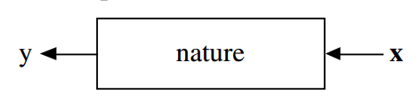
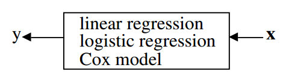
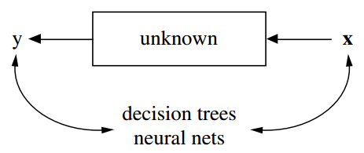

# Statistical Modeling: The Two Cultures

## Contact me

* Blog -> <https://cugtyt.github.io/blog/index>
* Email -> <cugtyt@qq.com>, <cugtyt@gmail.com>
* GitHub -> [Cugtyt@GitHub](https://github.com/Cugtyt)

> **本系列博客主页及相关见**[**此处**](https://cugtyt.github.io/blog/papers/index)

---

<head>
    
    
</head>

## Abstract

从数据中进行统计建模有两种文化。其中一个认为数据是从一个给定的随机数据模型中生成的，另一个把数据当作是未知量使用算法模型建模。统计社群里对数据模型有截然不同的使用，这也导致了不相关的理论，可疑的结论，使得统计学家们不能着手去解决现有的大量而有趣的问题。算法建模，无论是理论上还是实践上，在统计学之外发展迅速。它可以用在大量复杂的数据集上，也可以在更精细，信息量更多的小型替代数据上。如果我们的目标是使用数据解决问题，那么我们需要放弃对数据模型的互相排斥，采用更加多样性的工具。

## 1 INTRODUCTION

统计学起源于数据。把数据想做是一个黑盒子生成的，一边是一个向量$X$(独立变量)作为输入，另一边是它的响应变量$y$作为输出。在黑盒子内部，nature函数将预测变量和响应变量相关联：

在分析数据中有两个目标：

**预测** 要能够预测在输入变量时未来响应是什么样的

**信息** 要提取出一个信息，nature是如何把响应变量和输入变量联系在一起的

这两个目标有两个不同的方法：

**The Data Modeling Culture**

这个文化的分析起源于在黑盒子内部假设一个随机的数据模型，例如，一个通常的数据模型是数据独立的抽取自：

响应变量 = $f($ 预测变量，随机噪声，参数 $)$

参数的值是从数据中预测来的，模型接下来用于提取信息和/或预测，因此黑盒填充为：

**模型验证** 是否使用拟合优度(goodness-of-fit)测试和残余检验

**该文化群体数量估计** 98%的统计学家

**The Algorithmic Modeling Culture**

这个文化认为盒子里面是复杂且未知的。他们的方法是寻找一个函数$fXx)$——一个算法，能在$X$上运算预测响应$y$:

**模型验证** 通过预测准确率来衡量

**该文化群体数量估计** 2%的统计学家，大部分是其他领域的

本文我认为关注于数据模型上的统计社群会：

* 导致不相关的理论和可疑的结论
* 让统计学家不能使用更合适的算法模型
* 让统计学家不能去解决激动人心的新问题

我会回顾机器学习中算法建模的一些有趣的新进展，和在三个数据集上的应用。

## 2 ROAD MAP

这里会让你理解我为什么会成为第二个小众文化的一员。在做了7年满受限制的学术概率学家后，我辞职去做了完全自由职业的顾问。在3年顾问后，我在1980加入了伯克利统计系至今。我的顾问经历塑造了我对算法建模的看法。第三部分介绍我工作过的两个项目。

当我回到大学开始读统计期刊时，研究工作和我当顾问所做的离得很远。所有的文章重头到尾都是数据模型。我对出版统计理论研究的观察在第四部分。

数据模型在统计领域有很多成功的例子，包括数据分析，获取数据生成的信息等。但是有一个错误导致对潜在的机制产生了可疑的结论。第五部分有回顾。接下来第六部分是一个讨论，关于数据建模让统计学家无法进入一个新的科学和商业领域，因为那里收集的数据不适用数据模型的方法分析。

在过去的15年中，算法建模应用和方法成长非常快。已经超出了统计社群形成了一个新社群——通常叫做机器学习——这里主要是年轻的计算机科学家（第7部分）。它的先进性，尤其是过去的5年让人十分吃惊。有三个最重要的改变在第八、九和十部分，与下面一些名字相关联：

**Rashomon** 好模型的多样性

**Occam** 简单和有效的冲突

**Bellman** 维度——诅咒还是祝福

第11部分题目是“来自黑盒的信息”，它对于揭示算法模型可以比数据模型产出更多关于输入输出关系的结构信息。这将用两个医学数据集和一个基因数据集来说明。

## 3 PROJECTS IN CONSULTING

在做顾问的时候，我给EPA（Environmental Protection Agency）和联邦法庭系统设计了调查。控制实验是给EPA设计的，我给美国和加州运输部分析了交通数据。下面是一些例子：

* Predicting next-dayozone levels.
* Using mass spectra to identifyhalogen-containing
compounds.
* Predicting the class of a ship from high altitude
radar returns.
* Using sonar returns to predict the class of a submarine.
* Identityof hand-sent Morse Code.
* Toxicityof chemicals.
* On-line prediction of the cause of a freewaytraffic
breakdown.
* Speech recognition
* The sources of delayin criminal trials in state court
systems

### The Ozone Project

在20世纪60年代中后期，臭氧水平成为洛杉矶一个严重的健康问题，甚至建立了三种不同的警报级别，最高的一级是，所有政府工作人员都要求上班不开车，孩子们被档在操场外，不鼓励户外运动。

当时臭氧的主要来源是汽车尾气排放，它们上升到低层大气并被一个反转层困在那里。在早上通勤时间后两到三个小时，在阳光的帮助下，一个复杂的化学反应，加热并产生臭氧。警报是在早上发出的，但如果可以提前12小时发出会更有效。 在20世纪70年代中期，美国环保署资助了大量工作，以确定是否可以提前12小时准确预测臭氧水平。

洛杉矶的通勤模式是有规律的，从一个工作日到另一个工作日的日照时间总变化仅有几个百分点。由于排放总量大致不变，因此产生的臭氧水平取决于前几天的气象。因此组建了一个大型数据库，记录包括远在俄勒冈州和亚利桑那州的美国气象站的低空和高空测量，以及在盆地和附近几十个空气污染站的每小时表面温度，湿度和风速。

总共有七年的450多个气象变量的每日和每小时读数，以及流域内臭氧和其他污染物的相应小时值。设$X$为第$n$天的气象变量的预测向量，$X$中有超过450个变量，因为它包含了几天后的信息。设$y$是第$n + 1$天的臭氧水平。那么问题是构造一个函数$f(X)$，使得对$X$中任意时间和变量，$f(X)$为第二天的臭氧水平的准确预测值$y$。

为了估计预测准确性，将前五年的数据用作训练集，最后两年被留作测试集。20世纪80年代以前可用的算法建模方法现在似乎很原始。在该项目中，我们运行了大量的线性回归，然后进行变量选择。添加了保留变量中的二次项和相互作用，并再次使用变量选择来修剪方程。最后，该项目失败了，预测结果的误报率太高了。很遗憾的是这个项目无法通过今天的工具重现。

### The Chlorine Project

EPA每年对数千种化合物进行采样，并试图确定其潜在的毒性。在20世纪70年代中期，标准的流程是测量化合物的质谱并尝试从其质谱确定其化学结构。

测量质谱快速且便宜，但是从质谱中确定化学结构需要由经过培训的化学家进行艰苦的检查。分析所有质谱的化学家的成本使EPA感到沮丧。许多有毒化合物含有卤素，因此美国环保署资助了一个项目，以确定化合物中氯的存在是否可以从其质谱中可靠地预测。

通过在有磁场的情况下用离子轰击化合物来产生质谱，化合物分裂的分子和较轻的碎片在磁场中更加弯曲，然后碎片撞击吸收条带，条带上碎片的位置由碎片的分子量决定。然后通过在该位置的曝光强度来测量碎片的频率。得到的质谱数字反映了从分子量1到原始化合物分子量的碎片频率。峰值对应于出现最多的碎片，其中有许多零。可用的数据库由30,000种已知的化学结构和质谱组成。 

质谱预测向量$x$维度可变,数据库中的分子量从30到10,000不等。要预测的变量是

$y=1$：含氯

$y=2$：不含氯

这个问题是构建一个函数$f(x)$来预测化合物质谱$X$下的$y$。

为了测量预测准确性，将数据集随机分成25,000个训练集和5,000个测试集。 尝试了线性判别分析和二次判别分析，它们很难适应变化的维度。这时我正在考虑决策树，我研究了质谱中氯的标志，设计了可以应用于任何维度的质谱的1500个是-否问题的集合，将该领域知识结合到决策树算法中，结果是决策树对氯和非氯均有95％的准确度。

### Perceptions on Statistical Analysis

当我不做咨询回到大学时，这些是我对使用数据寻找问题答案的看法：

* 关注于找到一个好的解——这是顾问拿钱的地方
* 建模之前，好好接触数据
* 寻找一个能给出好解的模型，无论是算法建模还是数据建模
* 在测试集上的预测准确率是衡量模型好坏的标准
* 计算机是必不可少的工具

## 4　RETURN TO THE UNIVERSITY

我在伯克利统计学院有一个朋友，他是杰出的统计学家，在20世纪70年代到洛杉矶拜访我，我跟他说了决策树的方法，他第一个问题是“给数据建的模型是什么？”

### Statistical Research

在我回到大学后我开始阅读统计年鉴，这是理论统计的旗舰杂志，然后我就开始迷惑了。每个文章开始都是：

> 假设数据由以下模型生成：...

接着是数学推理，假设验证和逼近，有大量关于 TODO

## 5 THE USE OF DATA MODELS

应用领域的统计学家们把数据建模作为统计分析的模板：面对应用问题时，先考虑一个数据模型。这个企业的核心理念是，统计学家可以通过想象和浏览数据，为大自然复杂机制创造一类合理的参数模型，接着就是参数估计和结论。但是模型用到数据上得到量化的结论时，必须注意这些结论是关于模型的内在机制，而不是天然的机制。也就是说，如果模型是对大自然的错误模拟，那么结论也许就是错的。

在拟合数据模型的热情中，这些真理常常被忽视。几十年前，对数据模型的承诺导致即使是简单的东西，例如残差分析或拟合优度检验也没有使用。对数据模型的可靠性的信念几乎是宗教性的。这是一种奇怪的现象——一旦制作出一个模型，它就变成了真理，而它的结论是绝对可靠的。

### An Example

举个例子：假设数据是重如下模型中独立生成的

$$y = b _ { 0 } + \sum _ { 1 } ^ { M } b _ { m } x _ { m } + \varepsilon$$

要去估计系数$b _ { m }$, $\varepsilon$服从$N \left( 0 , \sigma ^ { 2 } \right)$，$\sigma ^ { 2 }$也要估计。

## 12. FINAL REMARKS

统计学中的目标是使用数据来预测和获取有关内在机制的信息。它不是写在石碑上的真理来教我们应该用什么样的模型来解决涉及数据的问题。为了明确我的立场，我本身并不反对数据模型。在某些情况下，它们的确是解决问题的最合适方式，但重点需要放在问题和数据上。

不幸的是无论面对多大的困难，我们这个领域对数据模型都及其热衷。例如，Dempster（1998）关于建模的论文，他对1990年人口普查调整争议的立场特别有趣。他承认他对数据或细节知之甚少，但他认为这个问题可以通过强大的建模来解决。对我而言，我不能理解越多建模越能让错误数据变正确。

无论科学还是商业，数以TB的数据不断涌入计算机，对数据分析和理解是很必要的。例如，望远镜和射电望远镜在扫描天空时以极高的速度生成数据，包含数百万个恒星对象的图像存储在磁带或磁盘上。天文学家需要通过自动方式扫描他们的数据，以找到某些或新类型的恒星。这是一个引人入胜的领域，我怀疑数据模型是否依然适用，我依然会把它分类为统计问题。

遗传数据分析是最具挑战性和最有趣的统计问题之一。 像第11.3节中分析的那样，微阵列数据可以在理解遗传效应方面取得重大进展，但是使用随机数据模型很难准确地对第11.3节中的变量重要性进行分析。

诸如恒星识别或基因表达数据分析等问题可能是统计学家的难题，但它要求的是专注于解决问题，而不是创建什么样的数据模型。最佳的解决方案可以是算法模型，也可以是数据模型，也可以是它们的组合，成为科学家的诀窍是对使用各种各样的工具持开放态度。

科学作为统计学的根源，主要工作是处理数据，检查构建在数据上的理论。我希望在本世纪这个领域能回归其根源。在过去的十年中，大量的统计学工作转向了真实问题，也向着交叉与合作不断探索。我相信这种趋势将持续下去，而且要想成为一个充满活力和创造力的领域，必须继续下去。