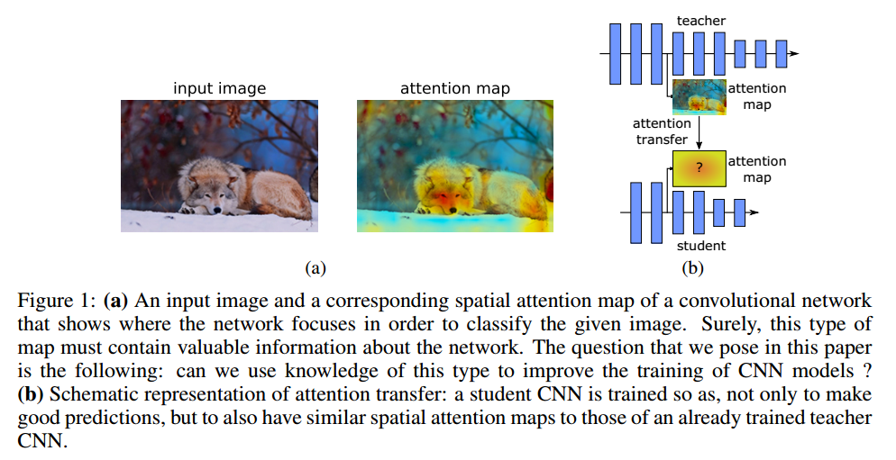
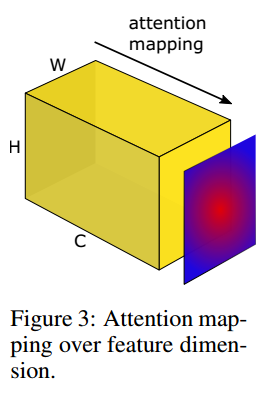
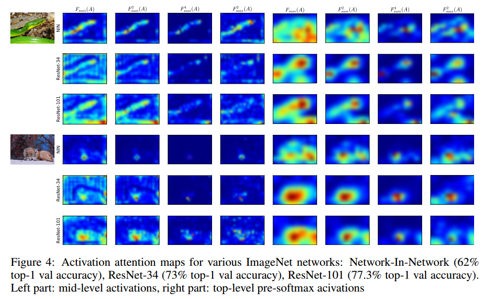
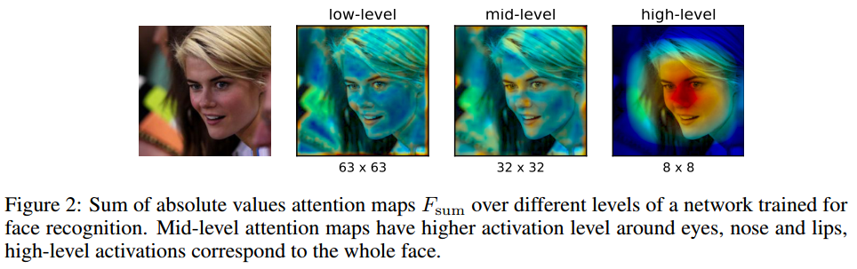
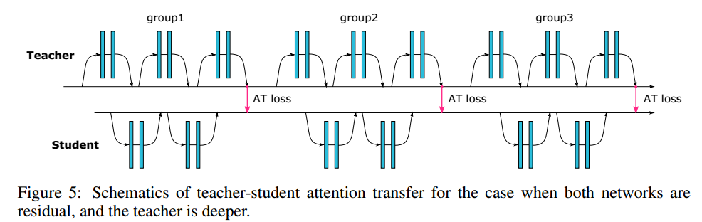
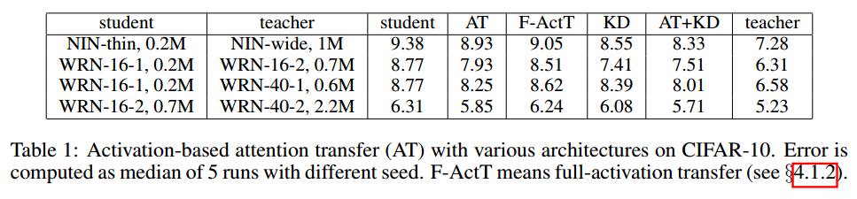
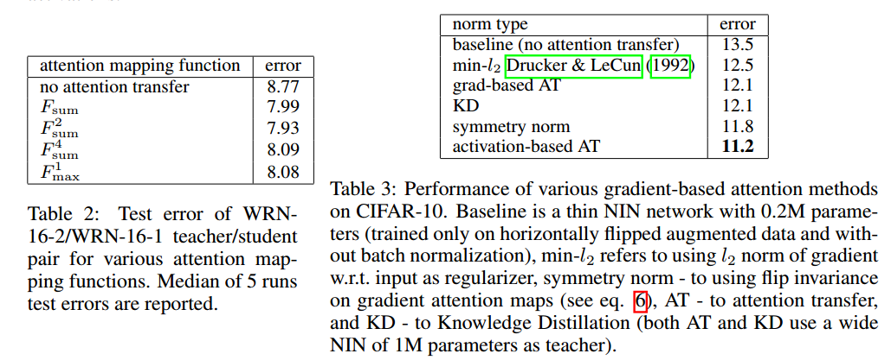
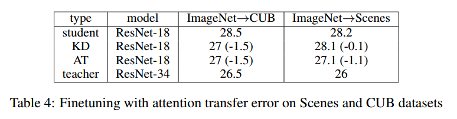

# PAYING MORE ATTENTION TO ATTENTION: IMPROVING THE PERFORMANCE OF CONVOLUTIONAL NEURAL NETWORKS VIA ATTENTION TRANSFER

## Contact me

* Blog -> <https://cugtyt.github.io/blog/index>
* Email -> <cugtyt@qq.com>, <cugtyt@gmail.com>
* GitHub -> [Cugtyt@GitHub](https://github.com/Cugtyt)

> **本系列博客主页及相关见**[**此处**](https://cugtyt.github.io/blog/papers/index)

---

<head>
    
    
</head>

## ABSTRACT

已经证明注意力在用人工智能网络的许多任务如计算机视觉和自然语言处理上有很重要的作用。本文展示了通过给CNN定义合适的注意力，我们可以通过强迫student CNN模仿teacher CNN的注意力图极大的提升student CNN的性能。最后，我们提出了几个新颖的注意力迁移方法，在多个数据集和卷积网络上都有稳定的提升。

## INTRODUCTION

人工的注意力机制让系统可以对目标进行更细节的查看，也成为理解神经网络背后机制的研究工具。一个流行的假说是有非注意力和注意力感知过程。非注意力过程正常观察场景获得高层次信息，当和其他的思考过程相结合时，这个信息帮助我们控制注意力过程，转到场景中一个特定的部分。这意味着不同的观察者由于不同的知识和目标，有着不同的注意力策略，相同的场景下看到不同的东西。这引出了本文的主要观点，人工神经网络的注意力有多大区别，我们可以用注意力来提升CNN性能吗？更具体点，一个teacher网络可以通过提供它的注意力信息提升student网络性能吗？

为了研究这些问题，首先需要正确定义一个网络的注意力。我们考虑注意力作为一个空间图，它把网络为了输出决策（例如图像分类）而对输入中最感兴趣的区域进行编码，这个图可以定义为能够捕获低层，中层，高层的表示信息的各个网络层。具体而言，在本文中，我们定义了两种空间注意力图：基于激活（activation-based）的空间图和基于梯度（gradient-based）的空间图。我们探索了这些注意力图在不同数据集和网络结构上的变化，展示了其中蕴含的信息可以极大地帮助提升卷积网络的性能。最后，我们提出了一个从teacher到student网络迁移注意力的新方法（图1）。

我们工作的贡献在于：

* 提出了让注意力作为从一个网络到另一个网络的知识迁移机制
* 提出了同时使用基于激活和基于梯度的空间特征图
* 实验证明了我们的方法在多个不同的数据集和深度网络中有极大的提升，包括残差网络和非残差网络
* 展示了基于激活的注意力迁移比激活迁移有更好的提升，可以和知识蒸馏结合在一起

## RELATED WORK

略

## ATTENTION TRANSFER

这里我们介绍两种卷积网络的空间注意力图，以及我们如何迁移注意力。

### ACTIVATION-BASED ATTENTION TRANSFER

考虑一个CNN层和对应的激活张量$A \in R ^ { C \times H \times W }$，c个通道，每个维度是$H \times W$。基于激活的映射函数$\mathcal { F }$把这个3维张量作为输入，输出一个2维空间特征图：

$$\mathcal { F } : R ^ { C \times H \times W } \rightarrow R ^ { H \times W }$$

为了定义这个空间注意力映射函数，我们的一个潜在假设是，隐层神经元激活（网络在预测时的结果）的绝对值可以用于指示这个神经元的重要性，这样我们可以计算通道维度的统计量，见图3。

具体而言，我们考虑如下的空间注意力图：

* 绝对值求和： `$F _ { \operatorname { sum } } ( A ) = \sum _ { i = 1 } ^ { C } \left| A _ { i } \right|$`
* 绝对值指数求和，指数大于1： `$F _ { \mathrm { sum } } ^ { p } ( A ) = \sum _ { i = 1 } ^ { C } \left| A _ { i } \right| ^ { p }$`
* 绝对值指数求最大值： `$F _ { \max } ^ { p } ( A ) = \max _ { i = 1 , C } \left| A _ { i } \right| ^ { p }$`

其中， $A _ { i } = A ( i , : , : )$(MATLAB 记号)，最大值，指数和绝对值都是元素级别的操作。

我们可视化了在多个数据集上多种网络，包括ImageNet分类和定位，COCO目标检测，人脸识别等。我们不带顶层线性全连接层，例如Network-InNetwork, ResNet and Inception，他们都有流线型的卷积结构。我们也在相同结构，宽度和深度的网络上，但是在不同的框架上训练得到了截然不同的性能。我们发现隐层激活的统计信息不仅有空间相关性，而且这些相关性与准确率有很强的关系，更强大的网络有更尖锐的注意力（图4）。网络中不同的层有不同的注意力图，关注与不同的地方。前面的层对于低层次梯度点激活程度很高，中间层对于最有判别性的区域激活很高，顶层会反映出整体的目标，例如图2。

对于上面说的不同的注意力映射函数，有一些属性上的微小差别：

* 与$F _ { \mathrm { sum } } ( A )$相比，空间图$F _ { \mathrm { sum } } ^ { p } ( A )$对有更高激活的空间位置有更多的权重，也就是对最优判别性的部分赋予更多的权重。
* 在相同空间位置的所有激活中，$F _ { \max } ^ { p } ( A )$只考虑其中一个来赋予权重，而$F _ { \mathrm { sum } } ^ { p } ( A )$更倾向于多个神经元都激活的区域。

为了进一步说明区别，我们可视化了3个性能截然不同的网络：Network-In-Network (62% top-1 val accuracy), ResNet-34 (73% top-1 val accuracy) and ResNet-101 (77.3% top-1 val accuracy)，每个网络我们取了最后一个下采样前的激活图，在图4中左边是中间层，右边是顶层均值池化前的激活图。顶层的有些模糊了，因为他的原始空间分辨率只有7*7。很明显最具有判别性的区域有更高的激活级别。

在注意力迁移中，给定teacher网络的空间激活图，我们的目标是训练一个student网络能不只是做正确的预测，同时也要有和teacher相似的激活图。通常我们可以加一个迁移损失，例如对于ResNet而言，可以考虑下面两种情况，这取决于teacher和student的深度：

* 相同的深度：可以在每个残差块后做注意力迁移
* 不同的深度：对每个组的激活图做注意力迁移

图5是一个不同深度情况下的残差网络结构。

不失一般性，我们假设迁移损失位于student和teacher相同分辨率的激活图上，但是如果需要的话，激活图可以差值到满足他们的形状要求。令S，T,$W_S, W_T$表示student，teacher和他们对应的权重，令$L(W, x)$表示标准的交叉熵。令$I$表示我们希望迁移激活图的teacher-student激活层对。那么我们可以定义如下的损失：

$$\mathcal { L } _ { A T } = \mathcal { L } \left( \mathbf { W } _ { S } , x \right) + \frac { \beta } { 2 } \sum _ { j \in \mathcal { I } } \left\| \frac { Q _ { S } ^ { j } } { \left\| Q _ { S } ^ { j } \right\| _ { 2 } } - \frac { Q _ { T } ^ { j } } { \left\| Q _ { T } ^ { j } \right\| _ { 2 } } \right\| _ { p }$$

其中$Q _ { S } ^ { j } = \operatorname { vec } \left( F \left( A _ { S } ^ { j } \right) \right)$ 和 $Q _ { T } ^ { j } = \operatorname { vec } \left( F \left( A _ { T } ^ { j } \right) \right)$表示第j个激活图对的向量表示，p表示norm的类型。

注意力迁移也可以和知识蒸馏结合，只需要往上面加一个额外项，也只增加了一点计算量。

### GRADIENT-BASED ATTENTION TRANSFER

这里我们把对输入的梯度定义为注意力，可以看作是输入敏感图。我们定义teacher和student的损失对于输入的梯度：

$$J _ { S } = \frac { \partial } { \partial x } \mathcal { L } \left( \mathbf { W } _ { \mathbf { S } } , x \right) , J _ { T } = \frac { \partial } { \partial x } \mathcal { L } \left( \mathbf { W } _ { \mathbf { T } } , x \right)$$

如果需要student的梯度注意力与teacher的注意力相似，我们可以最小化他们的距离：

$$\mathcal { L } _ { A T } \left( \mathbf { W } _ { \mathbf { S } } , \mathbf { W } _ { \mathbf { T } } , x \right) = \mathcal { L } \left( \mathbf { W } _ { \mathbf { S } } , x \right) + \frac { \beta } { 2 } \left\| J _ { S } - J _ { T } \right\| _ { 2 }$$

给定$W_T$和$x$，可以得到对于$W_S$的梯度：

$$\frac { \partial } { \partial \mathbf { W } _ { \mathbf { S } } } \mathcal { L } _ { A T } = \frac { \partial } { \partial \mathbf { W } _ { \mathbf { S } } } \mathcal { L } \left( \mathbf { W } _ { \mathbf { S } } , x \right) + \beta \left( J _ { S } - J _ { T } \right) \frac { \partial ^ { 2 } } { \partial \mathbf { W } _ { \mathbf { S } } \partial x } \mathcal { L } \left( \mathbf { W } _ { \mathbf { S } } , x \right)$$

所以为了做一次更新，我们先得做一次前向和反向传播来得到$J_S$和$J_T$，计算第二项的$\frac { \beta } { 2 } \left\| J _ { S } - J _ { T } \right\| _ { 2 }$然后再一次传播。【略】

我们也提出了迫使梯度注意力图的水平翻转不变。为了做到这一点，我们把原图和水平翻转的图像都做传播。然后加上得到的注意力和输出的$l_2$损失，做第二次传播：

$$\mathcal { L } _ { s y m } ( \mathbf { W } , x ) = \mathcal { L } ( \mathbf { W } , x ) + \frac { \beta } { 2 } \left\| \frac { \partial } { \partial x } \mathcal { L } ( \mathbf { W } , x ) - \operatorname { fip } \left( \frac { \partial } { \partial x } \mathcal { L } ( \mathbf { W } , \mathrm { flip } ( x ) ) \right) \right\| _ { 2 }$$

## EXPERIMENTAL SECTION

【略】

## CONCLUSIONS

我们展示了几个网络到网络的迁移方法，在空间信息很重要的情况下，查看注意力如何工作是很有趣的事情。总之，我们认为这个有趣的发现会帮助知识蒸馏的进一步发展，以及更好的理解卷积网络。