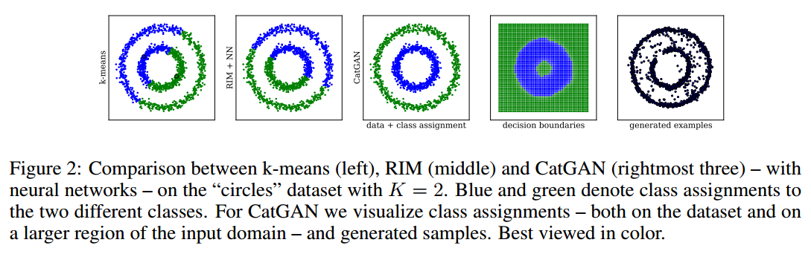

# UNSUPERVISED AND SEMI-SUPERVISED LEARNING WITH CATEGORICAL GENERATIVE ADVERSARIAL NETWORKS

## Contact me

* Blog -> <https://cugtyt.github.io/blog/index>
* Email -> <cugtyt@qq.com>, <cugtyt@gmail.com>
* GitHub -> [Cugtyt@GitHub](https://github.com/Cugtyt)

> **本系列博客主页及相关见**[**此处**](https://cugtyt.github.io/blog/papers/index)

---

<head>
    
    
</head>

## ABSTRACT

在本文中，我们提出了一种从未标记或部分标记的数据中学习判别分类器的方法。我们的方法是基于目标函数，该函数在观察到的示例与其预测的分类类别分布之间交换互信息，利用该分类器的鲁棒性实现了生成对抗模型。得到的算法可以看做为生成对抗网络（GAN）框架的泛化，或者看做为正则化信息最大化（RIM）的扩展，它对最优对抗进行分类。我们用实验评估了我们的方法，将分类生成对抗网络（CatGAN）用于合成数据以及图像分类任务，展示了学习分类器的鲁棒性。我们进一步评估了生成器生成的样本的保真度，以及CatGAN目标与判别性聚类算法（如RIM）之间的联系。

## 1 INTRODUCTION

从未标记或仅部分标记的数据中学习非线性分类器是机器学习中长期存在的问题。从未标记数据中学习的前提是，训练样本中的结构包含可用于推断未知标签的信息。也就是说，在无监督学习中，我们假设输入分布$p(x)$包含关于$p(y \vert x)$的信息，其中$y \in \{1, \dots, K \}$表示未知标签。通过利用来自数据分布的带标签和不带标签的样本，我们希望学习到该结构的表示。这样的表示可以帮助分类器仅使用少数标记样本训练，而且泛化到同样来自该数据分布但是不包含信息的其他部分。另外，无监督的数据分类是用于发现具有未知类结构的常用工具。 

传统上，该任务被形式化为群集分配问题，可以使用大量经过充分研究的算法。这些可以分为两种类型：（1）生成聚类方法，如高斯混合模型，k均值和密度估计算法，它们直接尝试对数据分布$p(x)$（或其几何性质）进行建模; （2）判别聚类方法，如最大边缘聚类（MMC）或正则化信息最大化（RIM），旨在通过一些分类机制将未标记数据直接分组为分割较好的类别，并不明确地建模$p(x)$。虽然后一种方法更直接地对应于我们学习类别分割的目标，但它们很容易过度拟合数据中的虚假相关性，特别是与强大的非线性分类器（如神经网络）结合使用时。

最近，神经网络已经探索了用于无监督和半监督学习任务的各种方法。这些方法通常涉及训练生成模型【略】或训练自动编码器网络，因为他们通过重建输入样本显式地模拟数据分布，所有这些模型都与生成聚类方法相关，并且通常仅用于预先训练一个分类网络。这种基于重建的学习方法的一个问题是，通过构造来学习在保留输入样本中所有信息情况下的表示。这种完美重建的目标通常与学习分类器的目标相反，分类器是建模$p(y \vert x)$，因此它只保留预测类标签所必需的信息（对不重要的细节不关心）。

分类生成对抗网络（CatGAN）框架的想法是结合生成和判别两个角度。我们学习判别网络分类器$D$，对于许多K个未知类别，其最大化输入$x$和标签$y$之间的互信息（通过条件分布$p(y \vert x,D)$预测）。为了帮助这些分类器更好的泛化到未知数据，我们将分类器的鲁棒性强加于对抗生成模型产生的样本，而对抗生成模型试图欺骗分类器接受伪造的输入样本。

## 2 GENERATIVE ADVERSARIAL NETWORKS

【GAN的基本知识略】

GAN的目标函数是：

$$\min _ { G } \max _ { D } \mathbb { E } _ { \mathbf { x } \sim \mathcal { X } } [ \log p ( y = 1 \vert \mathbf { x } , D ) ] + \mathbb { E } _ { \mathbf { z } \sim P ( \mathbf { z } ) } [ \log ( 1 - p ( y = 1 \vert G ( \mathbf { z } ) , D ) ) ]  \qquad  (1)$$

## 3 CATEGORICAL GENERATIVE ADVERSARIAL NETWORKS (CATGANS)

基于第2节的基础，我们现在将得出无监督和半监督学习的分类生成对抗网络（CatGAN）目标。我们首先推导无监督，这可以通过将GAN框架推广到多个类来得到。应该指出的是，我们可以从正则化信息最大化（RIM）的角度出发，等效地推导出CatGAN模型。

### 3.1 PROBLEM SETTING

令$\mathcal { X } = { \mathbf { x } ^ { 1 } , \ldots \mathbf { x } ^ { N } }$为未标记样本的数据集。我们考虑从$X$无监督地学习判别分类器$D$的问题，使得$D$将数据分类为先验选择的类别$K$.此外，我们需要$D(x)$来产生条件概率分布，即$\sum _ { k = 1 } ^ { K } p ( y = k \vert \mathbf { x } , D ) = 1$。接下来学习的目的是训练概率分类器$D$，其类别分配满足拟合优度。值得注意的是，由于样本的真实类别分布未知，我们必须借助于中间测量来判断分类器性能，而不是仅仅最小化目标函数，例如负对数似然。具体而言，我们将总是优选D，使其对于给定示例$x$的条件类别分布$p(y \vert x,D)$具有高确定性，而边际类别分布$p(y \vert D)$接近于先验分布$p(y)$。我们将始终假设一个统一的类别先验，即我们期望$X$中每个类的样本数量对于所有k是相同的:$\forall k , k ^ { \prime } \in K : p ( y = k \vert D ) = p ( y = k ^ { \prime } \vert D )$

在这个问题的第一个观察是，它可以自然的看做是“软”或概率群集分配任务。因此，原则上可以通过概率聚类算法来解决，例如正则化信息最大化（RIM），或相关的熵最小化。所有这些方法都倾向于过度拟合数据中的虚假相关性，这是我们旨在通过将判别器与对抗生成模型配对来缓解的问题，其必须变得鲁棒。顺便提一下，我们的方法可以被理解为RIM健壮的扩展，RIM中对抗提供了自适应正则化机制。

有些显然但重要的第二个观察是标准GAN目标函数不能直接用于解决我们所描述的问题。其原因在于，虽然等式（1）的优化确实会形成判别分类器$D$(其必须捕获所提供的输入数据的统计量)，该分类器仅用于确定给定示例$x$是否属于$X$。原则上，我们可以希望能够对数据分布建模的分类器也可以学习特征表示（例如，在神经网络中D的最后一层中的隐藏表示），用于在第二步骤中提取类别（例如通过判别聚类）。然而，有必要认识到函数$D$执行二元分类任务的方法(区分真实样本和假样本) - 在GAN框架中不受限制，因此分类器将主要未被生成器正确建模的输入特征。反过来，这些特征不一定与我们想要分离数据类别的概念一致。在最坏的情况下，它们仅仅用于可以检测数据中的噪声。 

尽管存在这些问题，但是存在一种原则化而简单的扩展GAN框架的方式，使得判别器可以用于多类别分类。为了达到这一点，让我们考虑将设定改为GAN框架背后的两个玩家游戏：不要让$D$预测$x$属于$X$的概率，我们可以要求$D$将样本分到$K$类，同时保持对生成模型$G$中样本的类别不确定性，我们期望这将有助于使分类器鲁棒。类似地，我们可以将生成器的问题从“生成属于数据集的样本”更改为“生成恰好属于$K$类中某一个类的样本”。

如果我们成功地训练了这样的分类器-生成器对，同时确保这$K$类与我们感兴趣的分类问题一致（例如$D$满足上面概述的拟合优度标准）,我们将有一个通用的公式来从未标记的数据中训练分类器 。

### 3.2 CATGAN OBJECTIVE

如上所述，我们想要解决的优化问题不同于标准GAN公式，主要在一个关键方面：我们的目标是学习通过为每个示例$x$分配标签$y$来将数据分成$K$类的判别器，而不是学习二元判别函数。形式上，我们将此设置的判别器$D(x)$定义为可预测$K$类的对数可微函数：$D ( \mathbf { x } ) \in \mathbb { R } ^ { K }$。然后，基于判别器的输出，通过softmax给出$x$属于$K$类之一的概率：

$$p ( y = k \vert \mathbf { x } , D ) = \frac { e ^ { D _ { k } ( \mathbf { x } ) } } { \sum _ { k = 1 } ^ { K } e ^ { D _ { k } ( \mathbf { x } ) } }$$

在标准GAN公式中，我们将生成器$G(z)$定义为映射随机噪声$\mathbf { z } \in \mathbb { R } ^ { Z }$生成样本$\tilde { \mathbf { x } } \in \mathbb { R } ^ { I }$：

$$\tilde { \mathbf { x } } = G ( \mathbf { z } ) \quad with \quad z \sim P ( \mathbf { z } )$$

其中$P ( \mathbf { z }$表示任意噪声分布。本文中，$D$和$G$总是被参数化为具有线性或S形输出的多层神经网络。

正如第3.1节中非正式描述的那样，拟合优度标准(结合我们想要使用生成模型来正则化分类器的想法)直接决定了学习判别器应该满足的三个要求，以及生成器应该满足的两个要求，如图1。

**判别器的角度** 它应该（i）确定样本的类别分配，（ii）不确定生成的样本的分配，以及（iii）平等地使用所有类别(平均分布)。 

**生成器的角度**  它应该（i）生成具有高度确定类别分配的样本，（ii）在所有K类中平均分配样本。

我们现在将依次解决这些要求，将它们定义为最大化或最小化问题类别概率。注意，如果没有关于K类的附加信息（标签），我们不能直接指定哪个类概率$p ( y = k \vert \mathbf { x } , D )$应该最大化以满足要求（i）。尽管如此，我们可以通过信息理论测量对预测类别分布来达到要求背后的直觉。可以应用于该问题最直接的度量是香农熵$H$，其被定义为来自给定分布的样本所携带信息的预期值。直观地，如果我们希望以样本$x$为条件分布$p ( y \vert \mathbf { x } , D )$高度达到峰值,即$D$对类别赋值十分确定，也就是希望样本的信息$H [ p ( y \vert \mathbf { x } , D ) ]$最低，因为来自所属分布的任何样本总为相同类。另一方面，如果我们希望条件类别分布对于不属于$X$(来自生成器)的样本是平坦的（高度不确定的）,我们可以最大化熵$H [ p ( y \vert G ( \mathbf { z } ) , D ) ]$，在最佳情况下会产生均匀条件分布并满足要求（ii）。具体地说，我们可以定义来自$X$条件熵的经验估计：

$$\begin{aligned} \mathbb { E } _ { \mathbf { x } \sim \mathcal { X } } [ H [ p ( y \vert \mathbf { x } , D ) ] ] & = \frac { 1 } { N } \sum _ { i = 1 } ^ { N } H [ p ( y \vert \mathbf { x } ^ { i } , D ) ] \\ & = \frac { 1 } { N } \sum _ { i = 1 } ^ { N } - \sum _ { k = 1 } ^ { K } p ( y = k \vert \mathbf { x } ^ { i } , D ) \log p ( y = k \vert \mathbf { x } ^ { i } , D ) \end{aligned}  \quad (4)$$

来自生成器的样本的条件熵经验估计可以表示为对于噪声向量$z$先验分布$P(z)$的$H [ p ( y \vert G ( \mathbf { z } ) , D ) ]$的期望，我们可以进一步通过蒙特卡罗抽样近似得到：

$$\mathbb { E } _ { \mathbf { z } \sim P ( \mathbf { z } ) } \[ H [ p ( y \vert D ( \mathbf { z } ) , D ) ] ] \approx \frac { 1 } { M } \sum _ { i = 1 } ^ { M } H [ p ( y \vert G ( \mathbf { z } ^ { i } ) , D ) ]  \quad with \quad \mathbf { z } ^ { i } \sim P ( \mathbf { z } )  \quad (5)$$

其中$M$表示样本数量（我们简单地设置为等于N）。为了满足所有类应该均等使用的第三个要求（对应于均匀的边际分布）我们可以根据$X$和$G$的样本经验性地测量边际类别分布的熵：

$$\begin{aligned} H _ { \mathcal { X } } [ p ( y \vert D ) ] & = H [ \frac { 1 } { N } \sum _ { i = 1 } ^ { N } p ( y \vert \mathbf { x } ^ { i } , D ) ] \\ H _ { G } [ p ( y \vert D ) ] & \approx H [ \frac { 1 } { M } \sum _ { i = 1 } ^ { M } p ( y \vert G ( \mathbf { z } ^ { i } ) , D ) ] , \text { with } \mathbf { z } ^ { i } \sim P ( \mathbf { z } ) \end{aligned} \quad (6)$$

这些熵中的第二个可以用于定义让生成器满足要求（ii）的最大化问题。从生成器角度满足条件（i）最终等于最小化而不是最大化等式（5）。结合方程（4,5,6）的定义，我们可以为判别器定义CatGAN目标函数，我们用$\mathcal { L } _ { D }$来指代，生成器用$\mathcal { L } _ { G }$表示： 

$$\begin{aligned}\mathcal { L } _ { D } & = \max _ { D } H _ { \mathcal { X } } [ p ( y \vert D ) ] - \mathbb { E } _ { \mathbf { x } \sim \mathcal { X } } [ H [ p ( y \vert \mathbf { x } , D ) ] ] + \mathbb { E } _ { \mathbf { z } \sim P ( \mathbf { z } ) } [ H [ p ( y \vert G ( \mathbf { z } ) , D ) ] ] \\ \mathcal { L } _ { G } & = \min _ { G } - H _ { G } [ p ( y \vert D ) ] + \mathbb { E } _ { \mathbf { z } \sim P ( \mathbf { z } ) } [ H [ p ( y \vert G ( \mathbf { z } ) , D ) ] \end{aligned} \quad (7)$$

其中$H$表示如上定义的经验熵，并且我们选择它定义生成器的目标函数$\mathcal { L } _ { G }$。该公式满足上述所有要求，并且具有简单的信息理论解释：判别器希望最大化$\mathcal { L } _ { D }$中的前两项，即数据分布与预测类别分布之间的互信息，同时最小化信息编码$G(\mathbf { z })$。类似地，$\mathcal { L } _ { G }$中的前两个项估计生成的样本的分布与预测的类分布之间的互信息。

由于我们关注于大型数据集上优化（7），所以我们希望$\mathcal { L } _ { G }$和$\mathcal { L } _ { D }$能够通过批量$\chi _ { B }$数据的小批量随机梯度下降进行优化。式（7）中的条件熵项仅由每个样本熵的和组成，因此可以简单地适用于分批计算。然而，边缘熵$H _ { \mathcal { X } } [ p ( y \vert D ) ]$和$H _ { G } [ p ( y \vert D ) ]$在整个数据集$X$中或在熵计算中包含来自$G$的大量样本中的总和，因此不能分批量计算。如果判别器需要预测的类别数量$K$远小于批量大小$B$，则对此问题的一个简单解决方法是仅在随机小批量中估计$B$个示例的边际类别分布：$H _ { \mathcal { X } } [ p ( y \vert D ) ] \approx H [ \frac { 1 } { B } \sum _ { \mathbf { x } \in \mathcal { X } _ { B } } p ( y \vert \mathbf { x } ^ { i } , D ) ]$。对于$H _ { G } [ p ( y \vert D ) ]$我们可以类似地仅使用B样本计算估计。我们注意到虽然这种近似对于我们考虑的问题是合理的，但对于类别特别多的情况也是有问题的，这种情况下只能在多个批量上估计边缘类别分布。

### 3.3 EXTENSION TO SEMI-SUPERVISED LEARNING

我们现在将考虑将第3.2节中的公式调整为半监督。 设$\mathcal { X } ^ { L } = { ( \mathbf { x } ^ { 1 } , \mathbf { y } ^ { 1 } ) , ( \mathbf { x } ^ { L } , \mathbf { y } ^ { L } ) }$是一组$L$个标记的样本，one-hot 编码标签向量$\mathbf { y } ^ { i } \in \mathbb { R } ^ { K }$，此外还有$N$个无标签的样本。通过计算预测的条件分布$p ( y \vert \mathbf { x } , D )$与$\mathcal { X } ^ { L }$中样本的真实标签分布之间的交叉熵，可以将这些附加样本结合到等式（7）的目标函数中。标记数据对$( \mathbf { x } , \mathbf { y } )$的交叉熵给出为

$$C E [ \mathbf { y } , p ( y \vert \mathbf { x } , D ) ] = - \sum _ { i = 1 } ^ { K } y _ { i } \log p ( y = y _ { i } \vert \mathbf { x } , D )$$

半监督的CatGAN通过两个目标$\mathcal { L } _ { D } ^ { L }$（用于判别器）和$\mathcal { L } _ { G } ^ { L }$（用于生成器）给出

$$\begin{array} { r l } { \mathcal { L } _ { D } ^ { L } = \max _ { D } } & { H _ { \mathcal { X } } [ p ( y \vert D ) ] - \mathbb { E } _ { \mathbf { x } \sim \mathcal { X } } [ H [ p ( y \vert \mathbf { x } , D ) ] ] + \mathbb { E } _ { \mathbf { z } \sim P ( \mathbf { z } ) } [ H [ p ( y \vert G ( \mathbf { z } ) , D ) ] ] } \\ { } & { + \lambda \mathbb { E } _ { ( \mathbf { x } , \mathbf { y } ) \sim \mathcal { X } ^ { L } } [ C E [ \mathbf { y } , p ( y \vert \mathbf { x } , D ) ] ] } \end{array}$$
其中λ是加权项，其中$\mathcal { L } _ { G } ^ { L }$与方程7相同：$\mathcal { L } _ { G } ^ { L } = \mathcal { L } _ { G }$

### 3.4 IMPLEMENTATION DETAILS

在我们的实验中，生成器和判别器总是通过神经网络参数化。众所周知，由于几种不幸的情况GAN很难训练。首先，如果判别器学得太快（在这种情况下生成器的loss饱和），则公式（1）的公式可能变得不稳定。其次，生成器可能卡住产生一种数据模式，或者在训练期间，于生成不同模式之间疯狂地切换。 

因此，我们采取两项措施来稳定训练。首先，我们在判别器的所有层和除了最后一层之外的生成器所有层中使用批量标准化，这有助于限制每层中的激活，并且我们实验发现它可以减少生成器的模式切换以及在少数标签情况下增加判别器的泛化能力。此外，我们通过对其隐藏层应用噪声来规范判别器。虽然我们确实发现dropout有效，但高斯噪声添加到批量归一化隐藏激活中可以产生稍好的性能。我们怀疑这主要是由于dropout噪声会严重影响批量归一化期间的均值和方差计算，而用于计算这些统计数据的激活的高斯噪声是一个自然的假设。 

## 4 EMPIRICAL EVALUATION

【细节略】

## 5 RELATION TO PRIOR WORK

【略】

## 6 CONCLUSION

我们提出了分类生成对抗网络，一个强大的无监督和半监督学习的框架。我们的方法将神经网络分类器与对抗生成模型相结合，该模型将经过判别训练的分类器正规化。我们发现所提出的方法产生的分类性能与用于图像分类中半监督学习的state-of-the-art结果有一比，并且进一步证实了与分类器一起学习的生成器能够生成高质量的图像。 