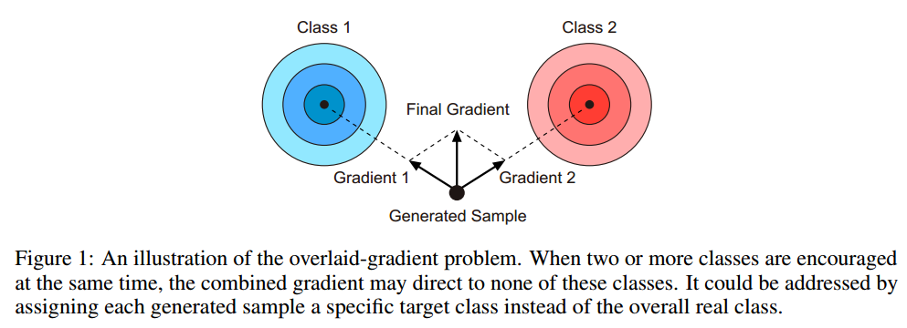
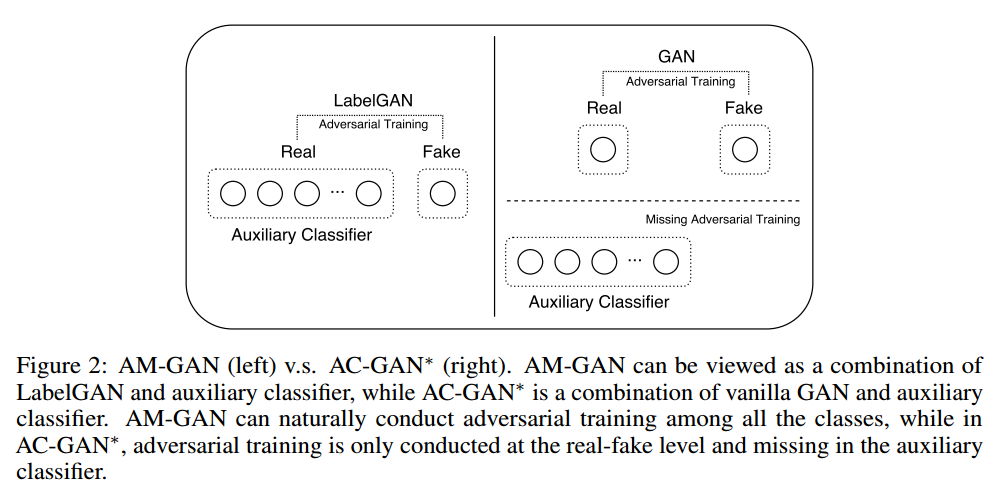
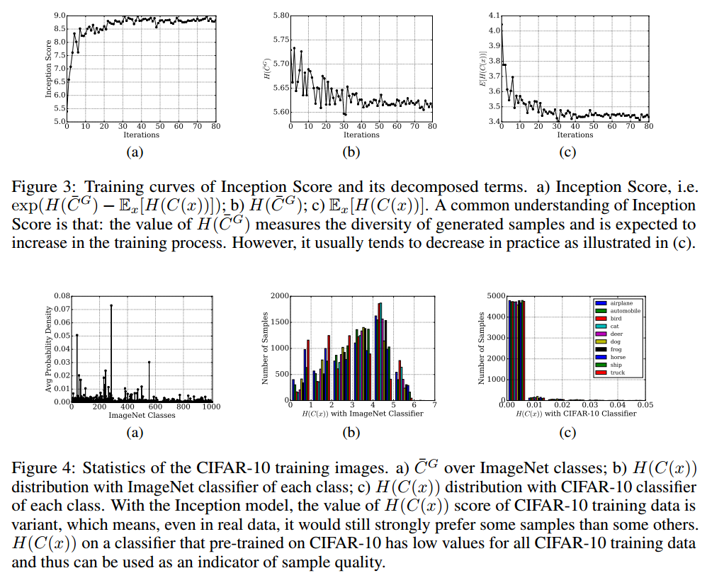
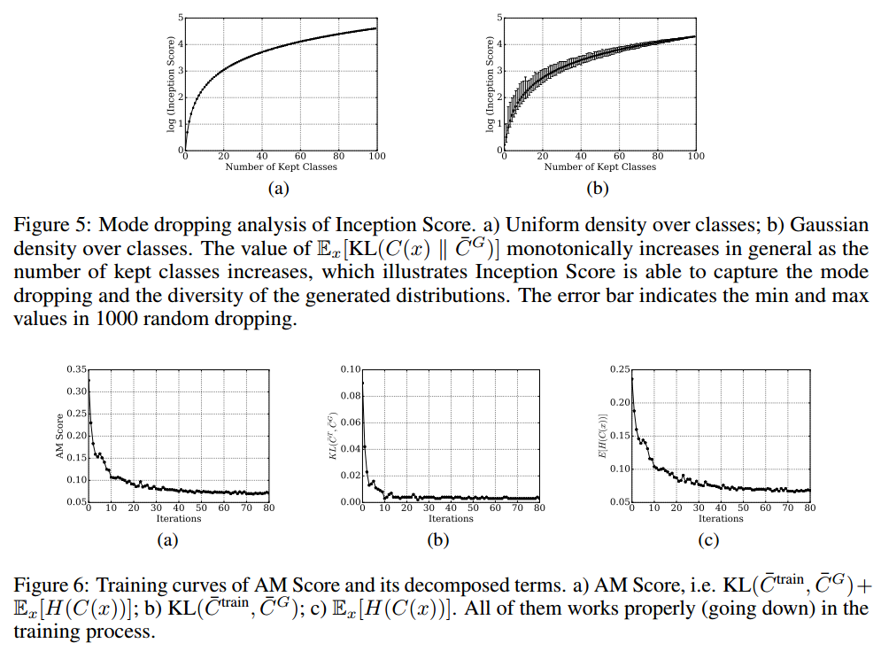
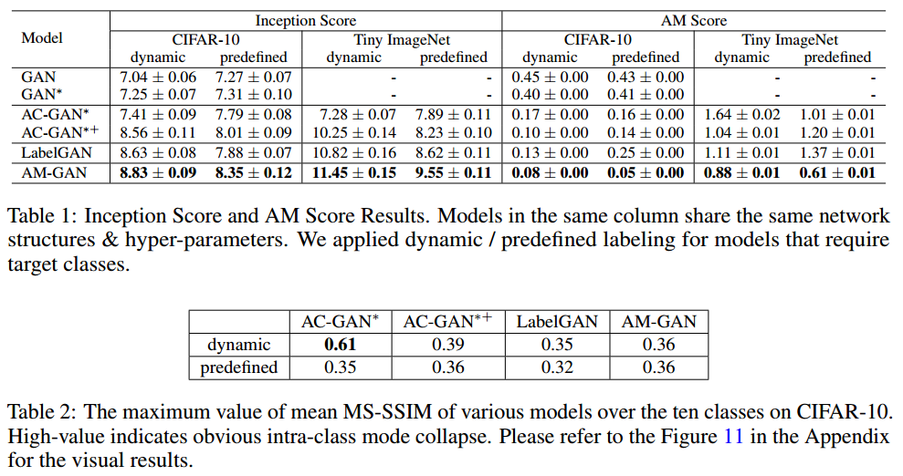
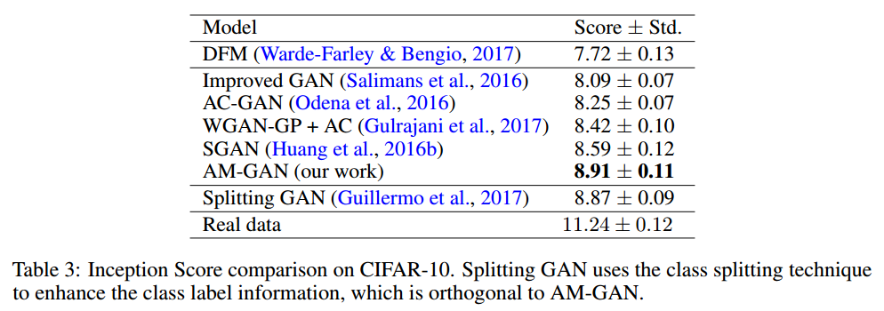
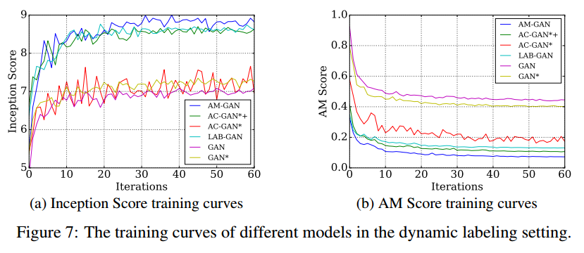

# ACTIVATION MAXIMIZATION GENERATIVE ADVERSARIAL NETS

## Contact me

* Blog -> <https://cugtyt.github.io/blog/index>
* Email -> <cugtyt@qq.com>, <cugtyt@gmail.com>
* GitHub -> [Cugtyt@GitHub](https://github.com/Cugtyt)

> **本系列博客主页及相关见**[**此处**](https://cugtyt.github.io/blog/papers/index)

---

<head>
    
    
</head>

## ABSTRACT

实验已经证明类别标签可用于改善生成对抗网络（GAN）的样本质量。在本文中，我们在数学上研究了当前使用类别标签信息的GAN变种。通过类别感知梯度和交叉熵分解，我们揭示了类别标签和相关损失如何影响GAN的训练。基于此，我们提出激活最大化生成对抗网络（AM-GAN）作为解决方案。我们已经进行了综合实验来验证我们的分析并评估我们的方案的有效性，其中AM-GAN优于其他基准，并在CIFAR-10上获得最好的IS分数（8.91）。此外，我们证明使用Inception ImageNet分类器，Inception Score主要跟踪生成器的多样性，但是没有可靠的证据表明它可以反映真实的样本质量。因此我们提出了一种称为AM Score的新指标，以提供更准确的样本质量估算，我们提出的模型也优于新指标中的基准方法。

## 1 INTRODUCTION

生成对抗网络（GAN）作为一种学习生成模型的新方法，最近在各种任务中表现出了很好的结果，例如逼真的图像生成，图像处理和文本生成。尽管取得了巨大成功，但当前GAN模型在对具有高可变性的数据集进行训练时，即使对于具有低分辨率的图像生成（例如CIFAR-10），仍然难以产生令人信服的样本。同时人们凭经验发现，利用类别标签可以显着提高样本质量。 

有三种典型使用标签信息的GAN模型：CatGAN将判别器作为多类分类器; LabelGAN将判别器扩展为生成样本的一个额外类别; AC-GAN联合训练了真假判别器和特定真实类别的辅助分类器。通过考虑类标签，这些GAN模型显示出更好的生成质量和稳定性，然而他们背后的机制尚未得到充分探索。

在本文中，我们在考虑类标签的情况下用数学方式来研究GAN模型。我们推导出LabelGAN的生成器损失对于类别logits的梯度，称为类别感知梯度，并进一步展示了该梯度引导每个生成的样本成为特定类别之一。此外我们展示了AC-GAN可以被视为具有分层类别判别器的GAN模型。基于一些分析，我们揭示了先前方法中的一些潜在问题，并提出了解决这些问题的新方法。

具体来说，我们认为显式目标类别的模型将为生成器提供比隐式目标类别模型更清晰的梯度指导。与AC-GAN相比，我们表明通过替换判别器中的真实类别logit来引入特定的类别logit比简单地训练辅助分类器更好。我们认为，在AC-GAN中的辅助分类器缺少对抗训练，这使模型更容易出现模式崩溃并产生低质量样本。我们还通过实验发现，预定义标签往往会导致类内模式崩溃，并对应地提出动态标签作为解决方案。提出的模型被称为激活最大化生成对抗网络（AM-GAN）。我们通过一系列对照实验来研究AM-GAN的有效性，结果与我们的分析一致。注意到，AM-GAN在CIFAR-10上达到了最好的IS分数（8.91）。 

此外，通过实验我们发现常用的指标需要进一步研究。在我们的论文中，我们对广泛使用的评估指标IS及其扩展指标进行了进一步研究。我们展示了，在Inception模型中，IS分数主要跟踪生成器的多样性，但没有可靠的证据表明它可以测量真实的样本质量。因此，我们提出了一个名为AM Score的新指标，以提供更准确的样本质量评估。就AM分数而言，我们提出的方法也优于其他基准方法。

## 2 PRELIMINARIES

GAN的损失函数为：

$$\begin{aligned} \tilde { L } _ { G } ^ { \mathrm { orn } } & = - \mathbb { E } _ { z \sim p _ { z } ( z ) } [ \log D _ { r } ( G ( z ) ) ] \triangleq - \mathbb { E } _ { x \sim G } [ \log D _ { r } ( x ) ] \\ L _ { D } ^ { \mathrm { ori } } & = - \mathbb { E } _ { x \sim p _ { \mathrm { data } } } t[ \log D _ { r } ( x ) ] - \mathbb { E } _ { x \sim G } [ \log ( 1 - D _ { r } ( x ) ) ] \end{aligned} \quad (1)$$

其中$D$是二元分类器，$D _ { r } ( x )$是样本来自真实数据的概率。

### 2.1 LABEL GAN

GAN已经被推广到多类别的情况，每个样本$x$对应于一个标签$y \in \{ 1 , \ldots , K , K + 1 \}$，其中$K+1$是生成样本的标签。损失函数定义为：

$$\begin{aligned} L _ { G } ^ { \mathrm { lab } } &= - \mathbb { E } _ { x \sim G } \left[ \log \sum _ { i = 1 } ^ { K } D _ { i } ( x ) \right] \triangleq - \mathbb { E } _ { x \sim G } \left[ \log D _ { r } ( x ) \right] \quad (2) \\ L _ { D } ^ { \mathrm { lab } } &= - \mathbb { E } _ { ( x , y ) \sim p _  \mathrm { data } } \left[ \log D _ { y } ( x ) \right] - \mathbb { E } _ { x \sim G } \left[ \log D _ { K + 1 } ( x ) \right] \quad (3)  \end{aligned}$$

其中$D _ { i } ( x )$是$x$属于类$i$的概率。损失可以写作交叉熵的形式，便于我们的分析：

$$\begin{aligned} L _ { G } ^ { \mathrm { lab } } &= \mathbb { E } _ { x \sim G } \left[ H \left( [ 1,0 ] , \left[ D _ { r } ( x ) , D _ { K + 1 } ( x ) \right] \right) \right]  \quad (4) \\ L _ { D } ^ { \mathrm { lab } } &= \mathbb { E } _ { ( x , y ) \sim p _ { \mathrm { data } } } [ H ( v ( y ) , D ( x ) ) ] + \mathbb { E } _ { x \sim G } [ H ( v ( K + 1 ) , D ( x ) ) ]  \quad (5) \end{aligned}$$

其中$D ( x ) = \left[ D _ { 1 } ( x ) , D _ { 2 } ( x ) , \ldots , D _ { K + 1 } ( x ) \right]$,$v ( y ) = \left[ v _ { 1 } ( y ) , \ldots , v _ { K + 1 } ( y ) \right], v _ { i } ( y ) = 0 \quad if \quad i \ne y \quad and \quad v _ { i } ( y ) = 1 \quad if \quad i = y$,$H$是交叉熵，定义为：$H ( p , q ) = - \sum _ { i } p _ { i } \log q _ { i }$，我们把上述模型记作LabelGAN。

### 2.2 AC-GAN*

AC-GAN在GAN的基础上引入了额外的分类器$C$来分类真实类别。核心思想没变，我们可以如下定义AC-GAN的变种AC-GAN*：

$$\begin{aligned} L _ { G } ^ { \mathrm { ac } } ( x , y ) = & \mathbb { E } _ { ( x , y ) \sim G } \left[ H \left( [ 1,0 ] , \left[ D _ { r } ( x ) , D _ { f } ( x ) \right] \right) \right] \\ & + \mathbb { E } _ { ( x , y ) \sim G } [ H ( u ( y ) , C ( x ) ) ] \\ L _ { D } ^ { \mathrm { ac } } ( x , y ) = & \mathbb { E } _ { ( x , y ) \sim p _ { \mathrm { data } } } \left[ H \left( [ 1,0 ] , \left[ D _ { r } ( x ) , D _ { f } ( x ) \right] \right) \right] + \mathbb { E } _ { ( x , y ) \sim G } \left[ H \left( [ 0,1 ] , \left[ D _ { r } ( x ) , D _ { f } ( x ) \right] \right) \right] \\ & + \mathbb { E } _ { ( x , y ) \sim p _ { \mathrm { data } } } [ H ( u ( y ) , C ( x ) ) ] \end{aligned}$$

其中$D _ { r } ( x )$和$D _ { f } ( x ) = 1 - D _ { r } ( x )$是二元判别器的输出，与原始GAN相同，$u ( \cdot )$是矢量化运算符，类似于$v ( \cdot )$但定义在$K$类上,$C(x)$是辅助分类器给出的K类概率分布。

在AC-GAN中，每个样本具有对应的目标类$y$，并且辅助分类器上的损失被添加到生成器中以利用类别标签信息。以上公式是原始AC-GAN的修改版本。具体地，我们省略辅助分类器损失$\mathbb { E } _ { ( x , y ) \sim G } [ H ( u ( y ) , C ( x ) ) ]$，其鼓励辅助分类器$C$将伪样本$x$分类为其目标类$y$。第5.3节提供了进一步的讨论。请注意，我们依旧采用了生成器中的$- log(D_r(x))$损失。 

## 3 CLASS-AWARE GRADIENT

在本节中，我们介绍类别感知梯度，即生成器损失关于判别器类别的梯度。通过分析LabelGAN的类别感知梯度，我们发现梯度倾向于将每个样本细化为其中一个类，这有助于阐明类别标签信息如何帮助生成器提高生成质量。在深入研究细节之前，我们首先介绍以下关于交叉熵损失的梯度特性的引理，以使我们的分析更加清晰。 

**引理1** $l$为logits向量且$\sigma$为softmax函数时，令$\sigma(l)$为当前softmax概率分布，$\hat{p}$表示目标概率分布，则

$$- \frac { \partial H ( \hat { p } , \sigma ( l ) ) } { \partial l } = \hat { p } - \sigma ( l )$$

对于一个生成的样本$x$,LabelGAN的损失是$L _ { G } ^ { \mathrm { lab } } ( x ) = H \left( [ 1,0 ] , \left[ D _ { r } ( x ) , D _ { K + 1 } ( x ) \right] \right)$。根据引理1，$对于logits向量$l(x)$L _ { G } ^ { 1 \mathrm { ab } } ( x )$对于logits向量$l(x)$为：

$$\begin{aligned} - \frac { \partial L _ { G } ^ { \mathrm { lab } } ( x ) } { \partial l _ { k } ( x ) } = & - \frac { \partial H \left( [ 1,0 ] , \left[ D _ { r } ( x ) , D _ { K + 1 } ( x ) \right] \right) } { \partial l _ { r } ( x ) } \frac { \partial l _ { r } ( x ) } { \partial l _ { k } ( x ) } = \left( 1 - D _ { r } ( x ) \right) \frac { D _ { k } ( x ) } { D _ { r } ( x ) } , \quad k \in \{ 1 , \ldots , K \} \\ - \frac { \partial L _ { G } ^ { \mathrm { lab } } ( x ) } { \partial l _ { K + 1 } ( x ) } & = - \frac { \partial H \left( [ 1,0 ] , \left[ D _ { r } ( x ) , D _ { K + 1 } ( x ) \right] \right) } { \partial l _ { K + 1 } ( x ) } = 0 - D _ { K + 1 } ( x ) = - \left( 1 - D _ { r } ( x ) \right) \end{aligned} \quad (11)$$

基于以上公式，$L _ { G } ^ { \operatorname { lab } } ( x )$关于$x$的梯度为：

$$\begin{aligned}   - \frac { \partial L _ { G } ^ { \mathrm { lab } } ( x ) } { \partial x } &= \sum _ { k = 1 } ^ { K } - \frac { \partial L _ { G } ^ { \mathrm { lab } } ( x ) } { \partial l _ { k } ( x ) } \frac { \partial l _ { k } ( x ) } { \partial x } - \frac { \partial L _ { G } ^ { \mathrm { lab } } ( x ) } { \partial l _ { K + 1 } ( x ) } \frac { \partial l _ { K + 1 } ( x ) } { \partial x } \\  &= \left( 1 - D _ { r } ( x ) \right) \left( \sum _ { k = 1 } ^ { K } \frac { D _ { k } ( x ) } { D _ { r } ( x ) } \frac { \partial l _ { k } ( x ) } { \partial x } - \frac { \partial l _ { K + 1 } ( x ) } { \partial x } \right) \\ &= \left( 1 - D _ { r } ( x ) \right) \sum _ { k = 1 } ^ { K + 1 } \alpha _ { k } ^ { \mathrm { lab } } ( x ) \frac { \partial l _ { k } ( x ) } { \partial x }  \end{aligned} \quad (12)$$

其中

$$\alpha _ { k } ^ { \mathrm { lab } } ( x ) = \left\{ \begin{array} { l l } { \frac { D _ { k } ( x ) } { D _ { r } ( x ) } } & { k \in \{ 1 , \ldots , K \} } \\ { - 1 } & { k = K + 1 } \end{array} \right. \quad (13)$$

从公式中，我们发现整体对于生成样本$x$的梯度是$1 - D _ { r } ( x )$，其与原始GAN中的相同。并且根据其当前概率比$\frac { D _ { k } ( x ) } { D _ { r } ( x ) }$将真实类别上的梯度进一步分配给每个特定类别logit$l _ { k } ( x )$。

因此，梯度自然地考虑到了标签信息：对于生成的样本，某个较高类的概率将导致向增加相应类置信度的方向走更大步骤。因此判别器对于每个样本的梯度倾向于将其细化为概率意义上的某一类。 

也就是说，LabelGAN中的每个样本都被优化为真正的类别之一，而不是简单地像普通GAN那样只求真实。因此，我们将LabelGAN视为隐式目标类别模型。将每个生成的样本优化到特定类别之一将有助于提高样本质量。有研究表明，GAN用独立的类别训练会有更好的结果。而AC-GAN引入了额外的损失，迫使每个样本属于某一个类别并得到了更好的结果。

## 4 THE PROPOSED METHOD

在LabelGAN中，生成器从判别器中的K个特定类别logit获得其梯度，并倾向于将每个样本细化为其中一个类。但是，LabelGAN实际上遇到了重叠梯度问题：同时激励了所有实际类别的logits。虽然在训练期间驱使每个样本成为类别中的一个，但是每个样本的梯度是对多个标签预测器的加权平均。如图1所示，这个平均梯度的结果导致根本不是所需要的类别。

在多类别设置中，每个有效样本应仅由判别器以最高置信度分类为一个类。解决上述问题的一种方法是明确地为每个生成的样本分配一个特定的类作为其目标。 

### 4.1 AM-GAN

把每个样本赋予特定的目标类$y$，改进版LabelGAN的损失函数为：

$$\begin{array} { l } { L _ { G } ^ { \mathrm { am } } = \mathbb { E } _ { ( x , y ) \sim G } [ H ( v ( y ) , D ( x ) ) ] } \quad (14) \\ { L _ { D } ^ { \mathrm { am } } = \mathbb { E } _ { ( x , y ) \sim p _ { \mathrm { data } } } [ H ( v ( y ) , D ( x ) ) ] + \mathbb { E } _ { x \sim G } [ H ( v ( K + 1 ) , D ( x ) ) ] } \quad (15) \end{array} $$

其中$v(y)$和前面的定义一样，具有上述公式的模型在文中被称为激活最大化生成对抗网络（AM-GAN）。AM-GAN和LabelGAN之间的唯一区别在于生成器的损失函数。AM-GAN中的每个样本都有一个特定的目标类，它解决了重叠梯度问题。AC-GAN也为每个样本分配了一个特定的目标类别，但我们将展示AM-GAN和AC-GAN有很大不同。

### 4.2 LABELGAN + AUXILIARY CLASSIFIER

LabelGAN和AM-GAN都是有$K+1$类的GAN模型。我们引入了交叉熵分解引理来描述两类和$K$类模型的联系。

**引理2** 给定$v = \left[ v _ { 1 } , \dots , v _ { K + 1 } \right] , v _ { 1 : K } \triangleq \left[ v _ { 1 } , \ldots , v _ { K } \right] , v _ { r } \triangleq \sum _ { k = 1 } ^ { K } v _ { k } , R ( v ) \triangleq v _ { 1 : K } / v _ { r }, F ( v ) \triangleq \left[ v _ { r } , v _ { K + 1 } \right] , \text { let } \hat { p } = \left[ \hat { p } _ { 1 } , \ldots , \hat { p } _ { K + 1 } \right] , p = \left[ p _ { 1 } , \ldots , p _ { K + 1 } \right]$，我们有：

$$H ( \hat { p } , p ) = \hat { p } _ { r } H ( R ( \hat { p } ) , R ( p ) ) + H ( F ( \hat { p } ) , F ( p ) ) \quad (16)$$

根据引理2，AM-GAN的生成器损失函数可以如下分解：

$$\begin{aligned} L _ { G } ^ { \mathrm { am } } ( x ) &= H ( v ( x ) , D ( x ) ) \\ &= v _ { r } ( x ) \cdot \underbrace { H ( R ( v ( x ) ) , R ( D ( x ) ) ) } _ { \text { Auxiliary Classifier G Loss } } + \underbrace { H ( F ( v ( x ) ) , F ( D ( x ) ) ) } _ { \text { LabelGAN GLoss } } \end{aligned} \quad (17)$$

式(17)第二项等价于LabelGAN的生成器损失函数：

$$H ( F ( v ( x ) ) , F ( D ( x ) ) ) = H \left( [ 1,0 ] , \left[ D _ { r } ( x ) , D _ { K + 1 } ( x ) \right] \right) = L _ { G } ^ { \mathrm { lab } } ( x )$$

类似的分析可以用于第一项和判别器。注意$v _ { r } ( x )$等于1。有趣的是，我们发现通过分解AM-GAN损失函数，AM-GAN可以看作是LabelGAN和辅助分类器的组合。从分解的角度来看不同于AM-GAN的是，AC-GAN是原始GAN和辅助分类器的组合。

公式中的辅助分类器损失（17）也可以看作是CatGAN中生成器损失的交叉熵版本：CatGAN的生成器直接优化熵$H ( R ( D ( x ) ) )$，使每个样本具有较高置信度为某一类，但是AM-GAN通过分解损失$H ( R ( v ( x ) ) , R ( D ( x ) ) )$的第一项以交叉熵与给定目标分布实现了这一点。也就是说，AM-GAN是CatGAN和LabelGAN的交叉熵版本的组合。

### 4.3 NON-HIERARCHICAL MODEL

由引理2，我们也可以把AC-GAN*改写为$K+1$类的模型。把生成器损失作为例子：

$$\begin{aligned} L _ { G } ^ { \mathrm { ac } } ( x , y ) & = \mathbb { E } _ { ( x , y ) \sim G } \left[ H \left( [ 1,0 ] , \left[ D _ { r } ( x ) , D _ { f } ( x ) \right] \right) + H ( u ( y ) , C ( x ) ) \right] \\ & = \mathbb { E } _ { ( x , y ) \sim G } \left[ H \left( v ( y ) , \left[ D _ { r } ( x ) \cdot C ( x ) , D _ { f } ( x ) \right] \right) \right] \end{aligned}$$

在$K + 1$模型中，$K + 1$类分布表示为$\left[ D _ { r } ( x ) \cdot C ( x ) , D _ { f } ( x ) \right]$。
考虑到利用类别标签的辅助信息，AC-GAN引入了辅助分类器，结果表明AC-GAN*的表达可以看作是一个分层的K + 1类模型，由一个两类判别器和一个K类辅助分类器，如图2所示。相反的是，AM-GAN是一种非分层模型。所有$K + 1$类都与AM-GAN中的判别器保持同一级别。

在分层模型AC-GAN*中，对抗训练仅在真假二分类下进行，而在辅助分类器中并没有。对抗性训练是全局收敛理论$p _ { \mathrm { G } } = p _ { \mathrm { data } }$保证的关键。以原始GAN公式为例，如果生成的样本坍塌到某一点$x$，即$p _ { \mathrm { G } } ( x ) > p _ { \mathrm { data } } ( x )$，那么必须存在另一个点$x'$使得$p _ { \mathrm { G } } \left( x ^ { \prime } \right) < p _ { \mathrm { data } } \left( x ^ { \prime } \right)$。给定最优$D ( x ) = \frac { p _ { \mathrm { data } } ( x ) } { p _ { \mathrm { G } } ( x ) + p _ { \mathrm { data } } ( x ) }$，坍塌点$x$将得到相对较低的分数。并且由于存在更高的得分点（例如$x'$），理论上最大化生成器的期望得分具有从模式崩溃状态恢复的能力。在实践中，$p _ { \mathrm { G } }$和$p _ { \mathrm { data } }$通常是不相交的，然而行为却保持一直：当样本崩溃到某一点时，他们更有可能从对抗性网络获得相对较低的分数。

如果没有辅助分类器中的对抗训练，模式崩溃的生成器将不会从辅助分类器损失中获得任何惩罚。在我们的实验中，我们发现AC-GAN更容易出现模式崩溃，并且根据经验发现，减少辅助分类器损失的重量（例如Gulrajani等人使用的0.1）将有所帮助。

## 5 EXTENSIONS

### 5.1 DYNAMIC LABELING

在上一节中，我们简单地假设每个生成的样本都有一个目标类。一种可能的解决方案是像AC-GAN那样，为每个样本预定义一个类标签，这实质上导致了条件GAN。实际上，我们可以根据判别器估计的当前概率为每个样本分配一个目标类。自然的选择是当前具有最大概率的类别：$y ( x ) \triangleq \operatorname { argmax } _ { i \in \{ 1 , \ldots , K \} } D _ { i } ( x )$。我们将此命名为动态标签。

根据我们的实验，动态标记为AM-GAN带来了重要的提升，并且适用于需要对每个生成样本设定目标类别的其他模型，例如AC-GAN，这可以作为预定义标签的替代品。

我们通过实验发现，具有预定义标签的GAN模型往往会遇到类内模式崩溃。此外，通过动态标记，GAN模型仍然从纯随机噪声产生，这具有潜在的益处，例如在潜在空间的类中进行平滑插值是可行的。

### 5.2 THE ACTIVATION MAXIMIZATION VIEW

激活最大化通常应用于对预训练神经网络的神经元可视化。GAN训练可视为对抗激活最大化过程。具体而言，训练生成器在表示目标类对数概率的神经元对每个生成的样本执行激活最大化，同时训练判别器以区分生成的样本并防止它们得到更高的激活。

值得一提的是，最大化一个神经元激活的样本不一定具有高质量，人们也引入各种先验来对抗这种现象。在GAN中，GAN训练的对抗过程可以检测到不切实际的样本，从而确保来自于高质量样本，这也会强烈的迷惑判别器。因此我们将模型命名为激活最大化生成对抗网络（AM-GAN） 

### 5.3 AC-GAN∗+

在实验上我们发现AC-GAN容易出现模式崩溃，降低生成器损失函数中辅助分类器项的权重将有所帮助。在4.3节中，我们将模式崩溃归因于辅助分类器中对抗训练的缺失。从对抗激活最大化的观点来看：如果没有对抗性训练，辅助分类器损失在某一类上进行高度激活并不能保证样本质量。

也就是说，在AC-GAN中，原始GAN损失起到确保样本质量和避免模式崩溃的作用。在这里，我们为AC-GAN*中的辅助分类器引入额外的损失，以强制进行对抗训练，并通过实验发现它能改善性能

$$L _ { D } ^ { \mathrm { act } } ( x , y ) = \mathbb { E } _ { ( x , y ) \sim G } [ H ( u ( \cdot ) , C ( x ) ) ]$$

其中$u ( \cdot )$代表均匀分布，其思想与CatGAN相同。

回想一下，我们在AC-GAN*中省略了辅助分类器损失$\mathbb { E } _ { ( x , y ) \sim G } [ H ( u ( y ) ]$。根据我们的实验，$\mathbb { E } _ { ( x , y ) \sim G } [ H ( u ( y ) ]$确实提高了AC-GAN *的稳定性并使其不太容易模式崩溃，但它也导致更差的IS分数。我们对这种现象的理解是：通过鼓励辅助分类器将假样本分类到目标类，它实际上降低了辅助分类器向实际类别提供梯度指导的能力，以及因此也减轻了GAN损失和辅助分类器损失之间的冲突。 

## 6 EVALUATION METRICS

生成模型的一个难点是评估方法。在本节中，我们对广泛使用的评估指标IS分数和其他相关指标进行了数学和实证分析。我们将证明IS分数主要用作多样性度量，我们提出AM分数作为IS分数的补充来估算生成的样本质量。

### 6.1 INCEPTION SCORE

作为最近提出的评估生成模型性能的度量标准，已发现IS分数与人类评估密切相关，其引入了在ImageNet上预先训练的公开可用的Inception模型$C$。通过将Inception模型应用于每个生成的样本$x$并获得相应的类概率分布$C(x)$，得到IS分数：

$$\text{Inception Score} = \exp \left( \mathbb { E } _ { x } [ \mathrm { KL } ( C ( x ) \Vert \overline { C } ^ { G } ) ] \right)$$

通过其中$\mathbb { E } _ { x }$是$\mathbb { E } _ { x \sim G }$的缩写，$\overline { C } ^ { G } = \mathbb { E } _ { x } [ C ( x ) ]$是生成的样本在各类上的总体概率分布，这由$C$判断得出，KL表示Kullback-Leibler散度。$\mathbb { E } _ { x } [ \mathrm { KL } ( C ( x ) \Vert \overline { C } ^ { G } ) ]$可以分为两个熵：

$$\mathbb { E } _ { x } [ \mathrm { KL } ( C ( x ) \Vert \overline { C } ^ { G } ) ] = H \left( \overline { C } ^ { G } \right) + \left( - \mathbb { E } _ { x } [ H ( C ( x ) ) ] \right)$$

### 6.2 THE PROPERTIES OF INCEPTION MODEL

对初始分数如何工作的共识在于,第一项$H \left( \overline { C } ^ { G } \right)$的高分表明生成的样本具有高度多样性（整体类概率分布均匀分布），第二项$- \mathbb { E } _ { x } [ H ( C ( x ) ) ]$的高分表示每个单独的样本具有高质量（每个生成样本的类别概率分布是尖锐的，即它可以被分类为具有一个高置信度的类别）。

但是以CIFAR-10为例，数据并非均匀分布在ImageNet上训练的Inception模型的类中，如图4a所示。从分解得分的角度来看，这使得IS分数有一定的问题。例如，人们会问更高$H \left( \overline { C } ^ { G } \right)$是否表示更好的模式覆盖以及更小的$H ( C ( x ) )$是否表示更好的样本质量。

我们通过实验发现，如图3b所示，$H \left( \overline { C } ^ { G } \right)$的值通常在训练过程中下降，但我们期望它会增加。当我们深入研究训练数据中每个特定样本的$H ( C ( x ) )$的细节时，我们发现$H ( C ( x ) )$得分的值也是变量，如图4b所示，这意味着即使在实际数据中，它仍然强烈偏好某些部分样本。IS分数中的exp算子和$H ( C ( x ) )$值的大方差加剧了这种现象。我们还观察到图4b中类级别的偏好，例如卡车的$\mathbb { E } _ { x } [ H ( C ( x ) ) ] = 2.14$，而鸟类的$\mathbb { E } _ { x } [ H ( C ( x ) ) ] = 3.80$。 

看来，对于ImageNet分类器，IS分数的两个指标都无法正确工作。接下来我们将展示Inception Score实际上是一种多样性测量。

### 6.3 INCEPTION SCORE AS A DIVERSITY MEASUREMENT

由于两个单独的指标是强相关的，这里我们回到初始得分的原始公式$\mathbb { E } _ { x } [ \mathrm { KL } ( C ( x ) \Vert \overline { C } ^ { G } ) ]$。在这种形式中，我们可以将IS分数解释为它要求每个样本的分布$C ( x )$与生成器的整体分布$\overline { C } ^ { G }$高度不同，这表明生成的样本具有良好的多样性。

根据实验观察，模式崩溃的生成器通常获得较低的IS分数。在极端的情况下，假设所有生成的样本都崩溃到一个点，$C ( x ) = C ^ { G }$，我们将获得最小的IS分数1.0，这是exp0结果。为了在更复杂的情况下模拟模式崩溃，我们设计实验如下：给出N点集合$\{ x _ { 0 } , x _ { 1 } , x _ { 2 } , \dots , x _ { N - 1 } \}$，每个点$x_i$采用分布$C \left( x _ { i } \right) = v ( i )$并表示类i，其中$v ( i )$是长度为N的向量化算子，如2.1节的定义，我们随机地删除$m$个点，评估$\mathbb { E } _ { x } [ \mathrm { KL } ( C ( x ) \Vert \overline { C } ^ { G } ) ]$并绘制曲线。如图5所示，当$N-m$增加时，$\mathbb { E } _ { x } [ \mathrm { KL } ( C ( x ) \Vert \overline { C } ^ { G } ) ]$的值一般单调增加，这意味着它可以很好地捕获模式丢失和生成分布的多样性。

剩下的一个问题是良好的模式覆盖和样本多样性是否意味着高质量的生成样本。从以上分析，我们没有找到任何证据。一个可能的解释是在实践中样本多样性通常与样本质量密切相关。 

### 6.4 AM SCORE WITH ACCORDINGLY PRETRAINED CLASSIFIER

注意到如果每个点$x_i$具有多个变体，例如$x _ { i } ^ { 1 } , x _ { i } ^ { 2 } , x _ { i } ^ { 3 }$，其中存在一种情况，$x _ { i } ^ { 2 }$和$x _ { i } ^ { 3 }$缺失且仅生成$x _ { i } ^ { 1 }$，$\mathbb { E } _ { x } [ \mathrm { KL } ( C ( x ) \Vert \overline { C } ^ { G } ) ]$得分并不能检测到。这意味着使用相应预训练的分类器，$\mathbb { E } _ { x } [ \mathrm { KL } ( C ( x ) \Vert \overline { C } ^ { G } ) ]$得分无法检测到类内级别模式崩溃。这也解释了为什么ImageNet上的Inception Network可能是CIFAR-10的一个很好的候选者$C$。探索最优$C$是一个挑战问题，我们将把它留作未来的工作。 

但是，没有证据表明使用ImageNet训练的Inception网络可以准确测量样本质量，如第6.2节所示。为了补充Inception分数，我们提出使用对应的预训练分类器引入额外的评估。在这个对应的预训练分类器中，大多数真实样本有相似的$H ( C ( x ) )$，99.6％的样本有小于0.05的分数，如图4c所示，这表明分类器的$H ( C ( x ) )$可以用作样本质量指标。

当训练数据在类别上分布不均匀时，$\overline { C } ^ { G }$上的熵项实际上是有问题的，因为argmin $H \left( \overline { C } ^ { G } \right)$是均匀分布。考虑到$\overline { C } ^ { train }$，我们用$\overline { C } ^ { train }$和$\overline { C } ^ { G }$之间的KL散度代替$H \left( \overline { C } ^ { G } \right)$。因此

$$\text{AM Score} \triangleq \mathrm { KL } \left( \overline { C } ^ { \mathrm { train } } , \overline { C } ^ { G } \right) + \mathbb { E } _ { x } [ H ( C ( x ) ) ]$$

这要求$\overline { C } ^ { G }$接近$\overline { C } ^ { train }$并且每个样本$x$具有低熵$C ( x )$。 AM Score的最小值为零，值越小越好。 AM Score的样本训练曲线如图6所示，其中AM Score中的所有指标均按预期工作。

## 7 EXPERIMENTS

为了实验验证我们的分析和方法的有效性，我们对图像基准数据集进行了实验，包括CIFAR-10和Tiny-ImageNet，它包括200个类，每个类有500个训练图像。为了评估，在我们的整个实验中使用的度量包括ImageNet分类器的IS分数，AM分数。以下实验结果略。 

### 7.1 EXPERIMENTS ON CIFAR-10

#### 7.1.1 GAN WITH AUXILIARY CLASSIFIER

#### 7.1.2 COMPARISON AMONG DIFFERENT MODELS

#### 7.1.3 INCEPTION SCORE COMPARING WITH RELATED WORK

#### 7.1.4 DYNAMIC LABELING AND CLASS CONDITION

#### 7.1.5 THE E(x;y)∼G[H(u(y); C(x))] LOSS

#### 7.1.6 THE LEARNING PROPERTY

### 7.2 EXPERIMENTS ON TINY-IMAGENET

## 8 CONCLUSION

在本文中，我们分析了当前包含类别标签信息的GAN模型。我们的分析表明：LabelGAN作为一个隐式目标类别模型工作，但其存在重叠的梯度问题，而显式目标类别将解决这个问题。我们展示了以非分层方式引入类别logit，通常比简单地补充辅助分类器更好，我们为其提供激活最大化视角，并强调对抗性训练的重要性。此外，根据我们的实验，预定义标签往往会导致类内模式崩溃，我们建议将动态标签作为替代方案。我们对基准测试数据集的实验验证了我们的分析，并证明了我们提出的AM-GAN的卓越性能。此外，我们深入研究评估指标IS分数，揭示了它主要作为多样性度量，我们提出将AM分数作为补充，以更准确地估计样本质量。

在本文中，我们关注生成器及其样本质量，而一些相关的工作侧重于判别器和半监督学习。对于未来的工作，我们希望对判别学习和半监督学习进行实证研究。【略】