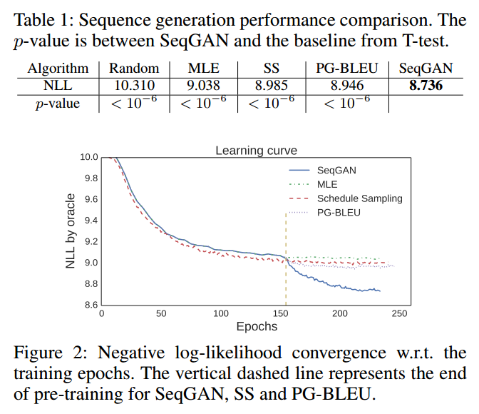

# SeqGAN: Sequence Generative Adversarial Nets with Policy Gradient

## Contact me

* Blog -> <https://cugtyt.github.io/blog/index>
* Email -> <cugtyt@qq.com>, <cugtyt@gmail.com>
* GitHub -> [Cugtyt@GitHub](https://github.com/Cugtyt)

> **本系列博客主页及相关见**[**此处**](https://cugtyt.github.io/blog/papers/index)

---

<head>
    
    
</head>

## Abstract

GAN在生成离散序列token数据时有它本身的局限性。一个主要的原因是离散的输出导致判别模型很难向生成模型提供梯度信息。另外判别模型只能对完整的序列做判断，而对于部分的生成序列，平衡当前分数与生成完整序列后的分数就不太容易了。文章提出了SeqGAN，把生成器建模成强化学习中的随机策略，SeqGAN通过直接做梯度策略更新越过了生成器的微分问题。强化学习的奖励信号来自于GAN判别器对完整序列评判，并且通过Monte Carlo搜索传回到中间的state-action步骤。

## Introduction

最为常用的训练RNN的方法是对于每个真实的token最大化对数似然。但是Bengio提到，最大化似然的方法在推理阶段存在称为exposure bias（偏见暴露）的问题：模型迭代生成一个序列，基于先前预测的结果预测下一个token，但是先前预测的结果可能从未在训练数据中出现过。这个训练和推断的差异可能不断累积成为很严重的问题。为了解决这个问题，Bengio提出了一个训练策略，称为scheduled sampling (SS)，这个方法会把自己的合成数据作为词头（观察过的token）喂给生成模型，而不是用真实的数据。但是有人展示出这个方法不能稳定的解决这个问题。BALABALA

## Sequence Generative Adversarial Nets

序列生成问题标记如下。给定一个真实的结构化序列数据集，训练一个参数为$\theta$的生成模型$G_\theta$，使其生成一个序列$Y_{1 : T}=\left(y_{1}, \dots, y_{t}, \ldots, y_{T}\right), y_{t} \in \mathcal{Y}$，其中$\mathcal{Y}$是候选token。我们基于强化学习来解释这个问题。在时间$t$，状态s是当前产生的token:$\left(y_{1}, \dots, y_{t-1}\right)$，a是下一个token$y_t$选择的行为。因此策略模型$G_{\theta}\left(y_{t} \vert Y_{1 : t-1}\right)$是随机的，其中状态转换在下一个行为选择后是确定的，即如果当前状态$s=Y_{1 : t-1}$，行为是$a=y_{t}$，下一个状态为$s^{\prime}=Y_{1 : t}$，那么$\delta_{s, s^{\prime}}^{a}=1$。对于下面的状态$\mathcal{S}^{\prime \prime}$为：$\delta_{s, s^{\prime \prime}}^{a}=0$。

另外，我们同样训练一个参数为$\phi$的判别模型$D_{\phi}$为生成模型$G_\theta$提供指导。$D_{\phi}\left(Y_{1 : T}\right)$表示$Y_{1 : T}$来自真实数据与否的概率。如图1所示，判别器模型$D_{\phi}$由来自真实序列数据的正样本和生成模型$G_\theta$生成合成数据的负样本训练。同时，生成模型$G_\theta$通过采用策略梯度和基于判别模型$D_{\phi}$期望奖励的MC搜索来更新。奖励是通过骗过判别模型$D_{\phi}$的似然来预测的。

### SeqGAN via Policy Gradient

由Sutton可知，当没有中间奖励的时候，生成模型（策略）$G_{\theta}\left(y_{t} \vert Y_{1 : t-1}\right)$的目标是从一个起始状态$s_0$生成最大化期望奖励的序列：

$$J(\theta)=\mathbb{E}\left[R_{T} \vert s_{0}, \theta\right]=\sum_{y_{1} \in \mathcal{Y}} G_{\theta}\left(y_{1} \vert s_{0}\right) \cdot Q_{D_{\phi}}^{G_{\theta}}\left(s_{0}, y_{1}\right), \qquad (1)$$

其中$R_{T}$是完整序列的奖励。注意到奖励是来自于判别器$D_{\phi}$的。$Q_{D_{\phi}}^{G_{\theta}}(s, a)$是序列的action-value函数，即从状态$s$开始，采取行为$a$,遵循策略$G_\theta$的期望累积奖励。序列目标函数的原理是给定一个初始状态，生成器的目标是生成可以让判别器认为真实的序列。

接下来的问题是如何估计action-value函数，本文中我们使用了强化算法，考虑判别器预测为真的概率$D_{\phi}\left(Y_{1 : T}^{n}\right)$作为奖励：

$$Q_{D_{\phi}}^{G_{\theta}}\left(a=y_{T}, s=Y_{1 : T-1}\right)=D_{\phi}\left(Y_{1 : T}\right) \qquad (2)$$

但是，判别器只在序列结束后提供一个奖励值。由于我们比较关心长期的奖励，因此在每个时间段，我们不仅考虑先前token（词头）的拟合度，同时也要考虑未来的输出结果。这和打游戏是类似的。因此，为了衡量中间状态的action-value，我们使用了带roll-out策略$G_{\beta}$的Monte Carlo搜索来采样剩下未知的$T-t$的token。我们把一个N时长的Monte Carlo搜索表示为：

$$\left\{Y_{1 : T}^{1}, \ldots, Y_{1 : T}^{N}\right\}=\mathrm{MC}^{G_{\beta}}\left(Y_{1 : t} ; N\right) \qquad (3)$$

其中$Y_{1 : t}^{n}=\left(y_{1}, \dots, y_{t}\right)$，$Y_{t+1 : T}^{n}$是基于roll-out策略$G_{\beta}$和当前状态的采样。在我们的实验中，$G_{\beta}$和生成器设置的一样，如果要求速度的话可以使用简单的版本。为了减少方差，得到更准确的action值，我们从当前状态开始到序列结束运行roll-out策略N次，来得到一个batch的输出样本。这样，我们有：

$$Q_{D_{\phi}}^{G_{\theta}}\left(s=Y_{1 : t-1}, a=y_{t}\right)=\left\{\begin{array}{ll}{\frac{1}{N} \sum_{n=1}^{N} D_{\phi}\left(Y_{1 : T}^{n}\right), Y_{1 : T}^{n} \in \mathrm{MC}^{G_{\beta}}\left(Y_{1 : t} ; N\right)} & {\text { for } t<T} \\ {D_{\phi}\left(Y_{1 : t}\right)} & {\text { for } t=T}\end{array}\right. \qquad (4)$$

可以看到，当没有中间的奖励时，函数由从状态$s^{\prime}=Y_{1 : t}$开始，到rolling out结束的过程中迭代定义。

使用判别器$D_{\phi}$作为奖励函数的好处是它可以动态的迭代更新来进一步提高生成模型。一旦我们有一些更真实的生成序列，我们可以重新训练判别器模型：

$$\min _{\phi}-\mathbb{E}_{Y \sim p_{\text { data }}}\left[\log D_{\phi}(Y)\right]-\mathbb{E}_{Y \sim G_{\theta}}\left[\log \left(1-D_{\phi}(Y)\right)\right]  \qquad (5)$$

每得到一个新的判别模型，我们就准备更新生成器。我们提出的基于策略的方法是优化参数化的策略来直接最大化长期奖励。目标函数$J(\theta)$对于生成器参数$\theta$的梯度为：

$$\nabla_{\theta} J(\theta)=\sum_{t=1}^{T} \mathbb{E}_{Y_{1 : t-1} \sim G_{\theta}}\left[\sum_{y_{t} \in \mathcal{Y}} \nabla_{\theta} G_{\theta}\left(y_{t} | Y_{1 : t-1}\right) \cdot Q_{D_{\phi}}^{G_{\theta}}\left(Y_{1 : t-1}, y_{t}\right)\right]  \qquad (6)$$

上述形式归因于确定性状态转移和零中间奖励。使用似然率，我们对式6建立了一个无偏的预测：

$$ \nabla_{\theta} J(\theta) \simeq \sum_{t=1}^{T} \sum_{y_{t} \in \mathcal{Y}} \nabla_{\theta} G_{\theta}\left(y_{t} | Y_{1 : t-1}\right) \cdot Q_{D_{\phi}}^{G_{\theta}}\left(Y_{1 : t-1}, y_{t}\right) 
\\ =\sum_{t=1}^{T} \sum_{y_{t} \in \mathcal{Y}} G_{\theta}\left(y_{t} | Y_{1 : t-1}\right) \nabla_{\theta} \log G_{\theta}\left(y_{t} | Y_{1 : t-1}\right) \cdot Q_{D_{\phi}}^{G_{\theta}}\left(Y_{1 : t-1}, y_{t}\right) 
\\ =\sum_{t=1}^{T} \mathbb{E}_{y_{t} \sim G_{\theta}\left(y_{t} | Y_{1 : t-1}\right)}\left[\nabla_{\theta} \log G_{\theta}\left(y_{t} | Y_{1 : t-1}\right) \cdot Q_{D_{\phi}}^{G_{\theta}}\left(Y_{1 : t-1}, y_{t}\right)\right] \qquad (7)$$

其中$Y_{1 : t-1}$是从$G_{\beta}$采样得到的中间状态。由于期望$\mathbb{E}[\cdot]$可以用采样方法近似，我们就可以如下更新生成器的参数：

$$\theta \leftarrow \theta+\alpha_{h} \nabla_{\theta} J(\theta) \qquad (8)$$

其中$\alpha_{h} \in \mathbb{R}^{+}$表示在第h步的学习率。

算法1展示了SeqGAN的完整细节。在训练开始时，我们使用最大似然估计在训练集$\mathcal{S}$上预训练$G_{\beta}$。我们发现预训练判别器的监督信号有助于有效的调整生成器。

在预训练后，生成器和判别器交替训练。当生成器通过训练g步更新获得进步后，判别器也需要周期性的重新训练来赶上生成器。当训练判别器时，正样本来自于给定数据集$\mathcal{S}$，负样本来自于生成器。为了保持平衡。我们每d步生成的负样本与正样本数量一致。为了减少估计的方差，我们使用了不同的负样本来与正样本结合，类似于bootstrapping。

### The Generative Model for Sequences

我们使用RNN作为生成模型。一个RNN使用更新函数g递归的把序列$x_{1}, \dots, x_{T}$输入嵌入表示`$\boldsymbol{x}_{1}, \dots, \boldsymbol{x}_{T}$`映射到隐藏状态`$\boldsymbol{h}_{1}, \dots, \boldsymbol{h}_{T}$`：

$$\boldsymbol{h}_{t}=g\left(\boldsymbol{h}_{t-1}, \boldsymbol{x}_{t}\right) \qquad (9)$$

另外，softmax输出层z把隐藏状态映射到输出token的分布：

$$p\left(y_{t} | x_{1}, \ldots, x_{t}\right)=z\left(\boldsymbol{h}_{t}\right)=\operatorname{softmax}\left(\boldsymbol{c}+\boldsymbol{V} \boldsymbol{h}_{t}\right) \qquad (10)$$

其中的参数是偏置向量$\boldsymbol{c}$和权重矩阵$\boldsymbol{V}$。为了解决随时间反向传播梯度消失和爆炸问题，我们借用了LSTM来实现式9的更新函数。值得注意的是，大部分RNN的变种，例如GRU，soft attention机制都可以用于SeqGAN的生成器。

### The Discriminative Model for Sequences

深度判别模型如DNN，CNN和RCNN在复杂的分类任务中都有很好的表现。本文中，我们使用CNN作为判别器，因为它最近在文本分类中有很好的表现。大部分判别模型只可以在完整的序列上做分类，在未完成的序列上不行。本文我们主要关注于判别器预测完整序列为真的情况。

我们把输入序列表示为：

$$\mathcal{E}_{1 : T}=\boldsymbol{x}_{1} \oplus \boldsymbol{x}_{2} \oplus \ldots \oplus \boldsymbol{x}_{T} \qquad (11)$$

其中`$\boldsymbol{x}_{t} \in \mathbb{R}^{k}$`是k维token嵌入，$\oplus$是拼接运算来构建矩阵`$\mathcal{E}_{1 : T} \in \mathbb{R}^{T \times k}$`。然后$\boldsymbol{w} \in \mathbb{R}^{l \times k}$核在l词大小的窗口上来做卷积运算来产生新的特征图：

$$c_{i}=\rho\left(\boldsymbol{w} \otimes \mathcal{E}_{i : i+l-1}+b\right) \qquad (12)$$

其中$\otimes$是元素间运算的和，b是偏置项，$\rho$是非线性函数。我们可以使用不同数量的核搭配不同大小的窗口来提取不同的特征。最后在特征图上执行一个max-over-time的池化操作：`$\tilde{c}=\max \left\{c_{1}, \ldots, c_{T-l+1}\right\}$`。

为了提高性能，我们加入了基于池化特征图的高速网络。最后，使用一个全连接层和sigmoid激活输出序列为真的概率。优化目标是最小化真实标签和预测概率的交叉熵。

## Synthetic Data Experiments

为了测试效率和增加对SeqGAN的理解，我们使用合成数据做了仿真测试。为了模拟真实的结构化序列，我们考虑一个语言模型来捕捉token的依赖。我们使用一个随机初始化的LSTM作为真实模型，也称作先知，为下面的实验生成真实数据分布`$p\left(x_{t} | x_{1}, \ldots, x_{t-1}\right)$`。

### Evaluation Metric

有这样一个先知的好处是，首先它提供了训练数据集，其次可以衡量真实的生成模型性能，对于真实数据是不可行的。我们指导最大似然估计会最小化真实数据分布p和我们的近似分布q的交叉熵，例如`$-\mathbb{E}_{x \sim p} \log q(x)$`。但是最准确的衡量生成模型的方法是从中采样一些样本来人工观察。我们假设观察者已经学到了自然分布`$p_{\text { human }}(x)$`的准确模型。为了提高通过图灵测试的几率，我们需要最小化完全相反的平均负对数似然`$-\mathbb{E}_{x \sim q} \log p_{\text { human }}(x)$`。在我们的合成数据实验中，我们可以把先知看做是人工观察者，因此一个完美的衡量标准是：

$$\mathrm{NLL}_{\mathrm{oracle}}=-\mathbb{E}_{Y_{1 : T} \sim G_{\theta}}\left[\sum_{t=1}^{T} \log G_{\mathrm{oracle}}\left(y_{t} | Y_{1 : t-1}\right)\right] \qquad (13)$$

其中$G_{\theta}$和$G_{\mathrm{oracle}}$分别表示生成模型和先知。

在测试阶段，我们使用$G_{\theta}$来生成100000个序列样本，通过$G_{\mathrm{oracle}}$和他们的平均分数来计算$\mathrm{NLL}_{\mathrm{oracle}}$。我们还比较了基线模型和SeqGAN统计特征。

### Training Setting

为了做合成数据实验，我们首先用正态分布$\mathcal{N}(0,1)$初始化LSTM网络的参数，先知代表真实分布`$G_{\text { oracle }}\left(x_{t} | x_{1}, \ldots, x_{t-1}\right)$`。我们用它生成10000个长度为20的序列作为生成模型的训练集$\mathcal{S}$。

在SeqGAN的算法中，判别器把$\mathcal{S}$中的数据标为1，生成数据标为0。对于不同的任务可以设置不同的卷积层结构，我们的试验中，核大小从1到T，数量在100到200之间。使用dropout和L2作为正则项。

有四个对比方法。第一个是随机生成token，第二个是使用最大似然估计训练LSTM$G_{\theta}$，第三个是scheduled sampling。第四个是带BLEU的策略梯度（PG-BLEU）。在scheduled sampling中，训练过程由完全导向模式（fully guided scheme）-把真实的token喂入LSTM，到非导向模式（less guided scheme）——把生成的token喂入LSTM。用一个curriculum率$\omega$来控制真实token替换为生成token的概率。为了得到稳定的性能，我们每个epoch降低0.002。在PG-BLEU算法中，我们使用BLEU的度量来衡量生成序列和训练数据的相似性，给来自Monte Carlo搜索的样本进行打分。

### Results

【略】

### Discussion

在我们的合成数据试验中，我们发现SeqGAN的稳定性取决于训练策略。具体而言，算法1中的g，d，k参数对收敛和性能有很大影响。图3展示了这些参数的作用。在3a中，g比d和k大得多，说明我们训练很多次生成器才更新一次判别器。这个策略使得收敛迅速但是判别器不能很好的训练，因此不断提供了误导性的信号。在3b中，在更多的判别器训练下，不稳定的训练过程缓解了。在3c中，我们训练生成器一个epoch，在判别器被骗过之前，我们用更真实的负样本来马上更新他。这种情况下，SeqGAN学的更稳定。

上面3个策略的d设为1，意味着我们只可以生成一个和给定数据集一样多的负样本集，然后在上面训练判别器k个epoch。但是我们可以借助潜在的任意多的负样本来提升判别器。这可以看作是一种bootstrapping，我们可以把固定的正样本和不同数量的负样本结合起来获得多个训练集。3d说明了这个方法可以在有很好的稳定性的情况下提升性能，由于判别器看过了更多的负样本，每次正样本都在加强，这给训练生成器提供了更全面的指导。当分析GAN的收敛性时，一个重要的假设是允许判别器到达给定G的最优值。只有判别器能够不断地区分真实数据和虚假数据，这其中的监督信号才有意义，整体的对抗过程才能稳定高效。

## Real-world Scenarios

【略】

## Conclusion

本文提出了一个序列生成方法，SeqGAN，它使用策略梯度高效的训练GAN来生成结构化序列数据。这是首次将GAN用于生成离散token。在我们的合成数据试验中，我们使用了先知评价机制来衡量SeqGAN对于基线的优越性。我们也做了一系列实验来分析SeqGAN的鲁棒性和稳定性。