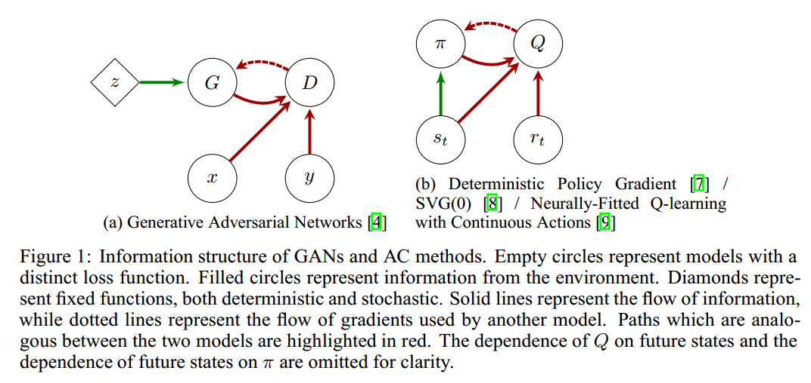
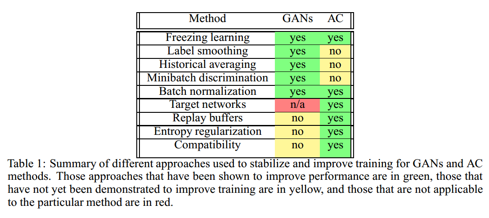

# Connecting Generative Adversarial Networks and Actor-Critic Methods

## Contact me

* Blog -> <https://cugtyt.github.io/blog/index>
* Email -> <cugtyt@qq.com>, <cugtyt@gmail.com>
* GitHub -> [Cugtyt@GitHub](https://github.com/Cugtyt)

> **本系列博客主页及相关见**[**此处**](https://cugtyt.github.io/blog/papers/index)

---

<head>
    
    
</head>

## Abstract

无监督的GAN和强化学习的actor-critic方法在优化困难方面声名显著。这两个领域的研究人员积累了大量的缓解不稳定和改善训练情况的策略。这里我们展示了GAN可以看作是一个特定环境中的actor-critic方法，在这个环境中actor无法影响奖励。我们对这两类模型稳定训练方法做了综述，不仅包括可以同时对二者使用的方法，还包括只针对特定模型的方法。我们也对一系列信息流更复杂的GAN和RL算法进行了综述。我们希望强调二者之间的联系来激励GAN和RL两个领域开发出通用，可扩展以及稳定的算法。

## 1 Introduction

大部分机器学习问题可以表述为对于一个目标的优化问题。但是，很多问题缺乏一个统一的代价函数，并且混合着多个模型，虽然模型间彼此传递信息，但是却试图最小化各自内部的损失函数。这对大部分学习算法的假设造成了影响，并且应用传统方法如梯度下降等通常会导致病态行为，例如波动或坍塌为退化解。尽管有这些实践中的问题，但是在具有混合或多级损失的模型中存在巨大潜力，同时不同局部损失的组合也是大脑功能的基础。

Actor-critic（AC）方法和GAN是两类多层次优化问题并且具有相似之处。在这两种情况中，信息流都是一个简单的前向传递。从一个模型，不管它接受一个Action（AC）还是生成的样本（GAN），到另一个模型来衡量前一个模型的输出质量。在这两类中，第二个模型都是唯一对环境特殊信息直接接触的模型，这个信息或许是奖励信息（AC）或是真实样本（GAN），并且第一个模型必须从第二个模型的错误信号中学习。当然二者也有其不同之处，第二部分讨论。这些模型都有稳定性方面的问题，而两个领域都形成了各自独立的稳定训练的方法。

## 2 Algorithms

GAN和AC都可以看作是双层（bilevel）或双时间尺度（two-time-scale）的优化问题，一个模型通过另一个模型来优化自身：

$$x^{*}=\arg \min _{x \in \mathcal{X}} F\left(x, y^{*}(x)\right) \qquad (1)$$
$$y^{*}(x)=\arg \min _{y \in \mathcal{Y}} f(x, y) \qquad (2)$$

双层优化问题在运筹学方面已经得到广泛研究，包括AC方法，但是都是在线性或凸的设置上。

### 2.1 Generative Adversarial Networks

GAN可以表述为包含两个部分的无监督问题：一个生成器G从一个分布中采样，一个判别器D分类一个样本为真或假。通常生成器是一个前向神经网络，接收一个固定噪声源$z \sim \mathcal{N}(0, I)$输入，判别器是另一个神经网络，把一个图像映射为一个二分类的概率。GAN的博弈可以表述为零和博弈，它的值表示为交叉熵损失：

$$\min _{G} \max _{D} \mathbb{E}_{w, y}[y \log D(w)+(1-y) \log (1-D(w))]\\=\min _{G} \max _{D} \mathbb{E}_{w \sim p_{\text { data }}}[\log D(w)]+\mathbb{E}_{z \sim \mathcal{N}(0, I)}[\log (1-D(G(z)))] \qquad (3)$$

为了保证生成器在判别器准确率很高的情况下也能有梯度来学习，生成器的损失函数通常表示为最大化分类为真的概率，而不是最小化分类为假的概率。修改后的损失依旧是双层优化问题：

$$F(D, G)=-\mathbb{E}_{w \sim p_{\text { data }}}[\log D(w)]-\mathbb{E}_{z \sim \mathcal{N}(0, I)}[\log (1-D(G(z)))] \qquad (4) \\ f(D, G)=-\mathbb{E}_{z \sim \mathcal{N}(0, I)}[\log D(G(z))] \qquad (5)$$

### 2.2 Actor-Critic Methods

AC方法在强化学习中很早就有了。大部分强化学习算法或是学习一个值函数，例如值迭代和TD学习，或直接学习一个策略，例如策略梯度方法。AC方法是同步的：actor学习策略与critic学习值函数同步进行。在很多AC方法中，critic为策略梯度方法提供了一个低方差的基准，而不用去从返回中估计值。在这种情况下，即使是一个坏的值函数估计也是有帮助的，因为无论使用什么基准策略梯度都会被修正偏置。在其他AC方法中，策略通过近似值函数来更新，这种情形与GAN很相似。如果策略通过一个不正确的值函数来优化，可能会导致一个坏的策略，从而不能完全探索整个空间，那么就不能发现好的值函数，从而出现退化解。有一系列的方法来缓解这个问题。

考虑一个RL的MDP问题，有一个状态S，行为A的集合，一个初始状态为$p_0(s)$的分布，转移函数$\mathcal{P}\left(s_{t+1} \vert s_{t}, a_{t}\right)$,奖励分布$\mathcal{R}\left(s_{t}\right)$，还有折扣因子$\gamma \in[0,1]$。AC方法的主要目的是同步学习一个行为值函数$Q^{\pi}(s, a)$，来预测折扣奖励期望：

$$Q^{\pi}(s, a)=\mathbb{E}_{s_{t+k} \sim \mathcal{P}, r_{t+k} \sim \mathcal{R}, a_{t+k} \sim \pi}\left[\sum_{k=1}^{\infty} \gamma^{k} r_{t+k} | s_{t}=s, a_{t}=a\right] \qquad (6)$$

然后根据值函数学一个最优的策略：

$$\pi^{*}=\arg \max _{\pi} \mathbb{E}_{s_{0} \sim p_{0}, a_{0} \sim \pi}\left[Q^{\pi}\left(s_{0}, a_{0}\right)\right]  \qquad (7)$$

我们可以把$Q^{\pi}$表示为最小化问题的解：

$$Q^{\pi}=\arg \min _{Q} \mathbb{E}_{s_{t}, a_{t} \sim \pi}\left[\mathcal{D}\left(\mathbb{E}_{s_{t+1}, r_{t}, a_{t+1}}\left[r_{t}+\gamma Q\left(s_{t+1}, a_{t+1}\right)\right] \| Q\left(s_{t}, a_{t}\right)\right)\right] \qquad (8)$$

其中$\mathcal{D}(\cdot \| \cdot)$是任意的散度。现在AC问题可以表示为一个双层优化问题：

$$F(Q, \pi)=\mathbb{E}_{s_{t}, a_{t} \sim \pi}\left[\mathcal{D}\left(\mathbb{E}_{s_{t+1}, r_{t}, a_{t+1}}\left[r_{t}+\gamma Q\left(s_{t+1}, a_{t+1}\right)\right]\right] | Q\left(s_{t}, a_{t}\right)\right) ] \qquad (9)
\\ f(Q, \pi)=-\mathbb{E}_{s_{0} \sim p_{0}, a_{0} \sim \pi}\left[Q^{\pi}\left(s_{0}, a_{0}\right)\right]$$

有很多解决这个问题的AC方法。传统的AC方法通过策略梯度来优化策略，通过TD错误来缩放策略梯度，而行为值函数通过普通的TD学习来更新。我们主要关注于确定性策略梯度（DPG），以及它在随机策略的扩展SVG（0），和连续行为的neurally-fitted Q-learning（NFQCA）。这些算法都是针对于行为和观察值为连续的情况，使用神经网络来近似行为值函数和策略。这是个早就存在的解决连续行为RL的方法，所有的方法通过传回估计值对行为的梯度来更新策略，而不是直接传入TD错误。这些方法的区别主要是训练过程。在NFQCA中，actor和critic在每个episode中以batch模式训练，而DPG和SVG（0）中，网络使用查分法在线更新。

### 2.3 GANs as a kind of Actor-Critic

GAN和AC方法总结在图1中。在这两种情形中，模型都可以从环境（GAN的判别器和AC中的critic）中获取错误信息，而另一个模型必须从第一个模型的梯度信息中更新。

我们可以使这种联系更加精确，把GAN看作是一种修改过的actor-critic方法来描述一个MDP。考虑这样一个MDP，其中动作为图像中的每个像素。环境随机选择显示生成器生成的图像或显示真实图像。如果环境选择真实图像，则环境奖励为1，否则为0。此MDP是无状态的，因为actor生成的图像不会影响将来的数据。

在这种环境中进行actor-critic的学习显然非常类似于GAN。但必须进行一些调整才能使其完全相同。如果actor可以获取到环境的state，它可以轻而易举地产生真实的图像，所以actor必须是“盲”的，不知道state。虽然MDP是无状态的，但这并不妨碍actor学习。均方Bellman残差通常用作critic的损失，但为了匹配GAN损失应使用交叉熵。这仍然提供了具有常量最小值的损失函数。由于actor接收值的梯度而不是RL中Bellman残差的梯度，因此要在给actor的梯度中包含与$\frac{\partial \mathcal{D}}{\partial Q}$成比例的缩放项，其中D是交叉熵（在实践中，生成器使用其他损失来细致地处理这个缩放项的复杂性）。最后，如果环境显示真实图像，那么不应更新actor的参数。在奖励为1时，可以通过让critic的梯度归零来实现。因此，GAN可以被视为在无状态MDP中“盲”actor的actor-critic方法。

此MDP有几个独特的方面会导致一些与actor-critic方法无关的行为。首先，为什么actor-critic算法导致了对抗性行为这点并不是很明显。通常，actor和critic试图优化互补损失函数，而非在不同方向上优化相同的损失。GAN中的对抗是因为其MDP是玩家不能对奖励产生影响的。从本质上讲，它是一个真实政策梯度始终为零的MDP。然而，critic不能单独从输入示例中学习游戏的因果结构，而是要朝着预测奖励的特征方向移动。actor根据critic的最佳估计向某个方向移动以增加奖励，但这种变化并不会导致真实奖励的增加，因此critic将很快学会在actor移动的方向上赋予较低的值。因此，对于actor和critic的更新而言，它们在理想情况下是正交的（如在兼容性的actor-critic中），而不是对抗。值得注意的是，这对于只能部分观察到actor的环境会产生重要影响。而对于完全可观察的MDP，最优策略始终是确定性的。然而，对于GAN，能匹配真实分布的生成器是极小极大问题的固定点。尽管GAN与RL问题之间存在这些差异，但我们认为二者有足够的相似之处，也值得研究两种情况下通用的训练技术。

## 3 Stabilizing Strategies

在回顾了GAN的基本知识，actor-critic算法及其扩展之后，我们这里讨论每个领域各自的“交易技巧”。表1总结了不同的方法。虽然并不是一个详尽的清单，我们已经包括那些我们认为已经在其领域产生最大影响或最有可能在各个领域之间交叉的东西。

### 3.1 GANs

1. 冻结学习（Freezing learning）。通常当生成器或判别器超过对方时，GAN将陷入退化的情况。一个简单的补救措施是在一个模型开始过于强大时冻结学习。在actor-critic学习中已经成功采用了一种非常类似的方法，即当TD误差的幅度低于或高于某个阈值时，actor或critic的学习被冻结。
2. 标签平滑（Label smoothing）。当判别器的预测非常有信心时，一种防止梯度消失的简单技巧是，用平滑标签$\epsilon / 1-\epsilon$替换0/1标签，这保证了生成器始终具有信息梯度。虽然这是针对分类的，但没有理由不能于奖励为0/1并且critic梯度消失的RL情形。
3. 历史平均（Historical averaging）。受到游戏理论中虚构游戏的启发，历史平均为梯度下降增加了一个限制项，惩罚超过参数历史平均值的步骤。即使参数平均值不具有直观含义，此方法也可有效地防止因两个模型优化不同目标而引起的振荡。历史平均也与Polyak-Ruppert平均及其扩展密切相关。尽管Polyak-Ruppert类型的平均已经被RL领域的人严格分析过，但据我们所知，它还没有被采纳为标准的“交易工具”。在DPG中使用replay buffer在概念上也类似于虚构游戏，但仅适用于actor。
4. 小批量判别（Minibatch discrimination）。为了防止生成器坍塌到单个样本上，小批量判别将鉴别器的作用从对单个图像分类到整个小批量分类，这有助于增加生成样本的熵。在RL中，通过向actor添加惩罚，进而鼓励更高熵策略的行为来解决类似的探索不足问题。直接计算熵对于复杂的随机策略是不切实际的，批量判别可能是鼓励在连续空间进行探索的有效替代方案。
5. 批量标准化（Batch normalization）。批量标准化对于将GAN扩展到深度卷积网络至关重要，虚拟批量标准化对其进行了扩展，使用常量引用批处理来防止由于小批量的其他元素导致的预测相关性。批量标准化在DPG已经尝试过的大部分环境中也很有用，但尚未有研究虚拟批量标准化能否会带来更大的改进。

### 3.2 Actor-Critic

1. 回放缓冲（Replay buffers）。在离散和连续RL中，重放缓冲对于从训练数据中去除相关性非常有效。它们在概念上也类似于博弈论中的虚构游戏，一个玩家对另一个玩家的平均政策起到最佳响应。在虚构游戏中，两个玩家都与对手的历史平均对战，而在AC设置中，回放缓冲只能用于critic。critic可以根据actor过去选择的行动进行离线政策更新，但actor不能从过去critic的梯度中学习，因为这些梯度是针对不同的行为而采取的。类似地，对于GAN，我们可以保留先前生成图像的缓冲器，以防止判别器与当前生成器拟合太紧密。我们已经尝试使用GAN的回放缓冲，但即使对于简单的分布也无法生成渐近正确的样本。
2. 目标网络（Target networks）。由于动作值函数在Bellman递归中出现两次，因此稳定性可能是Q函数近似中的难题。目标网络将TD更新中的一个网络固定来解决此问题。由于GAN博弈可以被视为无状态MDP，因此动作值函数的二次出现便消失了，并且判别器的学习变成普通的回归问题。因此，我们不考虑适用于GAN的目标网络。然而，将Q-learning作为子问题的其他多层优化问题可能会受益。同样值得注意的是，自相对估计在概念上与目标网络类似，因此目标网络的思想仍然可以适用于其他密度估计问题。
3. 熵正则化（Entropy regularization）。actor-critic方法往往无法充分探索行动空间。为了解决这个问题，有时会增加额外奖励以鼓励高熵政策。当动作空间是离散的时候很容易实现，但在连续控制情况中稍微困难一些。值得注意的是，GAN经常遇到类似的问题，这时候生成器坍塌到某几种模式。在连续控制中任何鼓励进行探索的方法都可能增加GAN中的样本多样性。
4. 兼容性（Compatibility）。actor-critic方法的理论发展之一是兼容性critic的概念。如果critic是策略梯度相对于其参数的线性函数，并且critic是最优的，那么使用它来代替预期回报的梯度真实值可以给出无偏近似。这种兼容性的critic也与预期收益的自然梯度密切相关，并可用于策略的高效自然梯度下降。虽然优雅，但仍不清楚兼容性的概念是否可以自然地扩展到GAN中。由于任何策略的真实值在GAN MDP中始终为0.5，因此真实政策梯度始终为零。通常我们更希望GAN是对抗而不是兼容。

## 4 Conclusions

将深度学习与多层优化相结合，可以为机器学习和人工智能中的各种问题带来巨大希望。尽管优化和探索存在固有的困难，但GAN和actor-critic方法已经对各自的领域产生了巨大的影响。我们希望通过指出两者之间的深层联系，能鼓励在不同领域之间开发和采用更通用的技术，让不同的思想自由流动。