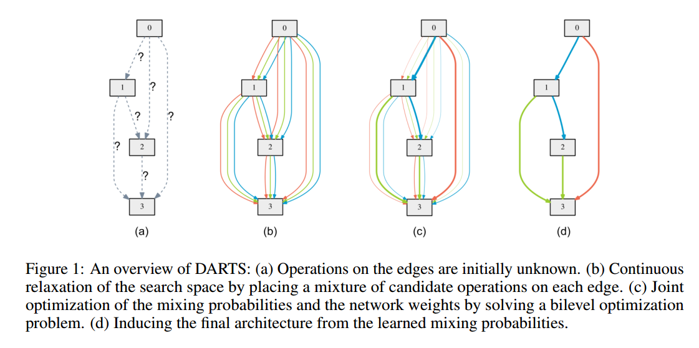
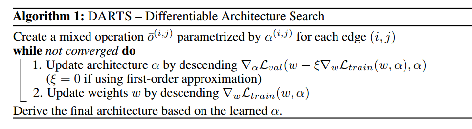
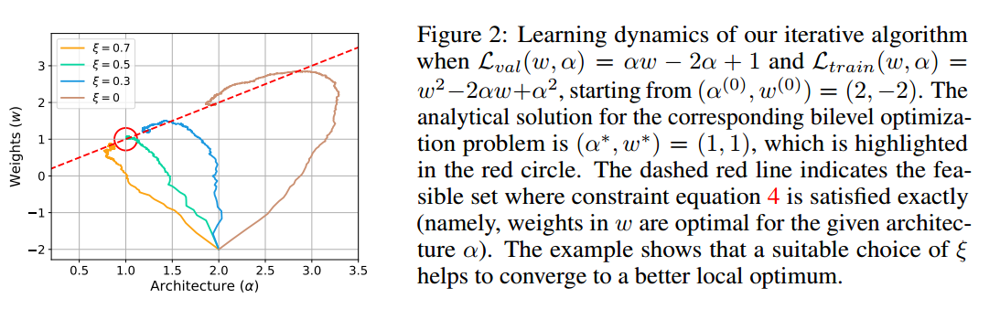
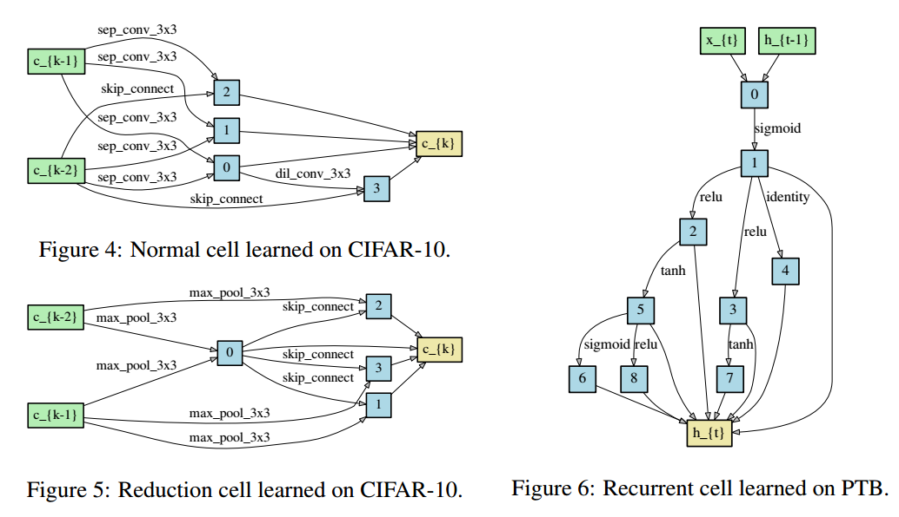
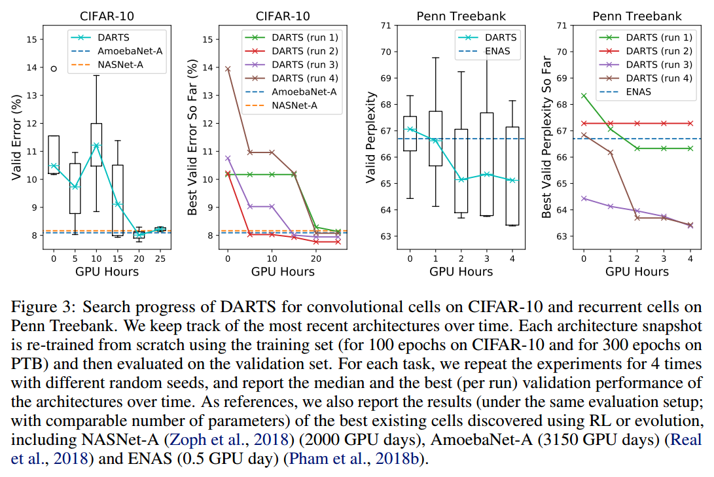
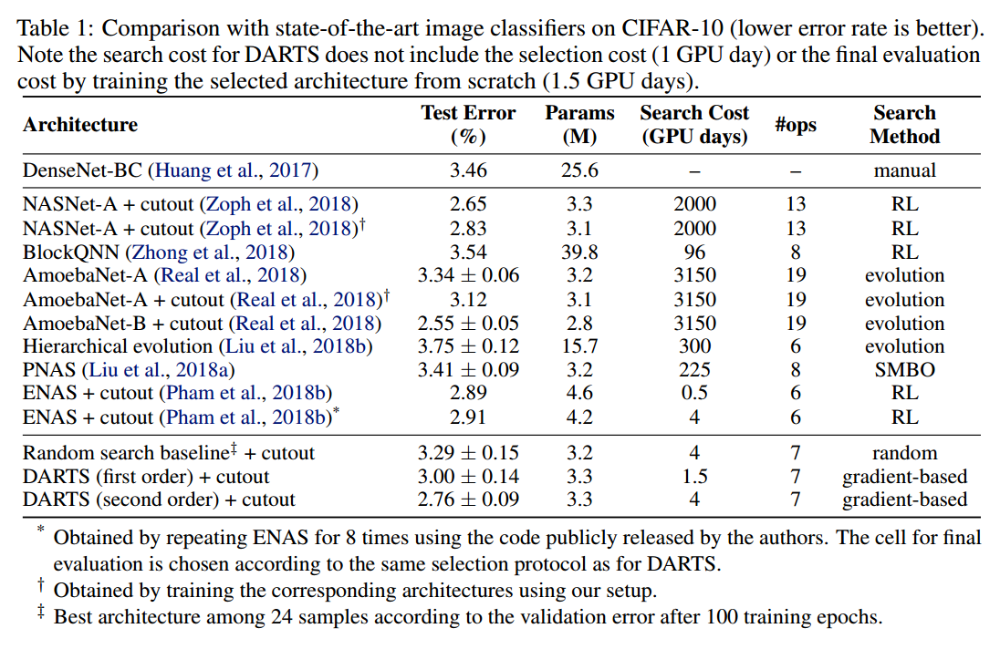
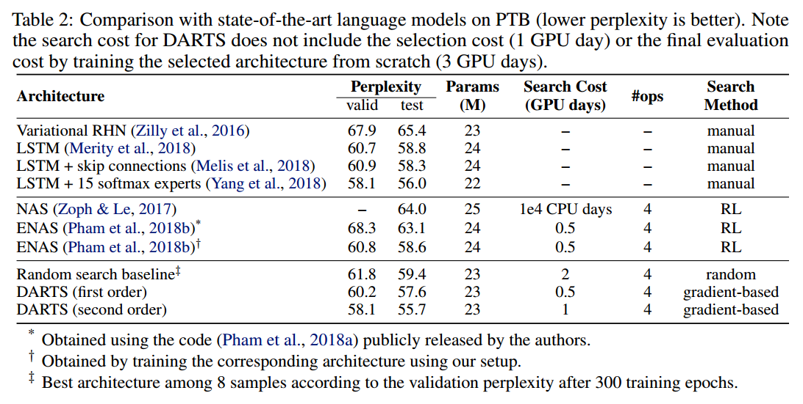
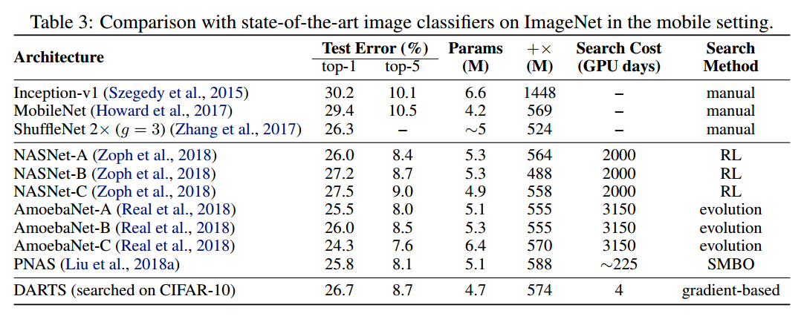
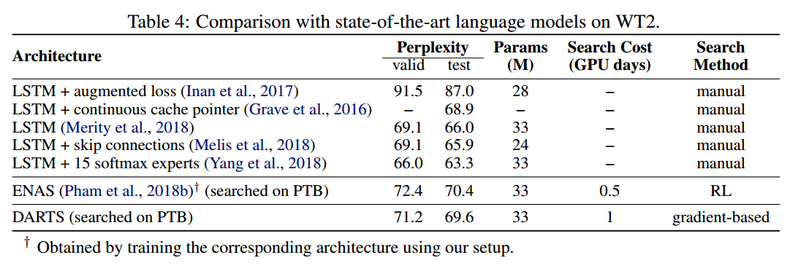

# DARTS: DIFFERENTIABLE ARCHITECTURE SEARCH

## Contact me

* Blog -> <https://cugtyt.github.io/blog/index>
* Email -> <cugtyt@qq.com>, <cugtyt@gmail.com>
* GitHub -> [Cugtyt@GitHub](https://github.com/Cugtyt)

> **本系列博客主页及相关见**[**此处**](https://cugtyt.github.io/blog/papers/index)

---

<head>
    
    
</head>

## Abstract

本文通可微分方式来解决网络结构搜索中的扩展性难题。与在离散和非可微搜索空间上使用演化或强化学习的传统方法不同，我们的方法基于结构表示的连续松弛，通过梯度下降来高效的进行搜索架构。在CIFAR-10，ImageNet，Penn Treebank和WikiText-2上的大量实验表明，我们的算法在高性能的图像分类卷积结构和语言建模的循环结构方面表现优异，同时比其他顶尖的非可微方法快几个数量级。

## 1. INTRODUCTION

寻找最好的网络结构需要人类专家，但是最近在自动化设计网络结构方面有很大进展，也取得了很好的结果。当前最好的结构搜索算法也需要相当大的计算量。例如有的需要2000个GPU天或3150个GPU天，【略】

我们的工作采用了不同的角度，提出了DARTS（Differentiable ARchiTecture Search）的高效结构搜索方法。我们不去搜索离散的候选结构，而是让搜索空间变为连续的，这样可以通过梯度下降根据验证集的性能优化网络结构。基于梯度的优化算法，相较于低效的黑盒搜索，让DARTS可以匹敌当前顶尖的性能，同时计算少了几个量级。【略】

把结构搜索连续化的想法不是最新的，但本文与它们有一些区别。先前的工作主要是微调结构的一个具体方面，例如卷积网络中filter的形状或分支，而DARTS能够在复杂的拓扑图结构中学习到高性能结构块。另外，DARTS对并不局限于任何特定的结构系列，对卷积网络和循环网络都是可用的。

在我们的试验中，我们发现DARTS可以使用3.3M的参数量在CIFAR10分类任务上获得2.76±0.09%的错误率，【略】

我们的贡献在于：

* 我们基于双层优化引入了可微网络结构搜索新算法，可以用在卷积和循环结构上。
* 通过大量的实验我们展示了CIFAR10上不错的结果，在PTB做到了最好。
* 我们达到了极大的性能提升（把结构搜索时间减少到了几个GPU天层次），这是基于梯度的优化相比不可微方法的优势。
* 我们展示了DARTS在CIFAR10和PTB上学到的结构可以迁移到ImageNet和WikiText2上。

## 2. DIFFERENTIABLE ARCHITECTURE SEARCH

### 2.1 SEARCH SPACE

和先前的一些工作一样，我们搜索一个计算块作为最终结构的基本组成。学到的这个块可以通过堆叠组成一个卷积网络或者相连成一个循环网络。

一个块是一个有向无环图，包括N个有序节点。每个节点$x^{(i)}$是一个隐含表示（例如卷积网络的一个特征图），每个有向边$(i, j)$对应$x^{(i)}$上的一些运算$O^{(i, j)}$。我们假设一个块有两个输入一个输出。对于卷积块，输入节点定义为前面两层的输出。对于循环块，输入是当前步骤的输入和前面步骤的状态。块的输出是对所有中间节点应用一些运算（如拼接）得到。

每个中间节点通过它所有前置节点计算得到：

$$x^{(j)}=\sum_{i<j} o^{(i, j)}\left(x^{(i)}\right) \qquad (1)$$

特殊的zero运算表示两个节点之间没有连接。学习块的任务变成了学习边运算的任务。

### 2.2 CONTINUOUS RELAXATION AND OPTIMIZATION

令$O$为候选运算的集合（例如卷积，最大池化，zero），每个运算表示应用在$x^{(i)}$上的函数$o(\cdot)$。为了让搜索空间连续，我们离散化的运算选择转化为所有可能运算的softmax：

$$\overline{o}^{(i, j)}(x)=\sum_{o \in \mathcal{O}} \frac{\exp \left(\alpha_{o}^{(i, j)}\right)}{\sum_{o^{\prime} \in \mathcal{O}} \exp \left(\alpha_{o^{\prime}}^{(i, j)}\right)} o(x) \qquad (2)$$

其中节点对$(i, j)$之间运算的权重用向量$\alpha^{(i, j)}$来表示，维度为$\vert O \vert$。结构搜索的任务可以转化为学习一系列连续的变量$\alpha=\{\alpha^{(i, j)}\}$，如图1。每次搜索结束后，可以得到一个确定的结构，把对应的运算$\overline{O}^{(i, j)}$替换为可能的运算，即$o^{(i, j)}=\operatorname{argmax}\_{o \in \mathcal{O}} \alpha\_{o}^{(i, j)}$。后面我们把$\alpha$作为结构的表示。

在松弛之后，我们的目标就是同时学习结构$\alpha$和运算的权重$w$。类似于使用RL和演化来做搜索，验证集的性能作为奖励或者适应度，DARTS目标是优化验证集的损失，但是使用的方法是梯度下降。

$\mathcal{L}\_{train}$和$\mathcal{L}\_{val}$表示训练集和验证集的损失。损失由结构$\alpha$和权重$w$决定。结构搜索的目标是找到$\alpha^{\*}$使得验证集损失$\mathcal{L}\_{v a l}\left(w^{\*}, \alpha^{\*}\right)$最小，这里权重$w^{\*}$来自于最小化训练损失$w^{\*}=\operatorname{argmin}\_{w} \mathcal{L}\_{train}(w, \alpha^{\*})$的结构。

这是个双层优化问题，$\alpha$是上层变量，$w$是下层变量：

$$\min _{\alpha} \mathcal{L}_{v a l}\left(w^{*}(\alpha), \alpha\right) \qquad (3) \\ s.t.  \quad w^{*}(\alpha)=\operatorname{argmin}_{w} \mathcal{L}_{\text {train}}(w, \alpha) \qquad (4)$$

### 2.3 APPROXIMATE ARCHITECTURE GRADIENT

由于内部优化很昂贵，因此不能对结构精确计算梯度。我们提出了一个简单的近似方法：

$$\nabla_{\alpha} \mathcal{L}_{v a l}\left(w^{*}(\alpha), \alpha\right) \qquad (5) \\ \approx \nabla_{\alpha} \mathcal{L}_{v a l}\left(w-\xi \nabla_{w} \mathcal{L}_{\text {train}}(w, \alpha), \alpha\right) \text { , } \alpha ) \qquad (6)$$

其中$w$表示当前算法持有的权重，$\xi$是内部优化一步的学习率。我们的想法是**通过简单一步训练调整$w$来近似$w^{*}(\alpha)$**，不需要训练至收敛来求解内部优化（公式4）。注意公式6在$w$已经是内部优化局部最优的时候变为$\nabla \_{\alpha} \mathcal{L}\_{v a l}(w, \alpha)$，这时候$\nabla\_{w} \mathcal{L}\_{t r a i n}(w, \alpha)=0$。

迭代步骤见算法1。虽然还无法确定我们的优化算法能保证收敛，但实践上，选择合适的$\xi$一般都能达到一个确定的点。我们也注意到在权重优化中使用动量的话，公式6中的单步学习目标随之改变，我们的分析依旧成立。

使用链式法则拟合结构梯度（公式6）：

$$\nabla_{\alpha} \mathcal{L}_{v a l}\left(w^{\prime}, \alpha\right)-\xi \nabla_{\alpha, w}^{2} \mathcal{L}_{t r a i n}(w, \alpha) \nabla_{w^{\prime}} \mathcal{L}_{v a l}\left(w^{\prime}, \alpha\right) \qquad (7)$$

其中$w^{\prime}=w-\xi \nabla \_{w} \mathcal{L}\_{t r a i n}(w, \alpha)$单步前向模型的权重。上式第二项包括一个矩阵-向量乘积，计算较大。但幸运的是，使用有限微分近似可以极大减少复杂度。令$\epsilon$为一个标量值，且$w^{ \pm}=w \pm \epsilon \nabla\_{w^{\prime}} \mathcal{L}\_{v a l}\left(w^{\prime}, \alpha\right)$，那么：

$$\nabla_{\alpha, w}^{2} \mathcal{L}_{t r a i n}(w, \alpha) \nabla_{w^{\prime}} \mathcal{L}_{v a l}\left(w^{\prime}, \alpha\right) \approx \frac{\nabla_{\alpha} \mathcal{L}_{t r a i n}\left(w^{+}, \alpha\right)-\nabla_{\alpha} \mathcal{L}_{t r a i n}\left(w^{-}, \alpha\right)}{2 \epsilon} \qquad (8)$$

求有限微分只需要两次权重的前向传播，和两次$\alpha$的反向传播，复杂度从$O(\vert\alpha\vert\vert w\vert)$到$O(\vert\alpha\vert+\vert w\vert)$。

**一阶近似** 当$\xi=0$时，公式7中的二阶偏导就消失了，这种情况下，结构梯度由$\nabla_{\alpha} \mathcal{L}_{v a l}(w, \alpha)$给定，这对应于一个简单的启发式方法，即假设当前$w$和$w^{*}(\alpha)$一样，然后优化验证损失。这带来速度上的提升但是实践上性能很差，结果在表1和表2中。后面我们把$\xi=0$称为一阶近似，$\xi > 0$称为二阶近似。

### 2.4 DERIVING DISCRETE ARCHITECTURES

为了组建离散结构中的每个节点，我们在前面节点收集到的所有非0候选运算中保留最强的k个运算。一个运算的强度定义为：$\frac{\exp \left(\alpha_{o}^{(i, j)}\right)}{\sum_{o^{\prime} \in \mathcal{O}} \exp \left(\alpha_{o^{\prime}}^{(i, j)}\right)}$。为了让产生的结构能与现有的工作匹敌，我们对卷积块使用$k=2$，循环块使用$k=1$。

zero运算不保留的原因有两点：第一，每个节点需要保证有k个非0输入边，这样能和现有的模型进行公平对比，第二，zero运算的强度是无法确定的，因为增加zero运算的logits只影响了最终节点表示的尺度，由于BN的存在并不影响最后的分类输出。

## 3 EXPERIMENTS AND RESULTS

在CIFAR10和PTB上的实验包括两个阶段，结构搜索和结构评估。第一阶段，使用DARTS搜索所有结构块，基于验证性能确定最后的块。第二阶段，使用这些块构建大的结构，从头训练在测试集上查看性能。我们也探索了在CIFAR10和PTB上的最好的块在ImageNet和WikiText-2上的表现。

### 3.1 ARCHITECTURE SEARCH

#### 3.1.1 SEARCHING FOR CONVOLUTIONAL CELLS ON CIFAR-10

在$O$中我们包括了如下运算：3\*3和5\*5的可分卷积，3\*3和5\*5的空洞可分卷积，3\*3最大池化，3\*3平均池化，直接输出，zero。所有的运算步长1，卷积特征图填充来保持空间分辨率不变。使用ReLU-Conv-BN的顺序，每个可分卷积总是应用两次。

【略】

#### 3.1.2 SEARCHING FOR RECURRENT CELLS ON PENN TREEBANK

【略】

### 3.2 ARCHITECTURE EVALUATION

为了确定最后的结构，我们使用不同的随机数种子运行DARTS四次，从头训练一个小段时间（CIFAR10为100个epoch，PTB为300个epoch），根据验证集性能挑选最好的结构。这对于循环块来说是极其重要的，因为优化输出对于初始化很敏感（图3）。

为了评估所挑选的结构，我们随机初始化权重（搜索阶段的权重丢弃），从头训练，在测试集上查看性能好坏。注意测试集在结构搜索和选择的过程中是不用的。

【略】

### 3.3 RESULTS ANALYSIS

## 4 CONCLUSION

我们提出了DARTS，一个简单高效的结构搜索算法，可用于卷积和循环网络。DARTS通过在连续空间搜索，可以在图像分类和语言建模任务上匹敌当前顶尖的非可微搜索算法，效率快了几个数量级。

【略】