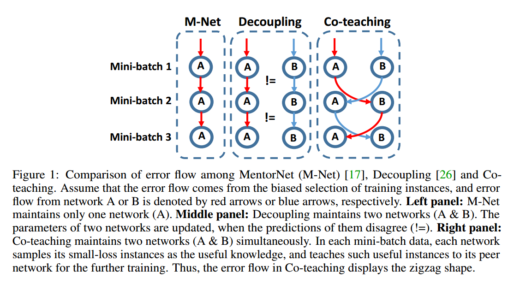
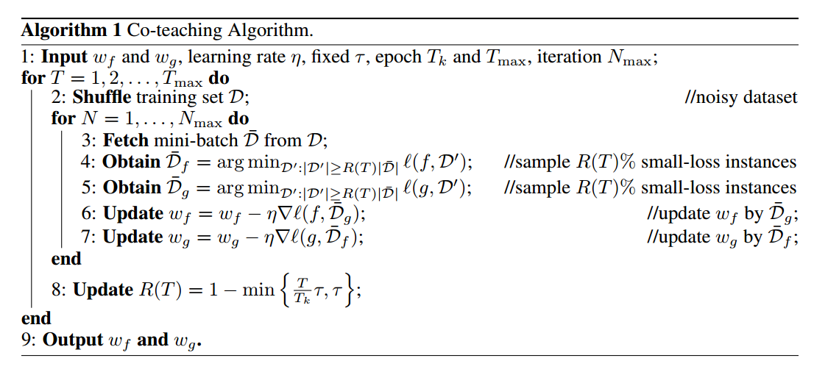
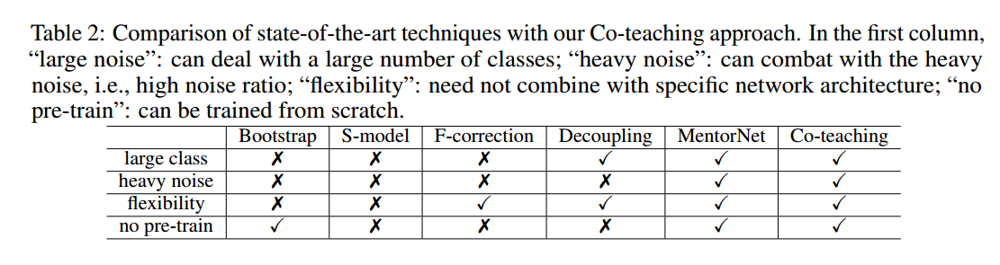
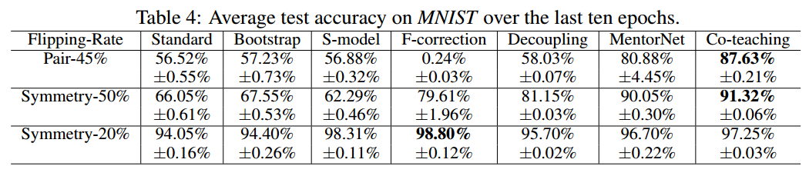
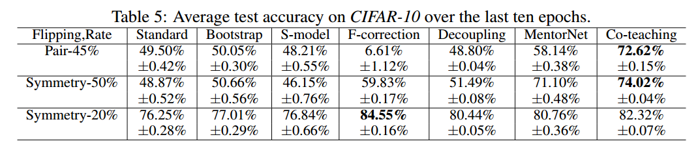
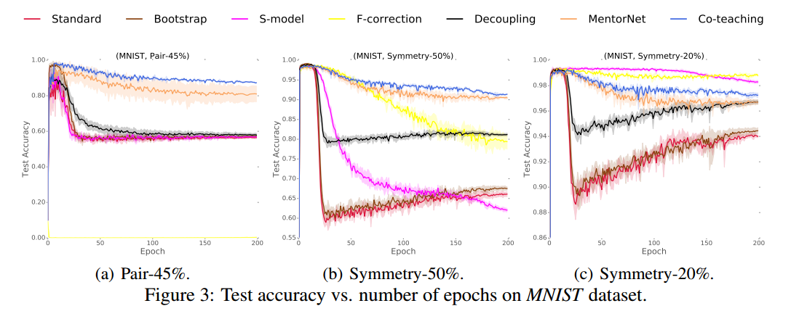
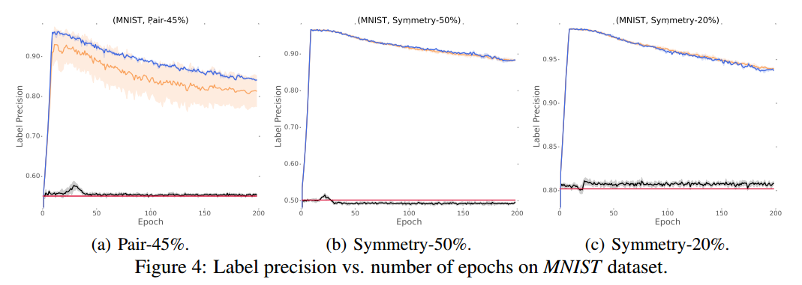
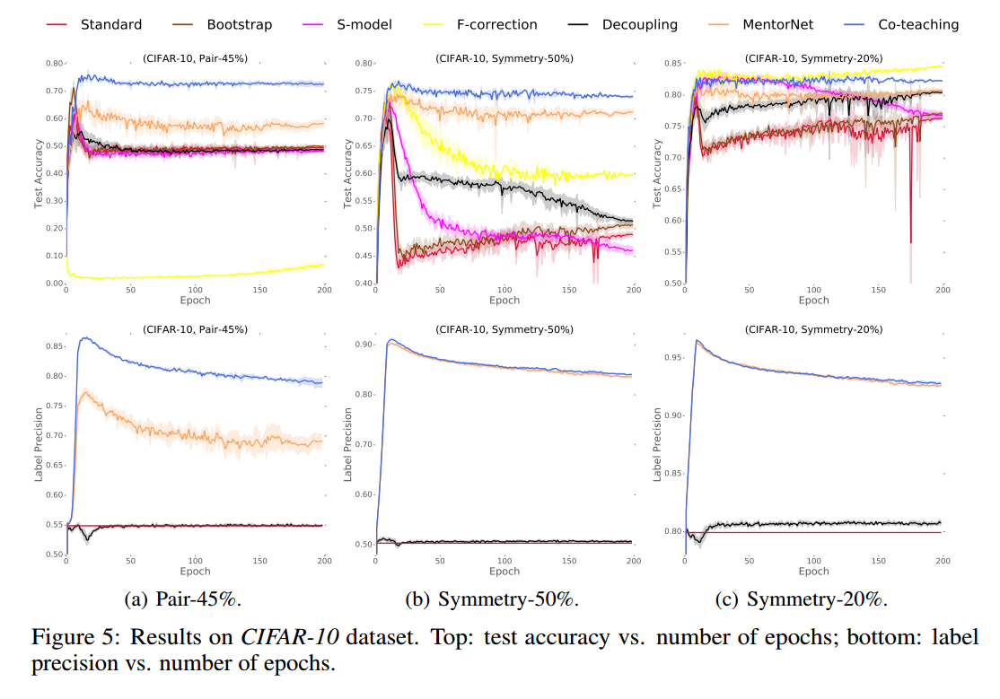

# Co-teaching: Robust Training of Deep Neural Networks with Extremely Noisy Labels

## Contact me

* Blog -> <https://cugtyt.github.io/blog/index>
* Email -> <cugtyt@qq.com>, <cugtyt@gmail.com>
* GitHub -> [Cugtyt@GitHub](https://github.com/Cugtyt)

> **本系列博客主页及相关见**[**此处**](https://cugtyt.github.io/blog/papers/index)

---

<head>
    
    
</head>

## Abstract

标签带噪声的深度学习具有很大的挑战性，因为深度模型的容量非常大，以至于可以在训练时迟早记住这些带噪声的标签。尽管如此，最近关于深度神经网络记忆效应的研究表明，网络首先会记住干净标签的训练数据，然后记住噪声标签的训练数据。因此，在本文中，我们提出了一种新的深度学习范式，称为“co-teaching”，用于抵抗标签的噪声。也就是说，我们同时训练两个深度神经网络，并让它们在每个小批量中相互学习：首先，每个网络输入所有数据并选择一些可能干净的标签数据；其次，两个网络相互通信这个批量中应该用于训练的数据; 最后，每个网络反向传播另一个网络挑选的数据并更新自己。对MNIST，CIFAR-10和CIFAR-100的噪声版本实验表明，在训练深度模型的稳健性方面，co-teaching远远优于当前的顶尖方法。

## 1 Introduction

从本质上讲，噪声标签是真实标签破坏后的状态，因此它们不可避免地会降低模型的鲁棒性，尤其是深度神经网络。不幸的是，噪声标签在现实世界中无处不在。

由于深度神经网络具有拟合噪声标签的容量，因此使用噪声标签训练网络具有很大的挑战性。目前的方法着重于估计噪声转移矩阵。例如，在softmax层之上，Goldberger等人增加了一个额外的softmax层来模拟噪声转移矩阵。Patrini利用两步解决方案启发式地估计噪声转移矩阵。然而，噪声转移矩阵很难准确估计，尤其是当类的数量很大时。

为了不用估计噪声转移矩阵，一个有希望的方向集中与对所选样本的训练。这些工作尝试从噪声样本选择干净的数据，然后使用它们来更新网络。直观地，随着训练数据噪声变小，性能也能得到提升。在这些工作中，代表性方法是MentorNet和Decoupling。具体来说，MentorNet预先训练一个额外的网络，然后使用使用这个网络选择干净的数据来指导训练。当干净的验证数据不可用时，MentorNet必须使用预定义的课程（curriculum）（例如，自定进度的课程）。自定进度的MentorNet的想法类似于自我训练，并且它一样有因样本选择偏差引起累积误差的劣势。Decoupling同时训练两个网络，然后仅使用这两个网络预测不同的样本来更新模型。尽管如此，噪声标签仍均匀分布在整个空间中。因此，不一致区域包括许多噪声标签，Decoupling方法不能明确地处理噪声标签。虽然MentorNet和Decoupling是这个这个方向的代表性方法，但仍然存在上述问题，这促使我们在研究中改进它们。

同时，深层模型一个有趣的观察是它们可以先记住简单样本，并随着训练而逐渐拟合难的样本。当存在噪声标签时，深度学习模型最终会记住这些错误给定的标签，这导致了较差的泛化性能。这种现象不会随着训练优化（Adagrad或Adam）或网络架构（MLP，Alexnet和Inception）的选择而变化。

在本文中，我们提出了一种简单但有效的学习范式，称为“co-teaching”，可以在极其嘈杂的标签中稳健地训练深度网络（多类的细粒度分类中有45％的噪声标签）。我们的想法源于co-training，与Decoupling类似，co-teaching也同时维护两个网络。但值得注意的是，在每个批量数据中，每个网络都将具有小损失的样本（如自定进度的MentorNet）视为有用的知识，并向其另一个网络传授这些样本以更新参数。co-teaching更加鲁棒的直觉可以如下解释。在图1中，假设错误流来自第一批量数据中有偏的训练样本。在MentorNet或Decoupling中，来自一个网络的错误将在第二个批量数据中再次训练，这样错误越来越多。但在co-teaching中，由于两个网络具有不同的学习能力，它们可以过滤由噪声标签引入的错误。交换过程中相互减少错误流。我们使用动量随机优化，非线性深度网络可以首先记忆干净数据从而更加鲁棒。当来自噪声数据的错误流入对方网络时，由于其本身的鲁棒性，错误得以衰减。

我们对MNIST，CIFAR-10和CIFAR-100数据集的噪声版本进行了实验。实证结果表明，在极度嘈杂的情况下（即45％的噪声标签），通过co-teaching方法训练的深度学习模型稳健性远远优于最先进的基线。在低水平噪声环境下（即20％的噪声标签），通过co-teaching方法训练的深度学习模型的稳健性仍然优于大多数基线。

## 2 Related literature
【略】

## 3 Co-teaching meets noisy supervision

我们的想法是同时训练两个深度网络。如图1所示，在每个批量数据中，每个网络选择损失小的样本作为有用的知识，并将这些有用的样本传授给另一个网络以进行进一步的训练。因此，所提出的算法被称为co-teaching（算法1）。由于所有深度学习训练方法都是基于随机梯度下降，因此我摸的方法基于小批量学习工作。具体来说，我们维护两个网络f（带参数$w_{f}$）和g（带参数$w_{g}$）。当得到一个小批量$\overline{D}$（步骤3）时，我们首先让f（或对应的g）在这个小批量$\overline{\mathcal{D}}\_{f}$（或对应的$\overline{\mathcal{D}}\_{g}$）中选择一小部分损失小的样本（步骤4和5）。样本的数量由$R(T)$控制，为选择的比例。然后，将所选样本作为参数更新的有用知识（步骤6和7）传给另一个网络。

设计上述算法1有两个重要问题：
* Q1. 为什么基于动态R（T）对小损失样本进行采样会有助于我们找到干净的样本？
* Q2. 为什么我们需要两个网络并交叉更新参数？

要回答第一个问题，我们首先要澄清损失小与干净样本之间的联系。直观而言，当标签正确时样本的损失才会小。因此，如果我们仅使用每个小批量数据中损失小的样本来训练我们的分类器，那么它应该能够抵抗噪声标签。

但是，这要求分类器足够可靠才能保证损失小的样本确实干净。深度网络的“记忆”效应可以帮助我们解决这个问题。也就是说，在噪声数据集上，即使存在噪声标签，深层网络也会在开始时学习干净简单的模式。因此，他们能够在训练开始时使用他们的损失值过滤掉噪声的样本。然而，问题在于随着不断的训练，它们最终会过拟合噪声标签。为了解决这个问题，我们希望在开始时的小批量中保留更多样本，即R（T）很大。然后，我们逐渐增加丢弃率，即R（T）变小，这样我们就可以在网络记忆它们之前保持干净的样本并丢弃那些噪声样本。

基于这个想法，我们可以在算法1中使用一个网络，让分类器自己进化。这个过程类似于boosting和主动学习。但boosting和主动学习对异常值和噪声敏感，并且一些错误选择的样本会使整个模型的性能恶化。这就与我们的第二个问题相关，使用两个分类器可以提供帮助。

直观而言，不同的分类器可以生成不同的决策边界，具有不同的学习能力。因此，当在嘈杂的标签上进行训练时，我们也期望它们可以具有不同的能力来滤除标签噪声。这启发我们交换损失小的样本，即使用从g（或f）中选择的小批量样本更新f（或g）中的参数。此过程类似于co-training，如果所选样本有噪声，则这两个网络将自适应地校正另一个网络的训练错误。可以把“同行评审”作为正面的一个例子。当学生检查自己的试卷时，他们很难找到错误，因为他们对答案有一些个人偏见。幸运的是，他们可以要求同伴们查看他们的试卷。进而更容易找到潜在的错误。总而言之，来自一个网络的错误不会直接转回本身，相比与自我演化，我们期望co-teaching方法可以处理更大噪声的数据。

**Relations to Co-training.** 尽管co-teaching是由co-training启发而来，但唯一的相似之处在于训练了两个分类器。它们之间存在根本区别：(i)co-training需要两种视角（两套独立的视图），而co-teaching只需要一个视图。（ii）co-training不利用深度神经网络的记忆，而co-teaching利用了。（iii）co-training是为半监督学习（SSL）而设计的，而co-teaching则用于学习带有噪音的标签（LNL）; 由于LNL不是SSL的特例，我们不能简单地将Co-training从一个问题转换为另一个问题。

## 4 Experiments

【略】

## 5 Conclusion

本文提出了一种简单但有效的学习范式，称为co-teaching，它在有噪声的监督下鲁棒的训练深度神经网络。我们的主要想法是同时维护两个网络，并通过“损失小”的标准进行交叉训练。我们进行了模拟实验证明了我们提出的co-teaching可以在噪声很强的情况下鲁棒的训练深度模型。将来，我们可以在以下方面扩展我们的工作。首先，我们可以调整co-teaching范式来训练其他弱监督下的深层模型，例如带标签和不带标签的数据。其次，我们将研究co-teaching的理论保证。以前的co-training理论很难转移到co-teaching中，因为设置根本不同。此外，我们没有对带噪声标签的深度学习泛化性能进行分析。因此，我们将泛化分析作为未来的工作。
