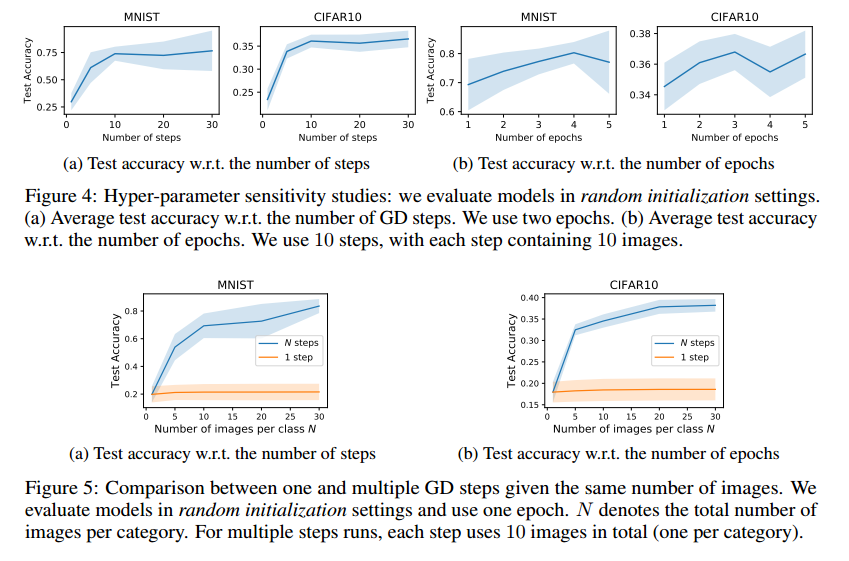

# DATASET DISTILLATION

## Contact me

* Blog -> <https://cugtyt.github.io/blog/index>
* Email -> <cugtyt@qq.com>, <cugtyt@gmail.com>
* GitHub -> [Cugtyt@GitHub](https://github.com/Cugtyt)

> **本系列博客主页及相关见**[**此处**](https://cugtyt.github.io/blog/papers/index)

---

<head>
    
    
</head>

## Abstract

模型蒸馏的目的是将复杂模型的知识提炼成到简单的模型。在本文中，我们考虑的是数据集蒸馏：保持模型固定，尝试将大型训练数据集中的知识提炼成小数据。该想法是合成少量数据，这些数据不需要一定来自正确的数据分布，但是当作为模型的训练数据学习时，能达到近似在原始数据上训练的效果。例如，我们展示了可以压缩60000个MNIST图像成仅10个合成蒸馏图像（每个类别一个），并且在给定固定网络初始化的情况下，仅通过几个梯度下降步骤实现接近原始训练的性能。我们在各种初始化设置和不同的学习目标中评估了我们的方法。在多个数据集上的实验表明了我们方法的优势。

## 1 INTRODUCTION
Hinton等人提出了网络蒸馏，作为将知识从许多单独训练的网络转移到单个（通常是紧凑的）网络中的方式，是一种模型压缩。
在本文中，我们正在考虑一个相关但正交的任务：我们蒸馏数据集，而不是蒸馏模型。与网络蒸馏不同的是，我们保持模型固定，将整个训练数据集的知识封装到少量的合成图像中。我们展示了可以将每个类别的图像合成到一个图像，在这些合成图像上也能训练性能相近的模型。例如，在图1a中，在给定固定网络初始化的情况下，将MNIST数字数据集的60000个训练图像合成仅10个图像（每个类别一个）。在这10幅图像上训练标准的LeNet，使得测试性能达到94％，而原始数据集的这一性能达到99％。对于具有未知随机权重的网络，100个合成图像通过几个梯度下降步骤训练到80％。我们将方法命名为数据集蒸馏，这些图像是蒸馏图像。

但为什么数据集蒸馏有用呢？在给定的数据集中编码多少数据，以及它的压缩性如何，这是个纯粹的科学问题。此外，与传统的常常使用数万个梯度下降步骤的训练相比，给定一些蒸馏图像，我们可以更加有效地给网络“加载”整个数据集的知识。

一个关键问题是，是否有可能将数据集压缩为一小组合成数据样本。例如，是否有可能在合成图像上训练分类模型？传统观点认为答案是否定的，因为合成训练数据可能不遵循真实测试数据的分布。然而在这项工作中，我们表明这确实是可能的。我们提出了一种新的优化算法用于合成少量的合成数据，不仅可以捕获大部分原始训练数据，而且还可以在几个梯度步骤中快速地训练模型。为了实现我们的目标，我们首先将网络权重推导为合成数据的可微函数。鉴于这种联系，我们优化蒸馏图像的像素值，而不是优化特定训练目标的网络权重。但是，这种方法需要获取网络的初始权重。为了放宽这个假设，我们开发了一种为随机初始化网络生成蒸馏图像的方法。为了进一步提高性能，我们提出了一个迭代版本，可以获得了一系列蒸馏图像，这些蒸馏图像可以用在多个阶段进行训练。最后，我们研究了一个简单的线性模型，得出了获得完整数据集性能的蒸馏数据大小下限。

我们证明，在固定初始化的模型下，可以使用少量蒸馏图像训练出实现令人惊讶的性能。对于在其他任务上预训练的网络，我们的方法可以找到用于快速模型微调的蒸馏图像。我们在几个初始化设置上测试我们的方法：固定初始化，随机初始化，固定预训练权重和随机预训练权重，以及两个训练目标：图像分类和恶意数据集毒性攻击。对四个公开可用的数据集MNIST，CIFAR10，PASCAL-VOC和CUB-200进行了大量实验，结果表明我们的方法通常优于现有方法。

## 3 APPROACH

给定一个模型和一个数据集，我们的目标是获得一个新的，大大减少的合成数据集，其性能几乎与原始数据集一样好。

考虑训练数据集`$\mathbf{x}=\left\{x_{i}\right\}_{i=1}^{N}$`，我们将神经网络参数化为$\theta$，并将`$\ell\left(x_{i}, \theta\right)$`表示为表示数据点`$x_{i}$`上该网络的损失函数。我们的任务是找到在整个训练数据上的经验误差最小化的值：

$$\theta^{*}=\underset{\theta}{\arg \min } \frac{1}{N} \sum_{i=1}^{N} \ell\left(x_{i}, \theta\right) \triangleq \underset{\theta}{\arg \min } \ell(\mathbf{x}, \theta) \qquad (1)$$

为了方便，我们还把$\ell(\mathbf{x}, \theta)$记作在整个数据集上的平均错误。假设$\ell$是二阶可微的，这在大部分现代机器学习模型和任务上是成立的。

### 3.1 OPTIMIZING DISTILLED DATA

标准的训练通常是在小批量上做随机梯度下降。每一步$t$,一个批量数据`$\mathbf{x}_{t}=\left\{x_{t, j}\right\}_{j=1}^{n}$`用于更新当前参数：

$$\theta_{t+1}=\theta_{t}-\eta \nabla_{\theta_{t}} \ell\left(\mathbf{x}_{t}, \theta_{t}\right)$$

此处通常要万甚至百万步来收敛。我们希望能学到一个合成的蒸馏数据`$\tilde{\mathbf{x}}=\left\{\tilde{x}_{i}\right\}_{i=1}^{M}$`，这里$M \ll N$，因此一个GD步骤为：

$$\theta_{1}=\theta_{0}-\tilde{\eta} \nabla_{\theta_{0}} \ell\left(\tilde{\mathbf{x}}, \theta_{0}\right) \qquad (2)$$

使用这个合成数据$\tilde{\mathbf{x}}$可以极大地加速测试集上的性能。给定一个初始参数$\theta_{0}$，我们通过最小化以下目标$\mathcal{L}$来获得合成数据$\tilde{\mathbf{x}}$和学习率$\tilde{\eta}$：

$$\tilde{\mathbf{x}}^{*}, \tilde{\eta}^{*}=\underset{\tilde{\mathbf{x}}, \tilde{\eta}}{\arg \min } \mathcal{L}\left(\tilde{\mathbf{x}}, \tilde{\eta} ; \theta_{0}\right)=\underset{\mathbf{\tilde { x }}, \tilde{\boldsymbol{\eta}}}{\arg \min } \ell\left(\mathbf{x}, \theta_{1}\right)=\underset{\mathbf{\tilde { x }}, \tilde{\boldsymbol{\eta}}}{\arg \min } \ell\left(\mathbf{x}, \theta_{0}-\tilde{\eta} \nabla_{\theta_{0}} \ell\left(\tilde{\mathbf{x}}, \theta_{0}\right)\right) \qquad (3)$$

生成新的$\theta_{1}$作为蒸馏数据$\tilde{\mathbf{X}}$的函数，通过公式2生成学习率$\tilde{\eta}$，然后在整个训练数据$\mathbf{X}$上评估新的权重。损失$\mathcal{L}\left(\tilde{\mathbf{x}}, \tilde{\eta} ; \theta_{0}\right)$对$\tilde{\mathbf{X}}$和$\tilde{\eta}$上是可微的，可以使用标准的基于梯度的方法来优化。在很多分类任务中，数据$\mathbf{X}$包含一些其他的部分，例如标签等。这种情况下，我们只把他们固定而不用学习。

### 3.2 DISTILLATION FOR RANDOM INITIALIZATIONS

不幸的是，上面的对于给定初始化的蒸馏数据优化方法在其他初始化上不能很好的泛化。蒸馏的数据通常看起来像噪声（图2a），这是因为它编码了训练数据$\mathbf{X}$和特定的网络初始值$\theta_{0}$。为了解决这个问题，我们计算了一小部分蒸馏数据，可以用于随机初始化的网络。我们把这个优化问题写为：

$$\tilde{\mathbf{x}}^{*}, \tilde{\eta}^{*}=\underset{\mathbf{\tilde { x }}, \tilde{\eta}}{\arg \min } \mathbb{E}_{\theta_{0} \sim p\left(\theta_{0}\right)} \mathcal{L}\left(\tilde{\mathbf{x}}, \tilde{\eta} ; \theta_{0}\right) \qquad (4)$$

其中网络初始值$\theta_{0}$是从分布$p\left(\theta_{0}\right)$中随机采样的。在我们的优化中，蒸馏的数据对随机初始化的网络工作得也很好。算法1是我们的主要方法。在实践中，我们观察到最后的蒸馏数据在未知初始化的数据上也能工作的很好。另外，这些蒸馏图像通常看起来有一定的信息，编码了每个类别的判别特征（图3）。

为了让蒸馏数据能被正确学习，$\ell(\mathbf{x}, \cdot)$在从$p\left(\theta_{0}\right)$采样的$\theta_{0}$上的本地条件（输出值，梯度量级）的相似性很重要。

### 3.3 ANALYSIS OF A SIMPLE LINEAR CASE

我们推导了在任意初始化下，单步GD达到整个数据集性能的蒸馏数据下界。考虑一个数据集$\mathbf{X}$，包括N个数据对`$\left\{\left(d_{i}, t_{i}\right)\right\}_{i=1}^{N}$`，可以表示为两个矩阵：$N \times D$数据矩阵$\mathbf{d}$和$N \times 1$目标矩阵$\mathbf{t}$。给定均方误差和一个$D \times 1$权重矩阵$\theta$，有：

$$\ell(\mathbf{x}, \theta)=\ell((\mathbf{d}, \mathbf{t}), \theta)=\frac{1}{2 N}\|\mathbf{d} \theta-\mathbf{t}\|^{2} \qquad (5)$$

我们希望学到M个合成数据对$\tilde{\mathbf{x}}=(\tilde{\mathbf{d}}, \tilde{\mathbf{t}})$，其中$\tilde{\mathbf{d}}$是$M \times D$矩阵，$\tilde{t}$是$M \times 1$矩阵，$\tilde{\eta}$是学习率，来最小化$\ell\left(\mathbf{x}, \theta_{0}-\tilde{\eta} \nabla_{\theta_{0}} \ell\left(\tilde{\mathbf{x}}, \theta_{0}\right)\right)$。在蒸馏数据上一步GD后更新权重矩阵为：

$$\theta_{1}=\theta_{0}-\tilde{\eta} \nabla_{\theta_{0}} \ell\left(\tilde{\mathbf{x}}, \theta_{0}\right)=\theta_{0}-\frac{\tilde{\eta}}{M} \tilde{\mathbf{d}}^{T}\left(\tilde{\mathbf{d}} \theta_{0}-\tilde{\mathbf{t}}\right)=\left(\mathbf{I}-\frac{\tilde{\eta}}{M} \tilde{\mathbf{d}}^{T} \tilde{\mathbf{d}}\right) \theta_{0}+\frac{\tilde{\eta}}{M} \tilde{\mathbf{d}}^{T} \tilde{\mathbf{t}} \qquad (6)$$

对于二次损失而言，总存在蒸馏数据$\widetilde{\mathbf{X}}$能在任意初始化$\theta_{0}$上到达和完整数据$\mathbf{X}$相同的性能（也就是达到全局最优）。例如给定一个全局最小解$\theta^{\*}$，我们可以选择$\tilde{\mathbf{d}}=N \cdot \mathbf{I}$和$\tilde{\mathbf{t}}=N \cdot \theta^{\*}$。但是蒸馏数据的大小可以有多小呢？对于这样的模型而言，全局最小可以在任意$\theta^{\*}$上取得，满足$\mathbf{d}^{T} \mathbf{d} \theta^{\*}=\mathbf{d}^{T} \mathbf{t}$。带入公式6，有：

$$\mathbf{d}^{T} \mathbf{d}\left(\mathbf{I}-\frac{\tilde{\eta}}{M} \tilde{\mathbf{d}}^{T} \tilde{\mathbf{d}}\right) \theta_{0}+\frac{\tilde{\eta}}{M} \mathbf{d}^{T} \mathbf{d} \tilde{\mathbf{d}}^{T} \tilde{\mathbf{t}}=\mathbf{d}^{T} \mathbf{t} \qquad (7)$$

这里我们做一个温和的假设，特征列是独立的，为了对任意$\theta_{0}$满足以上公式，我们必须有：

$$\mathbf{I}-\frac{\tilde{\eta}}{M} \tilde{\mathbf{d}}^{T} \tilde{\mathbf{d}}=\mathbf{0} \qquad (8)$$

表示$\tilde{\mathbf{d}}^{T} \tilde{\mathbf{d}}$是满秩的，并且$M \geq D$。

**Discussion** 上面的分析只考虑简单的情形，但是表明了任何少量的蒸馏数据不能泛化到随机初始化的$\theta_{0}$。这是很直观的，因为优化目标$\ell\left(\mathbf{x}, \theta_{1}\right)=\ell\left(\mathbf{x}, \theta_{0}-\tilde{\eta} \nabla_{\theta_{0}} \ell\left(\tilde{\mathbf{x}}, \theta_{0}\right)\right)$取决于$\ell(\mathbf{x}, \cdot)$在$\theta_{0}$的局部情况，这在不同的初始化情况下是不同的。由于真实数据集通常有成千上万维，下界$M \geq D$是很严格的条件。

### 3.4 MULTIPLE GRADIENT DESCENT STEPS AND MULTIPLE EPOCHS

可以扩展算法1，把一步GD改成多步GD（第6行），每一步用于不同的蒸馏数据批量和学习率上，也就是，第i步为：

$$\theta_{i+1}=\theta_{i}-\tilde{\eta}_{i} \nabla_{\theta_{i}} \ell\left(\tilde{\mathbf{x}}_{i}, \theta_{i}\right) \qquad (9)$$

修改第9行反向传播到所有步。但是直接计算梯度内存和计算量都很大。因此我们探索了最近的反向传播优化算法，可以更快的计算更新的梯度。

**Multiple epochs** 为了进一步提升性能，我们在相同序列的蒸馏数据上训练多个epochs。也就是说，每个epoch，我们的方法循环所有的GD步。【略】

### 3.5 DISTILLATION WITH DIFFERENT INITIALIZATIONS

* Random initialization
* Fixed initialization
* Random pre-trained weights
* Fixed pre-trained weights

**Distillation with pre-trained weights** 这种学习到的蒸馏数据基本上是在原始数据集上的微调，缩小了两个域之间的差距。【略】

### 3.6 DISTILLATION WITH DIFFERENT OBJECTIVES

通过不同目标学习到的蒸馏数据可以让训练的模型展示不同的期望行为。

**Distillation for malicious data poisoning** 例如，我们的方法可以用于构建新型的数据攻击。我们考虑以下情形，当用我们的合成对抗数据执行单步GD的时候，一个好的图像分类器可以灾难性的忘记一个类别但是依旧在其他类别上保持高的准确率。

严格来说，给定一个攻击类别K和一个目标类别T，最小化一个新的目标$\ell_{K \rightarrow T}\left(\mathbf{x}, \theta_{1}\right)$，这是一个分类损失，鼓励$\theta_{1}$错分K类别到T类别，但是其他类别依旧正确。我们可以通过以下优化获取恶意蒸馏数据：

$$\tilde{\mathbf{x}}^{*}, \tilde{\eta}^{*}=\underset{\tilde{\mathbf{x}}, \tilde{\eta}}{\arg \min } \mathbb{E}_{\theta_{0} \sim p\left(\theta_{0}\right)} \mathcal{L}_{K \rightarrow T}\left(\tilde{\mathbf{x}}, \tilde{\eta} ; \theta_{0}\right) \qquad (10)$$

其中$p\left(\theta_{0}\right)$是已优化分类器的随机权重分布。在这样的分类器分布上训练，蒸馏数据不需要接触到真实的模型权重，也可以泛化到未知的模型上。【略】

【略】

## 5 DISCUSSION

我们展示了用数据蒸馏将整个训练数据的知识压缩到少量的合成数据中。我们可以在合成数据上通过几步梯度下降达到很高的准确率。最后，我们证明了两个扩展，包括在新数据上用预训练数据和恶意数据攻击。【略】