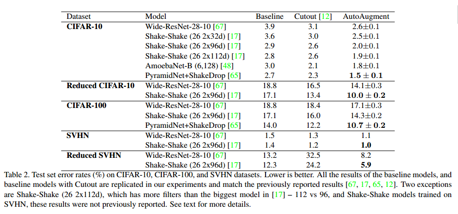

# AutoAugment: Learning Augmentation Strategies from Data

## Contact me

* Blog -> <https://cugtyt.github.io/blog/index>
* Email -> <cugtyt@qq.com>, <cugtyt@gmail.com>
* GitHub -> [Cugtyt@GitHub](https://github.com/Cugtyt)

> **本系列博客主页及相关见**[**此处**](https://cugtyt.github.io/blog/papers/index)

---

## Abstract

数据增强是提高图像分类器准确性的有效技术。但是当前的数据增强实现是手动设计的。在本文中，我们描述了AutoAugment来自动搜索改进数据增强。我们设计了一个搜索空间，其中一个策略由许多子策略组成，其中一个的子策略是为每个批量中的单个图像随机选择的。子策略由两个操作组成，每个操作是图像处理功能，例如平移，旋转或剪切，以及使用量。使用搜索算法来找到最佳策略，使得神经网络在目标数据集上产生最高的验证准确度。我们的方法达到了最好的技准确性。在ImageNet上获得了83.5％的top1准确度，比之前83.1％的记录好0.4％。在CIFAR-10上，我们实现了1.5％的错误率，比之前的记录好了0.6％。扩充策略可在数据集之间转换。在ImageNet上学到的策略也能在其他数据集上实现显著的提升。

## 1. Introduction

通常图像的数据增强是改变一些像素，水平翻转等。直觉上讲，数据增强教会了模型数据不变性。

本文中，我们希望能自动化高效数据增强的过程。在我们的实现中，每个策略表示几个可能的增强运算选项和顺序，每个运算是一个图像增强功能（例如翻转，旋转或色彩归一化），使用该功能的概率，和使用的量（magnitudes）。我们使用了搜索算法寻找最好的选择和顺序，使得网络可以有最好的验证准确率。在试验中使用了强化学习作为搜索策略，但是我们相信使用更高的搜索算法可以进一步提升。

在两种情况下AutoAugment可以获得很好的提升：1）AutoAugment直接应用于感兴趣的数据集，以找到最佳的扩充策略（AutoAugment-direct），2）学到的策略可以迁移到新的数据集（AutoAugment-transfer）。首先，对于直接应用，我们的方法在数据集上实现了最先进的准确性，例如CIFAR-10，减少的CIFAR-10，CIFAR-100，SVHN，减少的SVHN和ImageNet（没有附加数据）。【略】其次，如果直接应用代价很高，迁移增强政策可能是一个不错的选择。我们展示了在一个任务上找到的策略可以在不同的模型和数据集中很好地泛化。例如，ImageNet上的策略可以显著改善各种FGVC数据集。结果摘要见表1。

## 3. AutoAugment: Searching for best Augmentation policies Directly on the Dataset of Interest

我们把寻找最优增强策略定为离散搜索问题（图1）。我们的方法包括两个部分：一个搜索算法和一个搜索空间。简单来说，搜索算法（使用控制器RNN来实现）采样一个数据增强策略$S$，这个策略包括了处理的运算，使用的概率，使用量等信息。方法的关键是策略$S$用于训练固定结构的网络，验证准确率$R$返回更新控制器。由于$R$不可微分，控制器可以通过策略梯度方法更新。

**Search space details** 在搜索空间中，一个策略包括5个子策略，每个子策略包括两个有序的图像运算。另外，每个运算与两个超参数相关：1）运算使用的概率，2）使用量。

图2是搜索空间中包含5个子策略的样例。第一个子策略制定了ShearX,Invert的序列。ShearX的概率是0.9，使用量是7/10。然后应用Invert，概率是0.8。Invert操作不需要使用量。

实验中使用的运算来自PIL。我们还使用了两个增强方法：Cutout和SamplePairing。总共有的运算有：ShearX/Y,TranslateX/Y, Rotate, AutoContrast, Invert, Equalize, Solarize, Posterize, Contrast, Color, Brightness, Sharpness,
Cutout, Sample Pairing。【略】

**Search algorithm details** 我们使用的搜索算法是强化学习。算法有两部分：RNN控制器，训练算法是PPO。每一步控制器通过softmax进行决策，决策再输入下一步。总共有30个决策，可以预测5个子策略，每个包括两个操作，每个操作需要两个运算类型，概率和使用量。

**The training of controller RNN** 控制器是用奖励信号训练的，表示这个策略对模型泛化有多大提升。在试验中，我们设置了验证集来衡量泛化性。每个模型用5个子策略增强的数据训练。小批量中的每个样本，从5个子策略随机选取一个来增强图像。模型用验证集的准确率衡量，也作为奖励信号来训练控制器。

**Architecture of controller RNN and training hyperparameters** 【略】

最后，我们把最好的5个策略拼接为一个策略（25个子策略）。最后的25个子策略用于数据集训练。

## 4. Experiments and Results

【略】

## 5. Discussion

**AutoAugment vs. other automated data augmentation methods** 一种方法是GAN，生成器学习提出增强策略使得增强的图像可以骗过判别器。区别是，我们直接优化验证集的准确率。

【略】