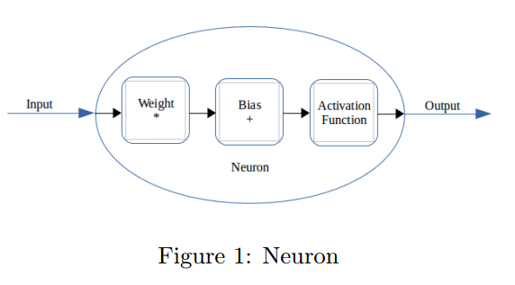
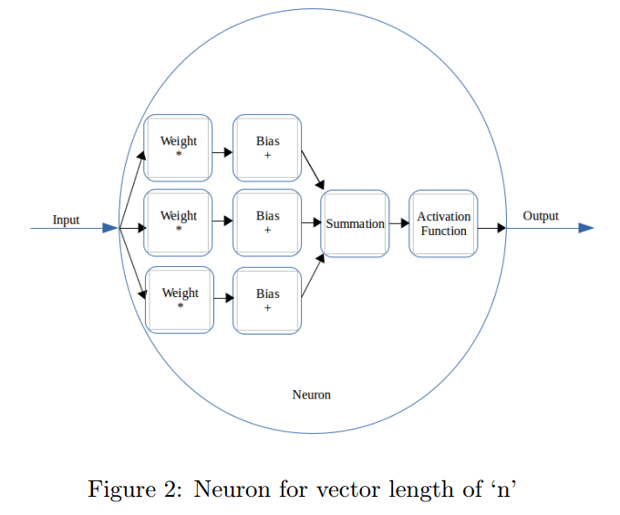
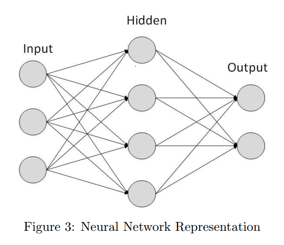
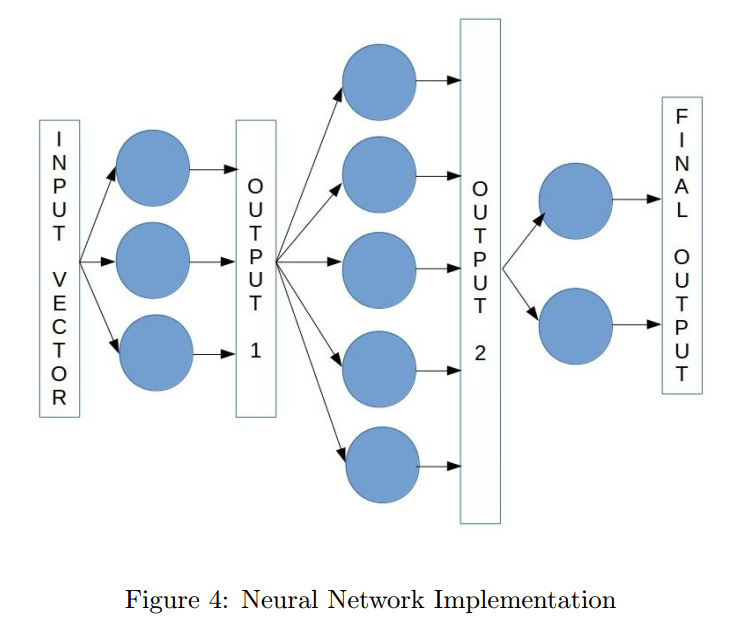
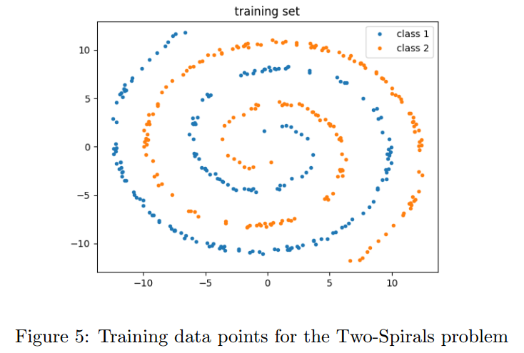
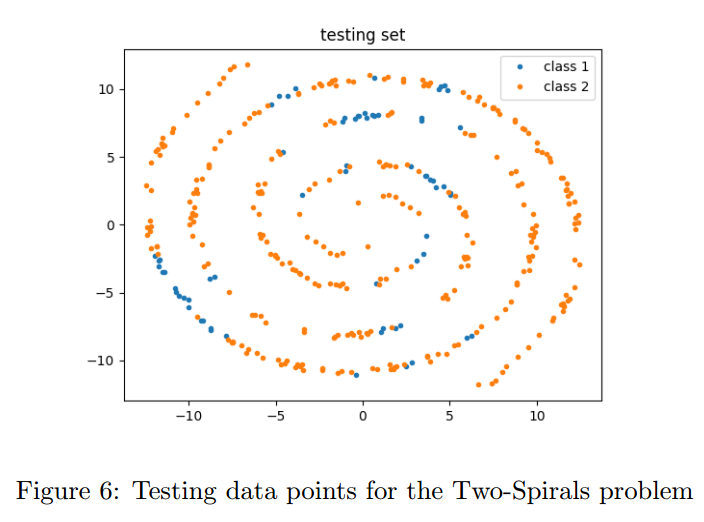
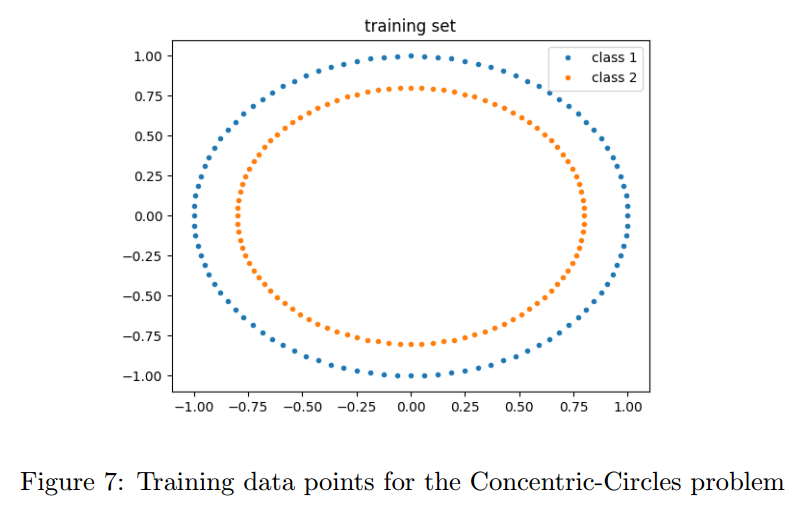
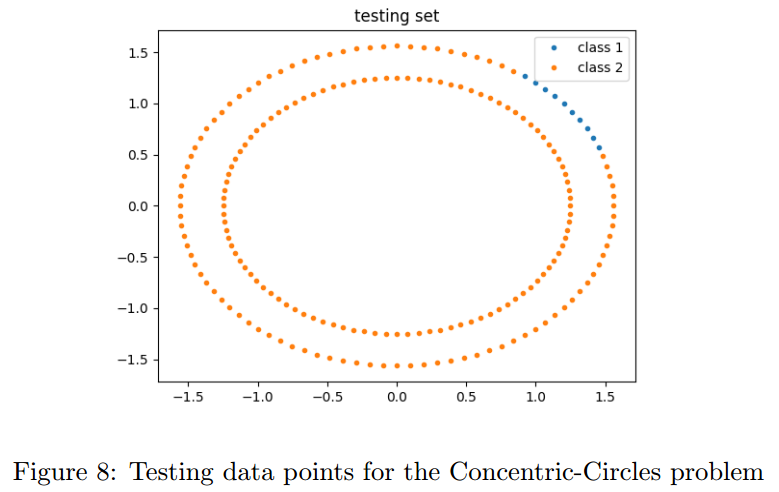
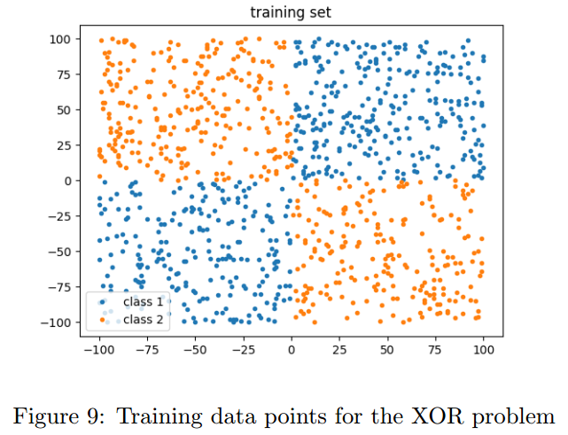
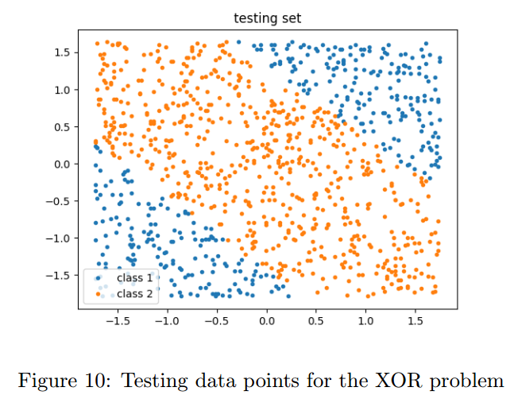

# A New Backpropagation Algorithm withoutGradient Descent

## Contact me

* Blog -> <https://cugtyt.github.io/blog/index>
* Email -> <cugtyt@qq.com>, <cugtyt@gmail.com>
* GitHub -> [Cugtyt@GitHub](https://github.com/Cugtyt)

> **本系列博客主页及相关见**[**此处**](https://cugtyt.github.io/blog/papers/index)

---

<head>
    
    
</head>

## Abstract

反向传播算法最初在20世纪70年代引入，是神经网络学习的主力。反向传播算法使用的是梯度下降方法，是一种一阶迭代优化算法。梯度下降为了找到函数的局部最小值，沿着反向梯度的方法进行寻找。在本文中，我们开发了一种不使用梯度下降算法的反向传播替代方法，使用Moore-Penrose伪逆寻找神经元的权重和偏置误差。

## 1 Introduction

梯度下降通过不断迭代逼近局部最小值。它基于一个观察，即如果多元函数$F(x)$在点$a$的邻域有定义且可微，那么$F(x)$在$a$点梯度反方向$-\Delta F(a)$就是下降最快的方向。那么如果$a_{n+1}=a_{n}-\gamma \Delta F\left(a_{n}\right)$，在$\gamma$足够小时，有$F\left(a_{n}\right)>=F\left(a_{n+1}\right)$。

即使这个方法通常工作得不错，但是有一些局限。第一，由于算法的迭代特性，收敛耗时。第二，在最小值附近下降很慢。第三，不适用于不可微函数。

Moore-Penrose伪逆，在数学上尤其是线性代数上，矩阵$\mathrm{A}$的伪逆$\mathrm{A}+$是逆矩阵的泛化。通常使用伪逆来计算非唯一解的线性等式的最优拟合（best fit）。另一个用途是多解等式的最小欧几里得norm解。

## 2 Modifications to the neuron structure

我们对神经元做了一个结构上的改变。我们假设每个输入有一个权重和偏置。和传统神经元的区别是传统的偏置是加在网络的输出上的。这个改变不会影响网络的结果和目标。证明如下：

对于大小为n的输入向量：

$$c_{1} w_{1}+b_{1}+c_{2} w_{2}+b_{2}+c_{3} w_{3}+b 3 \ldots c_{n} w_{n}+b_{n} \qquad (1)$$
$$=c_{1} w_{1}+c_{2} w_{2}+c_{3} w_{3} \dots c_{n} w_{n}+b \qquad (2)$$

其中：
$$b=b_{1}+b_{2}+b_{3} \ldots b_{n} \qquad (3)$$

因此，每个输入元素有各自的偏置不会对结果造成影响。

## 3 The New Backpropagation Algorithm
##＃　3.1 Calculating new weights and biases for a neuron

我们一次考虑一个神经元，此时有一个输入进入了神经元，即乘以权重加上偏置。这个值通过一个激活函数，激活后的输出就是神经元的输出。

令$C$为输入，原始的权重是$w$，偏置是$b$，$x$为$C$输入后的输出，$x_{n}$是我们要求的输出。基于这个要求，我们需要一个不同的权重和偏置，设为$w_{n}$和$b_{n}$。

原始的输出为：
$$C w+b=x \qquad (4)$$

但是我们希望的是：
$$C w_{n}+b_{n}=x_{n} \qquad (5)$$

令:
$$w_{n}=w-\Delta w \qquad (6)$$
$$b_{n}=b-\Delta b \qquad (7)$$
这里$\Delta w$是权重的误差，$\Delta b$是偏置的误差。

$$C w_{n}+b_{n}=x_{n} \qquad (8)$$
$$C(w-\Delta w)+(b-\Delta b)=x_{n} \qquad (9)$$
$$(C w+b)-(C \Delta w+\Delta b)=x_{n} \qquad (11)$$
$$x-x_{n}=(C \Delta w+\Delta b) \qquad (12)$$

因此：
$$C \Delta w+\Delta b=\left(x-x_{n}\right) \qquad (13)$$

现在：
$$\left[\begin{array}{ll}{C} & {1}\end{array}\right] \times\left[\begin{array}{c}{\Delta w} \\ {\Delta b}\end{array}\right]=\left[\begin{array}{l}{\left(x-x_{n}\right)}\end{array}\right] \qquad (14)$$
$$\left[\begin{array}{c}{\Delta w} \\ {\Delta b}\end{array}\right]=\left[\begin{array}{ll}{C} & {1}\end{array}\right]^{-1} \times\left[\left(x-x_{n}\right)\right] \qquad (15)$$

但是$\left[\begin{array}{ll}{C} & {1}\end{array}\right]$不是一个方阵。因此我们需要找它的Moore-Penrose伪逆：
$$\left[\begin{array}{c}{\Delta w} \\ {\Delta b}\end{array}\right]=\left[\begin{array}{ll}{C} & {1}\end{array}\right]^{+} \times\left[\left(x-x_{n}\right)\right. \qquad (16)$$

在得到$\Delta w$和$\Delta b$后，原始的权重和偏置到新权重和偏置：
$$w_{n}=w-(\Delta w * \alpha) \qquad (17)$$
$$b_{n}=b-(\Delta b * \alpha) \qquad (18)$$
这里$\alpha$ 是学习率。

### 3.2 Tackling multiple inputs

可以令输入$C$为$n^{t h}$维度向量。就可以扩展到多输入情况。此时有n个输入元素，有n个对应的权重和偏置，n个对应的输出。这些输出求和为一个输出，然后输入到激活函数。

在反向传播阶段，期望的输出分发到所有的权重-偏置对上，对于一个权重-偏置块$\left(w_{i}, b_{i}\right)$，期望的输出是总体期望输出的1$/ n$：
$$x_{n_{i}}=x_{n} / n \qquad (19)$$

权重和偏置开始时是随机初始化的。每个输入向量中元素对应的权重应该一样。每个权重-偏置块会有相同的输出，这样累积的输出才能给出我们想要的答案。

### 3.3 Activation Function for non-linearity

通常的方法是用一个非线性函数来做激活函数。在反向传播的时候，我们不能简单的传入希望的输出向量。如果这样做了，权重和偏置的修改会认为好像是没有激活函数一样，这样如果给定相同的输入，那输出也是不对的。因此必须给激活函数的逆函数传入需要的输出向量。我们需要保证选的激活函数让他们的域和范围一样，这样能规避掉数学错误和数据损失。在激活函数逆函数处理后的向量才是我们要传给网络的真实向量。

### 3.4 Network Architecture

可以转化为下面

对于最后一层而言，什么样的输入（前一层的输出）可以让这一层的输出是正确的？我们可以得到推导出这个输入向量。

如果：
$$C * w+b=x \qquad (20)$$
那么满足$C_{n} * w+b=x$的$C_{n}$为：
$$C_{n}=\left(x_{n}-b\right) / w \qquad (21)$$
这些式子可以扩展到前面的层。

另一个问题是，神经元够需要给定自己“要求”的输入向量，这样他们的输出才是正确的。比如多类别分类问题，每个输出向量要求为one-hot编码的向量。因此，我们把所有的向量取平均，这样会给每个神经元相等的权重。再把这些平均的向量传入前面的层作为期望的输出向量。

## 4 Differences with Extreme Learning Machines
【略】

## 5 Results
### 5.1 Telling-Two-Spirals-Apart Problem

Alexis P. Wieland 提出了一个基线任务：区分两个交织在一起的螺旋线。虽然这个任务很直观，但是对于网络来说还是很困难的，因为它极度非线性。

我们使用了包括每类193点的两个螺旋线。我们的网络为16-32-64-32-2，激活为softplus。我们训练了1000个周期，学习率0.0002。

准确率为63%，这是因为softplus的激活函数在这个问题上不好。推荐的激活函数是Tanh，但是由于逆函数的区间在（-1,1），不在$(-\infty,+\infty)$上，在不损失数据的情况下我们的反向传播不能使用。

### 5.2 Separating-Concentric-Circles Problem

另一个问题是同心环，【略】我们的网络是16-64-32-2，还是使用了softplus。【略】

准确率是61%，再一次是softplus的问题。。。

### 5.3 XOR Problem

【略】

## 6 Discussions and Conclusion

【略】没看出来这篇文章的意义