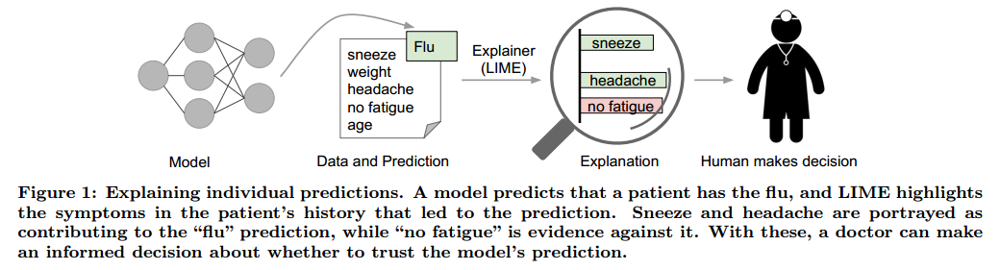
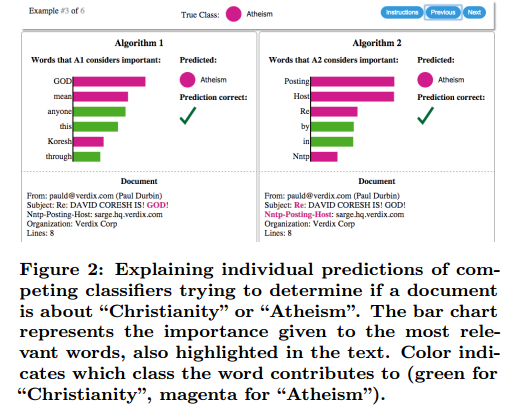

# “Why Should I Trust You?” Explaining the Predictions of Any Classifier

## Contact me

* Blog -> <https://cugtyt.github.io/blog/index>
* Email -> <cugtyt@qq.com>
* GitHub -> [Cugtyt@GitHub](https://github.com/Cugtyt)

> **本系列博客主页及相关见**[**此处**](https://cugtyt.github.io/blog/papers/index)

---

<head>
    
    
</head>

## ABSTRACT

我们提出了一个新的解释方法LIME，能可信的解释任何分类器的预测，做法是学习一个在预测结果附近的可解释模型。我们也提出了通过非冗余方式来表示单独预测结果来解释模型。我们在文本（如随机森林）和图像分类（如神经网络）等不同模型上证明了这些方法的灵活性。【略】

## 1. INTRODUCTION

使用机器学习算法有一个关键的考虑：如果用户不信任模型或它的预测，他们就不会使用它。有必要区分两种信任：（1）信任预测，即游湖是否足够信任一个预测，并基于此决策，（2）信任模型，即用户是否信任模型部署后行为合理。这都取决于人们对模型行为的理解，而不是单单把它看作是一个黑盒。

对预测的信任对于做决策是很重要的，如医疗诊断或恐怖检测，如果对预测盲目信任那结果可能是灾难的。

还有就是部署前对模型的评估。用户需要确信模型能对真实数据做出正确的行为。现在模型是通过验证集的准确率来衡量的，但是真实世界的数据是很不同的，衡量的指标也许与产品的目标不符。【略】

我们提出对预测提供解释作为“信任预测”的解决方案，并挑选多个这样的预测（和解释）作为“信任模型”的解决方案，我们的贡献在于：

* LIME，一个以可信的方法来解释任何分类器和回归器的算法，做法是用可解释的模型近似拟合预测。
* SP-LIME，挑选一系列带解释的代表性实例来解决“信任模型”的问题，做法是子模块优化。
* 大量的仿真和人工评估。在我们的试验中，非专家人员也可以是所有LIME挑选更好的分类器。【略】

## 2. THE CASE FOR EXPLANATIONS

我们说的“解释预测”表示通过文本的，视觉的东西来对模型输入部分和预测的关系进行定性理解。

如图1，如果模型有只能的解释，医生可以更好的进行决策。这种情况下，解释就是一个相关权重的列表。人有更好的先验知识，可以理解背后的逻辑来接收或拒绝预测。

每个机器学习应用也同样需要一个确定的可信衡量方法。开发和验证分类模型通常包括大量的标记数据，其中的一部分单独用于衡量。虽然很多时候很有用，但是验证数据也许并不能反应真正的数据情况。查看一些样本的情况也是一个检验模型是否可靠的方法，尤其是这些样本可解释的时候。我们提出了解释几个独立预测的表示作为一种全局的理解方式。

在几种情况下模型或其预测可能出错，例如数据泄露。一个例子是用户ID与目标类高度相关，这种情况下，只看一下预测和原始数据很难分辨，但是在图1有解释的情况下就容易很多。另一个是数据偏移，即训练数据和测试数据不同。这时候解释对于不可信模型转为可信模型就很重要了，例如移除泄露数据或改变训练数据避免数据偏移。

实践中通常会从一堆候选中选择一个模型，并评估他们之间的相对可信情况。图2展示了预测解释如何结合准确率用于挑选模型。这种情况下，高准确率的算法其实更差，可以很容易的通过提供的解释看出来。通常优化和需要最大化的指标是不匹配的。虽然我们不能衡量这些指标，但是我们有一定的知识知道模型的行为如何影响他们。因此，内容推荐中获取选择准确率相对低一点，但是不会影响用户的模型。

**Desired Characteristics for Explainers**

下面罗列一些来自解释方法中期望特性：

解释的核心标准之一是必须可解释，也就是能定性理解输入变量和响应的关系。我们注意到解释性必须将用户的限制考虑进来。因此一个线性模型，一个梯度向量等可能是也可能不是具有可解释性的。例如有成百上千的特征对于预测有很明显的贡献，那么就不能期待用户可以很好的理解为什么会有这样的预测结果。这也进一步预示着解释应该容易去理解，这不是针对模型利用的特征的，或者说解释中的输入变量和模型的输入变量或许是不相同的。最后，我们注意到，解释性的标记也取决于目标观众。或许我们可以解释小的贝叶斯网络，但是外行对于少数加权特征的解释更加容易理解。

另一个核心标准是局部保真。虽然通常模型不可能完全解释，但是有意义的解释至少是局部可信的，也就是它必须对实例附近的预测行为做到解释。我们注意到局部保真并不意味着全局保真：对于全局重要的特征不一定对于局部重要，反过来也是。虽然全局保真也意味着局部保真，但是对于复杂的模型确认全局保真是很困难的。

有一些模型本身就是可解释的，那么就可以把模型当做一个黑盒。除了解释预测，提供全局视角也是很重要的。正如之前提到的，准确率通常不适合于衡量模型，因此我们希望解释整个模型。

## 3. LOCAL INTERPRETABLE MODEL-AGNOSTIC EXPLANATIONS

我们提出了Local Interpretable Model-agnostic Explanations (LIME)。

### 3.1 Interpretable Data Representations

在我们表示可解释系统之前，很重要的事是区分特征和可解释的数据表示。可解释的表示需要对于人类可理解，这是不同于模型使用的特征的。例如，对于文本分类可能的可解释表示是单词是否出现的二元向量，虽然模型可能使用更复杂的特征，例如词嵌入等。类似的图像分类，可解释的表示或许是二元向量表示相似像素的出现与否，而模型可能把图像表示为向量。我们把$x \in \mathbb{R}^{d}$记作原始表示，把$x^{\prime} \in\{0,1\}^{d^{\prime}}$记作二元向量用于解释。

### 3.2 Fidelity-Interpretability Trade-off

我们定义对模型$g \in G$的解释，其中$G$是一个可解释模型，例如线性模型，决策树或其他，也就是说模型$g \in G$已经准备好展示给用户可视化的表示。$g$的域是$\{0,1\}^{d^{\prime}}$，也就是g表示可解释部分的存在与否。由于不是每个$g \in G$都是可解释的，因此我们令$\Omega(g)$做为复杂性衡量。例如对于决策树$\Omega(g)$可以是树的深度，对于线性模型$\Omega(g)$可能是非0权重。

令要解释的模型记作$f : \mathbb{R}^{d} \rightarrow \mathbb{R}$。在分类中，$f(x)$是x属于某个类的概率。我们进而使用$\pi_{x}(z)$为z到x的近似衡量，来定义x的局部域。最后，令$\mathcal{L}\left(f, g, \pi_{x}\right)$为g通过$\pi_{x}$在局部域近似f的不可信度。为了衡量可解释性和局部保真，我们必须最小化$\mathcal{L}\left(f, g, \pi_{x}\right)$，让$\Omega(g)$足够低。LIME产生的解释是：

$$\xi(x)=\underset{g \in G}{\operatorname{argmin}} \mathcal{L}\left(f, g, \pi_{x}\right)+\Omega(g) \qquad (1)$$

### 3.3 Sampling for Local Exploration

TODO