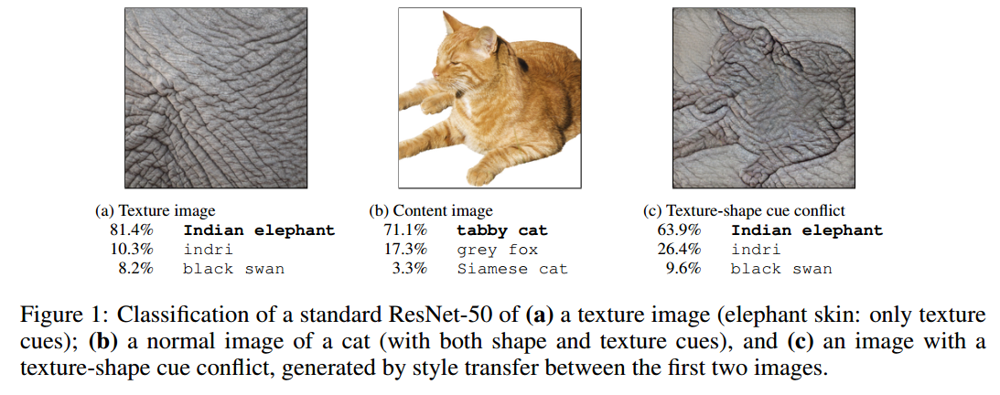
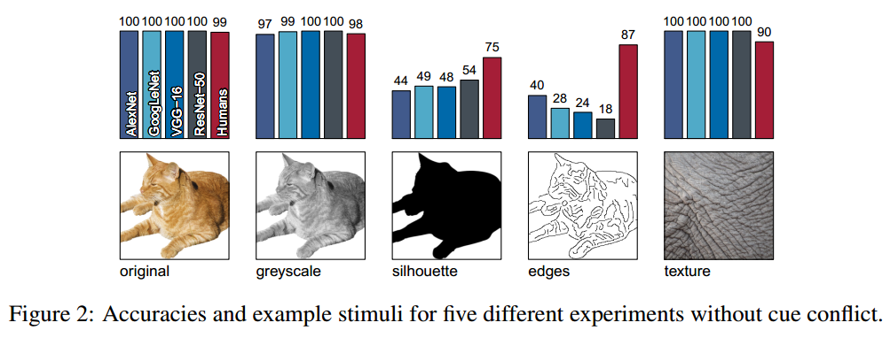
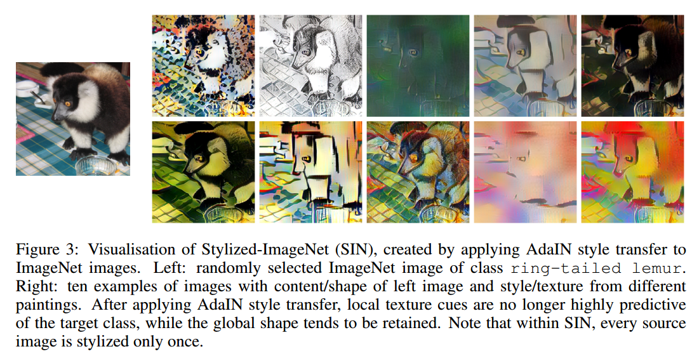
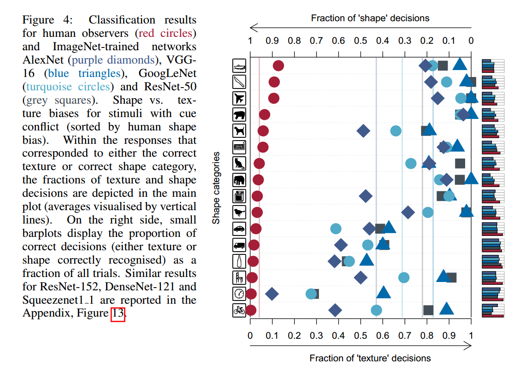
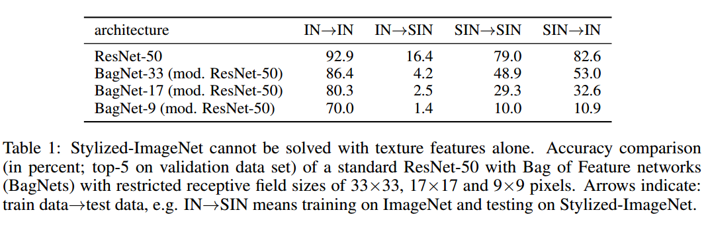
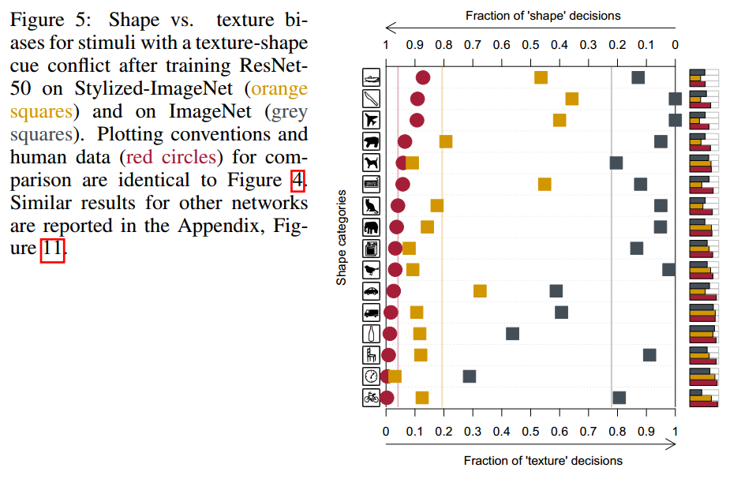
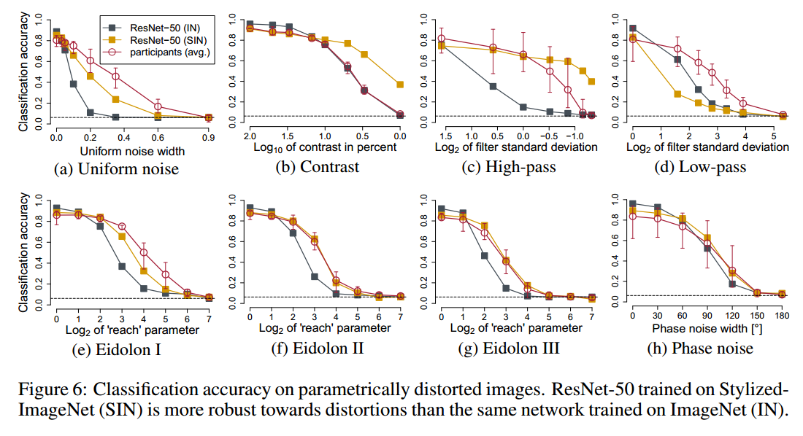

# IMAGENET-TRAINED CNNS ARE BIASED TOWARDS TEXTURE; INCREASING SHAPE BIAS IMPROVES ACCURACY AND ROBUSTNESS

## Contact me

* Blog -> <https://cugtyt.github.io/blog/index>
* Email -> <cugtyt@qq.com>
* GitHub -> [Cugtyt@GitHub](https://github.com/Cugtyt)

> **本系列博客主页及相关见**[**此处**](https://cugtyt.github.io/blog/papers/index)

---

<head>
    
    
</head>

## ABSTRACT

我们展示了在ImageNet上训练的CNN强烈的偏向于识别纹理而不是形状，这和人的行为是极为不同的。我们证明一些网络结构可以学会ImageNet上基于纹理的表示，也可以在Stylized-ImageNet上学会基于形状的表示。不仅更适合人类的行为，更惊讶的是提升了目标检测的精度，以及鲁棒性，更加体现了基于形状表示的优势。

## 1 INTRODUCTION

广为接受的直觉是CNN集合了低层次的特征（如边界），然后不断组成了复杂的形状（如车轮，车窗），直到目标可以被分类出来。我们把这种解释成为*形状假设*。也有很多的实验证明这个观点。

一些研究证明即使打破形状，CNN只靠纹理也可以达到不错的性能【略】。看起来局部纹理提供了足够的分类信息，只靠纹理就可以达到ImageNet的分类。因此我们考虑了第二个假设，称为*纹理假设*：目标识别而言，纹理比全局的形状更重要。

通过风格迁移，我们创造了新的图像，例如猫的形状但是大象的纹理，如图1c。我们的大量实验说明：大象纹理的猫对于CNN而言是大象，但是对于人而言还是猫。此外，还有两点贡献：改变这个偏向，以及改变偏向后的益处。我们展示了对纹理的偏向可以被克服，可以通过合适的训练数据改变为对形状的偏向。网络对于形状的偏向对于不同的扰动更加鲁棒，也能达到更高的性能。

## 2 METHODS

### 2.1 PSYCHOPHYSICAL EXPERIMENTS

【略】

### 2.2 DATA SETS (PSYCHOPHYSICS)

图2是我们的前5个实验，为简单的目标识别任务。

我们挑选的目标和纹理图像都是网络分类正确的。

【略】

### 2.3 STYLIZED-IMAGENET

我们构建了数据集Stylized-ImageNet（SIN）

## 3 RESULTS

### 3.1 TEXTURE VS SHAPE BIAS IN HUMANS AND IMAGENET-TRAINED CNNS

基本上所有的目标和纹理图像都能被CNN和人类分类正确（图2）。灰度图包括了形状和纹理，也识别的很好。当目标被填充成黑色后，CNN就很低与人类了。

我们设置了cue conflict实验，实验图像有自然图像的统计性，但是完全不同的纹理和形状，图4是结果。

### 3.2 OVERCOMING THE TEXTURE BIAS OF CNNS

ImageNet可以通过局部的信息达到很高的准确率。我们在SIN数据集上训练了ResNet-50。标准的ResNet50在SIN上达到79%的top5准确率（表1），相同的结构在ImageNet（IN）上达到92.5%的top5准确率。这表明SIN比IN更难。SIN上学到的特征在IN上泛化很好，反过来很差。

为了测试是否纹理特征仍然足够求解SIN，我们测试了BagNets。它有ResNet50的结构，但是最大的感受野限制在$9 \times 9,17 \times 17$ or $33 \times 33$像素。虽然它们在IN上达到了很高的准确率，但是在SIN上它们就不适用了（例如感受野$9 \times 9$的BagNet在IN上准确率70%，而SIN上10%）。这说明SIN的确移除了纹理，迫使网络需要学习较大范围的空间信息。

更重要的是，SIN上训练的ResNet50展示出更强的形状偏向（图5）。一些类别上甚至和人类一样强。

### 3.3 ROBUSTNESS AND ACCURACY OF SHAPE-BASED REPRESENTATIONS

增强形状偏向也改变了表示，那么影响了CNN的性能和鲁棒性了吗？我们设置了两个训练方案：

* 同时在SIN和IN上训练
* 同时在SIN和IN上训练，在IN上微调。称为Shape-ResNet。

如表2，Shape-ResNet超过了原始ResNet的准确率，说明SIN是有用的图像增强。

【略】

## 5 CONCLUSION

我们证明了机器识别强烈依赖于纹理，而不是全局的形状，以及形状偏向的表示更鲁棒的优势。【略】