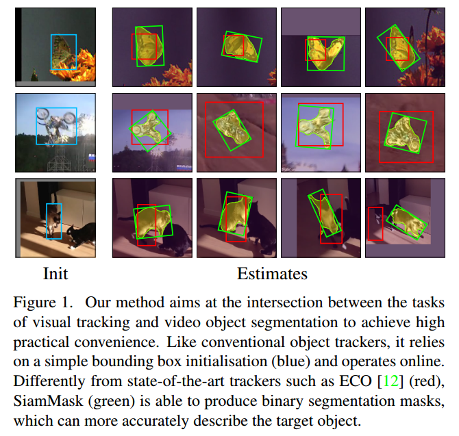
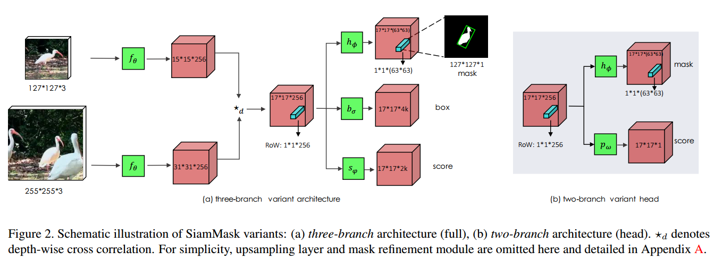
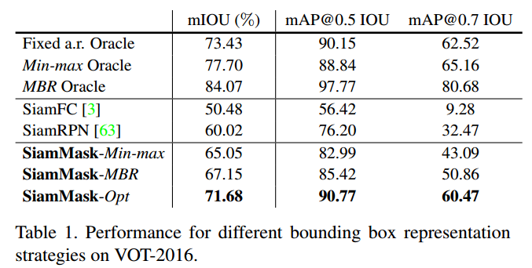
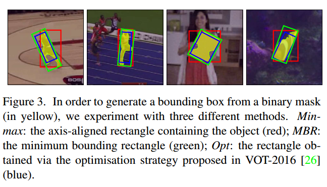
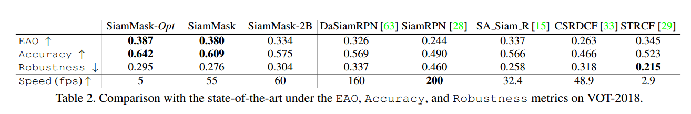
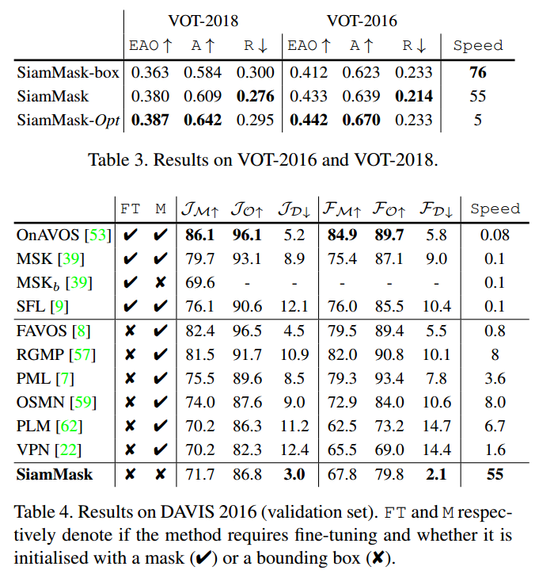
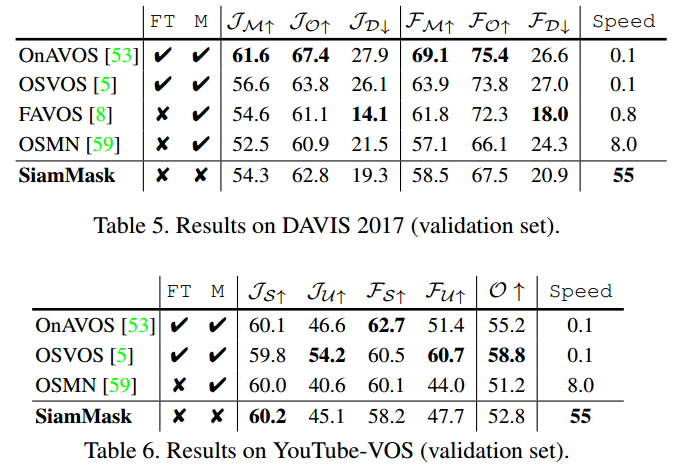
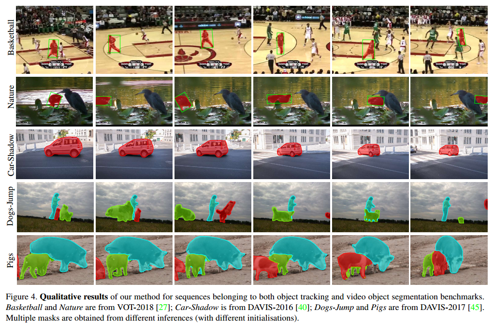
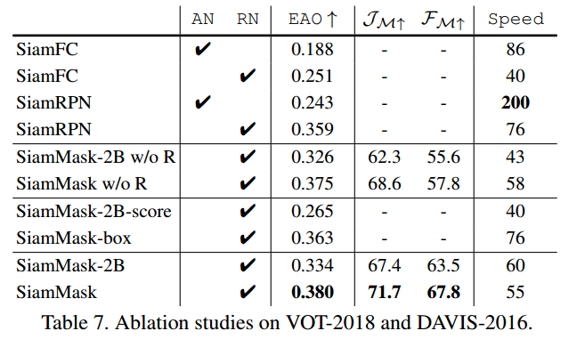
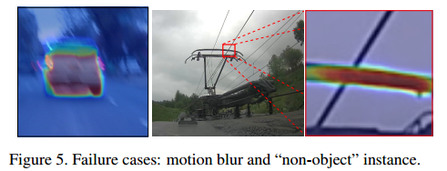

# Fast Online Object Tracking and Segmentation: A Unifying Approach

## Contact me

* Blog -> <https://cugtyt.github.io/blog/index>
* Email -> <cugtyt@qq.com>
* GitHub -> [Cugtyt@GitHub](https://github.com/Cugtyt)

> **本系列博客主页及相关见**[**此处**](https://cugtyt.github.io/blog/papers/index)

---

<head>
    
    
</head>

## ABSTRACT

展示了如何用单个方法实时做到同时目标跟踪和半监督视频目标分割。我们的方法SiamMask，通过二值分割任务增强损失提升了全卷积Siamense目标跟踪方法的训练过程。训练完成后，SiamMask只依赖于单个边界框初始值，可以做到旋转的边界框分割未知类别目标，达到每秒55帧。性能也有很大的优势【略】。

## 1. Introduction

本文希望通过SiamMask拉近任意目标跟踪和视频目标分割（VOS）的关系。SiamMask是一个简单的多任务方法，可以同时解决上述两个问题。我们希望保持离线的训练能力，以及在线的速度，同时对目标的表示进行快速调节。

为了达到这个目标，我们同时在三个任务上训练一个Siamese网络，每个对应于不同的目标对象和候选区域的策略。在Bertinetto的全卷积方法中，一个任务是学习目标对象和滑动窗口中多个候选的相似性度量。它的输出是密度响应图，表示目标的未知，但是不包含空间信息。为了提炼这个信息，我们同时训练另外两个任务：用Region Proposal Network训练边界框回归，未知类别二值分割。需要注意的是：二值标签只需要在离线训练时给出，在线分割和跟踪的时候不需要。每个任务用单独的分支表示，最终的损失对三个输出求和。

在训练后，SiamMask只依赖于单个初始边界框，不需要更新即可在线运算，最后生成目标分割的mask和旋转的边界框，达到每秒55帧。在VOT-2018上达到最好的效果。另外，相同的方法在半监督VOS上也很有竞争力。

## 3. Methodology

为了能在线运算，速度更快，我们采用了全卷积Siamese网络。我们实验了SiamFC和SiamRPN。

### 3.1. Fully-convolutional Siamese networks

**SiamFC** Bertinetto提出作为跟踪系统的基本块，离线训练的全卷积Siamese网络在（大的）搜索图像x中比较一个模板图像z，获得一个密集响应图。z和x分别是$w \times h$大小的中心剪切的目标对象，和更大的中心剪切的目标位置目标估计。两个输入通过相同的CNN$f_{\theta}$处理，返回两个交叉相关的特征图：

$$g_{\theta}(z, x)=f_{\theta}(z) \star f_{\theta}(x) \qquad (1)$$

我们把响应图（式1左）的每个空间元素看做候选窗的响应（ROW）。例如$g_{\theta}^{n}(z, x)$表示一个模板z和x第n个候选窗的相似性。对于SiamFC而言，目标是响应图最大值对应于在搜索区域x中的目标位置。为了让每个ROW编码更丰富的目标对象信息，我们把式1的交叉相关替换为深度方向的交叉相关，生成多通道响应图。SiamFC在几百万视频帧上用logistic损失（记作$\mathcal{L}_{s i m}$）离线训练。

**SiamRPN** Li等通过区域提议网络（RPN提上SiamFC的性能，可以用一个不同比例的边界框预测目标位置。在SiamRPN中，每个ROW表示k个archor box提议的集合，以及对应的目标/背景分数。两个输出的分支用平滑$L_{1}$和交叉熵训练。记作$\mathcal{L}_{b o x}$和$\mathcal{L}_{\text { score }}$。

### 3.2. SiamMask

不同于现在的依赖于低保真度目标表示的方法，我们认为生成先前帧的目标二值分割mask是很重要的。除了相似性分数和边界框坐标，ROW也包含了生成二值mask的信息。可以在现有的网络基础上增加新的分支和损失。

通过参数为$\phi$的两层神经网络$h_{\phi}$预测$w \times h$的二值mask。令$m_{n}$表示第n个ROW上预测的mask：

$$m_{n}=h_{\phi}\left(g_{\theta}^{n}(z, x)\right) \qquad (2)$$

从式2可以看出mask的预测是图像到分割x以及目标对象z的函数。这里z可以用于指导分割过程：给定一个不同的参考图像，网络会对x生成不同的分割mask。

**Loss function** 训练的时候，每个ROW由真实二值标签$y_{n} \in\{ \pm 1\}$标记，同时还有$w \times h$大小的像素级真实mask$c_{n}$。令$c_{n}^{i j} \in\{ \pm 1\}$表示第n个候选ROW像素$(i, j)$上的标签。损失$\mathcal{L}_{\text { mask }}$是二元logistic回归损失：

$$\mathcal{L}_{\operatorname{mask}}(\theta, \phi)=\sum_{n}\left(\frac{1+y_{n}}{2 w h} \sum_{i j} \log \left(1+e^{-c_{n}^{i j} m_{n}^{i j}}\right)\right) \qquad (3)$$

因此，$h_{\phi}$的分类层包括$w \times h$个分类器，每个表示给定像素是否候选窗中的对象。$\mathcal{L}_{\text { mask }}$只计算正的ROW（$y_{n}=1$）。

**Mask representation** 

$f_{\theta}(z)$和$f_{\theta}(x)$生成的深度方向交叉相关的（$17 \times 17$）ROW之一为mask的表示。分割任务的网络$h_{\phi}$由两个$1 \times 1$卷积层表示，一个256通道，一个$63^{2}$通道。这可以让每个像素分类器利用整个ROW包含的信息，也可以对x中的候选窗有完整的视角，这对于区分目标对象是很关键的。

**Two variants** 【略】

**Box generation** 【略】

### 3.3. Implementation details

【略】

## 4. Experiments

### 4.1. Evaluation for visual object tracking

### 4.2. Evaluation for semi-supervised VOS

### 4.3. Further analysis

## 5. Conclusion

我们提出了SiamMask方法，让全卷积Siamese跟踪器生成任意类别二值分割mask。我们把它成功运用到了目标跟踪和半监督视频目标分割中，速度快，性能高。