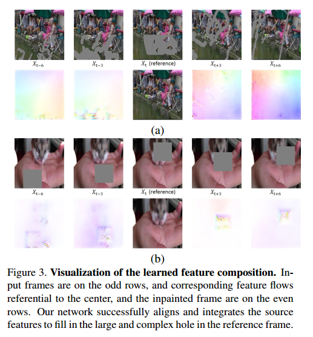

# Deep Video Inpainting

## Contact me

* Blog -> <https://cugtyt.github.io/blog/index>
* Email -> <cugtyt@qq.com>
* GitHub -> [Cugtyt@GitHub](https://github.com/Cugtyt)

> **本系列博客主页及相关见**[**此处**](https://cugtyt.github.io/blog/papers/index)

---

<head>
    
    
</head>

## ABSTRACT

视频修补任务希望能对一个视频的时空洞（时间-空间）进行填充。由于时间维度的存在，图像修补不能直接使用。我们提出了快速视频修补的网络框架。基于图像编码器-解码器的模型，我们的框架可以收集提炼邻近帧的信息，然后生成未知的区域。同时，输出要通过循环反馈和时间记忆模块保持时间上的一致性。我们的方法效果好，速度近乎实时。

## 1. Introduction

由于时间维的原因，虽然图像修补有很大进展，但是还不能直接用于视频修补。困难来自复杂的运动，以及时间一致性。最直接的方法是对每帧单独修补。但是这没有考虑到视频的动态性，忽略了视频中的运动，带来了时间不一致性。图1的第二行是直接使用图像修补的结果。

为了解决时间一致性的问题，有一些方法提出，但或是分离了色彩预估和流预估，或通用性较差。

我们希望能用两个函数来训练一个模型：1）时间特征收集，2）保留时间一致性。对于**时间特征收集**，我们把视频修补任务当做序列多对一修补问题。我们基于2D的编码-解码模型，提出了3D-2D的网络，用于收集和提取邻近帧的信息，合成时空视频内容。对于**时间一致性**，我们使用循环和记忆网络，利用流损失学习。最后提出了一个统一的CNN模型VINet。

我们的结果如图1最后一行所示，可以处理任意长度的视频帧，速度近乎实时。贡献在于：

* 把视频修补作为序列多对一的修补任务，提出了3D-2D编码-解码网络。高效的从邻近帧提取特征，合成缺失内容。
* 使用循环和记忆层保持时间一致性。两个损失：流损失和扭曲损失。
* 首次提出了统一的通用视频修补网络。大量的实验证明的性能。

## 3. Method
### 3.1. Problem Formulation

视频修补旨在填充视频帧`$X _ {1}^{T} :=\left \{X_ {1}, X _ {2}, \ldots, X _ {T}\right \}$任意缺失区域。重构的区域应该尽量和真实帧$Y_ {1}^{T} :=\left \{Y_ {1}, Y_ {2}, \ldots, Y _ {T}\right \}$一致，同时在时空上一致。我们把视频修补问题写作一个从$X _{1}^{T}$到输出$\hat{Y} _ {1}^{T} :=\left \{\hat{Y} _ {1}, \hat{Y} _ {2}, \ldots, \hat{Y} _ {T}\right \}$的映射函数，使得条件分布$p\left(\hat{Y} _ {1}^{T} \vert X _ {1}^{T}\right)$与$p\left(Y _ {1}^{T} \vert X _ {1}^{T}\right)$一致。通过吻合条件分布，网络可以学习生成真实的，时间一致的输出序列。为了简化问题，我们做了马尔科夫假设，把条件分布写为乘积形式，这样，原始的一帧一帧修补可以写作：

$$p\left(\hat{Y}_{1}^{T} | X_{1}^{T}\right)=\prod_{t=1}^{T} p\left(\hat{Y}_{t} | X_{t}\right) \qquad (1)$$

但是，为了获得更好的视觉效果，我们认为生成的第t帧$\hat{Y} _ {t}$应该和：1）时空邻近帧$X _ {t-N}^{t+N}$，2）生成的前一帧$\hat{Y} _ {t-1}$一致，3）编码过的历史记忆$M _ {t}$一致，因此，我们提出了条件概率：

$$p\left(\hat{Y}_{1}^{T} | X_{1}^{T}\right)=\prod_{t=1}^{T} p\left(\hat{Y}_{t} | X_{t-N}^{t+N}, \hat{Y}_{t-1}, M_{t}\right) \qquad (2)$$

实验中，我们设置N为2，利用两个前两个后帧来恢复当前帧。我们使用时间步长为3来采样帧，$X _ {t-N}^{t+N} :=\left \{X _ {t-6}, X _ {t-3}, X _ {t}, X _ {t+3}, X _ {t+6}\right \}$。通过自回归的函数D获得最终输出$\hat{Y} _ {1}^{T}$

### 3.2. Network Design

#### 3.2.1 Multi-to-Single Frame Video Inpainting

在视频中，由于目标移动或视角变化，遮挡或移除的部分会在前/后帧中出现。如果这样的提示在时间半径内，那么就可以用于恢复当前帧。因此我们的模型为编码-解码网络，来同时学习这种时间特征和单帧修复。网络是全卷积的，可以处理任意大小。

**Source and reference encoders.** 编码器是塔式网络，包括源和参考流。源流把带修补mask的前/后帧作为输入。参考流为当前帧和对应的修补mask。在通道维度上拼接了图片帧和mask然后输入编码器。我们使用了6塔编码：权重共享，5个源流$\left(X_{t-6}, X_{t-3}\right)$，$\left(X_{t+3}, X_{t+6}\right)$，$\left(\hat{Y}_{t-1}\right)$，和1个参考流。与参考特征不交叠的源特征可以根据特征刘学习和特征组合修补缺失区域。

**Feature flow learning.** 给定5个流源的特征图，根据时间维拼接，输入$5 \times 3 \times 3$（THW）的卷积层，生成1维时空集合特征图$F_{s^{\prime}}$。

$$F_{c_{1 / 8}}=\left(1-m_{1 / 8}\right) \odot F_{r_{1 / 8}}+m_{1 / 8} \odot F_{s_{1 / 8}^{\prime}} \qquad (3)$$

$$F_{c_{1 / 4}}=\left(1-m_{1 / 4}\right) \odot F_{r_{1 / 4}}+m_{1 / 4} \odot F_{s_{1 / 4}^{\prime}} \qquad (4)$$

$$F_{c_{1 / 2}}=\left(1-m_{1 / 2}\right) \odot F_{r_{1 / 2}}+m_{1 / 2} \odot F_{s_{1 / 2}^{\prime}} \qquad (5)$$

$$\hat{Y}_{t}=\left(1-m_{1}\right) \odot \hat{Y}_{t}^{\prime}+m_{1} \odot \hat{W}_{t \rightarrow t-1}\left(\hat{Y}_{t-1}\right) \qquad (6)$$

#### 3.2.2 Recurrence and Memory

### 3.3. Losses

$$\mathcal{L}=\lambda_{R} \mathcal{L}_{R}+\lambda_{F} \mathcal{L}_{F}+\lambda_{W} \mathcal{L}_{W} \qquad (7)$$

$$\mathcal{L}_{1}=\left\|\hat{Y}_{t}-Y_{t}\right\|_{1} \qquad (8)$$

$$\mathcal{L}_{s s i m}=\left(\frac{\left(2 \mu_{\hat{Y}_{t}} \mu_{Y_{t}}+c_{1}\right)\left(2 \sigma_{\hat{Y}_{t} Y_{t}}+c_{2}\right)}{\left(\mu_{Y_{t}}^{2}+\mu_{Y_{t}}^{2}+c_{1}\right)\left(\sigma_{Y_{t}}^{2}+\sigma_{Y_{t}}^{2}+c_{2}\right)}\right) \qquad (9)$$

$$\mathcal{L}_{R}=\mathcal{L}_{1}+\mathcal{L}_{s s i m} \qquad (10)$$

$$\sum_{t=2}^{T}\left(\left\|W_{t \rightarrow t-1}-\hat{W}_{t \Rightarrow t-1}\right\|_{1}+\left\|Y_{t}-\hat{W}_{t \rightarrow t-1}\left(Y_{t-1}\right)\right\|_{1}\right) \qquad (11)$$

$$\mathcal{L}_{s t}=\sum_{t=2}^{T} M_{t \rightarrow t-1}\left\|\hat{Y}_{t}-W_{t \rightarrow t-1}\left(Y_{t-1}\right)\right\|_{1} \qquad (12)$$

$$\mathcal{L}_{l t}=\sum_{t=2}^{T} M_{t \Rightarrow 1}\left\|\hat{Y}_{t}-W_{t \Rightarrow 1}\left(Y_{1}\right)\right\|_{1} \qquad (13)$$

$$\mathcal{L}_{W}=\mathcal{L}_{s t}+\mathcal{L}_{l t} \qquad (14)$$

### 3.4. Two-Stage Training

### 3.5. Inference

### 3.6. Implementation Details

## 4. Experiments

### 4.1. Visualization of Learned Feature Composition

### 4.2. Improvement on Temporal Consistency

### 4.3. Spatio-Temporal Video Quality

### 4.4. User Study on Video Object Removal

### 4.5. Application to Video Retargeting

### 4.6. Limitation

## 5. Conclusion

我们提出了视频修补框架。基于多对一的编码器-解码器网络，模型学习到集合和对齐邻近帧的特征图修复视频。使用循环反馈和时间记忆模块保证时间一致性。我们的方法性能高，速度快。