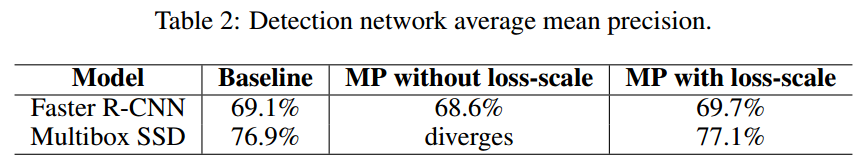

# MIXED PRECISION TRAINING

## Contact me

* Blog -> <https://cugtyt.github.io/blog/index>
* Email -> <cugtyt@qq.com>
* GitHub -> [Cugtyt@GitHub](https://github.com/Cugtyt)

> **本系列博客主页及相关见**[**此处**](https://cugtyt.github.io/blog/papers/index)

---

<head>
    
    
</head>

## ABSTRACT

增大网络通常会提升准确性，但是也增加了内存和计算量。我们的方法可以使用半精度浮点数训练网络，同时不损失准确性，也不需要修改超参数。这近乎减少了一般的内存，在最新的GPU上还能加速运算。权重，激活和梯度都使用IEEE半精度格式。由于这个格式范围比单精度小，我们提出了三种方法来避免重要信息的损失。首先，建议保留权重的单精度拷贝，每次优化器执行后累积梯度（前向和反向传播时，拷贝归整到单精度）。其次，我们提出了损失放大用于保留小的梯度值。第三，我们使用半精度累积到单精度输出，在存到内存前转为半精度。

## 1 INTRODUCTION

神经网络两个趋势：更大的数据和更大的模型。大的模型需要更多的计算和内存，可以通过降低精度来减小这些需求。性能（速度）包括了网络的训练和推理，受三个因素先知：算术带宽，内存带宽，或者延迟。减低精度解决了其中的两个限制。内存带宽的压力可以通过更少的比特位来降低。算术时间可以通过更大的低精度吞吐量来降低。例如，在最近的GPU上半精度的吞吐量是单精度的2到8倍。除了速度提升，降低精度也减少了训练的内存。

现代的深度学习系统是使用单精度（FP32）格式。我们使用更低的精度来训练，同时保持准确率，用IEEE半精度格式FP16来训练网络。由于FP16比FP32动态范围小，我们引入了3个技术来保持准确率：保留权重的FP32主拷贝，梯度变为0时损失放大，用FP16计算累积到FP32。我们证明了这些方法可以让大部分网络匹敌FP32的准确率。而且这些方法不需要修改模型或调整超参数。

## 2 RELATED WORK

【略】

## 3 IMPLEMENTATION

single-precision master weights and updates, loss-scaling, and accumulating FP16 products into FP32。

### 3.1 FP32 MASTER COPY OF WEIGHTS

在混合精度训练中，权重，激活和梯度用FP16存储。为了匹敌FP32的准确率，需要保留FP32的权重主拷贝，在优化的时候随梯度更新。每次迭代时，权重的FP16拷贝用于前向和反向传播，减少了FP32训练的存储和带宽。图1是混合精度的训练过程。

并不是所有步骤都需要FP32主权重，两个可能原因。一个解释是更新（权重梯度乘以学习率）太小，FP16无法表示，任何梯度小于$2^{-24}$在FP16中都是0。图2b中可以看到5%左右的权重梯度指数小于-24。

另一个解释是，权重的值小相比于更新的值很大。这样，即使权重的更新可以用FP16表示，在右移对齐二进制点的时候会变成0.当权重值量至少大于权重更新的2048倍时就会发生。由于FP16有10 bits的小数，可能在右移11或更多位置的时候变成0。这个影响可以通过计算FP32更新来解决。

为了展示FP32的必要性，我们使用了普通话语言模型进行了实验，如图2a，更新FP16权重导致了80%的准确率损失。即使保留额外的权重拷贝增加了内存，但是对于整体的内存占用还是很小的。训练内存的消耗主要是激活，这是因为每一层的批量或激活会保存下来用于重复使用。激活也使用半精度存储，整体的内存基本减半。

### 3.2 LOSS SCALING

FP16的指数偏置（exponent bias） 把标准化值的指数中心化为$[-14,15]$，而梯度值主要由很小的值（负指数）决定。例如图3为激活梯度直方图，来自SSD检测网络。注意到大部分FP16的表示范围并未使用，大量小于表示范围的值变为0。放大梯度可以让他们移到更好的表示区间内，不至于让值变为0。如果不放大网络很容易发散，放大因子设为8足够达到FP32的精度。这表明低于$2^{-27}$的值就与训练无关了，但是$\left[2^{-27}, 2^{-24}\right)$之间的值值得保留。

一个有效的把梯度值移动到FP16表示范围内的方法是在前向传播计算损失的时候放大损失值。通过链式法则反向传播保证了所有的梯度值可以放大的相同的范围。并不需要反向传播额外的运算，也不会让有用的梯度值变成0。权重梯度在更新的时候必须缩小回来，这样才能保证正确的FP32训练精度。

有几种方法来选择损失放大因子。最简单的是挑选一个常量。我们在8到32k的范围内训练大量的网络，可以通过经验选取一个值，或直接选择一个因子让最大值低于65504（FP16的最大值）即可。【略】

### 3.3 ARITHMETIC PRECISION

网络的运算有三类：向量点乘，reduction，和逐点操作。不同的类别有不同的方式处理。为了保持模型的准确率，我们发现一些网络需要把FP16点乘部分乘积累积到FP32精度，在写入内存的时候转成FP16。如果没有这个步骤，一些FP16模型无法达到相似的准确率。

大的reduction操作（向量元素相加）可以用FP32执行。这样的操作大多来自于BN层和softmax层。我们实现的这些层都是从内存中读写FP16张量，执行FP32运算。这些操作并没有降低训练速度，因为他们是受限于内存带宽的，对运算速度不敏感。

逐点操作，例如非线性或逐点矩阵成绩，是受限于内存带宽的。运算精度不影响速度，因此使用FP16和FP32都可以。

## 4 RESULTS

*  **Baseline (FP32)** 所有的运算FP32
*  **Mixed Precision (MP)** FP16用于运算和存储。权重，激活和梯度使用FP16存储，权重的FP32主拷贝用于更新。某些应用中使用损失放大。对于卷积，全连接和循环层的矩阵相乘通过FP16运算累积到FP32精度。

【略】

### 4.1 CNNS FOR ILSVRC CLASSIFICATION

### 4.2 DETECTION CNNS

### 4.3 SPEECH RECOGNITION

### 4.4 MACHINE TRANSLATION

### 4.5 LANGUAGE MODELING

### 4.6 DCGAN RESULTS

## 5 CONCLUSIONS AND FUTURE WORK

混合精度训练是减少内存占用的重要方法，还有运算时间和运算量。我们证明了很多不同的深度模型都可以用这个方法训练，没有准确率损失，也不需要修改超参数。对于有大量小梯度值的模型，我们引入梯度放大方法让它们可以收敛到与FP32同样的准确率。

【略】