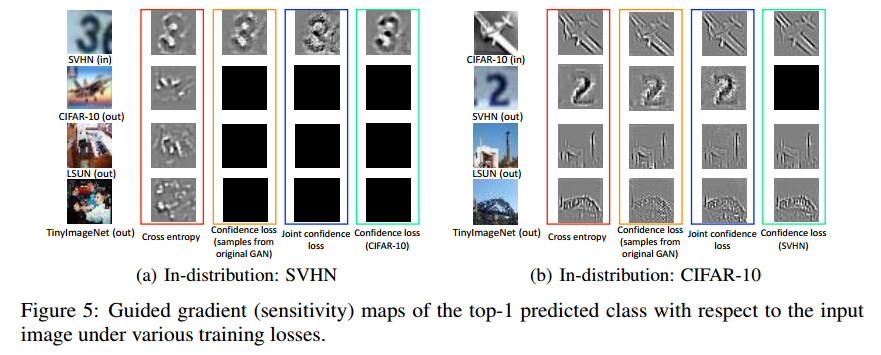

# TRAINING CONFIDENCE-CALIBRATED CLASSIFIERS FOR DETECTING OUT-OF-DISTRIBUTION SAMPLES

## Contact me

* Blog -> <https://cugtyt.github.io/blog/index>
* Email -> <cugtyt@qq.com>
* GitHub -> [Cugtyt@GitHub](https://github.com/Cugtyt)

> **本系列博客主页及相关见**[**此处**](https://cugtyt.github.io/blog/papers/index)

---

<head>
    
    
</head>

## ABSTRACT

检测一个测试样本来自内分布（分类器的训练分布， in-distributions）还是外分布（out-of-distributions）与其他机器学习应用有很大的不同。现在的顶尖网络都是对预测过于自信，也就是说无法分清内分布和外分布。我们在原始损失上加了额外两项，第一个强迫分类器对外分布样本降低置信度，第二个是为第一项生成更有效的训练样本。我们的方法同时训练分类网络和外分布的生成网络，并且在几个图像数据集上证明了它的有效性。

## 1 INTRODUCTION

神经网络虽然达到很高的准确率，但是通常对预测过于自信。例如，在MNIST上训练的DNN即使在随机噪声上也能达到91%的置信度。

过于自信的问题与检测外分布（区分测试样本是来自于外分布还是内分布）高度相关。可以形式化为一个二分类问题。令输入$\mathbf{x} \in \mathcal{X}$和标签$y \in \mathcal{Y}=\{1, \ldots, K\}$为随机变量，服从联合分布 $P_{\text { in }}(\mathbf{x}, y)=P_{\text { in }}(y \vert \mathbf{x}) P_{\text { in }}(\mathbf{x})$ 。我们假设分类器 $P_{\theta}(y \vert \mathbf{x})$ 在来自 $P_{\mathrm{in}}(\mathrm{x}, y)$ 分布的数据上训练，其中$\theta$是模型参数。令 $P_{\text { out }}(\mathbf{x})$ 表示外分布，即与内分布 $P_{\text { in }}(\mathbf{x})$ 距离较远。我们的问题是区分输入$\mathbf{X}$来自于 $P_{\text { in }}$ 还是 $P_{\text { out }}$ 。换句话说，我们希望构建一个检测器$g(\mathbf{x}) : \mathcal{X} \rightarrow\{0,1\}$，对内分布标记为1，外分布标记为0。

已经有一些方法通过简单的阈值来达到检测目的。对于每个输入$\mathbf{X}$，基于预训练的分类器衡量置信度$q(\mathbf{x})$，然后和阈值$\delta>0$进行比较。如果高于阈值，标记为1，否则标记为0。有工作把预测分布的最大值定义为置信度，后有工作通过临时缩放和数据扰动进一步提升了性能。虽然这些方法简单，但是性能高度取决于预训练的分类器。也就是如果分类器无法很好区分$P_{\text { in }}$和$P_{\text { out }}$，那么他们就失效了。还有一些方法比较复杂。【略】

**贡献** 提出了一个检测外分布的方法，同时不降低原始的分类准确率。首先，我们考虑一个新的损失函数，称为置信损失。它的目的是减低外分布的预测分布与均匀分布的KL散度，进而降低在外分布上的置信度。这样，内分布和外分布就分隔的更好。但是用于优化置信损失的训练样本较难采样：外分布的先验知识不可获得，或者它的潜在分布太大难以覆盖。我们考虑了GAN来生成更高效的样本。与原始GAN不同的是，我们的GAN在$P_{\mathrm{in}}$的低密度区域生成边界样本。最后，我们设计了联合训练方法同时减小分类器和GAN的损失。需要强调的是，GAN不需要生成显式的样本，只需要辅助分类器即可。

在多个数据集和网络上进行了实验，有很好的性能。【略】

## 2 TRAINING CONFIDENT NEURAL CLASSIFIERS

### 2.1 CONFIDENT CLASSIFIER FOR OUT-OF-DISTRIBUTION

不失一般性的，假设训练使用交叉熵损失。然后我们提出了如下的置信损失：

$$\min _{\theta} \mathbb{E}_{P_{\text { in }}}(\widehat{\mathbf{x}}, \widehat{y})\left[-\log P_{\theta}(y=\widehat{y} | \widehat{\mathbf{x}})\right]+\beta \mathbb{E}_{P_{\text { out }}}(\mathbf{x})\left[K L\left(\mathcal{U}(y) \| P_{\theta}(y | \mathbf{x})\right)\right] \qquad (1)$$

其中KL表示KL散度，$\mathcal{U}(y)$表示均匀分布，$\beta>0$是惩罚参数。容易看到，该损失迫使外分布样本预测分布接近均匀分布。换句话说，这个损失让内分布的最大预测值更大，外分布更小。我们发现由于网络强大的表示能力，加上这个KL项并没有降低分类器的准确率。

理想上，可以采样所有的外分布样本来最小化KL项，或者利用先验知识来高效采样。但是这通常不可行，我们建议对接近内分布的外分布采样，这样可以高效的提升检测性能。

我们考虑一个二分类任务，每个类的数据来自高斯分布，整个空间为$[-50,50]^{2}$的2D区域。用简单的全连接来实现置信损失。首先如图1a，外分布外100个绿色数据点。图1b是在该数据上优化置信损失的决策边界。可以看到分类器依然在接近内分布的区域有过自信的情况。另外，如果我们在$[-20,20]^{2}$构建外分布（图1c），图1d是它的决策边界。虽然可以通过增多图1a的样本达到图1d的效果，但是空间大的情况下很低效。

### 2.2 ADVERSARIAL GENERATOR FOR OUT-OF-DISTRIBUTION

GAN包括判别器$D$和生成器$G$。生成器将来自$P_{\mathrm{pri}}(\mathbf{z})$的变量$\mathbf{z}$生成$G(\mathbf{z})$，判别器$D : \mathcal{X} \rightarrow[0,1]$表示样本$\mathbf{x}$来自目标分布的概率。假设我们希望复原内分布$P_{\text { in }}(x)$，那么可以优化如下目标：

$$\min _{G} \max _{D} \mathbb{E}_{P_{\text { in }}(\mathbf{x})}[\log D(\mathbf{x})]+\mathbb{E}_{P_{\text { pra }}(\mathbf{z})}[\log (1-D(G(\mathbf{z})))] \qquad (2)$$

但是我们希望生成器复原外分布$P_{\text { out }}$，因此使用如下损失：

$$\begin{aligned} \min _{G} \max _{D} & \beta \underbrace{\mathbb{E}_{P_{G}(\mathbf{x})}\left[K L\left(\mathcal{U}(y) \| P_{\theta}(y | \mathbf{x})\right)\right]}_{(a)} \\ &+\underbrace{\mathbb{E}_{P_{\text { in }}(\mathbf{x})}[\log D(\mathbf{x})]+\mathbb{E}_{P_{G}(\mathbf{x})}[\log (1-D(\mathbf{x}))]}_{(b)} \end{aligned} \qquad (2)$$

第一项(a)表示生成分布的KL损失，第二项是让外分布接近内分布。【略】

### 2.3 JOINT TRAINING METHOD OF CONFIDENT CLASSIFIER AND ADVERSARIAL GENERATOR

两个模型可以用于互相提升。因此可以合起来训练：

$$\min _{G} \max _{D} \min _{D} \underbrace{\mathbb{E}_{P_{\text { in }}(\widehat{\mathbf{x}}, \widehat{y})}\left[-\log P_{\theta}(y=\widehat{y} | \widehat{\mathbf{x}})\right]}_{(\mathrm{c})}+\beta \underbrace{\mathbb{E}_{P_{G}(\mathbf{x})}\left[K L\left(\mathcal{U}(y) \| P_{\theta}(y | \mathbf{x})\right)\right]}_{\text { (d) }} \\\underbrace{+\mathbb{E}_{P_{\text { in }}(\widehat{\mathbf{x}})}[\log D(\widehat{\mathbf{x}})]+\mathbb{E}_{P_{G}(\mathbf{x})}[\log (1-D(\mathbf{x}))]}_{(\mathrm{e})} \qquad (4)$$

训练算法为：

## 3 EXPERIMENTAL RESULTS

【略】

## 4 CONCLUSION

我们提出了一个训练方法，可以检测外分布，同时不损失原始的分类准确率。我们同时训练了两个模型用于检测和生成外分布。【略】