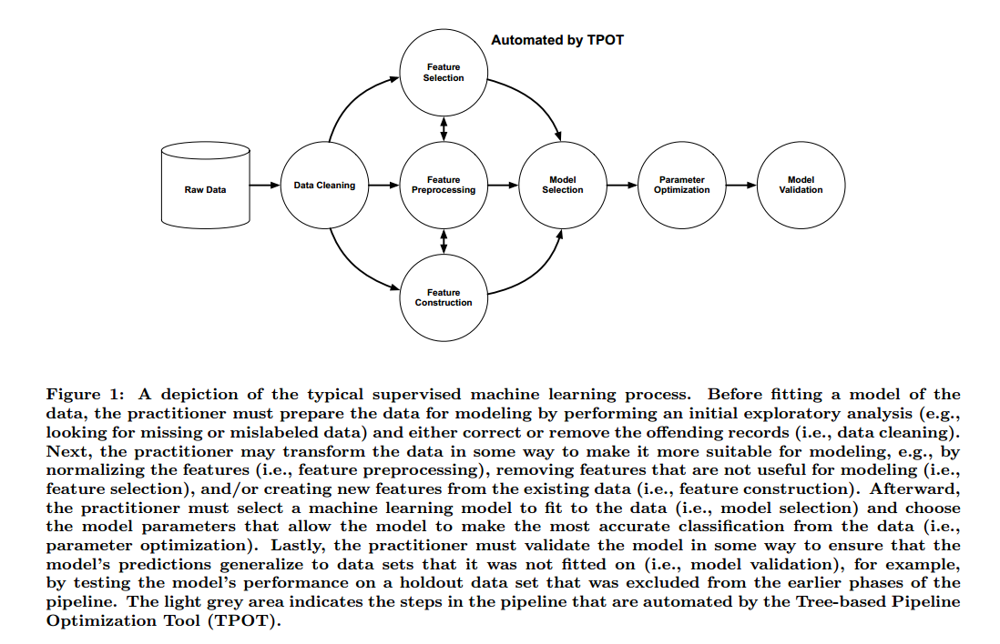
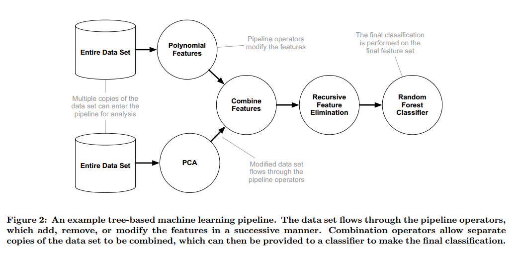
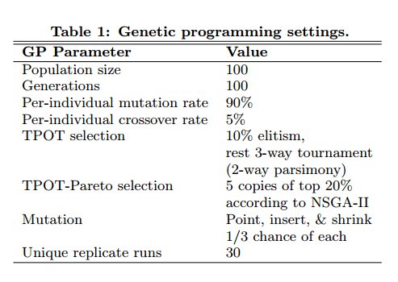
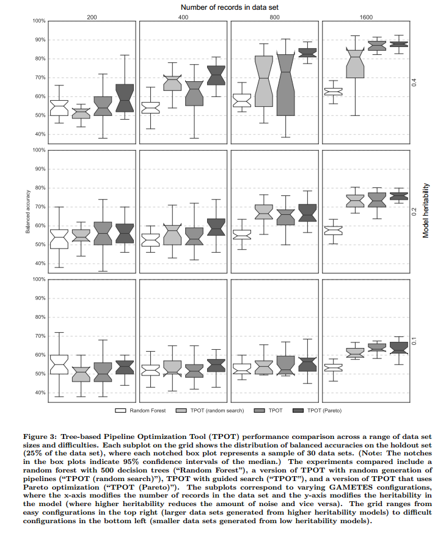
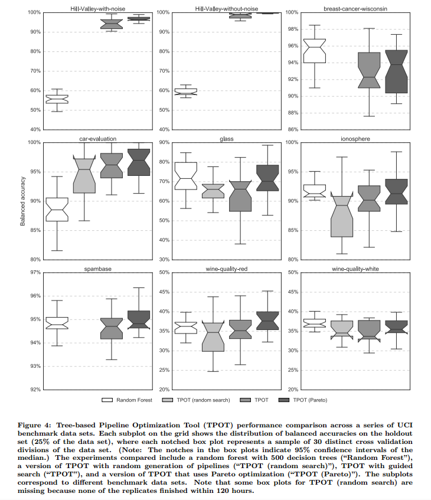
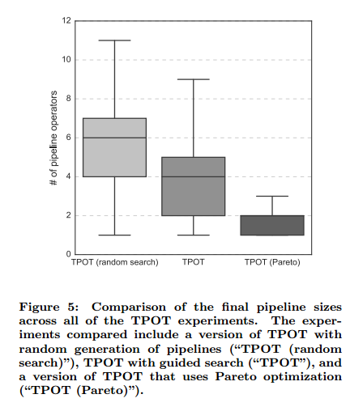

# Evaluation of a Tree-based Pipeline Optimization Tool for Automating Data Science

## Contact me

* Blog -> <https://cugtyt.github.io/blog/index>
* Email -> <cugtyt@qq.com>
* GitHub -> [Cugtyt@GitHub](https://github.com/Cugtyt)

> **本系列博客主页及相关见**[**此处**](https://cugtyt.github.io/blog/papers/index)

---

<head>
    
    
</head>

## ABSTRACT

让机器学习去专家化有很大的需求。我们提出了基于树的管道优化（tree-based pipeline optimization）方法，可以自动化最枯燥的管道设计工作。我们实现了开源的Tree-based
Pipeline Optimization Tool (TPOT)，并在真实的数据集上证明了它的效果。尤其是，我们展示了TPOT设计的机器学习管道可以获得巨大的提升，同时又不需要用户的输入和先验信息。我们通过Pareto优化解决了TPOT使用过于复杂管道的倾向，同时准确率也能保持。

## 1. INTRODUCTION

现在的机器学习工具需要很多的先验知识，也需要消耗大量的时间和计算量。【略】例如同城数据科学家会以图1的方法来解决机器学习问题。每一步都有大量的选择：如何预处理数据，使用什么模型，参数是什么。有经验的数据科学家有一定的直觉，可以从比较好的起点开始，但是缺乏经验会在花费大量的时间。

遗传算法可以自动化机器学习管道的设计吗？我们提出的TPOT使用了遗传算法自动设计和优化一系列数据转化运算和机器学习模型，尝试最大化分类准确率。我们也提出了TPOT-Pareto，它结合了Pareto，可以控制管道的复杂度。

## 3. METHODS

### 3.1 Pipeline Operators

我们列出了TPOT的4个主要运算。所有的管道运算都利用了scikit-learn现有的实现。

**Preprocessors** StandardScaler，RobustScaler， PolynomialFeatures

**Decomposition** RandomizedPCA，SVD

**Feature Selection** RFE， SelectKBest， SelectPercentile， VarianceThreshold

**Models** DecisionTreeClassifier, RandomForestClassifier, GradientBoostingClassifier，SVM， LogisticRegression， KNeighborsClassifier

### 3.2 Assembling Tree-based Pipelines

为了把这些结合成一个灵活的管道结构，我们如图2以树的形式实现了管道。每个基于树的管道开始于一个或多个输入数据的拷贝，把他们作为树的节点，然后输入4类管道运算之一。在多个数据拷贝处理之后，可以把他们结合成一个数据集。

每次一个数据集传入模型运算后，分类结果被存下来，最近的分类器就会覆盖以前的预测，先前的预测作为新特征存储下来。一旦数据被整个管道处理后（例如图2中数据通过随机森林），最后的预测用于衡量整个管道的分类性能。所有的情况下，我们把数据分层划分为75%的训练集和测试集，整个管道只使用训练集训练，使用测试集测试。基于树的管道结构可以使用任意的管道表示，例如管道可以在单个数据上线性执行一系列运算，或者在多个数据拷贝上运算，最后分类的时候再结合起来。

### 3.3 Evolving Tree-based Pipelines

为了自动化生成和优化这些管道，我们使用了演化计算方法，称为遗传编程（GP）。传统的GP构建数学函数树来优化给定的指标。在TPOT中，我们使用GP来调整参数和运算，最大化分类准确率。过程如表1。

本文中，TPOT的优化目标是测试集的分类准确率。我们也提出了TPOT的扩展，TPOT-Pareto，使用Pareto优化来优化两个目标：最大化最后的分类准确率，同时最小化管道的复杂度。

### 3.4 GAMETES Simulated Data Sets

【略】

### 3.5 UCI Benchmark Data Sets

【略】

## 4. RESULTS

## 5. DISCUSSION

【略】

## 6. CONCLUSIONS

基于树的管道优化是一个新的技术，可以极大地：1）让非专家人员可以更好的利用机器学习工具，2）自动化机器学习中枯燥的部分，节省大量时间。我们证明了TPOT在没有先验知识的情况下可以达到一定的性能。另外很多情况下，TPOT可以自动化发掘预处理和建模的结合，极大地超过基本数据分析的性能。通过结合Pareto优化，我们证明了TPOT可以设计出紧凑，易于解析的管道，同时准确率得以保持。