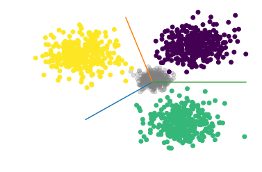

# Negative Awared Training: Be Neutral on Negative Samples

## Contact me

* Blog -> <https://cugtyt.github.io/blog/index>
* Email -> <cugtyt@qq.com>, <cugtyt@gmail.com>
* GitHub -> [Cugtyt@GitHub](https://github.com/Cugtyt)

> **本系列博客主页及相关见**[**此处**](https://cugtyt.github.io/blog/papers/index)

---

<head>
    
    
</head>

## Abstract

Neural network is commonly used for supervised classification task, but when predicting on negative samples, classes of which are not included in training sets, the network often fails and predicts random labels with high confidence. We address this problem by proposing an approach called Negative Awared Training, which introduces negative samples during training, cost function on original data stays unchanged for classification task while cost function on negative samples like KL divergence is used which enforce network to produce equal probability for each label. The network trained by our approach is more robust and neutral to negative samples, experiments on CIFAR 10 show much better performance than original based on our proposed negative confidence rate metric, and the accuracy on original data sets still holds, and this knowledge can be transfer to another network by attention transfer approach even that network trained only on original data sets.

## Introduction

Dramatic performance of neural network has been seen in recent years and become a dominant method on many tasks. On classification task, neural network reachs high accuracy but still has some drawbacks. Negative samples, labels of which are not included in the training set, training sets are refered as positive samples, are commonly predicted with random labels with high probability confidence, as shown in figure below (ref), that happens often as the training set can not conclude all the classes in real world, and that confuses the network as a consequence.

Negative samples are used more frequently on Generative adversarial nets (GANs) (ref Goodfellow), which training a discriminator aims to tell apart real (postive samples) from fake (negative samples) input data, and a generator is optimized to generate real data. Some proposed GAN models make use of label information, discriminator in CatGAN(ref) not only predict real or fake but minimize the entropy of labeled data and maximize the entropy of fake data, AC-GAN (ref) uses an auxiliary classifier for real classes, and AM-GAN (ref) uses the label information further with class aware gradient and cross-entropy decomposition.

For supervisied classification task, we argure that negative sample can also be used to address the problem we state above. Viewing and training negative samples as a new label is one simple approach, GANs like AM-GAN (ref) train discriminator by this way, but it involves new problems for supervisied learning, the network suffers greatly from unbalanced data sets since the number of negative samples is much bigger, and that severely hurts the performance of network. CatGAN (ref) maximizes the entropy of prediction on generated data, and minimize entropy of prediction on real data, idea of which is similar with ours, but it maximize the entropy is not a good object function for supervisied classification task. Our approach will give clear target for negative samples which will guide network to learn well on both postive samples and negative samples.

Attention transfer (ref) demonstrates that knowledge can be transfered through attention maps, which imporves the performance of shallow student network by forcing it to mimic the attention maps of a powerful teacher network. We will transfer the negative-awared knowledge the same way, even the student network is not negative-awared.

The contributions of this work are as follows:

* We propose a training strategy called Negative-Awared Training, which involved negative samples during training and the architecture of network stays unchanged, and network will be more neutral on negative samples.
* We show that the knowledge can be transferd from a powerful teacher network with Negative-Awared Training to a student network which is not even aware of negative samples.

## Approach

The output probability distribution, as we focusing on classification task and softmax is commonly used to produce probability, is network confidence on the specific data. We try to enforce network to produce correct label with probability 1 on postive samples, while we enforce network to produce equal probability for each label on negative samples, confidences of all classes is $\frac{1}{c}$ where $c$ is number of training set classes, which is the lowest bound network can reach, and the ground truth of negative samples during training. the approach we proposed is called Negative-Awared Training (NAT), the architecture is shown in figure below (ref). 

Original training settings and cost function stay unchanged, which means we don't need to change the network architecture and hyper-parameters. Both positive samples and negative samples are jointly trained but with different strategies, original classification cost function stays unchanged while cost function on negative samples, like KL(Kullback-Leibler) divergence used in this work, enforcing the network to produce $\frac{1}{c}$ for each label, the overall cost function is:

$$J _{NAT} = \frac{1}{n} \sum _{ i = 1} ^ n \{ L_{pos} \mathbb I (pos) +  D( \hat{ y } _ { neg } \parallel y_{ neg }) \mathbb I (neg) \}$$

where $neg$ and $pos$ indicate negative and postive samples, $\hat { y } _ { neg }$ is the output probability on negative samples, $y _ { neg }$ is ground truth:

$$ \hat { y } _ { neg(i) }  =  \frac { \exp \left( o_i \right) } { \sum _ { i = 1 } ^ { n } \exp \left( o _ { i } \right) } \\
y _ {neg}  = ( \frac{1}{c}, \dots, \frac{1}{c} ) ^ T$$

where $c$ is number of classes, $o$ is network output, and $D$ is distribution distance metric which measures the similarity of output distribution $\hat { y } _ { neg }$ and$y _ {neg}$ and can be customized for specific tasks, KL divergence is used in our work:

$$KL ( y _ {neg} \| \hat { y } _ { neg} ) = \sum _ { i = 1 } ^ { c } y _ {neg(i)} \log \frac { y _ {neg(i)} } { \hat { y } _ { neg(i)} }$$

The intuition behind NAT is shown in the figure below (ref), the original network classifies the negative samples as ordinary data, because it is unaware of negative samples, but our approach involves negative samples, and enforces network to produce $\frac{1}{c}$ for each class and that leads to negative-awared network, the information and data distribution of negative samples and postive samples are known.

In order to measure the performance of network on negative samples, we define Negative Confidence Rate (NCR):

$$NCR _ {t} =  \frac{1}{n} \sum _{i = 1} ^ n \mathbb I ( max (\hat { y } _ { neg }) > t )$$

where $n$ is number of negative samples and $t$ is the threshold. ${NCR} _ t$ indicates the ratio of maximum confidence over threshold $t$, bigger $NCR _ t$ means poorer performance on negative samples.

## Experiments

### CIFAR 10

CIFAR 10 is an image data set with 10 classes, and is used to train our baseline network. CIFAR 100 training set is used as negative samples during training, note that we don't throw same classes both in CIFAR 10 and CIFAR 100 because it is minor, three data sets will be tested on after training, CIFAR 100 test set, selected data samples from ILSVRC 2012, and random noises generated from standard normal distribution, they are all normalized. The baseline network is trained only on CIFAR 10 training set, tested on the above three test sets, while the network with NAT setting trained both on CIFAR 10 training set and CIFAR 100 training set. We use resnet 18 set threshold of NCR from $\{ 0.4, 0.6, 0.8, 0.9 \}$, batch size is 64, and there are 8 negative samples each minibatch. 

Table below (ref) displays the NCR results of the two networks, and the figure (ref) shows the maximum prediction of each network on CIFAR 100 test set, and the superiority is clear, baseline network predicts negative samples with high confidence while the network with NAT setting performs well not only on CIFAR 100 training set, which were used during training, but on other unseen data sets, surprisingly, the network of NAT even got 0 NCR on random noise in our experiment, but the results are varies on different conditions. Meanwhile, the performance of original classification task on CIFAR 10 still holds, baseline network got 95.54\% test accuracy and NAT got 95.03\%. 

> NCR results trained on CIFAR 10

| Test |Sets| CIFAR 100 Train Set | CIFAR 100 Test Set | ILSVRC 2012 Samples | Random Noise |
| -: | :- | :-: | :-: | :-: | :-: |
| ${NCR}_{0.4}$ | base |  0.960 | 0.971 |  0.949 |  0.736 |
|| NAT |  0.028 | 0.072 |   0.063 |  0 |
${NCR}_{0.6}$ | base |   0.817 | 0.839 |  0.764| 0.145 |
|| NAT |  0.012| 0.045  |  0.036 | 0 |
${NCR}_{0.8}$ | base |  0.649 | 0.671 | 0.563 | 0.006 |
|| NAT |   0.005 | 0.026 |   0.019 |  0 |
${NCR}_{0.9}$ | base |  0.534  |0.558 |   0.434  | 0.0001 |
|| NAT |   0.002 |0.018 | 0.012 |  0 | 

### Attention transfer

We use attention transfer method to verify that knowledge of negative can be transferd even the target network is not trained with negative samples. The setting of teacher network is, width = 1, depth = 40, and the student, width = 1, depth = 16, and we use activation-based attention transfer.

Table below (ref) is the NCR result of student, which shows that even student network is not trained with negative sample, knowledge of negative samples can still be get if its teacher is negative-awared. This encouraging results can be further advanced, we visualized the low-, middle-, high-level group attention map by $mean (A^2)$ on channel dimention where $A \in R ^ { C \times H \times W }$ is activation map, and founded that the major difference occurs from the middle level, the low level doesn't make much differences, as the latter layers contribute more weights for making decision.

> CIFAR 10 NCR results of attention transfer student

| Test |Sets| CIFAR 100 Train Set | CIFAR 100 Test Set | ILSVRC 2012 Samples | Random Noise |
| -: | :- | :-: | :-: | :-: | :-: |
${NCR}_{0.4}$ | ori | 0.974 | 0.974 |  0.946 |  0.966 |
|| NAT |  0.194 | 0.230 |   0.190 |  0|
${NCR}_{0.6}$ | ori | 0.835 | 0.837 |  0.776|   0.647 |
|| NAT |  0.116 | 0.151  |  0.115 | 0|
${NCR}_{0.8}$ | ori |  0.661 | 0.657 | 0.591 |   0.311 |
|| NAT |  0.063 | 0.097 |   0.066 |  0|
${NCR}_{0.9}$ | ori |  0.542  | 0.538 |   0.462  |   0.150|
|| NAT |  0.038 |0.062 | 0.042 |  0|

## Conclusion

We propose an training approach called Neutral-Awared Training (NAT), both original data sets, we called postive samples, and negative samples labels of which are not included in training sets are used during training, a cost function on negative samples which use distribution metric, KL divergence in our work, to enforce the network output equal probability for each label on negative samples, and original architecture and settings stay unchanged. The network with NAT is more robust and neutral, and holds the performance of original classification task. Experiments on  CIFAR 10 data sets shows that with NAT, the network performs well both on negative samples used during training and on other negative samples unseen before. We transfer the negative-aware knowledge to student network by attention transfer, even the student network is not aware of negative samples, indicates the great generalization and universality of NAT.