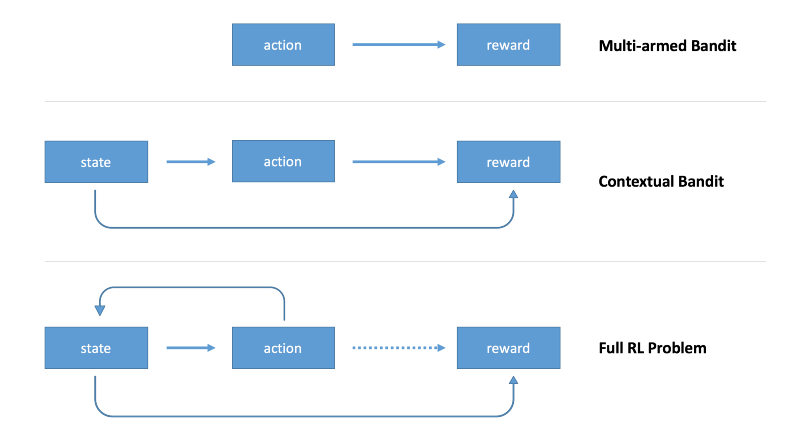

# Contextual Bandits

---
> ## Contact me
> Blog -> <https://cugtyt.github.io/blog/index>  
> Email -> <cugtyt@qq.com>, <cugtyt@gmail.com>  
> GitHub -> [Cugtyt@GitHub](https://github.com/Cugtyt)

---

> **本系列博客主页及相关见**[**此处**](https://cugtyt.github.io/blog/rl-notes/index)  
>
> 来自Arthur Juliani *Simple Reinforcement Learning with Tensorflow series* [Part 1.5: Contextual Bandits](https://medium.com/emergent-future/simple-reinforcement-learning-with-tensorflow-part-1-5-contextual-bandits-bff01d1aad9c)

---

[前面](https://cugtyt.github.io/blog/rl-notes/201807201027)的多臂老虎机问题没有环境状态state，agent只是学习选一个最好的action，后面我们将涉及state，新state取决于前一个state，reward随时间延迟。

介于无状态环境和完全RL问题中，有这样一个问题是存在state，但是state与前面的states或actions无关，另外我们不考虑rewards时延。

这三类问题如下图所示：



## Contextual Bandit

这里引入state的概念，state包括了环境的描述，agent可以在决定action时有更多的信息。

[代码来源](https://gist.github.com/awjuliani/b5d83fcf3bf2898656be5730f098e08b#file-contextualpolicy-ipynb)

``` python
import tensorflow as tf
import tensorflow.contrib.slim as slim
import numpy as np

"""
The Contextual Bandits

Here we define our contextual bandits. In this example, we are using three four-armed bandit. What this means is that each bandit has four arms that can be pulled. Each bandit has different success probabilities for each arm, and as such requires different actions to obtain the best result. The pullBandit function generates a random number from a normal distribution with a mean of 0. The lower the bandit number, the more likely a positive reward will be returned. We want our agent to learn to always choose the bandit-arm that will most often give a positive reward, depending on the Bandit presented.
"""

class contextual_bandit():
    def __init__(self):
        self.state = 0
        #List out our bandits. Currently arms 4, 2, and 1 (respectively) are the most optimal.
        self.bandits = np.array([[0.2,0,-0.0,-5],[0.1,-5,1,0.25],[-5,5,5,5]])
        self.num_bandits = self.bandits.shape[0]
        self.num_actions = self.bandits.shape[1]

    def getBandit(self):
        self.state = np.random.randint(0,len(self.bandits)) #Returns a random state for each episode.
        return self.state

    def pullArm(self,action):
        #Get a random number.
        bandit = self.bandits[self.state,action]
        result = np.random.randn(1)
        if result > bandit:
            #return a positive reward.
            return 1
        else:
            #return a negative reward.
            return -1

"""
The Policy-Based Agent

The code below established our simple neural agent. It takes as input the current state, and returns an action. This allows the agent to take actions which are conditioned on the state of the environment, a critical step toward being able to solve full RL problems. The agent uses a single set of weights, within which each value is an estimate of the value of the return from choosing a particular arm given a bandit. We use a policy gradient method to update the agent by moving the value for the selected action toward the recieved reward.
"""

class agent():
    def __init__(self, lr, s_size,a_size):
        #These lines established the feed-forward part of the network. The agent takes a state and produces an action.
        self.state_in= tf.placeholder(shape=[1],dtype=tf.int32)
        state_in_OH = slim.one_hot_encoding(self.state_in,s_size)
        output = slim.fully_connected(state_in_OH,a_size,\
            biases_initializer=None,activation_fn=tf.nn.sigmoid,weights_initializer=tf.ones_initializer())
        self.output = tf.reshape(output,[-1])
        self.chosen_action = tf.argmax(self.output,0)

        #The next six lines establish the training proceedure. We feed the reward and chosen action into the network
        #to compute the loss, and use it to update the network.
        self.reward_holder = tf.placeholder(shape=[1],dtype=tf.float32)
        self.action_holder = tf.placeholder(shape=[1],dtype=tf.int32)
        self.responsible_weight = tf.slice(self.output,self.action_holder,[1])
        self.loss = -(tf.log(self.responsible_weight)*self.reward_holder)
        optimizer = tf.train.GradientDescentOptimizer(learning_rate=lr)
        self.update = optimizer.minimize(self.loss)

"""
Training the Agent

We will train our agent by getting a state from the environment, take an action, and recieve a reward. Using these three things, we can know how to properly update our network in order to more often choose actions given states that will yield the highest rewards over time.
"""

tf.reset_default_graph() #Clear the Tensorflow graph.

cBandit = contextual_bandit() #Load the bandits.
myAgent = agent(lr=0.001,s_size=cBandit.num_bandits,a_size=cBandit.num_actions) #Load the agent.
weights = tf.trainable_variables()[0] #The weights we will evaluate to look into the network.

total_episodes = 10000 #Set total number of episodes to train agent on.
total_reward = np.zeros([cBandit.num_bandits,cBandit.num_actions]) #Set scoreboard for bandits to 0.
e = 0.1 #Set the chance of taking a random action.

init = tf.initialize_all_variables()

# Launch the tensorflow graph
with tf.Session() as sess:
    sess.run(init)
    i = 0
    while i < total_episodes:
        s = cBandit.getBandit() #Get a state from the environment.

        #Choose either a random action or one from our network.
        if np.random.rand(1) < e:
            action = np.random.randint(cBandit.num_actions)
        else:
            action = sess.run(myAgent.chosen_action,feed_dict={myAgent.state_in:[s]})

        reward = cBandit.pullArm(action) #Get our reward for taking an action given a bandit.

        #Update the network.
        feed_dict={myAgent.reward_holder:[reward],myAgent.action_holder:[action],myAgent.state_in:[s]}
        _,ww = sess.run([myAgent.update,weights], feed_dict=feed_dict)

        #Update our running tally of scores.
        total_reward[s,action] += reward
        if i % 500 == 0:
            print "Mean reward for each of the " + str(cBandit.num_bandits) + " bandits: " + str(np.mean(total_reward,axis=1))
        i+=1
for a in range(cBandit.num_bandits):
    print "The agent thinks action " + str(np.argmax(ww[a])+1) + " for bandit " + str(a+1) + " is the most promising...."
    if np.argmax(ww[a]) == np.argmin(cBandit.bandits[a]):
        print "...and it was right!"
    else:
        print "...and it was wrong!"
```