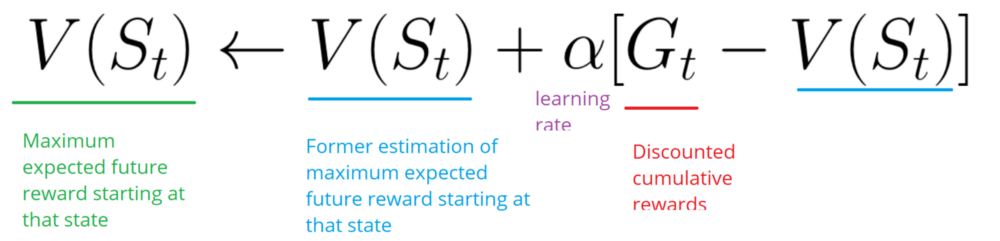
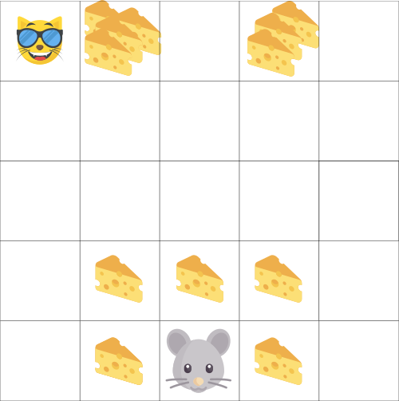
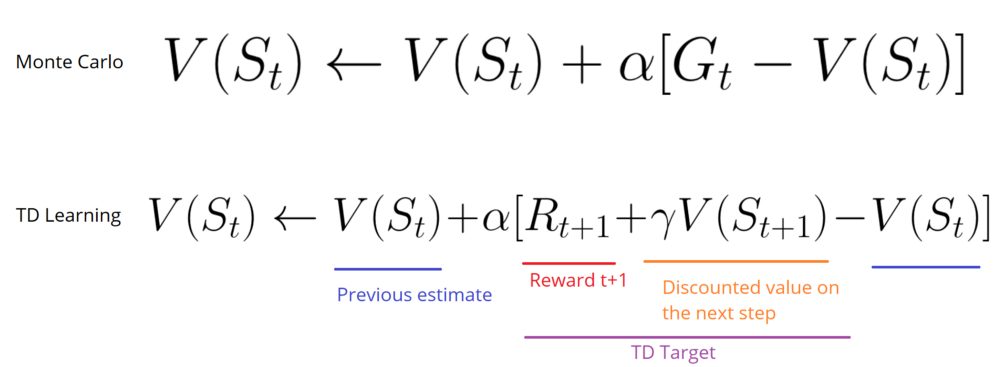
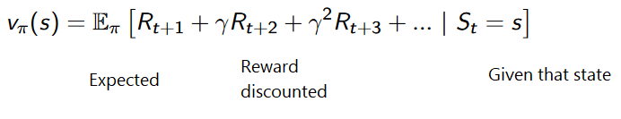
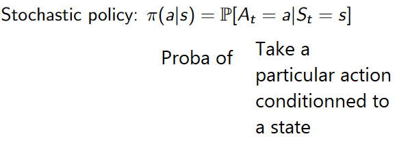
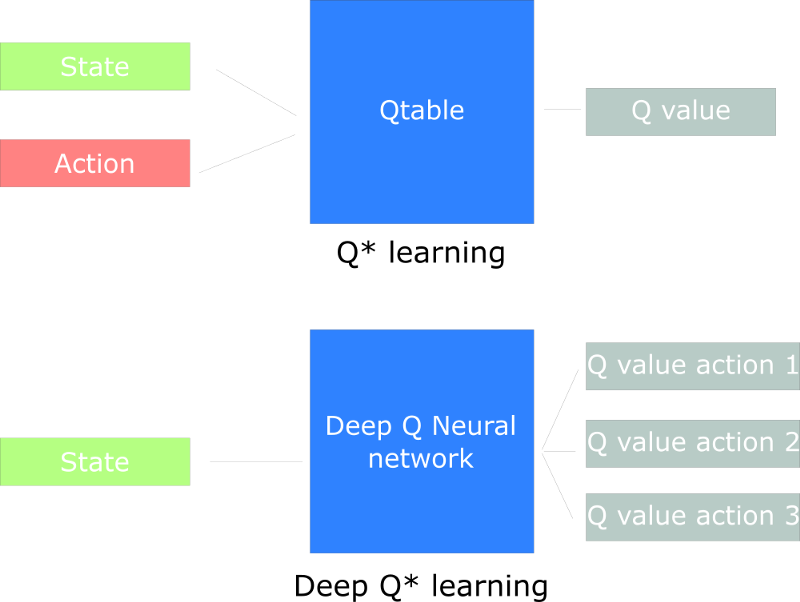

# An introduction to Reinforcement Learning

---
> ## Contact me
> Blog -> <https://cugtyt.github.io/blog/index>  
> Email -> <cugtyt@qq.com>, <cugtyt@gmail.com>  
> GitHub -> [Cugtyt@GitHub](https://github.com/Cugtyt)

---

> **本系列博客主页及相关见**[**此处**](https://cugtyt.github.io/blog/rl-notes/index)  
>
> 来自Thomas Simonini *Deep Reinforcement Learning Course* [Part 1: An introduction to Reinforcement Learning](https://medium.freecodecamp.org/an-introduction-to-reinforcement-learning-4339519de419)

---

<head>
    
    
</head>

## The Reinforcement Learning Process

- Our Agent receives state S0 from the Environment (In our case we receive the first frame of our game (state) from Super Mario Bros (environment))

- Based on that state S0, agent takes an action A0 (our agent will move right)

- Environment transitions to a new state S1 (new frame)

- Environment gives some reward R1 to the agent (not dead: +1)

This RL loop outputs a sequence of **state, action and reward**.

The goal of the agent is to **maximize the expected cumulative reward**.

### The central idea of the Reward Hypothesis

$$G_t = R_{t+1} + R_{t+2} + \dots$$

等价于：

$$G_t = \sum_{k=0}^T R_{t+k+1}$$

考虑到reward的时延性，引入折扣discount，取值在0-1：

- $\gamma$ 越大，discount越小，意味着agent更关心长期reward

- $\gamma$ 越小，discount越大，意味着agent更关心短期奖励

折扣累计为：

$$G_t = \sum_{k=0}^\infty R_{t+k+1} where \gamma \in [0,1)$$

## Episodic or Continuing tasks

### Episodic task

we have a starting point and an ending point **(a terminal state)**. This creates an episode: **a list of States, Actions, Rewards, and New States**.

### Continuous tasks

These are tasks that continue forever **(no terminal state)**. In this case, the agent has to learn how to choose the best actions and simultaneously interacts with the environment.

The agent keeps running until we decide to stop him.

## Monte Carlo vs TD Learning methods

- Collecting the rewards at the end of the episode and then calculating the maximum expected future reward: **Monte Carlo Approach**

- Estimate the rewards at each step: **Temporal Difference Learning**

### Monte Carlo

When the episode ends (the agent reaches a “terminal state”), the agent looks at the total cumulative reward to see how well it did. In Monte Carlo approach, rewards are only received at the end of the game.

Then, we start a new game with the added knowledge. The agent makes better decisions with each iteration.

- We always start at the same starting point.

- We terminate the episode if the cat eats us or if we move > 20 steps.

- At the end of the episode, we have a list of State, Actions, Rewards, and New States.

- The agent will sum the total rewards Gt (to see how well it did).

- It will then update V(st) based on the formula above.

- Then start a new game with this new knowledge.

By running more and more episodes, the agent will learn to play better and better.

### Temporal Difference Learning : learning at each time step

TD Learning, on the other hand, will not wait until the end of the episode to update **the maximum expected future reward estimation: it will update its value estimation V for the non-terminal states St occurring at that experience**.

This method is called TD(0) or **one step TD (update the value function after any individual step)**.

TD methods **only wait until the next time step to update the value estimates**. At time t+1 they immediately **form a TD target using the observed reward Rt+1 and the current estimate V(St+1)**.

TD target is an estimation: in fact you update the previous estimate V(St) **by updating it towards a one-step target**.

## Exploration/Exploitation trade off

- Exploration is finding more information about the environment.

- Exploitation is exploiting known information to maximize the reward.

## Three approaches to Reinforcement Learning

### Value Based

In value-based RL, the goal is to optimize the value function V(s).

The value function is a function that tells us the maximum expected future reward the agent will get at each state.

### Policy Based

In policy-based RL, we want to directly optimize the policy function π(s) without using a value function.

We have two types of policy:

- Deterministic: a policy at a given state will always return the same action.

- Stochastic: output a distribution probability over actions.

### Model Based

In model-based RL, we model the environment. This means we create a model of the behavior of the environment.

**The problem is each environment will need a different model representation.**

