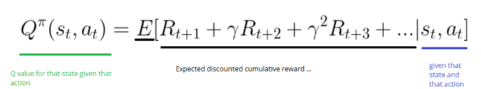
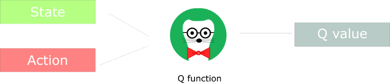
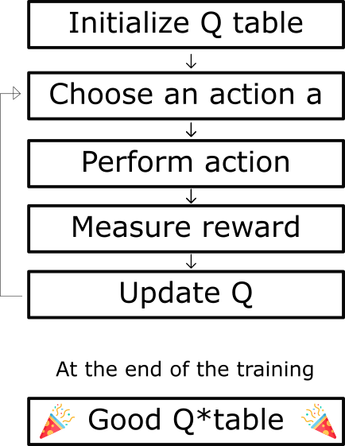
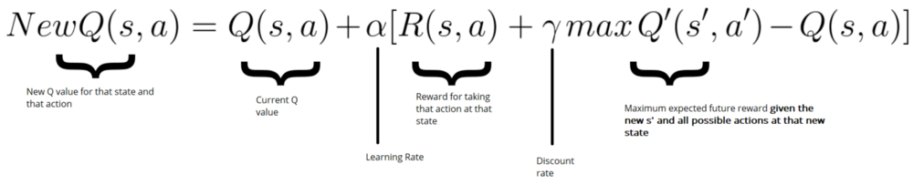

# Diving deeper into Reinforcement Learning with Q-Learning

---
> ## Contact me
> Blog -> <https://cugtyt.github.io/blog/index>  
> Email -> <cugtyt@qq.com>, <cugtyt@gmail.com>  
> GitHub -> [Cugtyt@GitHub](https://github.com/Cugtyt)

---

> **本系列博客主页及相关见**[**此处**](https://cugtyt.github.io/blog/rl-notes/index)  
>
> 来自Thomas Simonini *Deep Reinforcement Learning Course* [Part 2: Diving deeper into Reinforcement Learning with Q-Learning](https://medium.freecodecamp.org/diving-deeper-into-reinforcement-learning-with-q-learning-c18d0db58efe)

---

## Q-learning algorithm: learning the Action Value Function

The Action Value Function (or “Q-function”) takes two inputs: “state” and “action.” It returns the expected future reward of that action at that state.



)

## The Q-learning algorithm Process




update Q(s,a) we use the Bellman equation:



see Thomas Simonini *Deep Reinforcement Learning Course* [Part 2: Diving deeper into Reinforcement Learning with Q-Learning](https://medium.freecodecamp.org/diving-deeper-into-reinforcement-learning-with-q-learning-c18d0db58efe)
 for more specific process.

## Q* Learning with FrozenLake

[代码来源](https://gist.github.com/simoninithomas/baafe42d1a665fb297ca669aa2fa6f92#file-q-learning-with-frozenlake-ipynb)

``` python
import numpy as np
import gym
import random

"""Step 1: Create the environment """
env = gym.make("FrozenLake-v0")

"""Step 2: Create the Q-table and initialize it """
action_size = env.action_space.n
state_size = env.observation_space.n

qtable = np.zeros((state_size, action_size))
print(qtable)

"""Step 3: Create the hyperparameters"""

total_episodes = 10000        # Total episodes
learning_rate = 0.8           # Learning rate
max_steps = 99                # Max steps per episode
gamma = 0.95                  # Discounting rate

# Exploration parameters
epsilon = 1.0                 # Exploration rate
max_epsilon = 1.0             # Exploration probability at start
min_epsilon = 0.01            # Minimum exploration probability
decay_rate = 0.01             # Exponential decay rate for exploration prob

"""Step 4: The Q learning algorithm """
# List of rewards
rewards = []

# 2 For life or until learning is stopped
for episode in range(total_episodes):
    # Reset the environment
    state = env.reset()
    step = 0
    done = False
    total_rewards = 0

    for step in range(max_steps):
        # 3. Choose an action a in the current world state (s)
        ## First we randomize a number
        exp_exp_tradeoff = random.uniform(0, 1)

        ## If this number > greater than epsilon --> exploitation (taking the biggest Q value for this state)
        if exp_exp_tradeoff > epsilon:
            action = np.argmax(qtable[state,:])

        # Else doing a random choice --> exploration
        else:
            action = env.action_space.sample()

        # Take the action (a) and observe the outcome state(s') and reward (r)
        new_state, reward, done, info = env.step(action)

        # Update Q(s,a):= Q(s,a) + lr [R(s,a) + gamma * max Q(s',a') - Q(s,a)]
        # qtable[new_state,:] : all the actions we can take from new state
        qtable[state, action] = qtable[state, action] + learning_rate * (reward + gamma * np.max(qtable[new_state, :]) - qtable[state, action])

        total_rewards += reward

        # Our new state is state
        state = new_state

        # If done (if we're dead) : finish episode
        if done == True:
            break

    episode += 1
    # Reduce epsilon (because we need less and less exploration)
    epsilon = min_epsilon + (max_epsilon - min_epsilon)*np.exp(-decay_rate*episode)
    rewards.append(total_rewards)

print ("Score over time: " +  str(sum(rewards)/total_episodes))
print(qtable)

"""Step 5: Use our Q-table to play FrozenLake !"""
env.reset()

for episode in range(5):
    state = env.reset()
    step = 0
    done = False
    print("****************************************************")
    print("EPISODE ", episode)

    for step in range(max_steps):
        env.render()
        # Take the action (index) that have the maximum expected future reward given that state
        action = np.argmax(qtable[state,:])

        new_state, reward, done, info = env.step(action)

        if done:
            break
        state = new_state
env.close()
```

## 小结

- Q-learning是value-based，使用q函数找最优action选择策略

- 使用action-value函数衡量采用哪个action

- 目标是最大化Q函数

- Q-table用于帮助在每个state寻找最好的action

- 在所有可能的action里选择最好的来最大化期望reward

- Q来自于特定state下的特定action特性

- Q(state, action)返回state下采取action的期望reward

- 该函数可以用借助Bellman公式迭代更新Q(s,a)的Q-learning估计

- Q-table最开始是任意值，探索环境后，Q会越来越好
