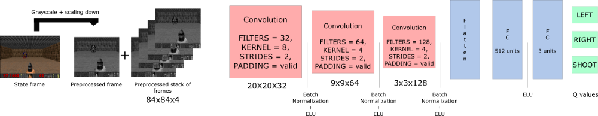
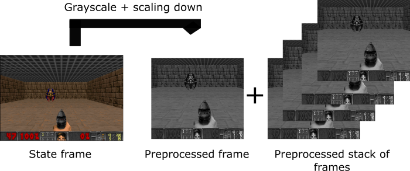
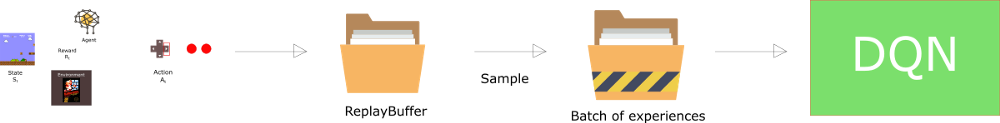
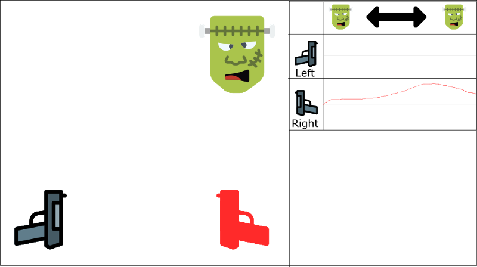
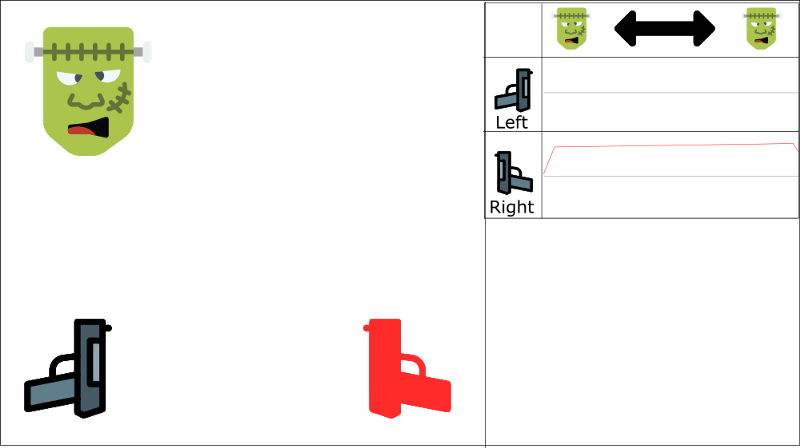

# An introduction to Deep Q-Learning: let’s play Doom

---
> ## Contact me
> Blog -> <https://cugtyt.github.io/blog/index>  
> Email -> <cugtyt@qq.com>, <cugtyt@gmail.com>  
> GitHub -> [Cugtyt@GitHub](https://github.com/Cugtyt)

---

> **本系列博客主页及相关见**[**此处**](https://cugtyt.github.io/blog/rl-notes/index)  
>
> 来自Thomas Simonini *Deep Reinforcement Learning Course* [Part 3: An introduction to Deep Q-Learning: let’s play Doom](https://medium.freecodecamp.org/an-introduction-to-deep-q-learning-lets-play-doom-54d02d8017d8)

---

## How does Deep Q-Learning work



### Preprocessing part



- 首先转为灰度图

- 剪切，房顶并无用处

- 减小尺寸，将四个帧堆叠

### The problem of temporal limitation

We stack frames together because it helps us to handle the problem of temporal limitation.

If we give him only one frame at a time, it has no idea of motion. And how can it make a correct decision, if it can’t determine where and how fast objects are moving?

### Using convolution networksUsing convolution networks

### Experience Replay: making more efficient use of observed experience

Experience replay will help us to handle two things:

- Avoid forgetting previous experiences.

- Reduce correlations between experiences.

#### Avoid forgetting previous experiences

We have a big problem: the variability of the weights, because there is high correlation between actions and states.



#### Reducing correlation between experiences



一直学习右枪



不会开左枪

We have two parallel strategies to handle this problem.

- First, we must stop learning while interacting with the environment. We should try different things and play a little randomly to explore the state space. We can save these experiences in the replay buffer.

- Then, we can recall these experiences and learn from them. After that, go back to play with updated value function.

## Our Deep Q-Learning algorithm


``` raw
Initialize Doom Environment E
Initialize replay Memory M with capacity N (= finite capacity)
Initialize the DQN weights w
for episode in max_episode:
    s = Environment state
    for steps in max_steps:
         Choose action a from state s using epsilon greedy.
         Take action a, get r (reward) and s' (next state)
         Store experience tuple <s, a, r, s'> in M
         s = s' (state = new_state)

         Get random minibatch of exp tuples from M
         Set Q_target = reward(s,a) +  γmaxQ(s')
         Update w =  α(Q_target - Q_value) *  ∇w Q_value
```

There are two processes that are happening in this algorithm:

- We sample the environment where we perform actions and store the observed experiences tuples in a replay memory.

- Select the small batch of tuple random and learn from it using a gradient descent update step.

## Deep Q Neural Network

[代码来源](https://gist.github.com/simoninithomas/7611db5d8a6f3edde269e18b97fa4d0c#file-deep-q-learning-with-doom-ipynb)