# Improvements in Deep Q Learning: Dueling Double DQN, Prioritized Experience Replay, and fixed Q-targets

---
> ## Contact me
> Blog -> <https://cugtyt.github.io/blog/index>  
> Email -> <cugtyt@qq.com>, <cugtyt@gmail.com>  
> GitHub -> [Cugtyt@GitHub](https://github.com/Cugtyt)

---

> **本系列博客主页及相关见**[**此处**](https://cugtyt.github.io/blog/rl-notes/index)  
>
> 来自Thomas Simonini *Deep Reinforcement Learning Course* [Part 3+: Improvements in Deep Q Learning: Dueling Double DQN, Prioritized Experience Replay, and fixed Q-targets](https://medium.freecodecamp.org/improvements-in-deep-q-learning-dueling-double-dqn-prioritized-experience-replay-and-fixed-58b130cc5682)

---

## Fixed Q-targets

We saw in the Deep Q Learning article that, when we want to calculate the TD error (aka the loss), we calculate the difference between the TD target (Q_target) and the current Q value (estimation of Q).

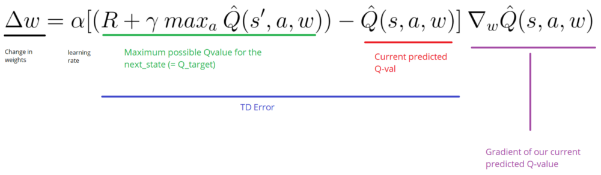

But we don’t have any idea of the real TD target. We need to estimate it. Using the Bellman equation, we saw that the TD target is just the reward of taking that action at that state plus the discounted highest Q value for the next state.

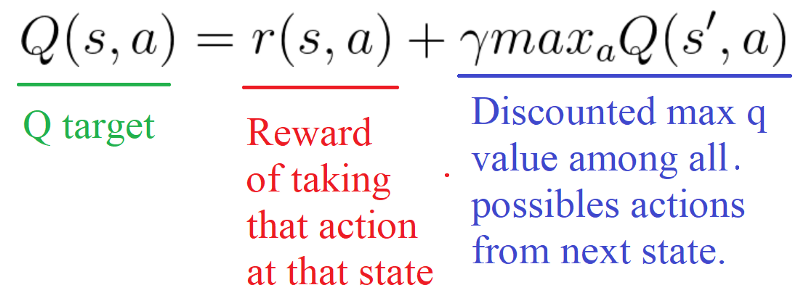

However, the problem is that we using the same parameters (weights) for estimating the target and the Q value. As a consequence, there is a big correlation between the TD target and the parameters (w) we are changing.

Therefore, it means that at every step of training, our Q values shift but also the target value shifts. So, we’re getting closer to our target but the target is also moving. It’s like chasing a moving target! This lead to a big oscillation in training.

**idea of fixed Q-targets  introduced by DeepMind:**

- Using a separate network with a fixed parameter (let’s call it w-) for estimating the TD target.

- At every Tau step, we copy the parameters from our DQN network to update the target network.

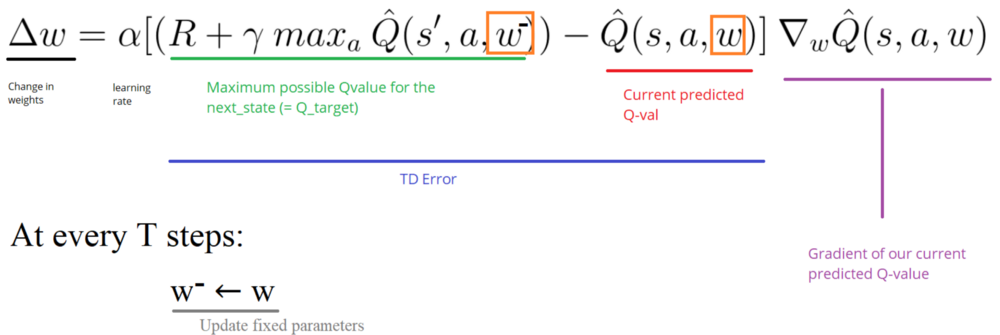

### Implementation

- First, we create two networks (DQNetwork, TargetNetwork)

``` python
# Instantiate the DQNetwork
DQNetwork = DQNNet(state_size, action_size, learning_rate, name="DQNetwork")

# Instantiate the target network
TargetNetwork = DQNNet(state_size, action_size, learning_rate, name="TargetNetwork")
```

- Then, we create a function that will take our DQNetwork parameters and copy them to our TargetNetwork

``` python
# This function helps us to copy one set of variables to another
# In our case we use it when we want to copy the parameters of DQN to Target_network
# Thanks of the very good implementation of Arthur Juliani https://github.com/awjuliani
def update_target_graph():

    # Get the parameters of our DQNNetwork
    from_vars = tf.get_collection(tf.GraphKeys.TRAINABLE_VARIABLES, "DQNetwork")

    # Get the parameters of our Target_network
    to_vars = tf.get_collection(tf.GraphKeys.TRAINABLE_VARIABLES, "TargetNetwork")

    op_holder = []

    # Update our target_network parameters with DQNNetwork parameters
    for from_var,to_var in zip(from_vars,to_vars):
        op_holder.append(to_var.assign(from_var))
return op_holder
```

- Finally, during the training, we calculate the TD target using our target network. We update the target network with the DQNetwork every tau step (tau is an hyper-parameter that we define).

``` python
# Get Q values for next_state
Qs_next_state = sess.run(TargetNetwork.output, feed_dict = {TargetNetwork.inputs_: next_states_mb})

...

                if tau > max_tau:
                    # Update the parameters of our TargetNetwork with DQN_weights
                    update_target = update_target_graph()
                    sess.run(update_target)
                    tau = 0
print("Model updated")
```

## Double DQNs


By calculating the TD target, we face a simple problem: how are we sure that the best action for the next state is the action with the highest Q-value?

The solution is: when we compute the Q target, we use two networks to decouple the action selection from the target Q value generation. We:

- use our DQN network to select what is the best action to take for the next state (the action with the highest Q value).

- use our target network to calculate the target Q value of taking that action at the next state.

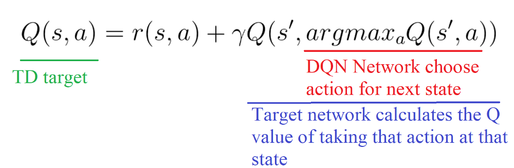

### Implementation

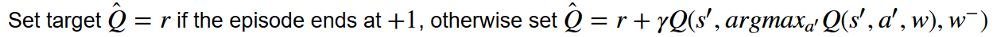

``` python
### DOUBLE DQN Logic
# Use DQNNetwork to select the action to take at next_state (a') (action with the highest Q-value)
# Use TargetNetwork to calculate the Q_val of Q(s',a')

# Get Q values for next_state 
Qs_next_state = sess.run(DQNetwork.output, feed_dict = {DQNetwork.inputs_: next_states_mb})

# Calculate Qtarget(s')
q_target = sess.run(TargetNetwork.output, feed_dict = {TargetNetwork.inputs_: next_states_mb})

# Set Q_target = r if the episode ends at s+1, otherwise set Q_target = r + gamma * Qtarget(s',a') 
for i in range(0, len(batch)):
terminal = dones_mb[i]

# We got a'
action = np.argmax(Qs_next_state[i])

# If we are in a terminal state, only equals reward
if terminal:
    target_Qs_batch.append(rewards_mb[i])
    
else:
    
    # Take the Qtarget for action a'
    target = rewards_mb[i] + gamma * q_target[i][action]
    target_Qs_batch.append(target)
```

## Dueling DQN (aka DDQN)

Q-values correspond to **how good it is to be at that state and taking an action at that state Q(s,a)**.

So we can decompose Q(s,a) as the sum of:

- V(s): the value of being at that state

- A(s,a): the advantage of taking that action at that state (how much better is to take this action versus all other possible actions at that state).

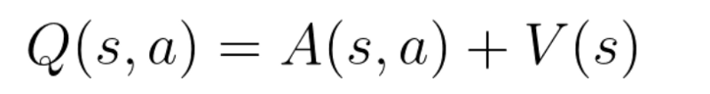

With DDQN, we want to separate the estimator of these two elements, using two new streams:

- one that estimates the state value V(s)

- one that estimates the advantage for each action A(s,a)

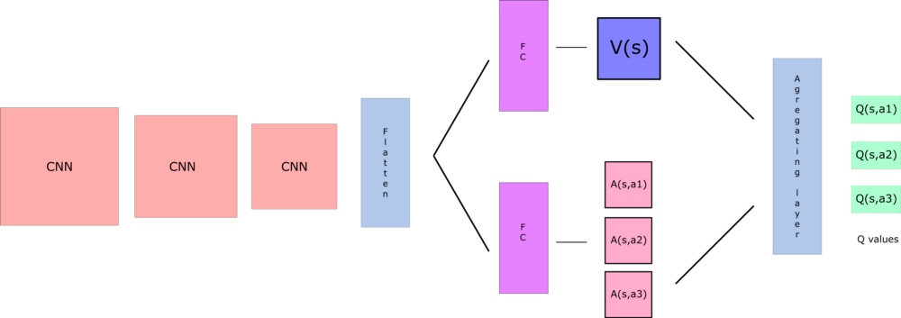

By decoupling the estimation, intuitively our DDQN can learn which states are (or are not) valuable **without** having to learn the effect of each action at each state (since it’s also calculating V(s)).

**This is particularly useful for states where their actions do not affect the environment in a relevant way.**

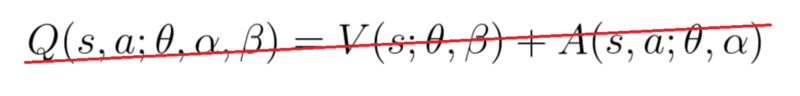

if we do that, we’ll fall into the **issue of identifiability**, that is — given Q(s,a) we’re unable to find A(s,a) and V(s).

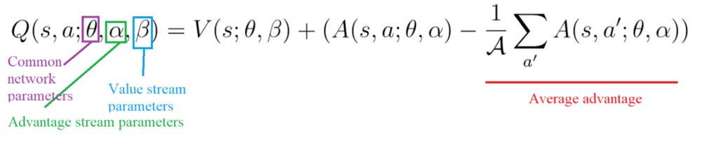

### Implementation

[代码来源](https://gist.github.com/simoninithomas/df21ba9d370c76482aa3a8c62e6b7af7#file-model_ddqn-py)

## Prioritized Experience Replay (PER)

The idea is that some experiences may be more important than others for our training, but might occur less frequently.

We want to take in priority **experience where there is a big difference between our prediction and the TD target, since it means that we have a lot to learn about it**.

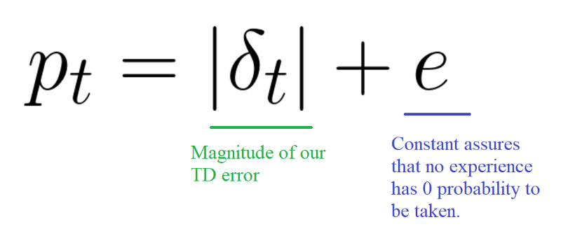

And we **put that priority in the experience of each replay buffer**.

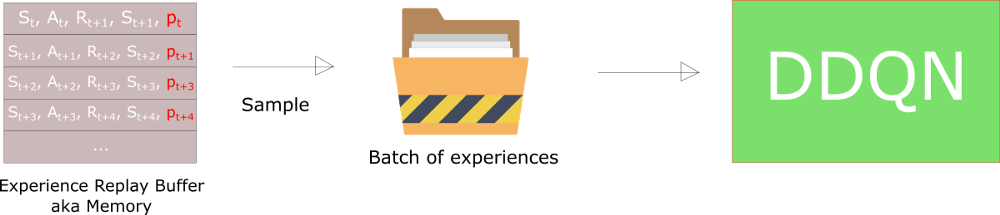

we introduce stochastic prioritization, **which generates the probability of being chosen for a replay**.

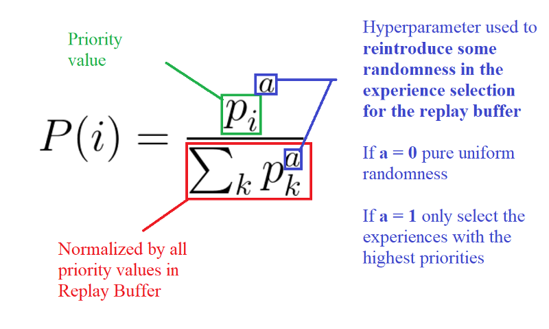

But, because we use priority sampling, purely random sampling is abandoned. As a consequence, we introduce bias toward high-priority samples (more chances to be selected).

To correct this bias, we use importance sampling weights (IS) that will adjust the updating by reducing the weights of the often seen samples.

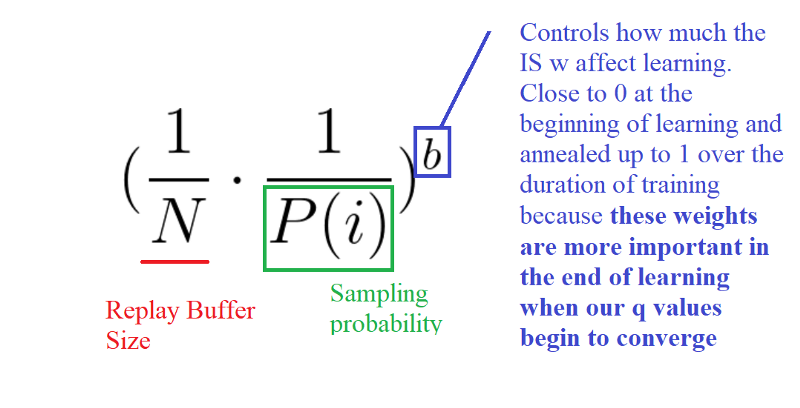

The weights corresponding to high-priority samples have very little adjustment (because the network will see these experiences many times), whereas those corresponding to low-priority samples will have a full update.

The weights corresponding to high-priority samples have very little adjustment (because the network will see these experiences many times), whereas those corresponding to low-priority samples will have a full update.

### Implementation

we can’t just implement PER by sorting all the Experience Replay Buffers according to their priorities. This will not be efficient at all due to O(nlogn) for insertion and O(n) for sampling.

A sumtree is a Binary Tree, that is a tree with only a maximum of two children for each node. The leaves (deepest nodes) contain the priority values, and a data array that points to leaves contains the experiences.

Updating the tree and sampling will be really efficient (O(log n)).


Then, we create a memory object that will contain our sumtree and data.

Next, to sample a minibatch of size k, the range [0, total_priority] will be divided into k ranges. A value is uniformly sampled from each range.

Finally, the transitions (experiences) that correspond to each of these sampled values are retrieved from the sumtree.

## Doom Deathmatch agent

[代码来源](https://medium.freecodecamp.org/improvements-in-deep-q-learning-dueling-double-dqn-prioritized-experience-replay-and-fixed-58b130cc5682)