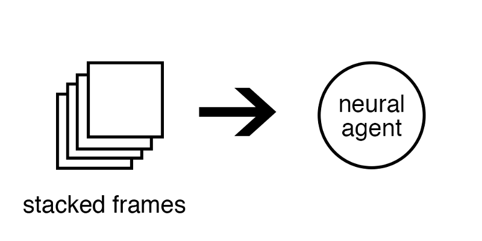
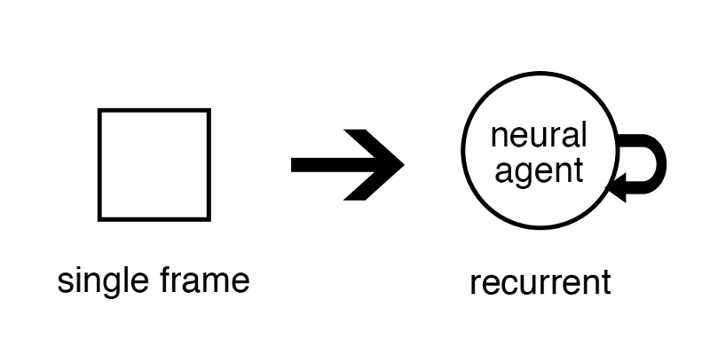
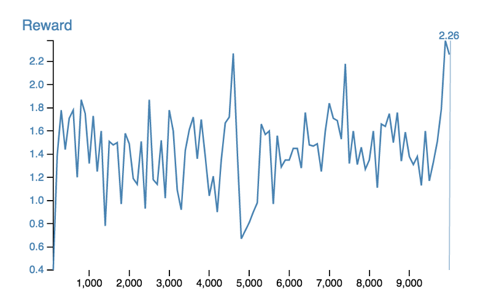
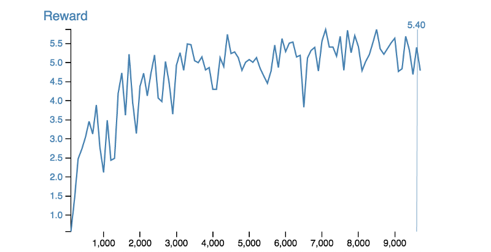

# Partial Observability and Deep Recurrent Q-Networks

---
> ## Contact me
> Blog -> <https://cugtyt.github.io/blog/index>  
> Email -> <cugtyt@qq.com>, <cugtyt@gmail.com>  
> GitHub -> [Cugtyt@GitHub](https://github.com/Cugtyt)

---

> **本系列博客主页及相关见**[**此处**](https://cugtyt.github.io/blog/rl-notes/index)  
>
> 来自Arthur Juliani *Simple Reinforcement Learning with Tensorflow series* [Part 6 - Partial Observability and Deep Recurrent Q-Networks](https://medium.com/emergent-future/simple-reinforcement-learning-with-tensorflow-part-6-partial-observability-and-deep-recurrent-q-68463e9aeefc)

---

## Making sense of a limited, changing world

How can we build a neural agent which still functions well in a partially observable world? The key is to give the agent a capacity for temporal integration of observations. The intuition behind this is simple: if information at a single moment isn’t enough to make a good decision, then enough varying information over time probably is.

The solution taken by DeepMind in their original paper on Deep Q-Networks was to **stack the frames** from the Atari simulator.

Lastly, we may simply need to keep things in mind that happened much earlier than would be feasible to capture with stacking frames.

## Recurrent Neural Networks

All of these issues can be solved by moving the temporal integration into the agent itself.

By utilizing a recurrent block in our network, we can pass the agent single frames of the environment, and the network will be able to change its output depending on the temporal pattern of observations it receives. It does this by maintaining a hidden state that it computes at every time-step. The recurrent block can feed the hidden state back into itself, thus acting as an augmentation which tells the network what has come before. The class of agents which utilize this recurrent network are referred to as Deep Recurrent Q-Networks (DRQN).

## Implementing in Tensorflow

We need to make a few modifications to our DQN described in Part 4:

- We will insert a LSTM recurrent cell between the output of the last convolutional layer and the input into the split between the Value and Advantage streams. We also need to slightly alter the training process in order to send an empty hidden state to our recurrent cell at the beginning of each sequence.

- our experience buffer will store entire episodes, and randomly draw traces of 8 steps from a random batch of episodes. By doing this we both retain our random sampling as well as ensure each trace of experiences actually follows from one another.

- Instead of sending all the gradients backwards when training their agent, they sent only the last half of the gradients for a given trace.

## The Limited Gridworld

By simply limiting the agent’s view of the environment, we can turn our MDP into a POMDP. In this new version of the GridWorld, the agent can only see a single block around it in any direction. We find that it performs relatively poorly.

The problem is that the agent has no way of remembering where it has been or what it has seen. If two areas look the same, then the agent can do nothing but react in exactly the same way to them, even if they are in different parts of the environment.

**DRQN** By allowing for a temporal integration of information, the agent learns a sense of spatial location that is able to augment its observation at any moment, and allow the agent to receive a larger reward each episode.

代码[来源](https://github.com/awjuliani/DeepRL-Agents/blob/master/Deep-Recurrent-Q-Network.ipynb)。