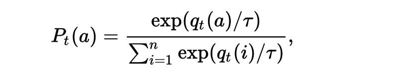
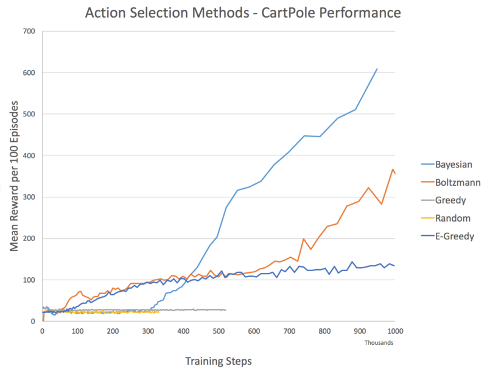

# Action-Selection Strategies for Exploration

---
> ## Contact me
> Blog -> <https://cugtyt.github.io/blog/index>  
> Email -> <cugtyt@qq.com>, <cugtyt@gmail.com>  
> GitHub -> [Cugtyt@GitHub](https://github.com/Cugtyt)

---

> **本系列博客主页及相关见**[**此处**](https://cugtyt.github.io/blog/rl-notes/index)  
>
> 来自Arthur Juliani *Simple Reinforcement Learning with Tensorflow series* [Part 7 - Action-Selection Strategies for Exploration](https://medium.com/emergent-future/simple-reinforcement-learning-with-tensorflow-part-7-action-selection-strategies-for-exploration-d3a97b7cceaf)

---

## Greedy Approach

Explanation: All reinforcement learning algorithms seek to maximize reward over time.

Shortcomings: The problem with a greedy approach is that it almost universally arrives at a suboptimal solution.

## Random Approach

Explanation: The opposite approach to greedy selection is to simply always take a random action.

Shortcomings: Only in circumstances where a random policy is optimal would this approach be ideal.

## ϵ-Greedy Approach

Explanation: A simple combination of the greedy and random approaches yields one of the most used exploration strategies: ϵ-greedy.

Adjusting during training: At the start of the training process the e value is often initialized to a large probability. The value is then annealed down to a small constant (often 0.1).

## Boltzmann Approach

Explanation: this approach involves choosing an action with weighted probabilities. The biggest advantage over e-greedy is that information about likely value of the other actions can also be taken into consideration.

Adjusting during training: In practice we utilize an additional temperature parameter (τ) which is annealed over time. This parameter controls the spread of the softmax distribution, such that all actions are considered equally at the start of training, and actions are sparsely distributed by the end of training.



Shortcomings: what the agent is estimating is a measure of how optimal the agent thinks the action is, not how certain it is about that optimality.

``` python
#Add this to network to compute Boltzmann probabilities.
Temp = tf.placeholder(shape=None,dtype=tf.float32)
Q_dist = slim.softmax(Q_out/Temp)

#Use this for action selection.
t = 0.5
Q_probs = sess.run(Q_dist,feed_dict={inputs:[state],Temp:t})
action_value = np.random.choice(Q_probs[0],p=Q_probs[0])
action = np.argmax(Q_probs[0] == action_value)
```

## Bayesian Approaches (w/ Dropout)

Explanation: What if an agent could exploit its own uncertainty about its actions? Unlike traditional neural network which act deterministically, Bayesian Neural Networks(BNNs) act probabilistically. In a reinforcement learning setting, the distribution over weight values allows us to obtain distributions over actions as well. The variance of this distribution provides us an estimate of the agent’s uncertainty about each action.

In practice however it is impractical to maintain a distribution over all weights. Instead we can utilize dropout to simulate a probabilistic network.

Shortcomings: In order to get true uncertainty estimates, multiple samples are required, thus increasing computational complexity.

``` python
#Add to network
keep_per = tf.placeholder(shape=None,dtype=tf.float32)
hidden = slim.dropout(hidden,keep_per)


keep = 0.5
Q_values = sess.run(Q_out,feed_dict={inputs:[state],keep_per:keep})
action = #Insert your favorite action-selection strategy with the sampled Q-values.
```

## Comparison & Full Code



代码[来源](https://gist.github.com/awjuliani/a9aa513b6b91dbffaaf1b1e149ee5b32#file-q-exploration-ipynb)。