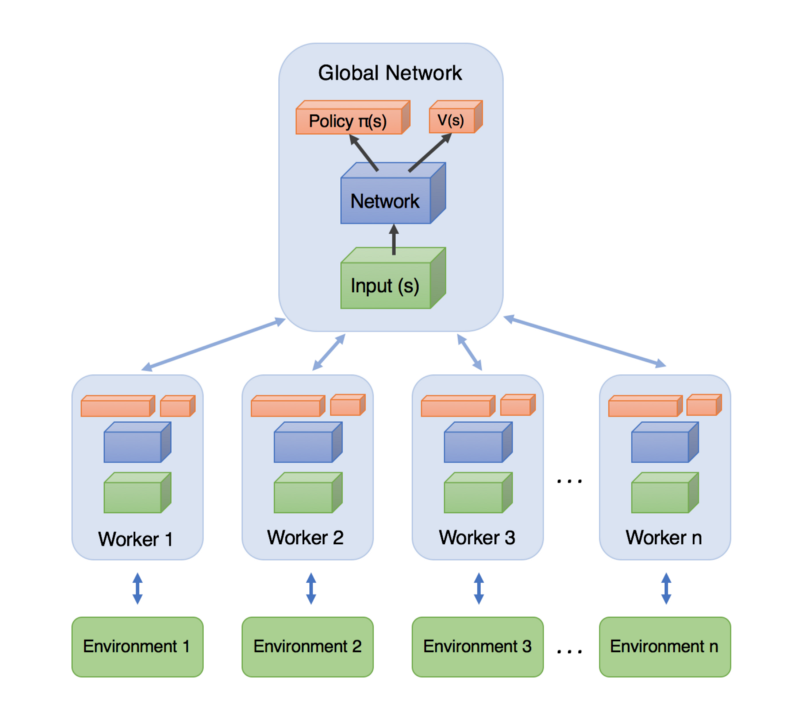
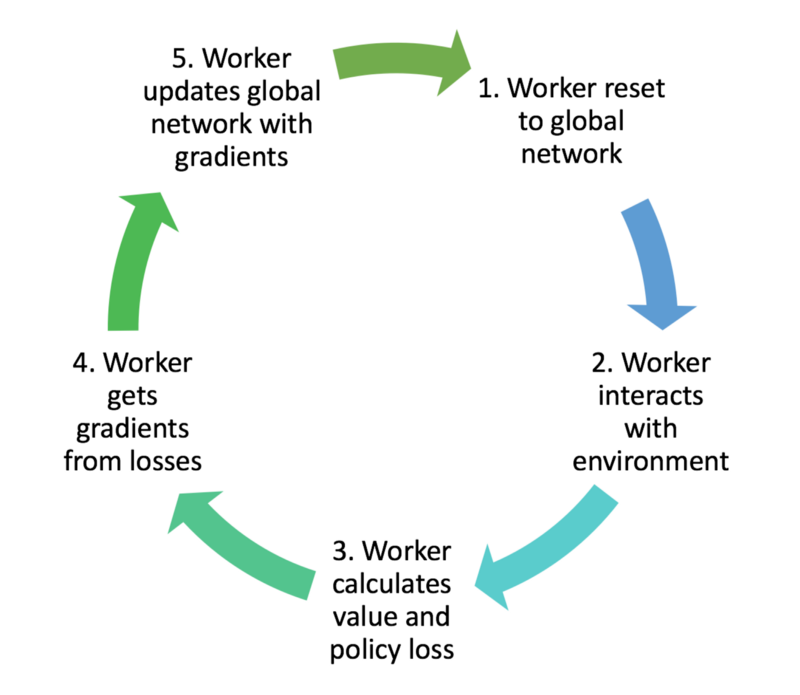
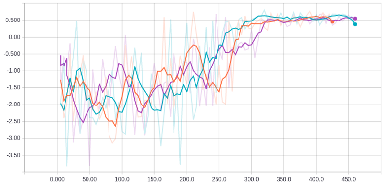

# Asynchronous Actor-Critic Agents (A3C)

---
> ## Contact me
> Blog -> <https://cugtyt.github.io/blog/index>  
> Email -> <cugtyt@qq.com>, <cugtyt@gmail.com>  
> GitHub -> [Cugtyt@GitHub](https://github.com/Cugtyt)

---

> **本系列博客主页及相关见**[**此处**](https://cugtyt.github.io/blog/rl-notes/index)  
>
> 来自Arthur Juliani *Simple Reinforcement Learning with Tensorflow series* [Part 8 - Asynchronous Actor-Critic Agents (A3C)](https://medium.com/emergent-future/simple-reinforcement-learning-with-tensorflow-part-8-asynchronous-actor-critic-agents-a3c-c88f72a5e9f2)

---

## The 3 As of A3C

**Asynchronous**: Unlike DQN, where a single agent represented by a single neural network interacts with a single environment, A3C utilizes multiple incarnations of the above in order to learn more efficiently. Each of these agents interacts with it’s own copy of the environment at the same time as the other agents are interacting with their environments.

**Actor-Critic**: In the case of A3C, our network will estimate both a value function V(s) (how good a certain state is to be in) and a policy π(s) (a set of action probability outputs). These will each be separate fully-connected layers sitting at the top of the network. Critically, the agent uses the value estimate (the critic) to update the policy (the actor) more intelligently than traditional policy gradient methods.

**Advantage**: If we think back to our implementation of Policy Gradient, the update rule used the discounted returns from a set of experiences in order to tell the agent which of its actions were “good” and which were “bad.” The network was then updated in order to encourage and discourage actions appropriately.

> Discounted Reward: R = γ(r)

The insight of using advantage estimates rather than just discounted returns is to allow the agent to determine not just how good its actions were, but how much better they turned out to be than expected. Intuitively, this allows the algorithm to focus on where the network’s predictions were lacking.

> Advantage: A = Q(s,a) - V(s)

Since we won’t be determining the Q values directly in A3C, we can use the discounted returns (R) as an estimate of Q(s,a) to allow us to generate an estimate of the advantage.

> Advantage Estimate: A = R - V(s)

## Implementing the Algorithm

- AC_Network — This class contains all the Tensorflow ops to create the networks themselves.

- Worker — This class contains a copy of AC_Network, an environment class, as well as all the logic for interacting with the environment, and updating the global network.

- High-level code for establishing the Worker instances and running them in parallel.

[a3c.py](https://gist.github.com/awjuliani/66e8f477fc1ad000b1314809d8523455#file-a3c-py)

[make_worker.py](https://gist.github.com/awjuliani/e9f98e74a151f275889bc46d1526e446#file-make_worker-py)

[set_parameters.py](https://gist.github.com/awjuliani/31d43d02816d801dc4e0e8440c56140a#file-set_parameters-py)

[work.py](https://gist.github.com/awjuliani/58d4826115fc35ed58c9f6786e19a2fa#file-work-py)

> Value Loss: L = Σ(R - V(s))²
>
> Policy Loss: L = -log(π(s)) \* A(s) - β\*H(π)

A worker then uses these losses to obtain gradients with respect to its network parameters. Each of these gradients are typically clipped in order to prevent overly-large parameter updates which can destabilize the policy.

A worker then uses the gradients to update the global network parameters. In this way, the global network is constantly being updated by each of the agents, as they interact with their environment.

[train.py](https://gist.github.com/awjuliani/9149588eed921eda593bf20e6f9b7e32#file-train-py)

[full code](https://github.com/awjuliani/DeepRL-Agents/blob/master/A3C-Doom.ipynb)

Average reward over time for three workers on Doom task. 0.5 reward corresponds to optimal performance. X-axis represents number of training episodes per worker.

