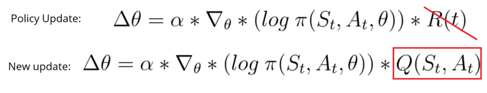
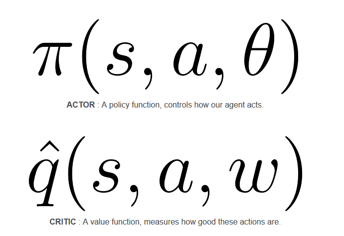
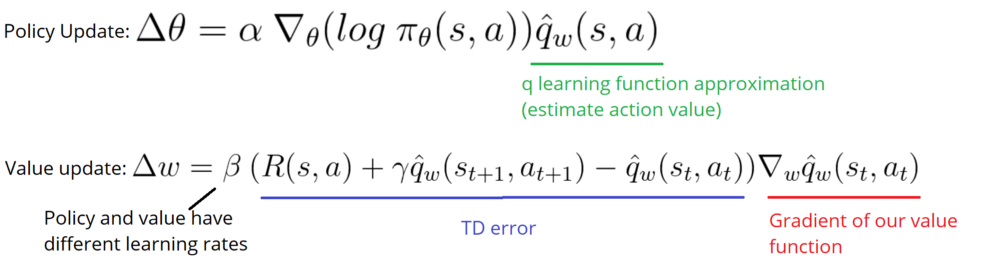
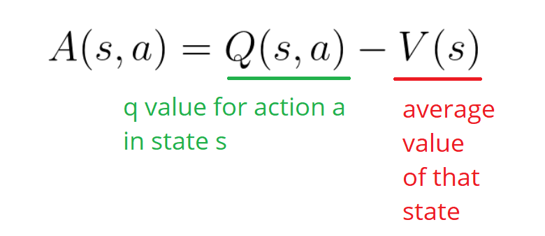
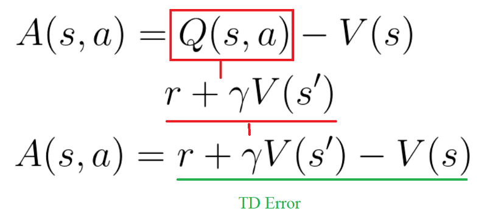
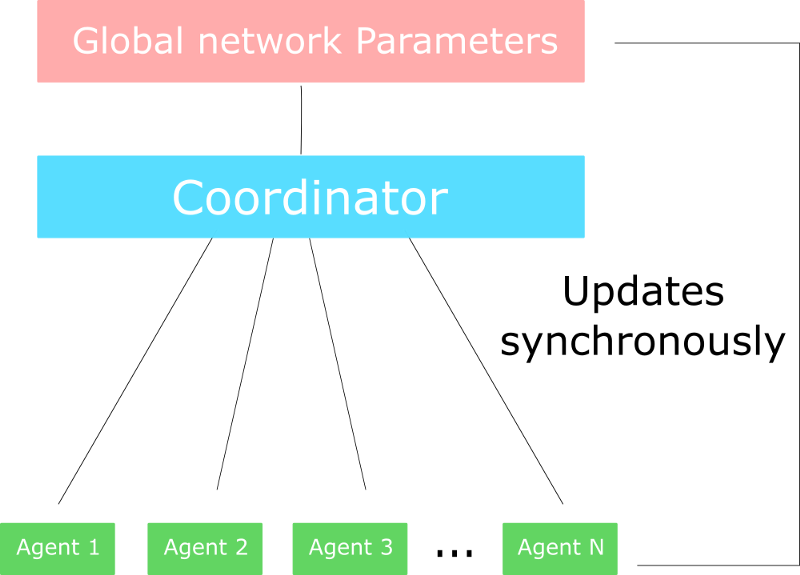

# An intro to Advantage Actor Critic methods: let’s play Sonic the Hedgehog!

## Contact me

* Blog -> <https://cugtyt.github.io/blog/index>
* Email -> <cugtyt@qq.com>, <cugtyt@gmail.com>
* GitHub -> [Cugtyt@GitHub](https://github.com/Cugtyt)

---

> **本系列博客主页及相关见**[**此处**](https://cugtyt.github.io/blog/rl-notes/index)  
>
> 来自Thomas Simonini *Deep Reinforcement Learning Course* [Part 5: An intro to Advantage Actor Critic methods: let’s play Sonic the Hedgehog!](https://medium.freecodecamp.org/an-intro-to-advantage-actor-critic-methods-lets-play-sonic-the-hedgehog-86d6240171d)

---

we’ve studied two different reinforcement learning methods:

* Value based methods (Q-learning, Deep Q-learning): where we learn a value function that will map each state action pair to a value. Thanks to these methods, we find the best action to take for each state — the action with the biggest value. This works well when you have a finite set of actions.
* Policy based methods (REINFORCE with Policy Gradients): where we directly optimize the policy without using a value function. This is useful when the action space is continuous or stochastic. The main problem is finding a good score function to compute how good a policy is. We use total rewards of the episode.

But both of these methods have big drawbacks.

**Actor Critic**. We’ll using two neural networks:

* a Critic that measures how good the action taken is (value-based)
* an Actor that controls how our agent behaves (policy-based)

## The quest for a better learning model

### The problem with Policy Gradients

to have an optimal policy, we need a lot of samples. This produces slow learning, because it takes a lot of time to converge.

## Introducing Actor Critic

Instead of waiting until the end of the episode as we do in Monte Carlo REINFORCE, we make an update at each step (TD Learning).

Because we do an update at each time step, we can’t use the total rewards R(t). Instead, we need to train a Critic model that approximates the value function (remember that value function calculates what is the maximum expected future reward given a state and an action). This value function replaces the reward function in policy gradient that calculates the rewards only at the end of the episode.

### How Actor Critic works

You try some action randomly. The Critic observes your action and provides feedback.

Learning from this feedback, you’ll update your policy and be better at playing that game.

Because we have two models (Actor and Critic) that must be trained, it means that we have two set of weights (𝜃 for our action and w for our Critic) that must be optimized separately:

## A2C and A3C

### Introducing the Advantage function to stabilize learning

value-based methods have **high variability**.

To reduce this problem, we spoke about using the advantage function instead of the value function.

This function will tell us the improvement compared to the average the action taken at that state is. In other words, this function calculates the extra reward I get if I take this action. The extra reward is that beyond the expected value of that state.

we can use the TD error as a good estimator of the advantage function.

### Two different strategies: Asynchronous or Synchronous

* A2C (aka Advantage Actor Critic)
* A3C (aka Asynchronous Advantage Actor Critic)

In A3C, we don’t use experience replay as this requires lot of memory. Instead, we asynchronously execute different agents in parallel on multiple instances of the environment. Each worker (copy of the network) will update the global network asynchronously.

only difference in A2C is that we synchronously update the global network. We wait until all workers have finished their training and calculated their gradients to average them, to update our global network.

### Choosing A2C or A3C ?

## Implementing an A2C agent that plays Sonic the Hedgehog

### A2C in practice

* Creates a vector of n environments using the multiprocessing library
* Creates a runner object that handles the different environments, executing in parallel.
* Has two versions of the network:
  + step_model: that generates experiences from environments
  + train_model: that trains the experiences.

When the runner takes a step (single step model), this performs a step for each of the n environments. This outputs a batch of experience.

Then we compute the gradient all at once using train_model and our batch of experience.

Finally, we update the step model with the new weights.

Remember that computing the gradient all at once is the same thing as collecting data, calculating the gradient for each worker, and then averaging. Why? Because summing the derivatives (summing of gradients) is the same thing as taking the derivatives of the sum. But the second one is more elegant and a better way to use GPU.

### A2C with Sonic the Hedgehog

[代码来源](https://gist.github.com/simoninithomas/df596b23d70a941a776d828a061a56b9#file-understand_a2c_sonic-ipynb)