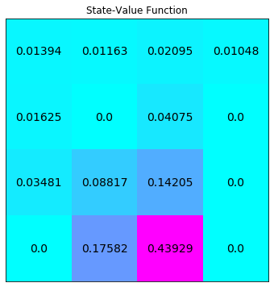
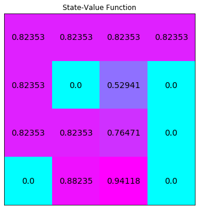

# Dynamic Programming

---
> ## Contact me
> Blog -> <https://cugtyt.github.io/blog/index>  
> Email -> <cugtyt@qq.com>, <cugtyt@gmail.com>  
> GitHub -> [Cugtyt@GitHub](https://github.com/Cugtyt)

---

> **本系列博客主页及相关见**[**此处**](https://cugtyt.github.io/blog/udacity-deep-rl/index)  
> [内容来源](https://github.com/udacity/deep-reinforcement-learning/tree/master/dynamic-programming)。

<head>
    <script src="https://cdn.mathjax.org/mathjax/latest/MathJax.js?config=TeX-AMS-MML_HTMLorMML" type="text/javascript"></script>
    <script type="text/x-mathjax-config">
        MathJax.Hub.Config({
            tex2jax: {
            skipTags: ['script', 'noscript', 'style', 'textarea', 'pre'],
            inlineMath: [['$','$']]
            }
        });
    </script>
</head>

---

## Part 0: FrozenLake

环境是4\*4的网格，agent有4种行为：LEFT = 0，DOWN = 1，RIGHT = 2，UP = 3。记为$\mathcal{S}^+ = \{0, 1, \ldots, 15\}$， $\mathcal{A} = \{0, 1, 2, 3\}$

``` python
env = FrozenLakeEnv()

# print the state space and action space
print(env.observation_space) # Discrete(16)
print(env.action_space) # Discrete(4)

# print the total number of states and actions
print(env.nS) # 16
print(env.nA) # 4
```

动态规划会假设agent知道马尔科夫决策过程，`env.P[1][0]`是会返回agent在状态1，向左走的所有可能的奖励和下一个状态：

``` python
env.P[1][0]

# output:
# [(0.3333333333333333, 1, 0.0, False),
#  (0.3333333333333333, 0, 0.0, False),
#  (0.3333333333333333, 5, 0.0, True)]
```

4列分别为：prob（概率）, next_state, reward, done（是否结束），因此可以这样解释结果：

$$
\mathbb{P}(S_{t+1}=s',R_{t+1}=r|S_t=1,A_t=0) = \begin{cases}
               \frac{1}{3} \text{ if } s'=1, r=0\\
               \frac{1}{3} \text{ if } s'=0, r=0\\
               \frac{1}{3} \text{ if } s'=5, r=0\\
               0 \text{ else}
            \end{cases}
$$

## Part 1: Iterative Policy Evaluation

输入：
* env
* policy: 2D数组，大小为：`(env.nS, env.nA)`，`policy[s][a]`表示agent在状态s采取行为a的概率
* gamma：折扣率，0-1，默认1
* theta： 是否收敛的阈值，默认1e-8

输出：
* V： 1D数组，大小为(env.nS)。`V[s]`表示在给定当前策略下状态s的值。

``` python
def policy_evaluation(env, policy, gamma=1, theta=1e-8):
    V = np.zeros(env.nS)
    while True:
        delta = 0
        # 遍历状态
        for s in range(env.nS):
            Vs = 0
            # 遍历状态s下的行为
            for a, action_prob in enumerate(policy[s]):
                for prob, next_state, reward, done in env.P[s][a]:
                    Vs += action_prob * prob * (reward + gamma * V[next_state])
            delta = max(delta, np.abs(V[s]-Vs))
            V[s] = Vs
        # 终止条件
        if delta < theta:
            break
    return V
```

对于均等概率进行测试，即$\pi(a \vert s) = \frac{1}{\vert \mathcal{A}(s) \vert}$：

``` python
random_policy = np.ones([env.nS, env.nA]) / env.nA
# evaluate the policy 
V = policy_evaluation(env, random_policy)

plot_values(V)
```



## Part 2: Obtain $q_\pi$ from $v_\pi$

输入：
* env
* V： 1D数组，大小为(env.nS)。`V[s]`表示在给定当前策略下状态s的值
* s: 一个状态
* gamma：折扣率，0-1，默认1

输出：
* q： 1D数组，大小为(env.nA)。`q[a]`表示状态s下，采取行为a的值。

``` python
def q_from_v(env, V, s, gamma=1):
    q = np.zeros(env.nA)
    # 遍历行为
    for a in range(env.nA):
        for prob, next_state, reward, done in env.P[s][a]:
            q[a] += prob * (reward + gamma * V[next_state])
    return q
```

计算所有状态的q：

``` python
Q = np.zeros([env.nS, env.nA])
# 对每个状态求所有行为的值
for s in range(env.nS):
    Q[s] = q_from_v(env, V, s)
print(Q)

# output
# [[0.0147094  0.01393978 0.01393978 0.01317015]
#  [0.00852356 0.01163091 0.0108613  0.01550788]
#  [0.02444514 0.02095298 0.02406033 0.01435346]
#  [0.01047649 0.01047649 0.00698432 0.01396865]
#  [0.02166487 0.01701828 0.01624865 0.01006281]
#  [0.         0.         0.         0.        ]
#  [0.05433538 0.04735105 0.05433538 0.00698432]
#  [0.         0.         0.         0.        ]
#  [0.01701828 0.04099204 0.03480619 0.04640826]
#  [0.07020885 0.11755991 0.10595784 0.05895312]
#  [0.18940421 0.17582037 0.16001424 0.04297382]
#  [0.         0.         0.         0.        ]
#  [0.         0.         0.         0.        ]
#  [0.08799677 0.20503718 0.23442716 0.17582037]
#  [0.25238823 0.53837051 0.52711478 0.43929118]
#  [0.         0.         0.         0.        ]]
```

## Part 3: Policy Improvement

下面我们对策略进行改进，依据是q值。

输入：
* env
* V： 1D数组，大小为(env.nS)。`V[s]`表示在给定当前策略下状态s的值
* gamma：折扣率，0-1，默认1

输出：
* policy: 2D数组，大小为：`(env.nS, env.nA)`，`policy[s][a]`表示agent在状态s采取行为a的概率

``` python
def policy_improvement(env, V, gamma=1):
    policy = np.zeros([env.nS, env.nA]) / env.nA
    # 遍历状态
    for s in range(env.nS):
        q = q_from_v(env, V, s, gamma)
        
        # 选择 1: 确定性策略，取有最大值的行为 
        # policy[s][np.argmax(q)] = 1
        
        # 选择 2: 随机策略，对每个最大值的行为设置相等的概率
        best_a = np.argwhere(q==np.max(q)).flatten() # 挑选所有最大的
        policy[s] = np.sum([np.eye(env.nA)[i] for i in best_a], axis=0)/len(best_a) # 赋值概率
        
    return policy
```

## Part 4: Policy Iteration

输入：
* env
* gamma：折扣率，0-1，默认1
* theta： 是否收敛的阈值，默认1e-8

输出：
* policy: 2D数组，大小为：`(env.nS, env.nA)`，`policy[s][a]`表示agent在状态s采取行为a的概率
* V： 1D数组，大小为(env.nS)。`V[s]`表示在给定当前策略下状态s的值

``` python
def policy_iteration(env, gamma=1, theta=1e-8):
    # 先生成随机策略
    policy = np.ones([env.nS, env.nA]) / env.nA
    while True:
        # 根据策略获取状态的值
        V = policy_evaluation(env, policy, gamma, theta)
        # 根据状态的值更新策略
        new_policy = policy_improvement(env, V)
        
        # 选择 1: 如果策略没有再更新，结束
        if (new_policy == policy).all():
            break;
        
        # 选择 2: 如果更改小于阈值，即收敛了，结束
        # if np.max(abs(policy_evaluation(env, policy) - policy_evaluation(env, new_policy))) < theta*1e2:
        #    break;
        
        policy = copy.copy(new_policy)
    return policy, V
```

查看效果：

``` python
policy_pi, V_pi = policy_iteration(env)
print(policy_pi,"\n")
plot_values(V_pi)

# output
# [[1.   0.   0.   0.  ]
#  [0.   0.   0.   1.  ]
#  [0.   0.   0.   1.  ]
#  [0.   0.   0.   1.  ]
#  [1.   0.   0.   0.  ]
#  [0.25 0.25 0.25 0.25]
#  [0.5  0.   0.5  0.  ]
#  [0.25 0.25 0.25 0.25]
#  [0.   0.   0.   1.  ]
#  [0.   1.   0.   0.  ]
#  [1.   0.   0.   0.  ]
#  [0.25 0.25 0.25 0.25]
#  [0.25 0.25 0.25 0.25]
#  [0.   0.   1.   0.  ]
#  [0.   1.   0.   0.  ]
#  [0.25 0.25 0.25 0.25]] 
```



## Part 5: Truncated Policy Iteration

输入：
* env
* policy: 2D数组，大小为：`(env.nS, env.nA)`，`policy[s][a]`表示agent在状态s采取行为a的概率
* V： 1D数组，大小为(env.nS)。`V[s]`表示在给定当前策略下状态s的值
* max_it: 扫描次数
* gamma：折扣率，0-1，默认1

输出：
* V： 1D数组，大小为(env.nS)。`V[s]`表示在给定当前策略下状态s的值

``` python
def truncated_policy_evaluation(env, policy, V, max_it=1, gamma=1):
    num_it=0
    while num_it < max_it:
        # 迭代状态
        for s in range(env.nS):
            v = 0
            # 根据策略计算q值
            q = q_from_v(env, V, s, gamma)
            # 迭代状态，根据概率更新状态值
            for a, action_prob in enumerate(policy[s]):
                v += action_prob * q[a]
            V[s] = v
        num_it += 1
    return V
```

输入：
* env
* max_it: 扫描次数
* gamma：折扣率，0-1，默认1
* theta： 是否收敛的阈值，默认1e-8

输出：
* policy: 2D数组，大小为：`(env.nS, env.nA)`，`policy[s][a]`表示agent在状态s采取行为a的概率
* V： 1D数组，大小为(env.nS)。`V[s]`表示在给定当前策略下状态s的值

``` python
def truncated_policy_iteration(env, max_it=1, gamma=1, theta=1e-8):
    # 初始状态值和策略
    V = np.zeros(env.nS)
    policy = np.zeros([env.nS, env.nA]) / env.nA
    while True:
        # 改进策略
        policy = policy_improvement(env, V)
        old_V = copy.copy(V)
        # 如果更新小于阈值，结束
        V = truncated_policy_evaluation(env, policy, V, max_it, gamma)
        if max(abs(V-old_V)) < theta:
            break;
    return policy, V
```

指定迭代次数更新策略：

``` python
policy_tpi, V_tpi = truncated_policy_iteration(env, max_it=2)
print(policy_tpi,"\n")
# plot the optimal state-value function
plot_values(V_tpi)

# output
# [[1.   0.   0.   0.  ]
#  [0.   0.   0.   1.  ]
#  [0.   0.   0.   1.  ]
#  [0.   0.   0.   1.  ]
#  [1.   0.   0.   0.  ]
#  [0.25 0.25 0.25 0.25]
#  [0.5  0.   0.5  0.  ]
#  [0.25 0.25 0.25 0.25]
#  [0.   0.   0.   1.  ]
#  [0.   1.   0.   0.  ]
#  [1.   0.   0.   0.  ]
#  [0.25 0.25 0.25 0.25]
#  [0.25 0.25 0.25 0.25]
#  [0.   0.   1.   0.  ]
#  [0.   1.   0.   0.  ]
#  [0.25 0.25 0.25 0.25]] 
```


## Part 6: Value Iteration

输入：
* env
* gamma：折扣率，0-1，默认1
* theta： 是否收敛的阈值，默认1e-8

输出：
* policy: 2D数组，大小为：`(env.nS, env.nA)`，`policy[s][a]`表示agent在状态s采取行为a的概率
* V： 1D数组，大小为(env.nS)。`V[s]`表示在给定当前策略下状态s的值

``` python
def value_iteration(env, gamma=1, theta=1e-8):
    V = np.zeros(env.nS)
    while True:
        delta = 0
        # 遍历状态，直到V稳定
        for s in range(env.nS):
            v = V[s]
            V[s] = max(q_from_v(env, V, s, gamma))
            delta = max(delta,abs(V[s]-v))
        if delta < theta:
            break
    # 根据V选择策略
    policy = policy_improvement(env, V, gamma)
    return policy, V
```

``` python
policy_vi, V_vi = value_iteration(env)
print(policy_vi,"\n")
# plot the optimal state-value function
plot_values(V_vi)

# output
# [[1.   0.   0.   0.  ]
#  [0.   0.   0.   1.  ]
#  [0.   0.   0.   1.  ]
#  [0.   0.   0.   1.  ]
#  [1.   0.   0.   0.  ]
#  [0.25 0.25 0.25 0.25]
#  [0.5  0.   0.5  0.  ]
#  [0.25 0.25 0.25 0.25]
#  [0.   0.   0.   1.  ]
#  [0.   1.   0.   0.  ]
#  [1.   0.   0.   0.  ]
#  [0.25 0.25 0.25 0.25]
#  [0.25 0.25 0.25 0.25]
#  [0.   0.   1.   0.  ]
#  [0.   1.   0.   0.  ]
#  [0.25 0.25 0.25 0.25]]
```

